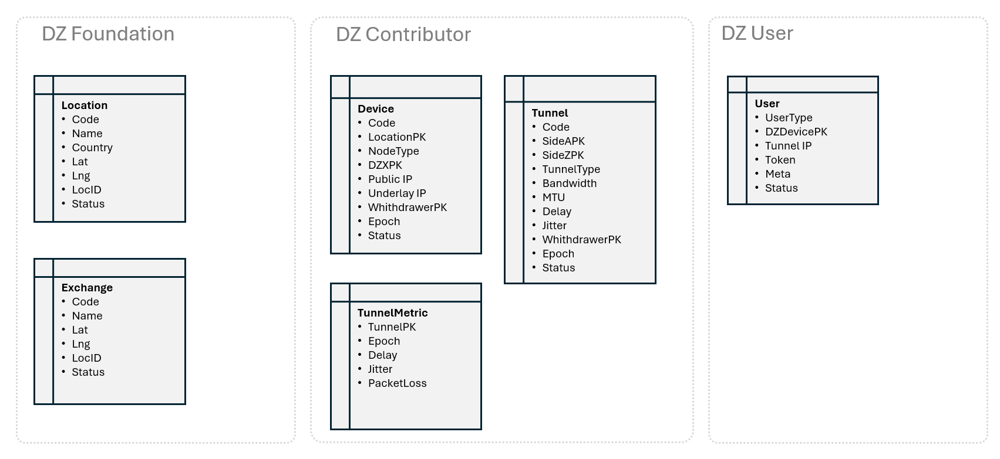
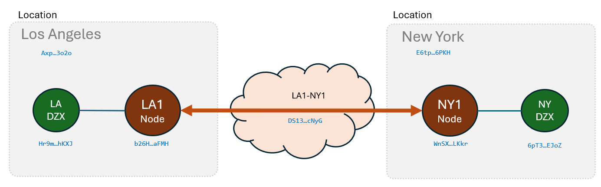

# Double Zero Client

The DoubleZero client allows you to interact with the on-chain smart contract, allowing you to manipulate Double Zero configuration objects.



### Command line utility
```console
doublezero --help
```

Output:
```
Double Zero SLA client tool

Usage: doublezero [OPTIONS] <COMMAND>

Commands:
  location  
  exchange  
  device    
  Link    
  help      Print this message or the help of the given subcommand(s)

Options:
      --rpc-url <RPC_URL>        
      --program-id <PROGRAM_ID>  
      --keypair <KEYPAIR>        
  -h, --help                     Print help
  -V, --version                  Print version
```

### Command user
```console
doublezero user --help
```

Output:
```
Usage: doublezero user <COMMAND>

Commands:
  create    
  list      
  activate  
  help      Print this message or the help of the given subcommand(s)

Options:
  -h, --help  Print help
```

### Command user create
```console
doublezero user create --help
```

Output:
```
Usage: doublezero user create --user-type <USER_TYPE> --device <DEVICE> --link-type <LINK_TYPE> --client-ip <CLIENT_IP>

Options:
      --user-type <USER_TYPE>      
      --device <DEVICE>            
      --link-type <LINK_TYPE>  
      --client-ip <CLIENT_IP>      
  -h, --help                       Print help
```

### Command user activate
```console
doublezero user activate --help
```

Output:
```
Usage: doublezero user activate --client-ip <CLIENT_IP> --c-underlay-ip <C_UNDERLAY_IP> --dz-underlay-ip <DZ_UNDERLAY_IP>

Options:
      --client-ip <CLIENT_IP>            
      --c-underlay-ip <C_UNDERLAY_IP>    
      --dz-underlay-ip <DZ_UNDERLAY_IP>  
  -h, --help                             Print hel
```


## Configuration

The CLI loads its configuration from the first file found in this order:

1. `$DOUBLEZERO_CONFIG_FILE` — env var override, used if set
2. `~/.config/doublezero/cli/config.yml` — per-user config
3. `/etc/doublezero/cli/config.yml` — system-wide config (shipped by the mainnet-beta package)
4. Built-in testnet defaults

When you run `doublezero config set ...`, settings are written to the per-user path (`~/.config/doublezero/cli/config.yml`), which then takes priority over the system config on subsequent reads.

The system config only needs the environment-specific fields (`json_rpc_url`, `websocket_url`, `program_id`). Fields like `keypair_path` and `address_labels` are optional and use sensible defaults when omitted.

# Basic use case

In the following example, two Locations and Exchanges will be created. 
Then a Contributor will create two Devices and a Link between them.



## Create locations

Locations are defined and created by the foundation with the following commands. Only the KeyPair that deployed the contract can manage this information.

### Los Angeles Location
Creation of a new Location with the code LA, name Los Angeles, in the country US and with coordinates 34.04 -118.25:

```console
doublezero location create --code la --name "Los Angeles" --country US --lat 34.049641274076464 --lng -118.25939642499903
```

[5qToTgeYuwz3XzCFKYP2d5XsgHsYsUqnNnBHwttprvHo](https://explorer.solana.com/address/5qToTgeYuwz3XzCFKYP2d5XsgHsYsUqnNnBHwttprvHo?cluster=devnet)

### New York Location

Creation of a new Location with the code NY, name new York, in the country US and with coordinates 40.78 -74.07:

```console
doublezero location create --code ny --name "New York" --country US --lat 40.780297071772125 --lng -74.07203003496925
```

[ArGmUJxrnNFVkfR5TMeQAWFrW5zeuoQJELyrQsezKg66](https://explorer.solana.com/address/ArGmUJxrnNFVkfR5TMeQAWFrW5zeuoQJELyrQsezKg66?cluster=devnet)


### List Locations
```console
doublezero location list
```

Output:
```
 pubkey                                       | code | name        | country | lat                | lng                  | loc_id | status | owner 
 5qToTgeYuwz3XzCFKYP2d5XsgHsYsUqnNnBHwttprvHo | la   | Los Angeles | US      | 34.049641274076464 | -118.25939642499903  | 0      | 1      | gwfHPG4suqu1aiXEjCPyW9rZfKnb9zQqdNt4iyqiA1D 
 ArGmUJxrnNFVkfR5TMeQAWFrW5zeuoQJELyrQsezKg66 | ny   | New York    | US      | 40.780297071772125 | -74.07203003496925   | 0      | 1      | gwfHPG4suqu1aiXEjCPyW9rZfKnb9zQqdNt4iyqiA1D 
 ```

## Create exchanges

Exchanges are defined and created by the foundation with the following commands. Only the KeyPair that deployed the contract can manage this information.

### Los Angeles Exchange

Creation of a new Exchange with the code LA, name Los Angeles and with coordinates 34.04 -118.25:
```console
doublezero exchange create --code xla --name "Los Angeles" --lat 40.049641274076464 --lng -118.25939642499903
```

[5Hbdr6X5pBvAXdhVjMS3bkyqFmQoZHHAbZi7JMEd1UGR](https://explorer.solana.com/address/5Hbdr6X5pBvAXdhVjMS3bkyqFmQoZHHAbZi7JMEd1UGR?cluster=devnet)

### New York Exchange

Creation of a new Exchange with the code NY, name new York and with coordinates 40.78 -74.07:
```console
doublezero exchange create --code xny --name "New York" --lat 40.780297071772125 --lng -74.07203003496925
```

[FpGew6SbmrLXipUC2BLFdi3Fa3BGNXrU85ky4fuB3HLU](https://explorer.solana.com/address/FpGew6SbmrLXipUC2BLFdi3Fa3BGNXrU85ky4fuB3HLU?cluster=devnet)

### Lista Exchanges

```console
doublezero exchange list
```

Output:
```
 pubkey                                       | code | name        | lat                | lng                  | bgp_community | status | owner 
 5Hbdr6X5pBvAXdhVjMS3bkyqFmQoZHHAbZi7JMEd1UGR | xla  | Los Angeles | 34.049641274076464 | -118.25939642499903  | 0             | 1      | gwfHPG4suqu1aiXEjCPyW9rZfKnb9zQqdNt4iyqiA1D 
 FpGew6SbmrLXipUC2BLFdi3Fa3BGNXrU85ky4fuB3HLU | xny  | New York    | 40.780297071772125 | -74.07203003496925   | 0             | 1      | gwfHPG4suqu1aiXEjCPyW9rZfKnb9zQqdNt4iyqiA1D 
 ```

## Create devices & Link

The following commands are executed by the Network Contributor to define its two Nodes and a Link between them.

### New York Device

```console
doublezero device create --code la2-dz01 --location la --exchange xla --public-ip "207.45.216.136"
```

[3mo8vSQJeCrP9eiUoEZkyYihTV9xkwDSp4ki9awfb575](https://explorer.solana.com/address/3mo8vSQJeCrP9eiUoEZkyYihTV9xkwDSp4ki9awfb575?cluster=devnet)

### Los Angeles Device

```console
doublezero device create --code ny5-dz01 --location ny --exchange xny --public-ip "64.86.249.80"
```

[J8AdFmRgHG1ADAH17WppbY9s79zYoBJc24yActMPkr8D](https://explorer.solana.com/address/J8AdFmRgHG1ADAH17WppbY9s79zYoBJc24yActMPkr8D?cluster=devnet)

### Create tunner from Los Angeles to New York

```console
doublezero link create wan --code "la2-dz02:ny5-dz01" --contributor co01 --side-a la2-dz01 --side-z ny5-dz01 --bandwidth 100 --mtu 9000 --delay 0 --jitter 0
```

[FK5AN9sgfS56Du2UtPAZu54u1q15GiPdfkBH4v2H6FgR](https://explorer.solana.com/address/FK5AN9sgfS56Du2UtPAZu54u1q15GiPdfkBH4v2H6FgR?cluster=devnet)

### List Devices

```console
doublezero device list
```

Output:
```
 pubkey                                       | code     | location | exchange | device_type | public_ip      | status | owner 
 3mo8vSQJeCrP9eiUoEZkyYihTV9xkwDSp4ki9awfb575 | la2-dz01 | la       | xla      | 1           | 207.45.216.136 | 1      | gwfHPG4suqu1aiXEjCPyW9rZfKnb9zQqdNt4iyqiA1D 
 J8AdFmRgHG1ADAH17WppbY9s79zYoBJc24yActMPkr8D | ny5-dz01 | ny       | xny      | 1           | 64.86.249.80   | 1      | gwfHPG4suqu1aiXEjCPyW9rZfKnb9zQqdNt4iyqiA1D 
```

### List Link

```console
doublezero Link list
```

Output:
```
 pubkey                                       | code              | side_a   | side_z   | link_type | bandwidth | mtu  | delay | jitter | status | owner 
 FK5AN9sgfS56Du2UtPAZu54u1q15GiPdfkBH4v2H6FgR | la2-dz02:ny5-dz01 | la2-dz01 | ny5-dz01 | 1           | 100       | 9000 | 0     | 0      | 1      | gwfHPG4suqu1aiXEjCPyW9rZfKnb9zQqdNt4iyqiA1D 
```


### Create User

```console
doublezero user create --user-type 1 --device ny5-dz01 --client-ip 186.158.137.96
```

[DGyGkcLZqdNWGbeBtLYdzVrgDi4VxemSwh6e6hG6qA2k](https://explorer.solana.com/address/DGyGkcLZqdNWGbeBtLYdzVrgDi4VxemSwh6e6hG6qA2k?cluster=devnet)

### List User

```console
doublezero user list
```

Output:
```
 pubkey                                       | user_type | device_pk | link_type | client_ip      | c_underlay_ip | dz_underlay_ip | status | owner 
 DGyGkcLZqdNWGbeBtLYdzVrgDi4VxemSwh6e6hG6qA2k | 1         | ny5-dz01  | 1           | 186.158.137.96 | 0.0.0.0       | 0.0.0.0        | 1      | gwfHPG4suqu1aiXEjCPyW9rZfKnb9zQqdNt4iyqiA1D 
```

### Activate User

```console
doublezero user activate --client-ip 186.158.137.96 --c-underlay-ip 10.0.0.1 --dz-underlay-ip 10.0.0.2
```

[DGyGkcLZqdNWGbeBtLYdzVrgDi4VxemSwh6e6hG6qA2k](https://explorer.solana.com/address/DGyGkcLZqdNWGbeBtLYdzVrgDi4VxemSwh6e6hG6qA2k?cluster=devnet)

### List User

```console
doublezero user list
```

Output:
```
 pubkey                                       | user_type | device_pk | link_type | client_ip      | c_underlay_ip | dz_underlay_ip | status | owner 
 DGyGkcLZqdNWGbeBtLYdzVrgDi4VxemSwh6e6hG6qA2k | 1         | ny5-dz01  | 1           | 186.158.137.96 | 10.0.0.1      | 10.0.0.2       | 2      | gwfHPG4suqu1aiXEjCPyW9rZfKnb9zQqdNt4iyqiA1D 
```