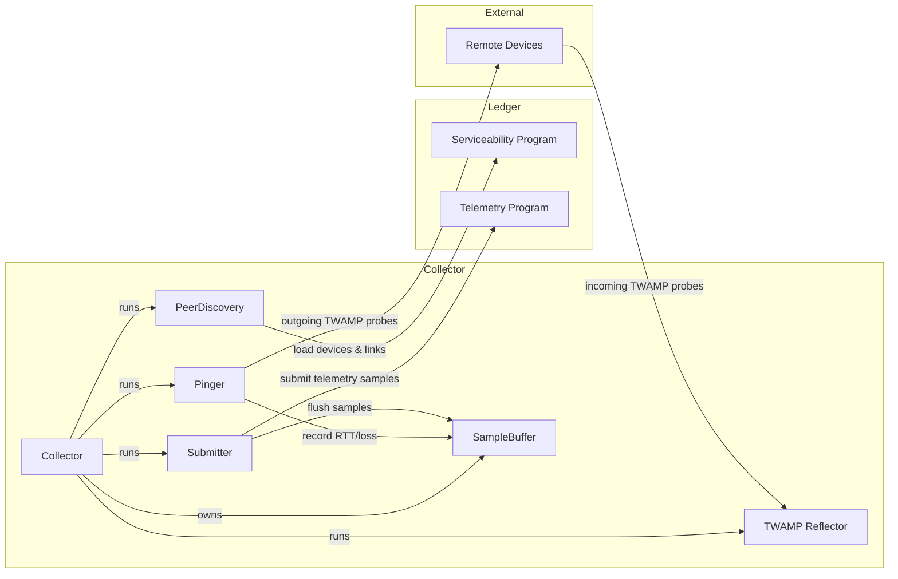
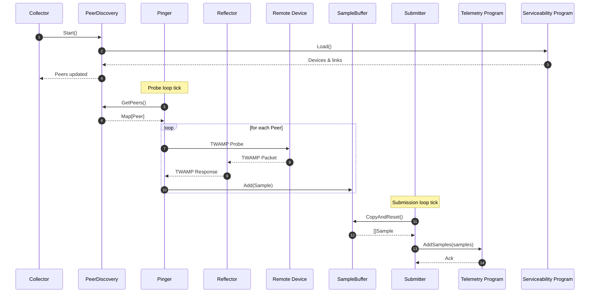

# Telemetry Agent

The Telemetry Agent continuously monitors round-trip latency and loss between devices using [TWAMP Light](https://datatracker.ietf.org/doc/html/rfc5357). It periodically discovers peers from the ledger, sends probes, buffers results, and submits telemetry data to an on-chain program.

## Architecture

### Components

- **Collector** – Coordinates the full telemetry pipeline: peer discovery, probing, and submission.
- **PeerDiscovery** – Periodically queries the on-chain serviceability program for devices linked to the local node.
- **Pinger** – Sends TWAMP probes to discovered peers and records RTT/loss.
- **Reflector** – Listens for incoming TWAMP probes from remote devices.
- **Submitter** – Flushes telemetry samples to the on-chain telemetry program.
- **SampleBuffer** – Thread-safe buffer that aggregates telemetry samples in memory.

### System Context Diagram

### Sequence Diagram

## Configuration

The telemetry agent is configured via command-line flags:

### Required Flags

- `--ledger-rpc-url`: URL of the ledger RPC endpoint.
- `--program-id`: ID of the on-chain telemetry program.
- `--local-device-pubkey`: Public key of the local device.

### TWAMP Settings

- `--twamp-listen-port` (default: `1862`): UDP port to listen for incoming TWAMP probes.
- `--twamp-reflector-timeout` (default: `1s`): Timeout for TWAMP reflector replies.
- `--twamp-sender-timeout` (default: `1s`): Timeout for outgoing TWAMP probes.

### Timing Intervals

- `--probe-interval` (default: `10s`): How often to probe discovered peers.
- `--submission-interval` (default: `60s`): How often to submit collected telemetry.
- `--peers-refresh-interval` (default: `10s`): How often to refresh the peer list from the ledger.

### Logging

- `--verbose`: Enable verbose (debug) logging.
