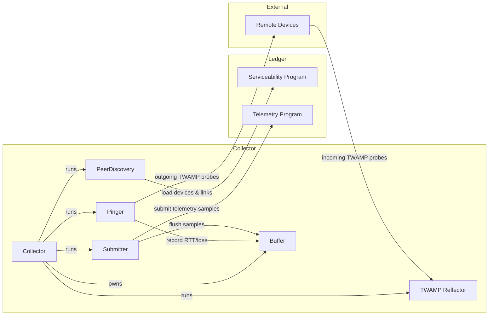
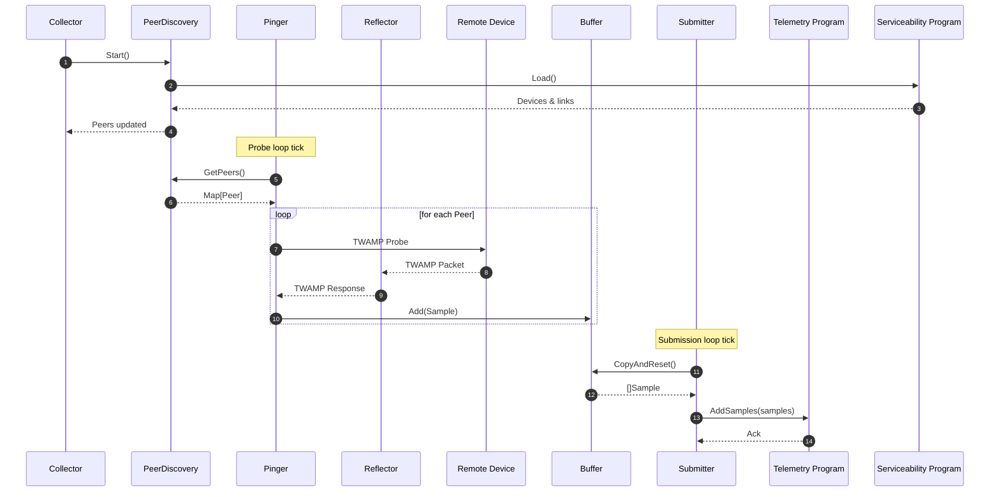

# Telemetry Agent

The Telemetry Agent continuously monitors round-trip latency and loss between devices using [TWAMP Light](https://datatracker.ietf.org/doc/html/rfc5357). It periodically discovers peers from the ledger, sends probes, buffers results, and submits telemetry data to an on-chain program.

## Architecture

### Components

- **Collector** – Coordinates the full telemetry pipeline: peer discovery, probing, and submission.
- **PeerDiscovery** – Periodically queries the on-chain serviceability program for devices linked to the local node.
- **Pinger** – Sends TWAMP probes to discovered peers and records RTT/loss.
- **Reflector** – Listens for incoming TWAMP probes from remote devices.
- **Submitter** – Flushes telemetry samples to the on-chain telemetry program.
- **Buffer** – Thread-safe buffer that aggregates telemetry samples in memory.

### System Context Diagram



### Sequence Diagram



## Configuration

The telemetry agent is configured via command-line flags:

### Required Flags

- `--ledger-rpc-url`: URL of the ledger RPC endpoint.
- `--program-id`: ID of the on-chain telemetry program.
- `--local-device-pubkey`: Public key of the local device.

### TWAMP Settings

- `--twamp-listen-port` (default: `1862`): UDP port to listen for incoming TWAMP probes.
- `--twamp-reflector-timeout` (default: `1s`): Timeout for TWAMP reflector replies.
- `--twamp-sender-timeout` (default: `1s`): Timeout for outgoing TWAMP probes.

### Timing Intervals

- `--probe-interval` (default: `10s`): How often to probe discovered peers.
- `--submission-interval` (default: `60s`): How often to submit collected telemetry.
- `--peers-refresh-interval` (default: `10s`): How often to refresh the peer list from the ledger.

### Logging

- `--verbose`: Enable verbose (debug) logging.

### Data Aggregation

This module also exposes the onchain telemetry data via both an HTTP API and a CLI for direct inspection.

#### HTTP API

You can start the telemetry aggregation server using:

```sh
go run ./cmd/data-api
```

This launches an HTTP server that provides JSON endpoints for querying rolled-up statistics derived from onchain data. It is designed for consumption by visualization tools like Grafana to support real-time and historical timeseries views.

By default, the server aggregates data from both `devnet` and `testnet` - no startup configuration is required to select the network.

See [cmd/data-api/grafana-dashboard.json](cmd/data-api/grafana-dashboard.json) for example usage of the available endpoints.

Available flags:

```
-listen-addr string
      address to listen on (default ":8080")
-verbose
      verbose logging
```

#### CLI

You can also inspect and aggregate RTT statistics directly from the command line:

```sh
go run ./cmd/data-cli
```

This command queries recent telemetry data across available circuits (origin device, target device, link).

```
Environment: devnet
Recency: 24h0m0s
* RTT aggregates are in microseconds (µs)
+-----------------------------------------------------+----------+------------+--------+---------+--------+-----+-----+-----+-------+--------+---------+------+------+
|                       Circuit                       | RTT Mean | Jitter Avg | Jitter | Jitter  |  RTT   | RTT | RTT | RTT |  RTT  |  RTT   | Success | Loss | Loss |
|                                                     |   (µs)   |    (µs)    |  EWMA  |   Max   | StdDev | P95 | P99 | Min |  Max  | Median |   (#)   | (#)  | (%)  |
+-----------------------------------------------------+----------+------------+--------+---------+--------+-----+-----+-----+-------+--------+---------+------+------+
| chi-dn-dzd1 → chi-dn-dzd2 (chi-dn-dzd1:chi-dn-dzd2) |      177 |       0.03 |    5.8 |    16.0 |   27.3 | 220 | 237 | 100 |   392 |    177 |    8633 |    0 | 0.0% |
+-----------------------------------------------------+----------+------------+--------+---------+--------+-----+-----+-----+-------+--------+---------+------+------+
| chi-dn-dzd1 → chi-dn-dzd3 (chi-dn-dzd1:chi-dn-dzd3) |      184 |       0.04 |   10.9 |    90.0 |   28.5 | 227 | 245 |  99 |   480 |    185 |    8631 |    0 | 0.0% |
+-----------------------------------------------------+----------+------------+--------+---------+--------+-----+-----+-----+-------+--------+---------+------+------+
| chi-dn-dzd2 → chi-dn-dzd1 (chi-dn-dzd1:chi-dn-dzd2) |      182 |       0.04 |    9.5 |    65.0 |   24.3 | 219 | 235 | 110 |   443 |    182 |    8628 |    0 | 0.0% |
+-----------------------------------------------------+----------+------------+--------+---------+--------+-----+-----+-----+-------+--------+---------+------+------+
| chi-dn-dzd2 → chi-dn-dzd4 (chi-dn-dzd2:chi-dn-dzd4) |      171 |       0.03 |    4.6 |    30.0 |   26.8 | 212 | 229 | 100 |   340 |    172 |    8632 |    0 | 0.0% |
+-----------------------------------------------------+----------+------------+--------+---------+--------+-----+-----+-----+-------+--------+---------+------+------+
| chi-dn-dzd3 → chi-dn-dzd1 (chi-dn-dzd1:chi-dn-dzd3) |      183 |       1.33 |  704.2 | 11142.0 |  125.4 | 221 | 238 | 104 | 11578 |    182 |    8633 |    0 | 0.0% |
+-----------------------------------------------------+----------+------------+--------+---------+--------+-----+-----+-----+-------+--------+---------+------+------+
| chi-dn-dzd3 → chi-dn-dzd4 (chi-dn-dzd3:chi-dn-dzd4) |      172 |       0.08 |   31.9 |   405.0 |   28.1 | 217 | 237 | 106 |   815 |    169 |    8633 |    0 | 0.0% |
+-----------------------------------------------------+----------+------------+--------+---------+--------+-----+-----+-----+-------+--------+---------+------+------+
| chi-dn-dzd4 → chi-dn-dzd2 (chi-dn-dzd2:chi-dn-dzd4) |      160 |       0.03 |    6.0 |    38.0 |   26.2 | 203 | 222 |  88 |   360 |    159 |    8630 |    0 | 0.0% |
+-----------------------------------------------------+----------+------------+--------+---------+--------+-----+-----+-----+-------+--------+---------+------+------+
| chi-dn-dzd4 → chi-dn-dzd3 (chi-dn-dzd3:chi-dn-dzd4) |      170 |       0.03 |    6.1 |    56.0 |   26.2 | 212 | 230 |  96 |   360 |    170 |    8634 |    0 | 0.0% |
+-----------------------------------------------------+----------+------------+--------+---------+--------+-----+-----+-----+-------+--------+---------+------+------+
```
