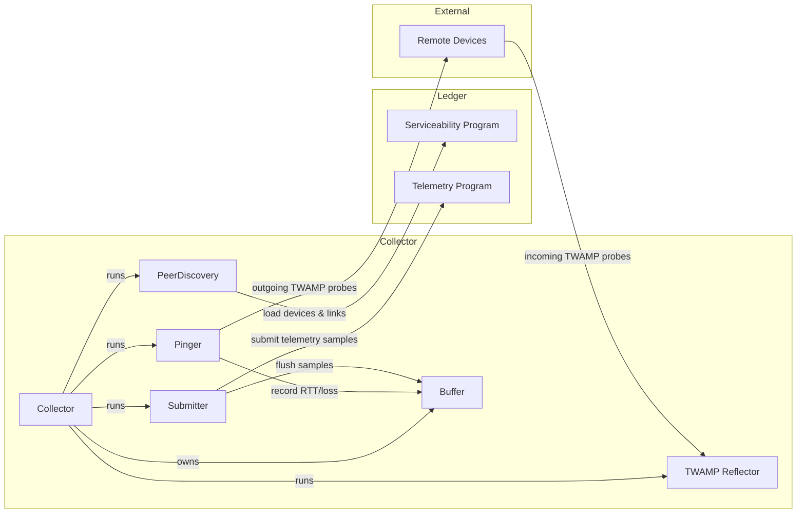
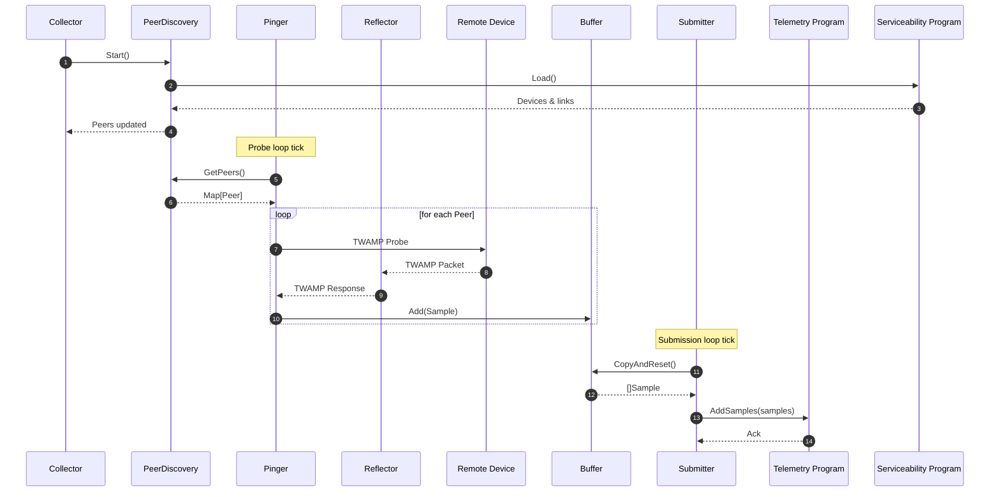

# Telemetry Agent

The Telemetry Agent continuously monitors round-trip latency and loss between devices using [TWAMP Light](https://datatracker.ietf.org/doc/html/rfc5357). It periodically discovers peers from the ledger, sends probes, buffers results, and submits telemetry data to an on-chain program.

## Architecture

### Components

- **Collector** – Coordinates the full telemetry pipeline: peer discovery, probing, and submission.
- **PeerDiscovery** – Periodically queries the on-chain serviceability program for devices linked to the local node.
- **Pinger** – Sends TWAMP probes to discovered peers and records RTT/loss.
- **Reflector** – Listens for incoming TWAMP probes from remote devices.
- **Submitter** – Flushes telemetry samples to the on-chain telemetry program.
- **Buffer** – Thread-safe buffer that aggregates telemetry samples in memory.

### System Context Diagram



### Sequence Diagram



## Configuration

The telemetry agent is configured via command-line flags:

### Required Flags

- `--ledger-rpc-url`: URL of the ledger RPC endpoint.
- `--program-id`: ID of the on-chain telemetry program.
- `--local-device-pubkey`: Public key of the local device.

### TWAMP Settings

- `--twamp-listen-port` (default: `1862`): UDP port to listen for incoming TWAMP probes.
- `--twamp-reflector-timeout` (default: `1s`): Timeout for TWAMP reflector replies.
- `--twamp-sender-timeout` (default: `1s`): Timeout for outgoing TWAMP probes.

### Timing Intervals

- `--probe-interval` (default: `10s`): How often to probe discovered peers.
- `--submission-interval` (default: `60s`): How often to submit collected telemetry.
- `--peers-refresh-interval` (default: `10s`): How often to refresh the peer list from the ledger.

### Logging

- `--verbose`: Enable verbose (debug) logging.

### Data Aggregation

This module also exposes the onchain telemetry data via both an HTTP API and a CLI for direct inspection.

#### HTTP API

You can start the telemetry aggregation server using:

```sh
go run ./cmd/data-api
```

This launches an HTTP server that provides JSON endpoints for querying rolled-up statistics derived from onchain data. It is designed for consumption by visualization tools like Grafana to support real-time and historical timeseries views.

By default, the server aggregates data from both `devnet` and `testnet` - no startup configuration is required to select the network.

See [cmd/data-api/grafana-dashboard.json](cmd/data-api/grafana-dashboard.json) for example usage of the available endpoints.

Available flags:

```
-listen-addr string
      address to listen on (default ":8080")
-verbose
      verbose logging
```

#### CLI

You can also inspect and aggregate RTT statistics directly from the command line:

```console
$ go run ./cmd/data-cli

Data CLI for DoubleZero onchain telemetry.

Usage:
  telemetry-data [flags]
  telemetry-data [command]

Available Commands:
  completion  Generate the autocompletion script for the specified shell
  device      Get device latency data
  help        Help about any command
  internet    Get internet latency data

Flags:
  -e, --env string   The network environment to query (devnet, testnet) (default "devnet")
  -h, --help         help for telemetry-data
  -v, --verbose      set debug logging level
```

This command queries recent telemetry data across available device or internet circuits.

```
Environment: devnet
Epoch: 75
* RTT aggregates are in ms
+-------------------------------------+----------+------------+--------+--------+--------+-------+-------+-------+-------+-------+--------+---------+------+------+
|               Circuit               | RTT Mean | Jitter Avg | Jitter | Jitter |  RTT   |  RTT  |  RTT  |  RTT  |  RTT  |  RTT  |  RTT   | Success | Loss | Loss |
|                                     |   (ms)   |    (ms)    |  EWMA  |  Max   | StdDev |  P90  |  P95  |  P99  |  Min  |  Max  | Median |   (#)   | (#)  | (%)  |
+-------------------------------------+----------+------------+--------+--------+--------+-------+-------+-------+-------+-------+--------+---------+------+------+
| chi-dn-dzd2 → chi-dn-dzd4 (NXKkmmd) |    0.175 |    0.02732 |  0.022 |  0.490 |  0.029 | 0.205 | 0.214 | 0.230 | 0.092 | 0.620 |  0.174 |    1319 |    0 | 0.0% |
+-------------------------------------+----------+------------+--------+--------+--------+-------+-------+-------+-------+-------+--------+---------+------+------+
| chi-dn-dzd2 → chi-dn-dzd1 (S3YDmPA) |    0.177 |    0.02541 |  0.022 |  0.870 |  0.039 | 0.201 | 0.212 | 0.236 | 0.121 | 1.005 |  0.174 |    1315 |    0 | 0.0% |
+-------------------------------------+----------+------------+--------+--------+--------+-------+-------+-------+-------+-------+--------+---------+------+------+
| chi-dn-dzd4 → chi-dn-dzd3 (FS6QfrA) |    0.180 |    0.02835 |  0.028 |  0.452 |  0.031 | 0.211 | 0.221 | 0.268 | 0.118 | 0.589 |  0.178 |    1319 |    0 | 0.0% |
+-------------------------------------+----------+------------+--------+--------+--------+-------+-------+-------+-------+-------+--------+---------+------+------+
| chi-dn-dzd4 → chi-dn-dzd2 (NXKkmmd) |    0.171 |    0.02954 |  0.033 |  0.587 |  0.031 | 0.201 | 0.211 | 0.239 | 0.097 | 0.754 |  0.169 |    1313 |    0 | 0.0% |
+-------------------------------------+----------+------------+--------+--------+--------+-------+-------+-------+-------+-------+--------+---------+------+------+
| chi-dn-dzd3 → chi-dn-dzd4 (FS6QfrA) |    0.169 |    0.02646 |  0.019 |  0.208 |  0.024 | 0.199 | 0.206 | 0.220 | 0.110 | 0.344 |  0.170 |    1319 |    0 | 0.0% |
+-------------------------------------+----------+------------+--------+--------+--------+-------+-------+-------+-------+-------+--------+---------+------+------+
| chi-dn-dzd3 → chi-dn-dzd1 (r18HUJ7) |    0.137 |    0.01704 |  0.015 |  0.265 |  0.018 | 0.157 | 0.166 | 0.182 | 0.088 | 0.393 |  0.135 |    1315 |    0 | 0.0% |
+-------------------------------------+----------+------------+--------+--------+--------+-------+-------+-------+-------+-------+--------+---------+------+------+
| chi-dn-dzd1 → chi-dn-dzd2 (S3YDmPA) |    0.154 |    0.02879 |  0.024 |  0.106 |  0.026 | 0.187 | 0.196 | 0.213 | 0.095 | 0.237 |  0.154 |    1319 |    0 | 0.0% |
+-------------------------------------+----------+------------+--------+--------+--------+-------+-------+-------+-------+-------+--------+---------+------+------+
| chi-dn-dzd1 → chi-dn-dzd3 (r18HUJ7) |    0.129 |    0.02270 |  0.031 |  0.186 |  0.021 | 0.155 | 0.163 | 0.183 | 0.084 | 0.305 |  0.127 |    1315 |    0 | 0.0% |
+-------------------------------------+----------+------------+--------+--------+--------+-------+-------+-------+-------+-------+--------+---------+------+------+
```
