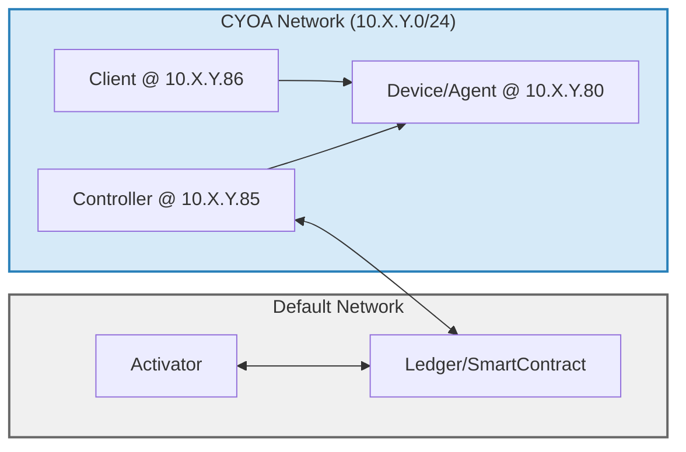

# End-to-End Testing

This directory contains our end-to-end tests which exercise smartcontract, controller, activator, client, and the agent on device. We run docker containers for all of the components in the system, using [testcontainers-go](https://github.com/testcontainers/testcontainers-go). The tests are completely isolated and run in parallel.

The docker images depend on images exposed via our container registry. To access, you need to login with your github username and a personal access token with read access. Go to your [Personal Access Tokens](https://github.com/settings/tokens) page and create a token with `read:packages` access. See [this github doc](https://docs.github.com/en/packages/working-with-a-github-packages-registry/working-with-the-container-registry#authenticating-with-a-personal-access-token-classic) for more details.

The docker images will automatically build whenever you run `make test`. You do not need to explicitly build them, but if you'd like to you can run `make build`

Run the tests with:

```sh
make test
```

Or run specific tests with `go test` directly:
```sh
go test -tags e2e -v -run=TestE2E_IBRL$
```

If you're running tests with `go test` directly, and you're making changes to the components, you'll need to run `make build` before your `go test` command for the changes to be included.

## Topology

Each test spins up a local devnet with all components running in containers, and internal CYOA networks for devices and clients.


