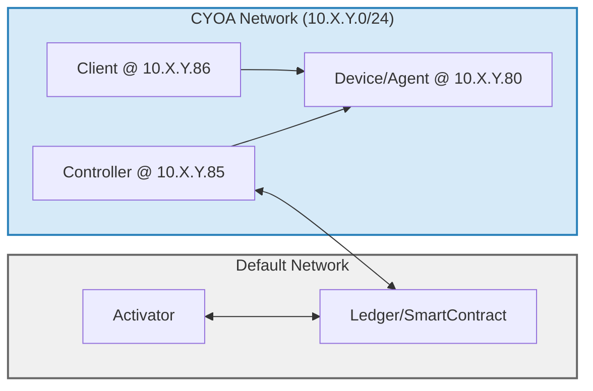

# End-to-End Testing

This directory contains our end-to-end tests which exercise smartcontract, controller, activator, client, and the agent on device. We run docker containers for all of the components in the system, using [testcontainers-go](https://github.com/testcontainers/testcontainers-go). The tests are completely isolated and run in parallel.

The docker images depend on images exposed via our container registry. To access, you need to login with your github username and a personal access token with read access. Go to your [Personal Access Tokens](https://github.com/settings/tokens) page and create a token with `read:packages` access. See [this github doc](https://docs.github.com/en/packages/working-with-a-github-packages-registry/working-with-the-container-registry#authenticating-with-a-personal-access-token-classic) for more details.

The docker images will automatically build whenever you run `make test`. You do not need to explicitly build them, but if you'd like to you can run `make build`

Run the tests with:

```sh
make test
```

Or run specific tests with `go test` directly:
```sh
go test -tags e2e -v -run=TestE2E_IBRL$
```

If you're running tests with `go test` directly, and you're making changes to the components, you'll need to run `make build` before your `go test` command for the changes to be included.

> ⚠️ **Note**
> If you are running the full test suite in parallel on Mac with [Docker for Mac](https://docs.docker.com/desktop/setup/install/mac-install/), you'll likely need to configure it with sufficient resources. We recommend at least 26GB of memory and 6 CPUs, or more.

## Topology

Each test spins up a local devnet with all components running in containers, and internal CYOA networks for devices and clients.



## Test Structure

The test framework is designed to be modular and reusable. Here's how the components fit together:

1. **TestDevnet**: The main test infrastructure that sets up:
   - A local devnet with ledger, manager, controller, and activator
   - A CYOA network for devices and clients
   - Helper methods for common operations (connecting tunnels, checking state, etc.)
   - `TestDevnet` is mostly just a wrapper around [Devnet](./internal/devnet/devnet.go), which is responsible for provisioning and managing the component containers

2. **Test Cases**: Each of the current tests follow a common pattern:
  ```go
  func TestE2E_IBRL(t *testing.T) {
    t.Parallel()

    // 1. Set up test environment
    dn := NewSingleDeviceSingleClientTestDevnet(t)
    client := dn.Clients[0]
    device := dn.Devices[0]

    if !t.Run("connect", func(t *testing.T) {
      // Setup steps
      // Connect steps
      // Verify post-connect state
    }) {
      t.Fail()
      return
    }

    if !t.Run("disconnect", func(t *testing.T) {
      // Disconnect steps
      // Verify post-disconnect state
    }) {
      t.Fail()
    }
  }
  ```

3. **State Verification**: Tests use helper methods to verify state:
   - `WaitForClientTunnelUp`: Ensures tunnel is established
   - `WaitForAgentConfigMatchViaController`: Verifies agent configuration
   - Custom verification functions for specific test cases

## Adding a New Test

To add a new test:

1. Create a new test file (e.g., `ibrl_test.go`) in the `e2e` directory
2. Use `NewSingleDeviceSingleClientTestDevnet` to set up the test environment
3. Implement connect/disconnect test cases following the pattern above, if applicable
4. Add state verification functions specific to your test case (see `checkIBRLPostConnect` in [ibrl_test.go](ibrl_test.go) for example)
5. Use fixtures for expected output verification if appropriate

Example test structure:
```go
func TestE2E_IBRL(t *testing.T) {
	t.Parallel()

	dn := NewSingleDeviceSingleClientTestDevnet(t)
	client := dn.Clients[0]
	device := dn.Devices[0]

	if !t.Run("connect", func(t *testing.T) {
		dn.ConnectIBRLUserTunnel(t, client)

		dn.WaitForClientTunnelUp(t, client)

		checkIBRLPostConnect(t, dn, device, client)
	}) {
		t.Fail()
		return
	}

	if !t.Run("disconnect", func(t *testing.T) {
		dn.DisconnectUserTunnel(t, client)

		checkIBRLPostDisconnect(t, dn, device, client)
	}) {
		t.Fail()
	}
}
```
