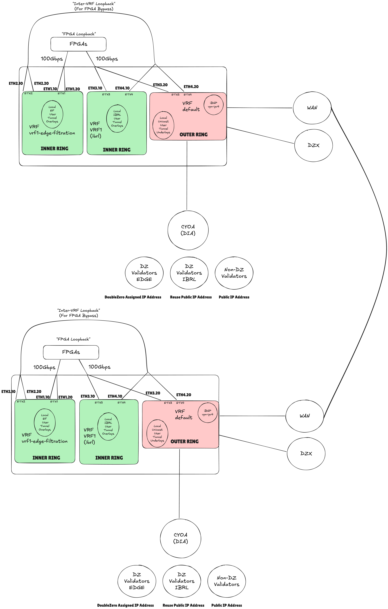
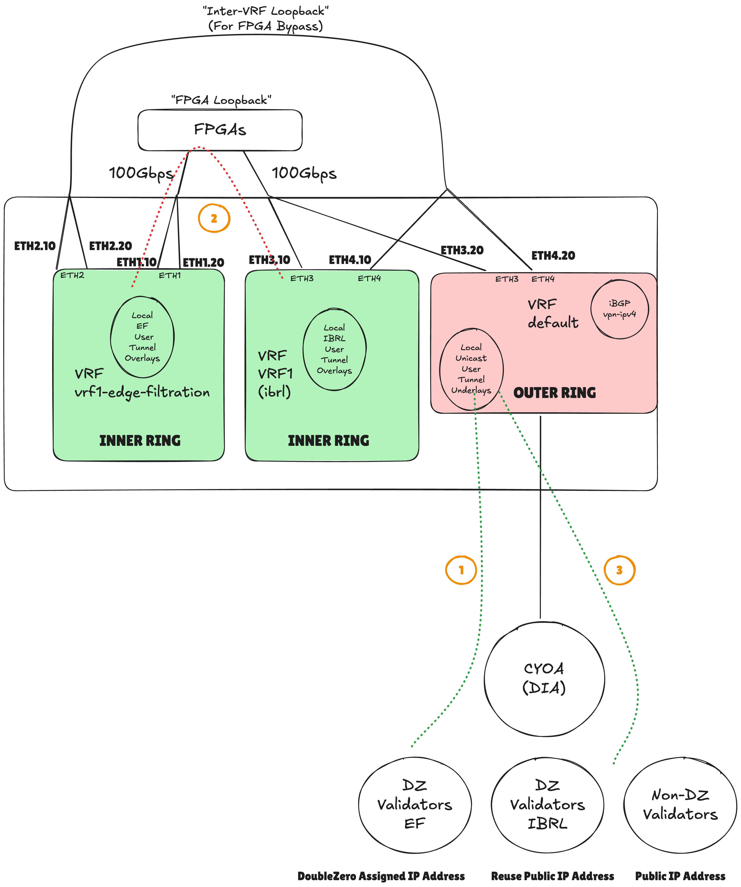
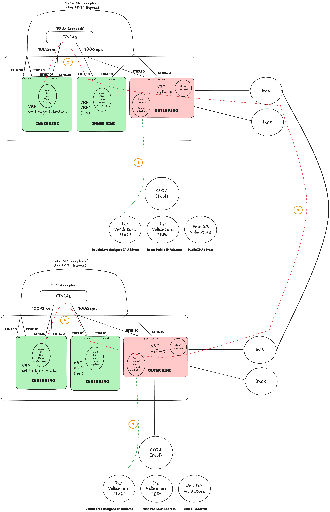
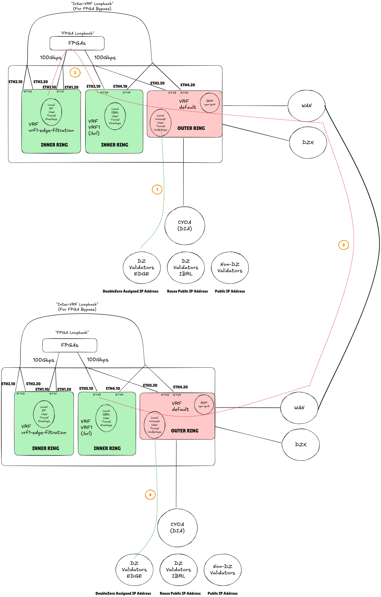
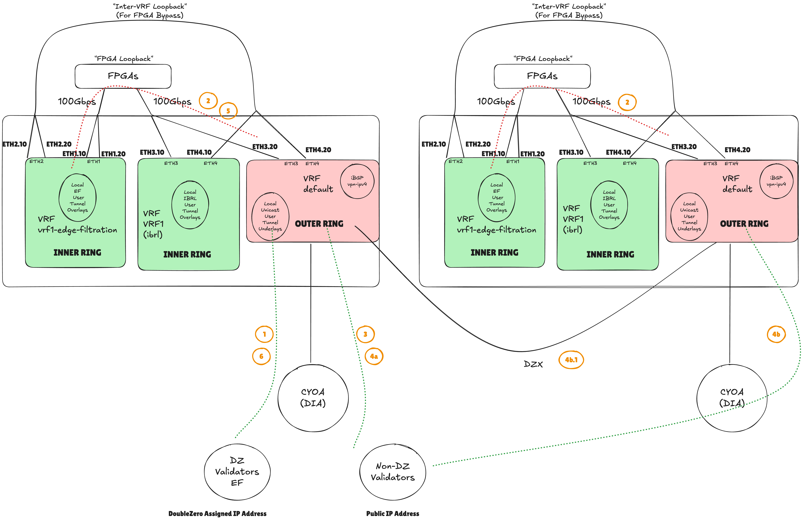
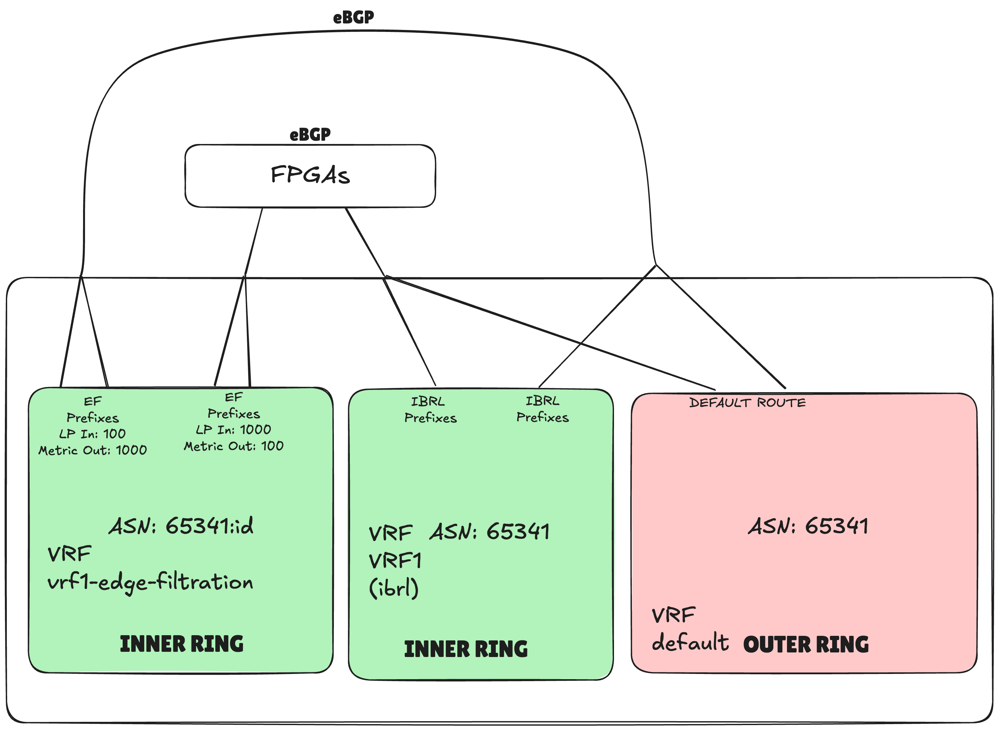

# FPGA Routing Architecture

---

## Summary
Status: Draft

DoubleZero conceptually separates an outer ring and inner ring of the network, with the outer ring interfacing with the Internet while the inner ring is the filtered layer.  Filtering occurs as packets transit from outer to inner rings through FPGA hardware.

The goal of this RFC is to provide an architectural overview of the placement of FPGA hardware within the data path of packets flowing within the DoubleZero network.  It outlines the traffic flows for a newly defined edge-filtration (EF) user mode that enables the benefits of FPGA offloading for a single tenant, Solana.  Currently, IBRL mode supports connectivity between DZ connected users only and assumes a level of trust, particularly in the permissioned access-pass entitlement that currently exists.  In EF mode, this will expand the use of DZ to support traffic from any node on the public Internet to connect to a DZ user, with the added benefit of FPGA filtering protecting the inner ring EF users from malicious attacks.

Out of scope for this RFC:
- The benefits of FPGA services to Solana users
- FPGA design and implementation, including the use of QUIC or other transport protocols
- FPGA provisioning or management
- doublezerod/client routing

## Motivation
DoubleZero's inner ring should be protected using FPGA filtration services, providing deduplication and signature verification as an opt-in feature for Solana users.  To successfully inspect the packets, the FPGA hardware must have visibility of the traffic flows, including as they ingress from the Internet, and as such must sit inline without explicit modification to the configuration of the user software i.e. the validator configuration file(s).  Additionally, interoperability is required with DZ users that connect in different modes, such as IBRL.

## New Terminology
Edge-Filtration: mode that allows a user to opt-in to FPGA services such as deduplication and signature verification.

FPGA Loopback: Interconnect, typically a cable , that facilitates routing between the edge-filtration VRF and other VRFs on the same DZD, with FPGA hardware sitting inline.

Inter-VRF Loopback: Interconnect, typically a cable , that facilitates routing between the edge-filtration VRF and other VRFs on the same DZD, bypassing any FPGA hardware.

Provider Aggregatable (PA) Address Space - address space assigned to a customer (contributor) as part of an address block owned by the upstream Internet provider.

Provider Independent (PI) Address Space - address space assigned to a customer (contributor) by a Regional Internet Registry such as ARIN in North America or RIPE in Europe. 

## Alternatives Considered
- N/A

## Detailed Design
With IBRL mode, DZ facilitates connectivity between DZ users only, with all traffic flows that terminate at a non-DZ user routed via the Internet.  In EF mode, a user can be reached by any host - DZ connected or not - via the user's `doublezero0` interface.  As such, EF mode will require the use of DZ assigned address space, with routing policies enabled to support access via the DZD CYOA interfaces. For a DZD to support EF mode, it must have at least one CYOA interface of type `gre-over-dia` or `gre-over-public-peering` to facilitate Internet access.

In the existing IBRL and multicast connection modes, user tunnels are terminated in an L3VPN VRF (`VRF1`) and in the `default` VRF respectively.  This facilitates a number of properties of the DZ network, including address reuse and segment routing for IBRL mode, and native IPv4 shortest path routing for multicast mode.  To ensure that packets for EF users traverse the FPGA hardware while supporting IBRL and multicast modes, the DZ network topology will be enhanced by further virtualizing the DZD hardware through the addition of a new VRF lite instance called `vrf1-edge-filtration`, responsible for terminating tunnel overlays for EF users.

The following traffic flows need to be supported for EF users:
1. EF user to IBRL user (same DZD)
2. EF user to IBRL user (different DZDs)
3. EF user to EF user (different DZDs) 
3. EF user to/from non-DZ user

Note that for EF users, intra-metro routing policies supports connectivity to any user - EF or IBRL - except for intra-DZD EF to EF users.  

Consider Figure 1 below which will be used as a baseline for describing all unicast traffic flows (note interface names are indicative only):

- VRF `default` (existing):
  - Interfaces:
    - WAN interface(s) (existing): used for terminating layer 3 interfaces facing same contributor owned DZDs via WAN links
    - DZX interface(s) (existing): used for terminating layer 3 interfaces facing different contributor owned DZDs via MAN links
    - CYOA interface(s) (existing): used for terminating layer 3 interfaces facilitating user onramp(s)
      - user tunnel underlays
    - Loopback 255 (existing): used for `vpn-ipv4` address-family supporting iBGP peering / segment routing
    - Loopback 256 (existing): used for `ipv4` address-family supporting iBGP and MSDP peering
    - ETH3.20 (new): layer 3 sub-interface to interconnect between `default` VRF and `vrf1-edge-filtration` VRF via FPGA hardware 
    - ETH4.20 (new): layer 3 sub-interface to interconnect between `default` VRF and `vrf1-edge-filtration` VRF bypassing FPGA hardware

- VRF `vrf1` (existing):
  - Interfaces:
    - `ibrl` GRE tunnel interface(s) (existing): GRE tunnels connecting IBRL users
      - user tunnel overlays
    - ETH3.10 (new): layer 3 sub-interface to interconnect between `vrf1` VRF and `vrf1-edge-filtration` VRF via FPGA hardware 
    - ETH4.10 (new): layer 3 sub-interface to interconnect between `vrf1` VRF and `vrf1-edge-filtration` VRF bypassing FPGA hardware

- VRF `vrf1-edge-filtration` (new):
  - Interfaces:
    - EF GRE tunnel interface(s) (new): GRE tunnels connecting EF users
      - user tunnel overlays
    - ETH1.10 (new): layer 3 sub-interface to interconnect between `vrf1` VRF and `vrf1-edge-filtration` VRF via FPGA hardware
    - ETH1.20 (new): layer 3 sub-interface to interconnect between `default` VRF and `vrf1-edge-filtration` VRF via FPGA hardware  
    - ETH2.10 (new): layer 3 sub-interface to interconnect between `vrf1` VRF and `vrf1-edge-filtration` VRF bypassing FPGA hardware
    - ETH2.20 (new): layer 3 sub-interface to interconnect between `default` VRF and `vrf1-edge-filtration` VRF bypassing FPGA hardware

<p align="center">
  
</p>
<p align="center"><em>Figure 1: FPGA Routing Architecture</em></p>

### Traffic Flows

#### EF user to IBRL user (same DZD)

1. An EF user sends packets via its `doublezero0` interface based on receiving IBRL prefixes via its eBGP session with the DZD.  Traffic is sent via GRE ingressing at the DZD on its CYOA interface, de-encapsulated with Tunnel overlays placed in `vrf1-edge-filtration` VRF.

2. `vrf1-edge-filtration` routes packets via the FPGA Loopback to `vrf1` within the same DZD.  Routing is controlled via eBGP between the VRFs.  A backup is available via the Inter-VRF Loopback in the event that the FPGA is unable to pass traffic.

3. Traffic is routed from `vrf1` via GRE, egressing local CYOA interfaces.  It is received at the IBRL user on its `doublezero0` interface.

<p align="center">
  
</p>
<p align="center"><em>Figure 2: EF user to IBRL user (same DZD)</em></p>

#### EF user to EF user (different DZDs)

1. An EF user sends packets via its `doublezero0` interface based on receiving EF prefixes via its eBGP session with the DZD.  Traffic is sent via GRE ingressing at the DZD on its CYOA interface, de-encapsulated with Tunnel overlays placed in `vrf1-edge-filtration` VRF.

2. `vrf1-edge-filtration` routes packets via the FPGA Loopback to `vrf1` within the same DZD.  Routing is controlled via eBGP between the VRFs.  A backup is available via the Inter-VRF Loopback in the event that the FPGA is unable to pass traffic.

3. Traffic is routed from `vrf1` via L3VPN to the destination DZD using the appropriate Segment Routing Policy, encapsulated and received at `vrf1` on the remote DZD.  

4. From `vrf1`, traffic is routed to the `vrf1-edge-filtration` VRF via the FPGA Loopback. 

5. Traffic is routed from `vrf1-edge-filtration` via GRE, egressing local CYOA interfaces.  It is received at the EF user on its `doublezero0` interface.

<p align="center">
  
</p>
<p align="center"><em>Figure 3: FPGA Routing - EF User to EF User (different DZDs)</em></p>

#### EF user to IBRL user (different DZDs)

1. An EF user sends packets via its `doublezero0` interface based on receiving IBRL prefixes via its eBGP session with the DZD.  Traffic is sent via GRE ingressing at the DZD on its CYOA interface, de-encapsulated with Tunnel overlays placed in `vrf1-edge-filtration` VRF.

2. `vrf1-edge-filtration` routes packets via the FPGA Loopback to `vrf1` within the same DZD.  Routing is controlled via eBGP between the VRFs.  A backup is available via the Inter-VRF Loopback in the event that the FPGA is unable to pass traffic.

3. Traffic is routed from `vrf1` via L3VPN to the destination DZD using the appropriate Segment Routing Policy, encapsulated and received at `vrf1` on the remote DZD.  

4. Traffic is sent from `vrf1` via GRE, egressing local CYOA interfaces.  It is received at the IBRL user on its `doublezero0` interface.

<p align="center">
  
</p>
<p align="center"><em>Figure 4: FPGA Routing - EF user to IBRL user (different DZDs)</em></p>

#### EF user to/from non-DZ user

1. An EF user sends packets via its `doublezero0` interface based on receiving the default route via its eBGP session with the DZD.  Traffic is sent via GRE ingressing at the DZD on its CYOA interface, de-encapsulated and is placed in `vrf1-edge-filtration` VRF.

2. `vrf1-edge-filtration` routes packets via the FPGA Loopback to the `default` VRF within the same DZD.  Routing is controlled via eBGP between the VRFs.  A backup is available via the Inter-VRF Loopback in the event that the FPGA is unable to pass traffic.

3. Traffic is routed from `default` using the default route with the next-hop as the upstream Internet provider.  Traffic reaches the non-DZ user based on Internet routing policies.

4. A non-DZ user routing towards a DZ EF user will ingress DZ via the DZD that has the best BGP path. This could be via:

    4a. The DZD connected to the destination EF user

    4b. A different DZD in the metro  
        &nbsp;&nbsp;&nbsp;&nbsp;4b.1 Requires at least one additional hop through the metro using `default` VRF

5. At the DZD where the EF user is directly connected, the `default` VRF routes packets via the FPGA Loopback to the `vrf1-edge-filtration` within the same DZD.

6. Traffic is sent from `vrf1-edge-filtration` via GRE, egressing local CYOA interfaces.  It is received at the EF user on its `doublezero0` interface. 

<p align="center">
  
</p>
<p align="center"><em>Figure 5: FPGA Routing - EF user to/from non-DZ user</em></p

### Routing Policy Between Outer and Inner Rings

BGP will be used to control routing policy between `vrf1-edge-filtration` and both `VRF1` and `default` VRFs. `vrf1-edge-filtration` will be configured using a new ASN based on a newly defined `device.id`.  BGP will be migrated to support BGP dot notation, resulting in eBGP peerings between 65341.device.id and 65341 (used for both `default` and `vrf1`).

To support both `FPGA Loopback` and `Inter-VRF Loopback` paths, BGP attributes will be set on the neighbor configuration applied under `vrf1-edge-filtration`.  Local-preference will be increased to support primary egress via the `FPGA Loopback` peering while metric will be increased via the `Inter-VRF Loopback` peering to  support primary ingress via `FPGA Loopback`. 

In summary, EF BGP policy is:
  - Traffic Flows/Policy (set within `vrf1-edge-filtration` only):
    - FPGA Loopback:
      - Local Preference inbound: 1000
      - Metric outbound: 100
    - Inter-VRF Loopback
      - Local Preference: 100
      - Metric outbound: 1000
  - Filtering:
    - `vrf1-edge-filtration`:
      - outbound:
        - Local EF prefixes
      - inbound:
        - All
    - `vrf1`:
      - outbound: 
        - All
        - Default Route originated from local CYOA (DIA)
      - inbound: 
        - All

See example configuration below.

<p align="center">
  
</p>
<p align="center"><em>Figure 6: FPGA Routing - BGP Control Plane</em></p

#### Example configuration
```
vrf instance vrf1-edge-filtration
!
ip routing vrf vrf1-edge-filtration
!
route-map RM-FILTER-FPGA-LOOPBACK-IN permit 10
   set local-preference 1000
!
route-map RM-FILTER-FPGA-LOOPBACK-OUT permit 10
   set metric 100
!
route-map RM-FILTER-INTER-VRF-IN permit 10
   set local-preference 100
!
route-map RM-FILTER-INTER-VRF-OUT permit 10
   set metric 1000
!
router bgp 65342
   bgp asn notation asdot
   !
   neighbor {{ POINT_TO_POINT_1 }} remote-as 65342.{device.id}
   neighbor {{ POINT_TO_POINT_1 }} description VRF1-FPGA-LOOPBACK
   neighbor {{ POINT_TO_POINT_2 }} remote-as 65342.{device.id}
   neighbor {{ POINT_TO_POINT_2 }} description VRF1-INTER-VRF

   vrf vrf1
    neighbor {{ POINT_TO_POINT_3 }} remote-as 65342.{device.id}
    neighbor {{ POINT_TO_POINT_3 }} description VRF1-FPGA-LOOPBACK
    neighbor {{ POINT_TO_POINT_4 }} remote-as 65342.{device.id}
    neighbor {{ POINT_TO_POINT_4 }} description VRF1-INTER-VRF

   vrf vrf1-edge-filtration
    !Below ASN will appear in asplain format
    local-as 65342.{device.id}
    neighbor {{ POINT_TO_POINT_3 }} remote-as 65342
    neighbor {{ POINT_TO_POINT_3 }} description VRF1
    neighbor {{ POINT_TO_POINT_3 }} route-map RM-FILTER-FPGA-LOOPBACK-IN in
    neighbor {{ POINT_TO_POINT_3 }} route-map RM-FILTER-FPGA-LOOPBACK-OUT out
    neighbor {{ POINT_TO_POINT_1 }} remote-as 65342
    neighbor {{ POINT_TO_POINT_1 }} description DEFAULT
    neighbor {{ POINT_TO_POINT_1 }} route-map RM-FILTER-FPGA-LOOPBACK-IN in
    neighbor {{ POINT_TO_POINT_1 }} route-map RM-FILTER-FPGA-LOOPBACK-OUT out
    neighbor {{ POINT_TO_POINT_4 }} remote-as 65342
    neighbor {{ POINT_TO_POINT_4 }} description VRF1-BYPASS
    neighbor {{ POINT_TO_POINT_4 }} route-map RM-FILTER-INTER-VRF-IN in
    neighbor {{ POINT_TO_POINT_4 }} route-map RM-FILTER-INTER-VRF-OUT out
    neighbor {{ POINT_TO_POINT_2 }} remote-as 65342
    neighbor {{ POINT_TO_POINT_2 }} description DEFAULT-BYPASS
    neighbor {{ POINT_TO_POINT_2 }} route-map RM-FILTER-INTER-VRF-IN in
    neighbor {{ POINT_TO_POINT_2 }} route-map RM-FILTER-INTER-VRF-OUT out
```

### Default Route and iBGP Routing Policy
The scope of the default route in the network is currently limited to within the `default` VRF of a single DZD i.e. Internet services are not shared between DZDs.  This is controlled through static route configuration or through the use of BGP's well-known community `no-advertise`, applied by contributors outside of the DZ protocol.  With EF, the scope of the default route increases to both the `vrf1-edge-filtration` VRF and via eBGP to EF users.  As such, contributors will be required to remove configuration applying `no-advertise`.

To maintain the policy of limiting the scope of the default route to a single DZD, routing policy changes will be implemented between iBGP neighbors within the `default` VRF, preventing default route propagation across the DZ network.  The implementation of iBGP filtering has an additional benefit of controlling and explicitly whitelisting from onchain data prefixes that can be propagated between contributors via iBGP, eliminating an existing vulnerability in the network.

Route-map configuration to support iBGP filtering will reference two match conditions:
  - For multicast sources, a match on `COMM-ALL_MCAST_USERS` community will be used
  - For EF prefixes, a static prefix-list will be used

```
!Matches all possible EF user IP addresses
ip prefix-list PL-DZ-PA-AGGREGATE seq 10 permit 147.51.0.0/17 ge 32
!
route-map RM-IBGP-POLICY-OUT permit 10
   match community COMM-ALL_MCAST_USERS
route-map RM-IBGP-POLICY-OUT permit 20
   match ip address prefix-list PL-DZ-PA-AGGREGATE
route-map RM-IBGP-POLICY-IN permit 10
   match community COMM-ALL_MCAST_USERS
route-map RM-IBGP-POLICY-IN permit 20
   match ip address prefix-list PL-DZ-PA-AGGREGATE
!
router bgp 65342
   images/rfc-fpga-routing/FPGA-F7.png!
   neighbor {{ WAN_POINT_TO_POINT }} route-map RM-IBGP-POLICY out
   neighbor {{ WAN_POINT_TO_POINT }} route-map RM-IBGP-POLICY in
   !
```

### Internet Routing and IP Address Management
The addressing of EF users must use DZ owned PI address space. While existing contributor-owned `dz_prefixes` were considered, the choice of address space directly impacts flexibility when announcing prefixes to the Internet. PA address space is constrained to the upstream provider that owns it, whereas DZ owned PI address space can be announced to any provider. This proposal, therefore, recommends using DZ owned address space 148.51.0.0/17, originated from DZ ASN 209321. By default, a single /24 prefix is allocated per metro during the creation of a DoubleZero `exchange`, supporting up to 255 EF users per metro.  Additional /24 prefixes should be able to be requested through a CLI command, for example:

```
doublezero exchange --pubkey <PUBKEY> request-ip-prefix
```
For the set of prefixes assigned to the metro, all must be advertised from every CYOA within the metro.  This has a number of advantages, particularly with optimizing address allocation as well as using the most efficient peering for traffic ingressing from the Internet to EF users.  A contributor must ensure that the full DZ aggregate block `148.51.0.0/17 le 24 ge 17` is permissioned to be advertised via each CYOA with their upstream providers.

Note that this will by design create asymmetrical routing within the metro, with ingress and egress traffic potentially entering and exiting DZDs.

<p align="center">
  
</p>
<p align="center"><em>Figure 7: FPGA Routing - Internet Routing</em></p

#### Example configuration
```
ip route 148.51.0.0/17 Null0

ip route 148.51.0.0/24 Null0

ip route 148.51.2.0/24 Null0

route-map RM-CYOA-IN permit 10
  match ip address prefix-list DEFAULT

ip prefix-list PL-DZ_LOCAL_SUMMARY seq 10 permit 148.51.0.0/17
ip prefix-list PL-DZ_LOCAL_SUMMARY seq 20 permit 148.51.0.0/24
ip prefix-list PL-DZ_LOCAL_SUMMARY seq 30 permit 148.51.2.0/24

route-map RM-CYOA-OUT permit 10 
  match ip address prefix-list PL-DZ_LOCAL_SUMMARY

router bgp 65342

  neighbor {{ CYOA_POINT_TO_POINT }} local-as 209321 no-prepend replace-as  
  neighbor {{ CYOA_POINT_TO_POINT }} route-map RM-CYOA-IN
  neighbor {{ CYOA_POINT_TO_POINT }} route-map RM-CYOA-OUT

  network 148.17.0.0/17
  network 148.51.0.0/24
  network 148.51.2.0/24
```

### DZD User and Host Routing

Example DZD and EF user tunnel configuration:
```
vrf instance vrf1-edge-filtration
ip routing vrf vrf1-edge-filtration 

interface Tunnel500
   description USER-UCAST-EF-{{ .Id }}
   ip access-group SEC-USER-{{ .Id }}-IN in
   vrf vrf1-edge-filtration
   mtu 9216
   ip address {{ .OverlaySrcIP }}/31
   tunnel mode gre
   tunnel source {{ .UnderlaySrcIP }}
   tunnel destination {{ .UnderlayDstIP }}
   tunnel path-mtu-discovery
   tunnel ttl 32
   no shutdown

ip community-list COMM-ALL_USERS permit 21682:1200

ip community-list COMM-{{ .Strings.ToUpper .Device }}-EF-USERS permit 21682:{{ .Device.Id }}

route-map RM-USER-{{ .Id }}-IN permit 10
   match ip address prefix-list PL-USER-{{ .Id }}
   match as-path length = 1
   set community 21682:1200 21682:{{ .Device.Id }}
route-map RM-USER-{{ .Id }}-OUT deny 10
   match community COMM-{{ .Strings.ToUpper .Device }}-EF-USERS 
route-map RM-USER-{{ .Id }}-OUT permit 20
   match community COMM-ALL_USERS

router bgp 65341
    bgp asn notation asdot
    vrf vrf1-edge-filtration
      router-id {{ .Device.PublicIP }}
      ! ASN below will be integer value i.e. BGP plain-notation
      local-as {{ 65342.deviceid }}
      neighbor {{ .OverlayDstIP }} remote-as 65000
      neighbor {{ .OverlayDstIP }} passive
      neighbor {{ .OverlayDstIP }} description USER-{{ .Id }}
      neighbor {{ .OverlayDstIP }} route-map RM-USER-{{ .Id }}-IN in
      neighbor {{ .OverlayDstIP }} route-map RM-USER-{{ .Id }}-OUT out
      neighbor {{ .OverlayDstIP }} maximum-routes 1
      neighbor {{ .OverlayDstIP }} maximum-accepted-routes 1  
!
```

`doublezerod` will update the kernel Routing Policy Database with appropriate `ip rules` that facilitate policy routing based on, for example, the host application binding to the `doublezero0` interface (to be detailed in a future RFC).

## Impact
- Updates required to the following codebases:
  - activator
  - client/doublezerod
  - client/doublezero/cli
  - controlplane/controller
  - smartcontract
- Delegating DZ IP addressing and ASNs to contributors to be defined, potentially with increased operational complexity

### User Impact
- Validators require multihoming support if failback to the Internet is desired without a Validator restart

### Contributor Impact
- Migrate CYOA to BGP to support dynamic routing on Internet of EF user address space
- DZF will need to delegate ASN and DZ PI address space to each contributor, which will need to be coordinated with upstream providers
- CYOA capacity usage increase as DZ and non-DZ user traffic flow traverses CYOA

## Security Considerations
- DDoS attacks on Validators using EF mode will now be routed via DZ CYOA, resulting in CYOA capacity being critical and/or DDoS mitigation strategies required.

## Backward Compatibility
- IBRL and multicast connection modes should continue to operate as is.

## Open Questions
- What requirements, if any, should we stipulate for edge security?
  - DDoS mitigation?
  - Enhanced ACL filtering?
  - Enhanced anti-spoofing?
- Do we need to mandate particular physical interfaces to interconnect FPGAs?  
  - Assumption is that expressing interface usage onchain is sufficient
