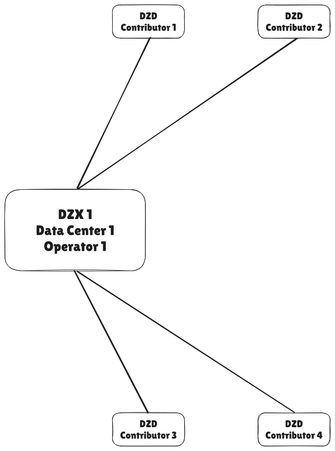

## DoubleZero Exchange - DZX

## Summary

The DoubleZero Exchange (DZX) is a network architectural component designed to ensure a contiguous global DZ network between multiple contributor nodes (DZDs).  The scope of a DZX is a single geographic region, typically a metro or city. Its purpose is to scale the DZ network by enabling broader reach across data centers and contributors.

As the number of DZDs in a metro grows, typically beyond four, the complexity and cost of full-mesh or direct interconnects increase exponentially. The DZX addresses this through the introduction of a fabric-based design, resembling a hub-and-spoke topology, where contributors connect to a shared local exchange, simplifying deployment through reduced fiber requirements and improving operational manageability.  A DZX could be an existing commercial offering or could be a solution developed by the DZ community.

In the long term, the DZX also aligns with the DZ project’s strategic vision of permissionless networking by serving as a physical access point to enable future contributors to join the network. DZD connections could be governed and validated by smart contracts, automated provisioning, verification and ongoing compliance.

The design considerations for a DZX should focus on:
- Enabling a globally contiguous DZ network
- Expanding decentralization
  - Multiple DZX operators
  - Multiple data-center vendors
- Intenet being captured with a smart-contract
- Automation of logical components
- Enhance the vision of permissionless networking

## Motivation

*Why we need this change now.*
Describe the problem or limitation that exists today, who is affected, and any data or examples that illustrate the pain point. Clarify how the proposed feature advances project goals (performance, usability, security, ecosystem growth, etc.).

The DZX is required as the ecosystem expands beyond three DZDs in specific metros.  This is an already identified requirement in multiple major metro areas such as New York City, London, Frankfurt and others.

Consider how DZ could enter and expand into any given city:
- Single DZD, single contributor
  - Metro is most centralized, single point of failure
  - No DZX required
- Two DZDs, single data center, single contributor
  - Contributor may have deployed redundant DZDs in their data center
  - Metro is highly centralized, contributor is single point of failure, increased resiliency in metro network
  - Switches are interconnected, most likely with a simple intra rack or intra cage cabling
  - Negligible cost, low latency, low complexity
- Two DZDs, single data center, multiple contributors
  - Decentralization across contributors, resiliency in network, centralized within a single data center vendor
  - Switches are interconnected using point-to-point cross-connects
  - Low cost, low latency, low complexity
- Multiple DZDs, multiple data centers and vendors, multiple contributors
  - Decentralization across contributors, data centers and vendor, highly resilient network
  - Switches are interconnected using a mixture of hub and spoke and point-to-point interconnects
  - High cost, acceptable latency, higher complexity, greatest scale

The motivation for the DZX is to allow DZ to scale to maximize reach and decentralize while still supporting DZ's major goal of IBRL.

## New Terminology

*Glossary of any new or overloaded terms.*
List and define new words, acronyms, or protocol messages introduced by this RFC. Keep each definition concise and unambiguous so reviewers share a common vocabulary.

- DoubleZero Exchange (DZX): a metro interconnect between 
- Metro: the geographical area where DZDs are deployed and interconnected together across facilities within a city or urban area.

## Alternatives Considered

- Do nothing: 
  - Advantages:
    - None
  - Disadvantages:
    - DZ network is severely limited in its growth without being able to interconnect multiple contributors
- Leverage public Internet by connecting DZDs via GRE over Internet:
  - Advantages:
    - Reuse existing investment, i.e. cheap
  - Disadvantages:
    - Unable to guarantee MTU
    - Loose end-to-end visibility
    - Potential additional capacity required for Internet connections

## Detailed Design

*Exact technical specification.*
Provide enough detail for someone to implement the feature:

* Architecture overview (diagrams encouraged but optional)
* Data structures, schemas, or message formats
* Algorithms, control flow, or state machines
* API or CLI changes (with example calls)
* Configuration options, defaults, and migration steps
  Use subsections as needed; aim for clarity over brevity.

## Impact

*Consequences of adopting this RFC.*
Discuss effects on:

* Existing codebase (modules touched, refactors required)
* Operational complexity (deployment, monitoring, costs)
* Performance (throughput, latency, resource usage)
* User experience or documentation
  Quantify impacts where possible; note any expected ROI.

## Security Considerations

*Threat analysis and mitigations.*
Identify new attack surfaces, trust boundaries, or privacy issues introduced by the change. Describe how each risk is prevented, detected, or accepted and reference relevant best practices.

## Backwards Compatibility

*Interaction with existing deployments.*
Explain whether current nodes, data, or integrations continue to work unchanged. If not, spell out migration paths, feature gates, version negotiation, or deprecation timelines.

## Open Questions

*Items that still need resolution.*
List outstanding issues, research tasks, or decisions deferred to later milestones. This section helps reviewers focus feedback and signals areas where contributions are welcomed.

---

*End of template. Delete all instructional text (italicized sentences and bullet guidance) when submitting your RFC.*
