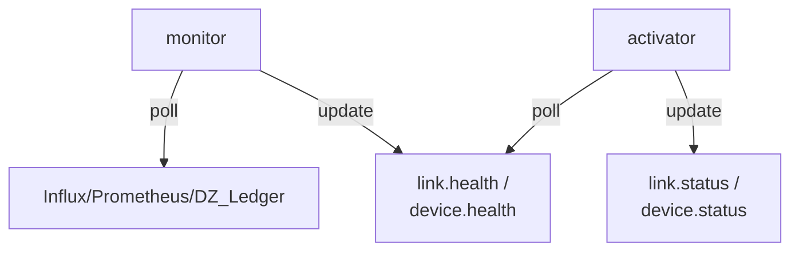
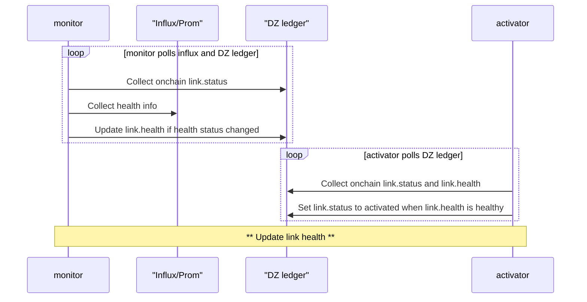

# TODO
- Incorporate https://github.com/malbeclabs/doublezero/issues/2032

# Network Provisioning Framework

## Summary

**Status: Draft**

This RFC defines the network provisioning process to be used by DoubleZero contributors when onboarding (and offboarding) new devices, links, and CYOA interfaces, with a focus on automation. Also see related RFCs: 

## Motivation

The provisioning process for DoubleZero devices and links currently involves a lot of manual effort, is prone to human error, and includes overhead and delays due to coordination needed between contributors and the DoubleZero Foundation. We want to define the process, and identify which parts of the process to prioritize for automation.

## New Terminology

**Onboarding** - The process of adding a new device or link to the network, starting with the point at which the contributor and DZF have decided to add the device or link
**Offboarding** - The process of removing an existing device or link from the network, starting with the point at which the contributor has decided to remove the link or device

## Alternatives Considered

* We can keep the current loosely defined manual process in place. This will allow us to prioritize other development work, but it will keep operational overhead high for contributors, and make the DoubleZero mainnet-beta network more difficult to scale.
* We can look at procuring a commercial network provisioning system such as Cisco Network Services Orchestrator, Juniper Apstra, SolarWinds Network Configuration Manager, or others. However, Malbec Labs has experience with using these systems. In the best case these systems tend to be expensive and they do not solve anything out of the box - they require customization. They also use traditional database backends, and would require customization to integrate with the DZ ledger (if doing so is even feasible). We prefer the approach of building a minimal, purpose-built system that deeply integrates with the rest of the DoubleZero stack.

## Detailed Design

* Architecture overview (diagrams encouraged but optional)
* Data structures, schemas, or message formats
* Algorithms, control flow, or state machines
* API or CLI changes (with example calls)
* Configuration options, defaults, and migration steps
  Use subsections as needed; aim for clarity over brevity.

Components:


### Link (WAN or DZX) onboarding  

-----
Link onboarding - Sequence diagram:


#### Link onboarding - prerequisites
1. Link record exists on DZ ledger with link.status = soft_drained or hard_drained
1. The link's A and Z interfaces have 24 hours of data in InfluxDB with zero errors and non-zero utilization
1. link.desired_status = activated

#### Link onboarding - activation
1. The `monitor` component, when all prerequisites are met, sets link.health to `healthy`
1. The `activator` component listens to link events (and periodically polls for them)
	1. Set link.status to `activated` when:
        1. link.desired_status = activated
        1. and link.health = healthy 
        1. and link.status = soft_drained|hard_drained

### Link (WAN or DZX) offboarding  

#### Link offboarding - prerequisites
1. link.status = hard_drained

#### Link offboarding - deletion
1. Contributor or DZF runs `doublezero link delete --pubkey <pubkey>`

### Device onboarding  
#### Device onboarding - prerequisites
1. Device record created with
   1. public_ip - set
   1. dz_prefixes - at least one /29
   1. max_users - set to 0
   1. status = hard-drained
1. At least 1 DIA interface defined on chain with status = activated
1. At least 1 DZX/WAN link interface defined on chain with status = activated
1. At least 1 DIA interface up for 24 hours with zero errors and non-zero utilization
1. At least 1 DZX or WAN link up for 24 hours with zero errors and non-zero utilization
1. Device is reporting to InfluxDB for 24 hours
1. Config agent installed and running for 24 hours
1. Telemetry agent installed and running for 24 hours
1. QA test passing for 24 hours

#### Link onboarding - activation
1. The `monitor` component, when all prerequisites are met, sets device.health to `healthy`
1. The `activator` component listens to device events (and periodically polls for them)
	1. Set device.status to `activated` when:
        1. device.desired_status = activated
        1. and device.health = healthy 
        1. and device.status = soft_drained|hard_drained

### Tasks

- serviceability: add link.health 
```
pub enum LinkHealth {
    Unknown = 0,
    Pending = 1,
    Healthy = 2,
    Impaired = 3,
}
```
- serviceability: add link.desired_status
```
pub enum LinkDesiredStatus {
    Activated = 0,
    SoftDrained = 1,
    HardDrained = 2,
    Deleted = 3,
}
```
- serviceability: add device.health 
```
pub enum DeviceHealth {
    Unknown = 0,
    Pending = 1,
    Healthy = 2,
    Impaired = 3,
}
```
- serviceability: add device.desired_status
```
pub enum DeviceDesiredStatus {
    Activated = 0,
    SoftDrained = 1,
    HardDrained = 2,
    Deleted = 3,
}
```
- monitor: add logic to update link.health and device.health
- activator: add logic to update link.status and device.status

-----
WORK IN PROGRESS - DO NOT READ PAST THIS POINT

## Impact

*Consequences of adopting this RFC.*
Discuss effects on:

* Existing codebase (modules touched, refactors required)
* Operational complexity (deployment, monitoring, costs)
* Performance (throughput, latency, resource usage)
* User experience or documentation
  Quantify impacts where possible; note any expected ROI.

## Security Considerations

*Threat analysis and mitigations.*
Identify new attack surfaces, trust boundaries, or privacy issues introduced by the change. Describe how each risk is prevented, detected, or accepted and reference relevant best practices.

## Backward Compatibility

*Interaction with existing deployments.*
Explain whether current nodes, data, or integrations continue to work unchanged. If not, spell out migration paths, feature gates, version negotiation, or deprecation timelines.

## Open Questions

*Items that still need resolution.*
List outstanding issues, research tasks, or decisions deferred to later milestones. This section helps reviewers focus feedback and signals areas where contributions are welcomed.

---

*End of template. Delete all instructional text (italicized sentences and bullet guidance) when submitting your RFC.*
