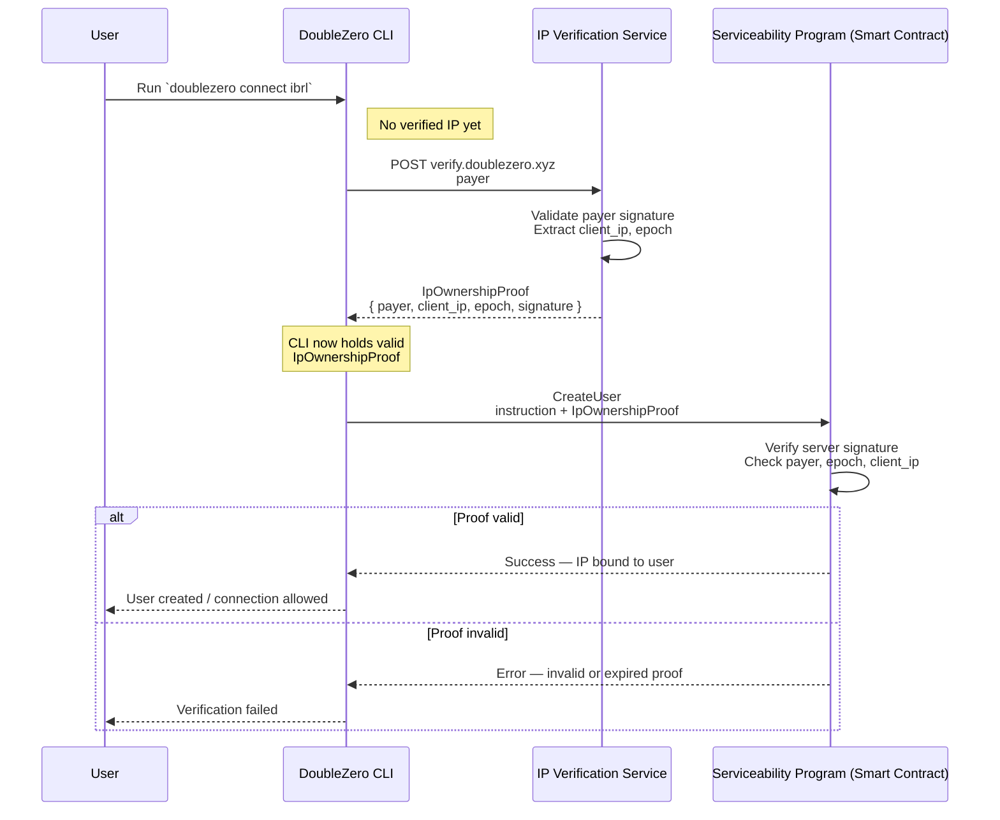

# RFC 12: IP Ownership Verification Service for user connection

## Summary

**Status:** Draft  

This RFC introduces a mandatory **IP Ownership Verification** mechanism for DoubleZero onboarding. The goal is to ensure that only the legitimate owner of a public IP can bind that IP to an User connection.  

DoubleZero will deploy a new component,  the **IP Verification Service**,  which generates cryptographically signed proofs that the Serviceability program consumes before allowing IP assignment.

This eliminates the risk of malicious users preemptively claiming IPs they do not control.

---

## Motivation

Currently, DoubleZero accepts a `client_ip` during `user create` without validating ownership. Because IPs must be unique for routing and access-control, this is a critical security gap.

### Risk: Unauthorized IP Claim

A malicious user may intentionally register an IP they do not control, blocking the real operator from connecting and causing a denial-of-service.

### Goal

Guarantee that the only entity capable of claiming an IP is the one that truly operates from it.

---

## New Terminology

## Alternatives Considered

## Detailed Design

This RFC proposes an **outbound proof-of-control** process using an external verification endpoint (e.g., `https://verify.doublezero.xyz`).

## Verification Flow Diagram

The Verification Service returns a signed **IpOwnershipProof** containing:

- the payer pubkey
- the observed public IP
- the current epoch
- a signature by a DoubleZero verifier keypair

The CLI includes this proof in the `CreateUser` or `CreateUserSubscriber` instruction.

The Serviceability program validates the proof and only then binds the IP.

---

### Protocol Flow



#### Outbound Ownership Verification

Ownership is established by the user initiating a request **from the IP they want to claim**.

The user runs the `connect` command, the CLI retrieves the signed public IP and creates the user by passing this information.

   ```bash
   doublezero connect ibrl
   ```

#### Steps

1. CLI requests a verification proof:

   ```bash
   GET https://verify.doublezero.xyz 
   {
        "payer": "<Pubkey>",
   }
   ```

2. The Verification Service extracts:
   - `client_ip` = IP source from HTTP request
   - `payer` pubkey from body
   - `epoch` from DoubleZero side chain 

3. The Verification Service create asignature with string: "\<payer\><client_ip\><epoch\>".

4. The service returns a signed proof:
   ```json
   {
     "payer": "<payer_pubkey>",
     "client_ip": "<a.b.c.d>",
     "epoch": <u64>,
     "signature": "<ed25519_signature>" 
   }
   ```

5. The CLI receive the proof and create the user

   ```bash
   CreateUser(client_ip, user_payer, epoch, signature)
   ```

6. Smart contract verifies proof:
   - signature valid  
   - payer matches  
   - epoch fresh  
   - IP valid  

If all conditions pass → the IP is bound.

---

### Proof Specification

```rust
pub struct IpOwnershipProof {
    pub payer: Pubkey,
    pub client_ip: u32,     // IPv4
    pub epoch: u64,
    pub signature: [u8; 64],  // Ed25519
}
```

#### Signing Procedure

```
signature = sign(
    verifier_private_key,
    hash(payer || client_ip || epoch)
)
```

The corresponding public key is embedded in the Serviceability program.

---

### Smart Contract Validation

#### Required checks

1. Decode proof.  
2. Compute `H = hash(payer || client_ip || epoch)`.  
3. Verify signature.  
4. Validate:
   - `payer == user_payer`
   - epoch within allowed drift
   - IP is well formed  

5. Apply IP binding.

#### Rejection Conditions

The program MUST reject when:

- signature invalid  
- epoch expired  (~1)
- payer mismatch  
- malformed IP  
- reused proof outside time window  


### Drawbacks

- Requires maintaining centralized verification infrastructure. We can run multiple services simultaneously behind Cloudflare. 
- Adds complexity to CLI + smart contract.  
- Users may need re-verification if their IP changes.  

---

### Security Considerations

#### Preventing IP Hijacking
Only the true operator of the IP can make the outbound request, making preemptive claiming impossible.

#### Replay Protection
Epoch provides a freshness window; proof cannot be reused indefinitely.

#### NAT & Shared IP Environments
Some scenarios may map multiple operators to the same IP or multiple IP on the same Server.  
Documentation must warn these users about possible conflicts.

---

## Backward Compatibility

To ensure a smooth transition, the Serviceability program can support both user-creation flows for a limited number of versions:

1. the legacy flow, where the CLI directly provides a client_ip without verification, and
2. the new verification-based flow, where the IP is bound only after presenting a signed proof generated by the IP Verification Service.

This maintains a compatibility period until all users migrate to the new CLI version.

---

## Open Questions

- Should proofs be persisted for auditing?  
- Should IP re-verification be periodic?  
- Should IPv6 be supported?  
- Should verifier keys rotate on a schedule?

---
