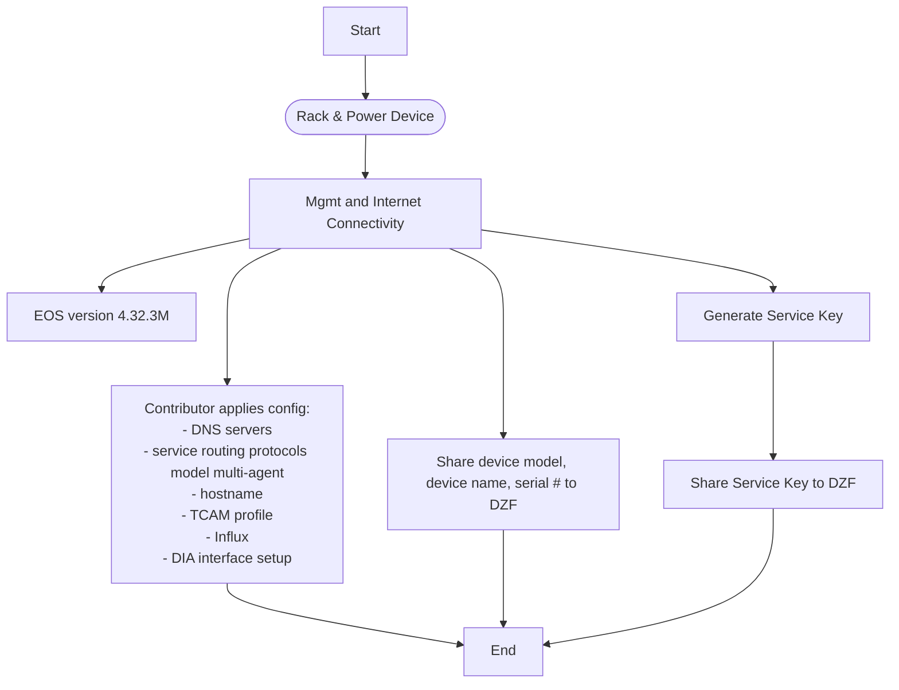
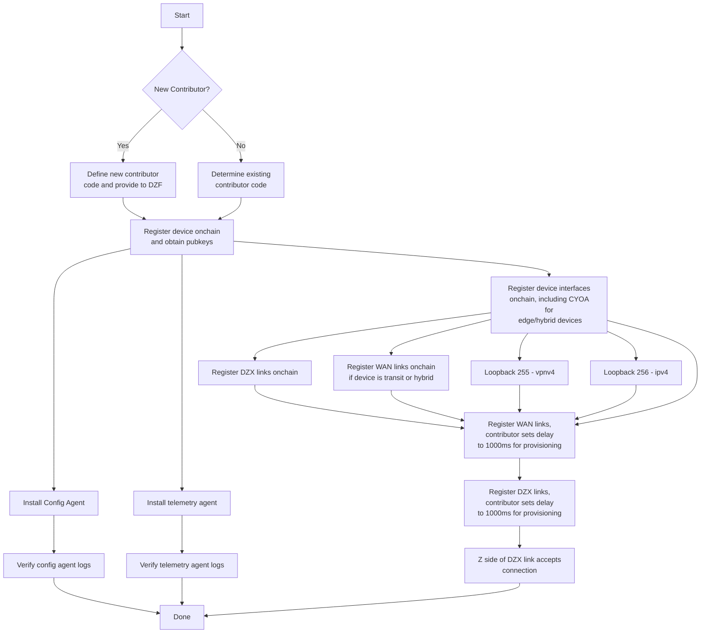
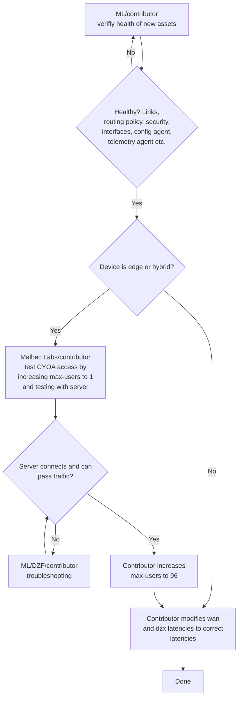

# Network Provisioning Framework

## Summary

**Status: Approved**

This RFC documents the network provisioning process used by DoubleZero contributors when onboarding and performing maintenance on devices, links, and CYOA interfaces, and proposes initial steps for automating the process. Also see rfc9-link-draining.md. Offboarding is currently out of scope.

## Motivation

The provisioning process for DoubleZero Devices (DZDs) and links currently requires manual effort, is prone to human error, and includes overhead and delays from coordination between contributors and the DoubleZero Foundation (DZF).

## New Terminology

- **Onboarding** - The process of adding a new device or link to the network, starting with contributor's decision to add a device or link
- **Offboarding** - The process of removing an existing device or link from the network, starting with the contributor's decision to remove the link or device
- **Edge device** - A DoubleZero Device (DZD) that terminates user tunnels (max-users > 0). It has:
    - 1 or more CYOA interfaces 
    - Zero WAN links
    - 1 or more DZX links
    - 1x out-of-band management with Internet access (can reuse CYOA)
- **Transit device** - A DZD that routes traffic between other DZDs but does not terminate user tunnels. It has:
    - Zero CYOA interfaces
    - 2 or more WAN links (single contributor metro)
    - 1x WAN link and 1 or more DZX link (multi-contributor metro)
    - 1x out-of-band management with Internet access
- **Hybrid device** - A DZD that terminates user tunnels and also routes traffic between other DZDs. It has:
    - 1 or more CYOA interfaces
    - 1 or more WAN links (single contributor metro)
    - 1 or more WAN links and 1 or more DZX links (multi-contributor metro)
    - 1x out-of-band management with Internet access (can reuse CYOA)
- **RFS** - Ready For Service criteria are a set of conditions that must be met for a device or link to be considered healthy and therefore ready for service.
- **Burn-in period** - The amount of time a link or device must pass all its health checks before it can be activated. For links and devices activated for the first time this is 200,000 slots on the [DoubleZero ledger](https://explorer.solana.com/?cluster=custom&customUrl=https%3A%2F%2Fdoublezero-mainnet-beta-local.rpcpool.com%2Fdb336024-e7a8-46b1-80e5-352dd77060ab), which at 370ms per slot is about 20 hours. For links and devices being re-activated after maintenance this is 5000 slots, about 30 minutes.

## Alternatives Considered

* We can keep the current manual process in place. This will allow us to prioritize other development work, but it will keep operational overhead higher for contributors and the DoubleZero engineering team, and make the DoubleZero mainnet-beta network more difficult to scale.
* We can look at procuring a commercial network provisioning system such as Cisco Network Services Orchestrator, Juniper Apstra, SolarWinds Network Configuration Manager, or others. However, based on team members' experience with these systems, in the best case they systems tend to be expensive and require extensive investment in customization. They also use traditional database backends, and would require additional customization to integrate with the DZ ledger (if doing so is even feasible). We prefer a minimal, purpose-built system that deeply integrates with the rest of the DoubleZero stack.

## Scope
This rfc covers device and link onboarding, and device draining for maintenance purposes like firmware upgrades and parts replacement.

The following are out of scope:
- Offboarding of devices is out of scope because we don't currently have demand for removing devices from the network.
- Automatically moving devices or links to a drained status, for example due to failing health checks, is out of scope due to the operational risk it would introduce. For now, this will still require action by the contributor owning the device or link.
- Link draining is already covered by rfcs/rfc9-link-draining.md.
- Automatic re-connection of users to nearby devices is out of scope. During device draining, users will remain connected to their current device, and will need to take action if they want to re-connect to another nearby device
- Providing visibility into the history of the network topology is out of scope.
- Providing users with visibility into a schedule of planned maintenance is out of scope.
- Automatically determining whether the network has enough capacity to safely drain a given DZD is out of scope.
- Draining of CYOA interfaces is out of scope, although draining a device will shut down all user BGP sessions, and so it will have the effect of removing all user traffic from all CYOA interfaces.
- We would like to publish detailed health info to contributors onchain, but to keep the scope tight, we will start by using Grafana to publish health info to contributors.
- We would like to add a health check that performs a port scan on devices, but that is currently out of scope.
- Some device/link RFS criteria are out of scope because we don't currently have a way to retrieve relevant data from devices, and we don't want to delay the first version of this framework in order to incorporate them. For example we currently have no way to verify that NTP is configured correctly.
- Providing a means for DZDs to talk to the controller when internet access is down is out of scope.

## Detailed Design

### Device onboarding - current process
This section describes the existing manual onboarding process for new devices. The workflow is divided into phases to make them easier to view. This rfc currently focuses on parts of Phase 2 and Phase 3 of the device onboarding process.

Phase 1 - Initial device setup


Phase 2 - Model device onchain


Phase 3 - Health check and enable user connections


Here are the same phases as lists:

#### Phase 1
1. Rack & power device
1. Mgmt and Internet connectivity
1. Upgrade EOS to version 4.32.3M
1. Contributor applied configuration
    1. DNS servers
    1. `service routing protocols model multi-agent`
    1. hostname
    1. DZ-provided TCAM profile
    1. Influx
    1. DIA interface setup
1. Generate service key
    1. Share service key to DZF

#### Phase 2
1. Share device model, name, and serial number to DZF
1. If this is a new contributor, define new contributor code and provide to DZF
1. Register device onchain with max-users=0 (to prevent users from connecting)
    1. Provide pubkey to DZF
1. Install config agent
    1. Verify config agent logs
1. Install telemetry agent
    1. Verify telemetry agent logs
1. Register device interfaces onchain
    1. Loopback256 - ipv4
    1. Loopback255 - vpnv4
    1. Interfaces to be used for wan/dzx links
    1. Interfaces to be used for CYOA
1. Register wan/dzx links onchain with link.status set to SoftDrained
1. Z side contributor accepts any pending links

#### Phase 3
1. Contributor verifies health of new assets
    1. Are interfaces links, routing protocols, routing policy, security, etc, configured correctly?
    1. Are the device's config and telemetry configured and operating correctly?
1. For edge/hybrid devices
    1. Run QA test via device's CYOA interface(s)
    1. On failure, troubleshoot errors and repeat QA test
    1. On success, set device.max-users to 96
1. For each link connected to the device:
    1. Contributor un-drains the link by setting link.status to Activated

### Architecture
We propose to create a new `device-health-oracle` component to periodically monitor the health of links and devices and update a new `health` field in serviceability's `link` and `device` to reflect each link's and device's current health status, as defined by the set of ready-for-service (RFS) criteria defined below. The existing controller component, in turn, supplies the fleet of DZDs with configuration statements that implement the desired network configuration for each status.

### Link (WAN or DZX) onboarding/maintenance/offboarding

Link onboarding has two stages:
1. link created with status = Provisioning
2. link meets all RFS criteria, status set to Activated.

```
               ┌──────────────────────┐
               │ device-health-oracle │
               └───────┬──────────────┘
                       │
            ┌──────────┴───────────────┐
            │                          │ When all link RFS criteria are met,
        poll│                          │ update link.health to ReadyForService
            │                          │
            │                          │
            ▼                          │
┌───────────────────────-┐   ┌─────────│────────────────────────────┐
│ Link health info from  │   │         │                            │
│ DZ_Ledger, Influx,     │   │         ▼                            │
│ Prometheus             │   │  ┌──────────────┐                    │
└──────────────────────-─┘   │  │ link.health  │                    │
                             │  └──────┬───────┘                    │
                             │         │                            │
                             │         │ if link.health is.         │
                             │         │ ReadyForService and        │
                             │         │ link.desired_status is     │
                             │         │ activated, set link.status │
                             │         ▼ to activated               │
                             │  ┌──────────────────────┐            │
                             │  │ link.status          │◄──────────────┐
                             │  └──────────────────────┘            │  │
                             │                                      │  │
                             │   serviceability "link" program      │  │
                             └──────────────────────────────────────┘  │
						   	                                           │
						   	                                           │
					                                                   │ poll
						   	                                   ┌───────┴────┐
							                                   │ controller │
						 	                                   └────────────┘
						 	                                        ▲
                                                                    │
						                                            │ poll
						                                      ┌─────┴──────┐
                                                              │  device    │┐
                                                              │   fleet    ││┐
                                                              └────────────┘││
													           └────────────┘│
													            └────────────┘
```

#### Link RFS criteria
1. Determine the burn-in period to use:
    1. If link.status = Provisioning (new link), use a burn-in period of 200K DZ Ledger slots (about 20 hours)
    1. If link.status = HardDrained or SoftDrained (link being reactivated after maintenance), use a burn-in period of 5000 DZ Ledger slots (about 30 minutes)
1. The link's A and Z interfaces have `<burn-in slots>` worth of data in InfluxDB with zero errors and non-zero utilization
1. The link has `<burn-in slots>` of data in the DoubleZero ledger telemetry program with zero loss


#### Link onboarding - steps
0. Prerequisites
    1. Contributor creates new link (desired_status = Activated, status = Provisioning)
1. The `device-health-oracle` component, when all RFS criteria have been met for the burn-in period, sets link.health to ReadyForService
1. On link.health update, the serviceability link program sets link.status to Activated when:
    1. link.desired_status = activated
    1. and link.health = healthy
    1. and link.status = SoftDrained|HardDrained
1. When link.status is Activated, controller configures link's device interfaces

##### Link maintenance - steps
0. Prerequisites
    1. Contributor sets link.desired_status to HardDrained
1. When link.desired_status is set to HardDrained, the serviceability device program sets link.status to Drained
1. Controller sets `isis passive` on link interfaces
1. When maintenance is complete, contributor sets link.desired_status to Activated
1. Follow [the link onboarding steps](#link-onboarding---steps) above to bring the link back into service

#### Link offboarding - steps
1. Contributor sets link.status to HardDrained
1. Controller sets `isis passive` on link interfaces
1. Contributor runs `doublezero link delete --pubkey <pubkey>`
1. Contributor optionally runs `doublezero device interface delete <device-code> <interface-name>` for all interfaces
1. Contributor manually removes the interface configuration with `default interface <interface-name>`

### Device onboarding
As of December 2025, 72 device have been onboarded to DoubleZero mainnet-beta using the manual health check process described in [phase 3](#phase-3) above. The automated process outlined here replaces the manual process.

Device activation has three stages:
1. device created with status = DeviceProvisioning and desired_status = Activated
2. device meets all RFS criteria needed to support having activated links connected, status set to LinkProvisioning
3. device meets all RFS criteria for users, status set to Activated.

```
               ┌──────────────────────┐
               │ device-health-oracle │
               └─────────┬────────────┘
                         │
            ┌────────────┴─────────────┐
            │                          │ When all device RFS (link) criteria are met,
        poll│                          │ update device.health to ReadyForLinks.
            │                          │
            │                          │ When all device RFS (link) and RFS (user) criteria
            ▼                          │ are met, update device.health to ReadyForUsers
┌───────────────────────-┐          ┌─────────│────────────────────────────────────────────────────────────────────┐
│ Device health info from│          │         ▼                                                                    │
│ (DZ_Ledger / Influx /  │          │  ┌──────────────┐                                                            │
│ Prometheus)            │          │  │ device.health│                                                            │
└──────────────────────-─┘          │  └──────┬───────┘                                                            │
                                    │         │ if desired_status is Activated and status is DeviceProvisioning    │
                                    │         │ and health is ReadForLinks, set device.status to LinkProvisioning  │
                                    │         │                                                                    │
                                    │         │ if desired_status is Activated and status is LinkProvisioning      │
                                    │         │ and health is ReadForUsers, set device.status to Activated         │
                                    │         ▼                                                                    │
                                    │  ┌──────────────────────┐                                                    │
                                ┌─────►│ device.status        │                                                    │
                                │   │  └──────────────────────┘                                                    │
                                │   │                                                                              │
                                │   │                      serviceability "device" program                         │
                                │   └──────────────────────────────────────────────────────────────────────────────┘
                                │
                                │
                                │ poll
                      ┌─────────┴──┐
                      │ controller │ controller renders device/link config appropriate for the current device/link status
                      └────────────┘
                           ▲
                           │
                           │ poll
                     ┌─────┴──────┐
                     │  device    │┐
                     │   fleet    ││┐
                     └────────────┘││
                      └────────────┘│
                       └────────────┘
```

#### Device onboarding - RFS (links) criteria

These criteria must be met before links connected to the device can be activated.

1. Device record created with
    1. public_ip - set
    1. dz_prefixes - at least one /29
    1. max_users - set to 0
    1. status = Pending
    1. Loopback255 exists with loopback_type = vpnv4
    1. Loopback256 exists with loopback_type = ipv4
1. DIA
    1. At least 1 DIA interface defined on chain with status = activated
    1. At least 1 DIA interface up for `<burn-in slots>` with zero errors and non-zero utilization
1. Device is reporting to InfluxDB for `<burn-in slots>` (already established by link RFS criteria)
1. Config agent installed and running for `<burn-in slots>`
1. Telemetry agent installed and running for `<burn-in slots>` (already established by link RFS criteria)

#### Device onboarding - RFS (users) criteria

These criteria must be met before users are able to connect to the device.

1. Determine the burn-in period to use:
    1. If device.status = Provisioning (new device), use a burn-in period of 200K DZ Ledger slots (about 20 hours)
    1. If device.status = Drained (device being reactivated after maintenance), use a burn-in period of 5000 DZ Ledger slots (about 30 minutes)
1. At least 1 DZX/WAN link interface defined on chain with status = activated
1. At least 1 DZX or WAN link up for `<burn-in slots>` with zero errors and non-zero utilization (already established by link RFS criteria)
1. Device meets the criteria for its device.type (edge, hybrid, transit)
1. When device.status = Provisioning, QA tests have emitted 4 "qa test success" prometheus metrics for the device in the past `<burn-in slots`>

#### Device onboarding - out of scope RFS criteria
The following criteria are out of scope because they depend on data that we currently don't have access to.
1. DIA
    1. BGP routes received from DIA are marked with `no-advertise`
    1. An ACL is applied to inbound DIA traffic
    1. The 0th IP in the device's first dz_prefix is configured on loopback100 and reachable via DIA
1. NTP is configured and synced
1. DNS is configured and working
1. TCAM profile is set
1. `service routing protocols model multi-agent` has been set

#### Device onboarding - steps
1. The `device-health-oracle` component, when all RFS criteria have been met for the burn-in period, sets device.health to ReadyForUsers
1. On device.health update, the serviceability link program sets device.status to Activated and device.max-users to 96 (for edge/hybrid devices only) when the following are all true:
    1. device.desired_status = activated
    1. and device.health = healthy
    1. and device.status = Drained

### Device maintenance
When a device needs maintenance that will interrupt user traffic, such as a firmware upgrade or hardware part replacement, we first soft-drain the device's links to re-route transit traffic around the device. Next, we drain user traffic from the device itself by having the controller add `neighbor <w.x.y.z> shutdown` to every user BGP session. At this point, from the user's perspective, `doublezero status` will show a tunnel status of Pending, and the user will not be able to route any traffic over DoubleZero unless they take action by disconnecting a connecting to a different device.

For IBRL users, traffic will re-route via the internet. For multicast users, traffic will be interrupted for the duration of the maintenance, so users will need to fall back on other means to receive the same data over the internet. If users want to remain connected to DoubleZero during the maintenance, they will need to take action to disconnect and reconnect to a different device.

##### Device maintenance - steps
1. Contributor runs `doublezero link update --pubkey PUBKEY --desired-status drained` for each link connected to the device
1. Contributor runs `doublezero device update --pubkey PUBKEY --desired-status drained`
1. When the contributor sets device.desired_status to Drained, the serviceability device program sets device.status to Drained

1. On link.desired_status update, the serviceability link program sets link.status to HardDrained and sets link.health to Drained.
1. Controller sets `isis passive` on link interfaces
1. When maintenance is complete, contributor sets link.desired_status to Activated
1. Follow [the link onboarding steps](#link-onboarding---steps) above to bring the link back into service

#### Device offboarding
Out of scope

### Tasks

#### - serviceability: add new LinkStatus - Provisioning
Add new Provisioning status to LinkStatus. Currently, new links are created with the Pending status and immediately moved to Activated status after resources are assigned. Now, new links will instead be moved to Provisioning status after resources are assigned.
```
pub enum LinkStatus {
    Pending = 0,
    Activated = 1,
    Suspended = 2,
    Deleting = 3,
    Rejected = 4,
    Requested = 5,
    HardDrained = 6,
    SoftDrained = 7,
    Provisioning = 8,   // new status
}
```

#### - serviceability: add link.health
This new link field is updated by the new `device-health-oracle` component.
```
pub enum LinkHealth {
    Unknown = 0,
    Pending = 1,            // this link has never met all RFS criteria
    ReadyForService = 2,    // this link has met all RFS criteria
    Impaired = 3,           // this link has failed one or more RFS criterion after previously reaching ReadyForService
}
```

#### - serviceability: add link.desired_status
This new link field captures the intention of the contributor. It defaults to Activated when a link is created.
```
pub enum LinkDesiredStatus {
    Activated = 0,          // The link should be fully activated once all RFS criteria are met
    SoftDrained = 1,        // The link's isis metric should be set to its maximum, see rfc9-link-draining.md for details
    HardDrained = 2,        // The link should be removed from isis, effectively removing it from the network
    // Deleted = 3,         // Not applicable since offboarding is currently out of scope
}
```

#### - serviceability: add DeviceProvisioning and LinkProvisioning to device.status
Add two new statuses to DeviceStatus -- DeviceProvisioning and LinkProvisioning. Currently, new devices are created with the Pending status and immediately moved to Activated status after resources are assigned. Now, new devices will instead be moved to DeviceProvisioning status after resources are assigned. Once `device-health-oracle` determines all RFS (device) criteria are met, it sets device.health to ReadyForLinks (defined below), and serviceability moves device.status to LinkProvisioning. Once `device-health-oracle` determines all RFS (links) criteria are met, it sets device.health to ReadyForUsers, and serviceability moves device.status to Activated.

```
pub enum DeviceStatus {
    Pending = 0,                // 1. assign resources and change to DeviceProvisioning
    Activated = 1,              // 4. device and link health checks have passed and device is ready to connect users
    Suspended = 2,
    Deleting = 3,
    Rejected = 4,
    Drained = 5,
    DeviceProvisioning = 6,     // 2. controller provides configuration.
    LinkProvisioning = 7,       // 3. device health checks have passed and device is ready to connect links
}
```

#### - serviceability: add device.health
```
pub enum DeviceHealth {
    Unknown = 0,
    Pending = 1,
    ReadyForLinks = 2,        // ready to connect links
    ReadyForUsers = 3,        // ready to connect users
    Impaired = 4,
}
```

#### - serviceability: add device.desired_status
```
pub enum DeviceDesiredStatus {
    Pending = 0,
    Activated = 1,
    Drained = 6,
}
```

#### - device-health-oracle: add logic to update link.health and device.health
#### - device-health-oracle: send Slack notifications
#### - serviceability link program
- add LinkHealth
- add LinkDesiredStatus
- add `Drained` to LinkStatus
- add logic to update link.status
- allow foundation to override device.status
#### - serviceability device program
- add DeviceHealth
- add DeviceDesiredStatus
- add `Drained` to DeviceStatus
- add logic to update device.status
- allow foundation to override device.status
#### - activator/serviceability: when devices and links are created, don't change their status to activated
#### - activator/serviceability: don't allow users to connect when device.status is drained
#### - controller: add logic that shuts down user BGP, IBGP sessions, MSDP neighbors, and ISIS neighbors when device.status is drained
#### - qa: create identity that can connect without any checks for status or max-users
#### - qa: update alldevices test to emit prometheus metrics to be used in RFS criteria
#### - Grafana: don't alert on links and devices that are not in activated status
#### - Grafana: provide a dashboard to contributors showing detailed device status and health, including maintenance status
#### - e2e: create e2e tests showing that device/link provisioning and maintenance workflows work

## Impact

Changes are needed to the following components:
* serviceability link and device
* controller
* QA alldevices test

This RFC should improve the operational controls to manage DZDs and links in the network.  It introduces an intent based methodology that uses explict fields to achieve the desired state.

This RFC adds a new device-health-oracle component that collects data from Solana and the DZ ledger (serviceability and telemetry), reads data from Grafana and InfluxDB, and writes data to serviceability.

Contributors should not be rewarded for devices and links that are not in activated status. This check is already present in contributor-rewards (doublezero-offchain/crates/contributor-rewards/src/calculator/shapley_handler.rs).

This RFC improves network operations, but it also works against DoubleZero's long-term goal of being fully decentralized by adding a centralized component, `device-health-oracle`. Two possible approaches to decentralizing this in the future are: 1) move all health data and related logic to the DZ Ledger, and 2) have contributors run instances of `device-health-oracle` that operate only on that contributor's links and devices.

## Security Considerations

- The device-health-oracle component will API keys for reading from Grafana and InfluxDB, as well as a key with write access to link.health and device.health. If this key is leaked, an attacker could move a device into activated status even though it's not healthy.
- An attacker could shut down user BGP sessions on DZDs if they gains the ability to update device.status or device.desired_status to Drained.

## Backward Compatibility

- The changes can be deployed in a backward-compatible manner, starting with the program updates, followed by the qa and device-health-oracle updates, followed by the controller updates.

## Open Questions
* What verification can be implemented to prove that a DZD, link or CYOA interface has been successfully drained and undrained?
