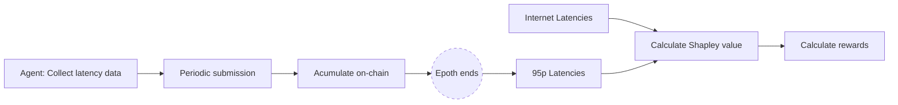
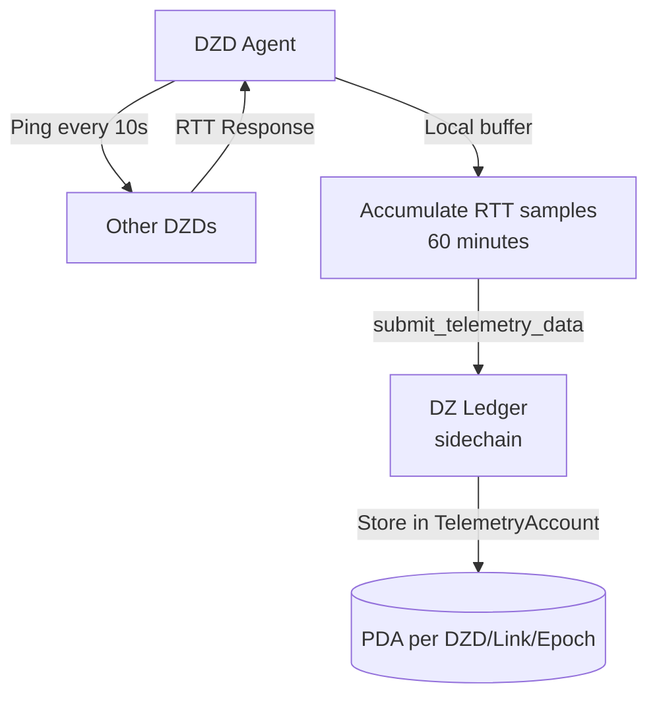
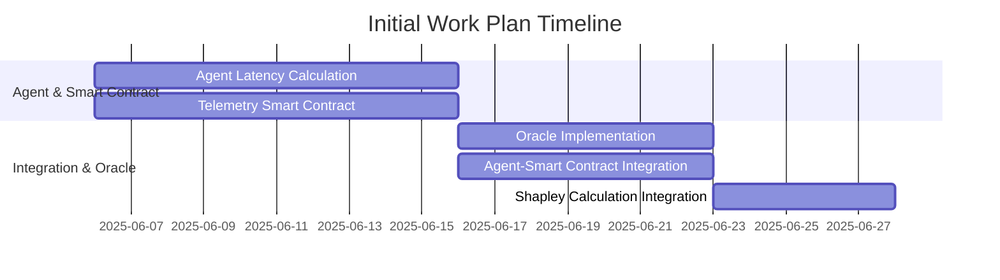

# Telemetry Program

## Summary

The Telemetry Program defines a decentralized process for collecting, storing, and evaluating network telemetry data on the DZ Lager sidechain. Telemetry is accumulated on-chain via a dedicated smart contract, enabling transparent and tamper-resistant tracking of network performance and resource utilization. This data is subsequently used by the Serviceability Program to compute contributor utilization metrics and verify fulfillment of network commitments. The approach ensures accountability, incentivizes high-quality service, and provides a foundation for automated rewards or penalties based on objective, on-chain evidence.

## Motivation

Current network monitoring solutions are centralized, opaque, and susceptible to manipulation. There is a need for a trust-minimized, verifiable telemetry system that enables:
- Transparent measurement of network health and contributor performance
- On-chain, auditable records of service delivery
- Automated enforcement of service-level agreements (SLAs) and contributor incentives

The primary purpose of collecting this telemetry information is to objectively measure the performance of the network and validate that contributors are meeting their contractual obligations. By storing telemetry on-chain, the protocol ensures that all data is tamper-resistant and publicly auditable.

Additionally, these metrics will be used to execute Shapley value calculations, allowing the protocol to fairly determine the rewards each contributor receives based on their marginal contribution to the overall network service. This approach incentivizes high-quality participation, aligns contributor rewards with actual impact, and supports decentralized governance and reliability across the DoubleZero ecosystem.

## New Terminology

- **Telemetry Record:** A PDA (Program Derived Address) account in the smart contract that accumulates latency samples for a specific circuit from a source DZD to a destination DZD. This account collects all latency measurements for a given epoch, with each periodic submission appending new samples to the end of the account data. Over the course of an epoch (approximately two days), the account aggregates all latency samples for that circuit and epoch, enabling accurate performance analysis and SLA evaluation.
- **Telemetry Oracle:** An off-chain agent responsible for submitting signed telemetry records to the smart contract.

## Alternatives Considered

- **Off-chain Telemetry Only:** Storing telemetry data exclusively off-chain is simpler but lacks transparency and auditability. It is vulnerable to tampering and does not enable automated, trustless enforcement.
- **Periodic Audits:** Manual or periodic audits are less scalable and introduce delays and subjectivity.
- **Do Nothing:** Retaining the status quo perpetuates the risks of centralization and unverifiable claims.

## Detailed Design

### Architecture Overview

The following diagram represents the information flow used to provide the data required for the Shapley value calculation. It requires both standard internet latency information and the actual latency values measured within the DoubleZero network.

1. **Inventory Registration:** The Serviceability Program maintains an on-chain registry of Devices and Links, representing the network inventory.
2. **Agent Measurement:** An agent running on each switch (DZD) uses the on-chain inventory to identify peer devices and links. For each link, the agent spawns a thread that periodically measures round-trip time (RTT) to other DZDs, collecting latency samples for every active link.
3. **In-Memory Accumulation:** The agent accumulates RTT measurements in memory for each (device_pk, link_pk) pair.
4. **Periodic Submission:** At defined intervals (e.g., every 60 minutes), the agent submits a batch instruction to the Telemetry Program smart contract, reporting the accumulated RTT samples for each (device_pk, link_pk, epoch) tuple.
5. **On-Chain Storage:** The smart contract creates or updates a telemetry account for each (device_pk, link_pk, epoch), appending the new samples to the account's data.
6. **Percentile Calculation:** At the end of each epoch, the Telemetry Program reads the accumulated samples and computes the 95th percentile latency for each link, using this value to evaluate SLA compliance and contributor performance.
7. **Latency Accumulator Account Creation:** At the end of each epoch, the Telemetry Program will create an account to store the latency accumulator calculation for each metric, as measured by each DZD for every Link. This account will record the statistical values (min, max, 95th percentile, 99th percentile) for each metric. The account will contain all aggregated values for each epoch and will be used as input for the Shapley value calculation.

#### Data Structures

- `LatencySample` (on-chain):
    - device_pk: Pubkey
    - link_pk: Pubkey
    - epoch: u64
    - samples: Vec<u64> (RTT values in microseconds)

- `LatencyAccumulator` (on-chain):
    - device_pk: Pubkey
    - link_pk: Pubkey
    - epoch: u64
    - sample_count: u32
    - max: u64
    - min: u64
    - 95p: u64
    - 99p: u64

#### Algorithms & Control Flow

- **Measurement:**
    - For each link, the agent measures RTT to the remote DZD and records the value in memory.
- **Batch Submission:**
    - Every 60 minutes, the agent sends an instruction to the smart contract with all accumulated samples for the current period.
    - The contract appends these samples to the corresponding (device_pk, link_pk, epoch) account.
- **Percentile Calculation:**
    - At epoch close, the Telemetry Program retrieves all samples for each (device_pk, link_pk, epoch) and computes the 95th percentile latency.
    - This value is used for SLA evaluation and reporting.

#### Initial Work Plan

1. **Agent Latency Calculation:**
   - Implement latency measurement in the DZD agent. Initially, the agent will record RTT samples to a local file for each link.

2. **Telemetry Smart Contract:**
   - Develop the Telemetry Program smart contract to receive and accumulate RTT samples submitted by agents.

3. **Oracle Implementation:**
   - Create an oracle service that, at the end of each epoch, reads the accumulated samples from the smart contract and computes the required statistical values (min, max, 95th percentile, 99th percentile).

4. **Agent-Smart Contract Integration:**
   - Update the agent to send RTT samples directly to the Telemetry Program smart contract instead of writing to a local file.

5. **Shapley Calculation Integration:**
   - Integrate the Shapley value calculation module to consume the aggregated telemetry data from the Telemetry Program for reward computation.

#### API/CLI Changes

- `submit-telemetry` CLI command for oracles
- `get-telemetry` and `get-accumulator` for querying on-chain data
- `submit-latency` CLI command for agents to submit RTT samples
- `get-latency` for querying on-chain latency data per device/link/epoch

#### Configuration

- Measurement interval (e.g., every 5 seconds)
- Submission interval (e.g., every 60 minutes)

## Impact

- **Codebase:** New smart contract (Telemetry Program), updates to Serviceability Program, CLI/SDK extensions for telemetry submission and queries.
- **Operational Complexity:** Requires deployment and operation of telemetry oracles; increases on-chain storage and transaction volume.
- **Performance:** Slight increase in on-chain resource usage; enables automated, scalable SLA enforcement.
- **User Experience:** Improves transparency and trust; enables contributors to verify their own performance and compliance.

## Security Considerations

- **Data Integrity:** All telemetry records must be signed by trusted oracles; contract verifies signatures.
- **Sybil Resistance:** Only authorized oracles can submit telemetry; access controlled via on-chain allowlist.
- **Privacy:** Telemetry data is public; sensitive metrics should be aggregated or anonymized as needed.

## Backwards Compatibility

- Existing deployments are unaffected until the Telemetry Program is deployed and integrated.
- Migration requires updating oracles, SDK, and Serviceability Program to use the new telemetry submission and evaluation flows.

## Open Questions

- What is the optimal telemetry submission interval?
- How should the protocol handle missing or delayed telemetry submissions?
- Should telemetry data be pruned or archived off-chain after a certain period?

