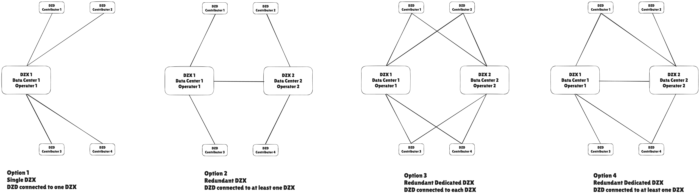

# DoubleZero Exchange - DZX

## Summary

The DoubleZero Exchange (DZX) is a network architectural component designed to ensure a contiguous global DZ network between multiple contributor nodes (DZDs).  The scope of a DZX is a single geographic region, typically a metro or city. Its purpose is to scale the DZ network by enabling broader reach across data centers and contributors.

As the number of DZDs in a metro grows, typically beyond three, the complexity and cost of full-mesh or direct interconnects increase exponentially. The DZX addresses this through the introduction of a fabric-based design, analogous to a hub-and-spoke topology, where contributors connect to a shared local exchange, simplifying deployment through reduced fiber requirements and improving operational manageability.  A DZX should be a solution operated by the DZ community.

In the long term, the DZX aligns with the DZ project’s strategic vision of permissionless networking by serving as a physical access point to enable future contributors to join the network. DZD connections should be governed and validated by smart contracts, automated provisioning, verification and ongoing compliance.

### Design considerations
A successful design:
- Enables a globally contiguous DZ network
- Expands decentralization
  - Multiple DZX operators
  - Multiple data-center vendors
- Captures intent with a smart-contract
- Automates logical components
- Enhances the vision of permissionless networking

Note that [DZX Economics](https://www.notion.so/DZX-Economics-2088eaaee713801f95aaf84a5003314c?source=copy_link) provides detail on the economic model and potential incentives for operating a DZX.  This document does not consider the pros or cons of single or dual-ownership.

## Motivation

The DZX is required as the ecosystem expands beyond three DZDs in specific metros.  By Q3 2025 we had identified this requirement in multiple major metro areas such as New York City, London, Frankfurt and others.

Consider the evolution of DZ as it expands into new cities and metros:
- Single DZD, single contributor
  - Metro is most centralized, single point of failure
  - No DZX required
- Two DZDs, single data center, single contributor
  - Contributor may have deployed redundant DZDs in their data center
  - Metro is highly centralized, contributor is single point of failure, increased resiliency in metro network
  - Switches are interconnected, most likely with a simple intra rack or intra cage cabling
  - Negligible cost, low latency, low complexity
- Two DZDs, single data center, multiple contributors
  - Decentralization across contributors, resiliency in network, centralized within a single data center vendor
  - Switches are interconnected using point-to-point cross-connects
  - Low cost, low latency, low complexity
- Multiple DZDs, multiple data centers and vendors, multiple contributors
  - Decentralization across contributors, data centers and vendor, highly resilient network
  - Switches are interconnected using a mixture of hub and spoke and/or point-to-point interconnects
  - High cost, acceptable latency, higher complexity, greatest scale

The motivation for the DZX is to allow DZ to scale to maximize reach and decentralization while still supporting DZ's primary goal of IBRL.

## New Terminology

- DoubleZero Exchange (DZX): a network fabric creating a contiguous network between all network contributors with a metro
- DoubleZero Device / DoubleZero eXchange (DZDx): a single DZ network device that acts as both a DZD and a DZX
- DZX Operator: organization that owns the DZX network equipment
- Metro: the geographical area where DZDs are deployed and interconnected together across facilities within a city or urban area.

## Alternatives Considered

- Do nothing: 
  - Advantages:
    - None
  - Disadvantages:
    - DZ network is severely limited in its growth without being able to interconnect multiple contributors beyond point-to-point cross-connects
- Leverage public Internet by connecting DZDs via GRE over Internet:
  - Advantages:
    - Reuse existing investment, i.e. cheap
  - Disadvantages:
    - Unable to guarantee MTU
    - Loose end-to-end visibility
    - Potential additional capacity required for Internet connections

## Detailed Design

### High-Level Physical Topology Options

Figure 1: DZX Topology Options

| Option     | Description | Pros | Cons |
|------------|-------------|------|------|
| **Option 1** | - Simplest DZX setup - Single switch requiring links from each contributor in the metro   - Links may be:     - Cross-connects within a campus     - Tail circuits across cities | - Simple - Cheap - Quickest time to market | - Highly centralized - Single point of failure - Scalability limited to at most the number of ports on the switch (see section below) |
| **Option 2** | - Redundant DZX switches operated by multiple Operators across two strategic data centers - Requires only one DZX connection per DZD - Requires interconnect between DZX switches | - Increased decentralization - No single point of failure - Contributors can choose their DZX Operator | - Risk of network discontinuity if interconnect fails or an Operator stops participating - Scalability limited to ~2× switch port count |
| **Option 3** | - Redundant DZX switches operated by multiple Operators across two strategic data centers - Each contributor must purchase links to both DZXs - No interdependence between DZX Operators | - Most decentralized - Highest redundancy | - Most expensive for Network Contributors |
| **Option 4** | - Redundant DZX switches operated by multiple Operators across two strategic data centers - Each contributor must purchase at least one link to a DZX   | - Highly decentralized -  Highly redundant  - Optionality for Network Contributors | - Risk of network discontinuity if interconnect fails or an Operator stops participating  - Scalability limited to ~2× switch port count |

### 7280CR3A port speed options: 

[Arista 7280 Datasheet](https://www.arista.com/assets/data/pdf/Datasheets/7280R3A-Datasheet.pdf) 

### Recommendation
- Option 4:
  - Sweet spot that balances cost to contributors, redundancy and decentralization

### DZX Logical Topology

#### DZX as a Layer 2 Fabric
- DZX operated by DZ community members
- Each DZX switch operates at layer 2
- A single subnet (broadcast domain) is used to address all DZD NNIs facing the DZX
- The existing DZ network routing is extended across the DZX
  - A full-mesh of IS-IS/PIM neighbors is formed across the DZX
  - The DZX is transparent from a routing perspective
- All links are assumed to be of equal latency
  - Helps incentivize diversification out of a single data center
  - Prevents an arms race in the metro
- The DZX switch maintains a layer 3 connection for telemetry

Figure 2: DZX Logical Layer 2

Pros
- The DZX switch requires a simpler feature set (layer 2 only) than a DZD
- Allows the DZX operator to purchase less expensive switch platforms e.g. Arista 7060X6 Tomahawk
- All links are assumed to be of equal latency
  - Helps incentivize diversification out of a single data center
  - Prevents an arms race in the metro
- Full visibility for monitoring and troubleshooting

Cons
- New automation and configuration model to support DZX layer 2 switch use-case
- Small switch buffers with Tomahawk may not be sufficient to absorb traffic bursts towards busy DZDs in the metro
  - Would likely require traffic shaping on DZDs
- Limitations of scaling a single broadcast domain, for example the DZX topology MUST remain loop-free and MUST NOT rely on spanning-tree protocols
  - Limited to two DZX switches
- Complex to integrate within a hybrid community/vendor model
  - Layer 2 hand-off complexity

#### DZX as a Layer 3 Fabric
- DZX operated by DZ community members
- Each DZX switch operates at layer 3
- Allows a DZD to become a DZDx
  - The DZD terminates DZX links from multiple contributors originating within the same metro
- A layer 3 connection (single subnet) is built between DZD to DZX/DZDx per NNI
- The existing DZ network routing is extended to the DZX/DZDx
  - IS-IS/PIM neighbors are established between each DZD and/or DZDx
- The DZX/DZDx fully participates in routing
- All links are assumed to be of equal latency
  - Helps incentivize diversification out of a single data center
  - Prevents an arms race in the metro

Figure 3: DZX Logical Layer 3

Figure 4: DZDx Logical Layer 3

Pros
- DZX has equivalent functionality to DZD, either as a dedicated device or as a DZDx
- By participating in routing, in future it can support end-to-end traffic-engineering planning
- Requires minimal additional development support in the controller/configuration templates
- Full visibility for monitoring and troubleshooting
- Likely simplifies integration of any potential hybrid community/vendor model
  - Simple routed hand-offs to vendors

Cons
- More expensive switches if using dedicated layer 3 devices rather than DZDx i.e. Jericho2/7280CR3

#### DZX as a Vendor Fabric Solution
- Various commercial solutions exist to create last mile connectivity similar to the DZX, e.g.:
  - Packetfabric
  - MegaPort
  - Equinix Fabric
- Likely facilitates logical cross-connects between DZDs e.g. Virtual Cross-Connects (VXC)
- Access to immediate scale, fastest time-to-market
- All links are assumed to be of equal latency
  - Helps incentivize diversification out of a single data center
  - Prevents an arms race in the metro

Figure 5: DZX Logical Vendor

Pros
- Vendor solution abstracts away operational overhead of operating DZX for a cost
- Fastest time-to-market
- Easiest to scale across multiple metros
- Automated provisioning already developed by vendor, including LOA management

Cons
- Lack of visibility into network fabric
- Dependency on Web2 businesses for supporting Web3 project e.g. MSAs
- Assumed to be most expensive

#### Hybrid Models
- Combine DZX community and vendor solution
- DZX community layer 2 and layer 3 options are mutually exclusive
- Interconnect DZX switches with vendor network fabrics
- All links are assumed to be of equal latency
  - Helps incentivize diversification out of a single data center
  - Prevents an arms race in the metro

Figure 6: DZX Logical Vendor

Pros
- Combines the best of Web3 decentralization with scale of existing Web2 offering

Cons
- Lack of visibility into network fabric
- Complexity increases

### Recommendation:
- DZX as a Layer 3 Fabric:
  - Results in the most visibility in to, and control of, end-to-end traffic flows
  - Creation of DZDx allows reuse of existing hardware with nominal further capital expense
    - Optics and cabling
  - DZDx option also has relatively fast time-to-market

## Impact

- Fundamentally affects the ability of DZ to deliver its core product
- Ensures that DZ performance - latency, bandwidth and jitter - are optimized end-to-end
- Allows scaling to many network contributors, realizing decentralization efforts

## Security Considerations

- No new security threats or attack vectors
- A fully decentralized DZX helps mitigate the risk of censorship by any single organization

## Backwards Compatibility

- Not applicable

## Open Questions
- Need to understand if there are any unknown implications that results from converting a DZD to a DZDx
  - Example: in NYC, an existing LON long-haul link on the DZDx become favored as it is more central to the network graph than the equivalent LON link terminated on a DZD
- Find out pricing difference between DZX switches if used as layer 2 vs layer 3
- Commercially available network fabrics from vendors:
  - Technical capabilities
    - Once known, a separate RFC or design must be created before deployment
  - Pricing
- Any additional telemetry features required for DZX links?
  - Does telemetry need awareness that there are multiple owners of a single link?
