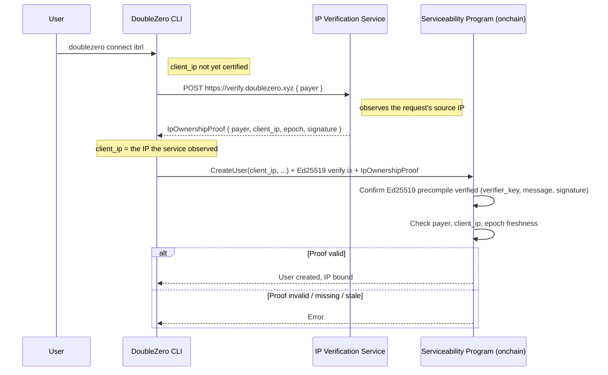

# RFC 22: IP Ownership Verification Service for user connection

## Summary

**Status: Draft**

This RFC introduces an **IP Ownership Verification** step for DoubleZero user creation. When a user
binds a public `client_ip` to a connection, an external **IP Verification Service** issues a
cryptographically signed `IpOwnershipProof` attesting that the request originated from that IP. The
serviceability program validates the proof **onchain** before accepting the `client_ip`.

The motivation is a concrete gap: for **wildcard access passes** — passes stored at the unspecified
IP (`0.0.0.0`) or flagged `allow_multiple_ip`, including the `EdgeSeat` passes issued by the
shred-oracle — the program intentionally accepts *any* globally‑routable `client_ip` without
verifying that the connecting party controls it. The proof re‑introduces the missing per‑IP control
for exactly those flows, without removing the flexibility of connecting from a changing IP.

## Motivation

Today the serviceability program gates user creation with an **AccessPass** keyed by
`(client_ip, user_payer)`. For a pass bound to a specific IP, the program enforces that the user's
`client_ip` matches the pass, so the issuing authority effectively chose the IP. But for **wildcard
passes** the program skips that check entirely
(`smartcontract/programs/doublezero-serviceability/src/processors/user/create_core.rs:173-183`):

```rust
// A pass stored at the UNSPECIFIED PDA (0.0.0.0) is valid for any client IP by construction
if accesspass.client_ip != Ipv4Addr::UNSPECIFIED
    && accesspass.client_ip != client_ip
    && !accesspass.allow_multiple_ip()
{ /* reject */ }
```

The only validation applied to the supplied IP is `is_global(client_ip)`
(`.../state/user.rs:381`), which checks that the address is publicly routable — **not** that the
caller owns it.

This is a real risk for wildcard passes:

- **IP squatting → denial of service.** The `User` PDA is derived from `(client_ip, user_type)`
  (`create_core.rs:125`). Registering an IP occupies that slot and can prevent the legitimate
  operator of that IP from creating their own user.
- **Traffic misdirection.** The controller provisions the GRE tunnel and routes toward the declared
  `client_ip`; an IP the registrant does not control points device traffic at an unrelated third
  party.

The `EdgeSeat` flow in `doublezero-shreds` (`shred-oracle`) issues exactly such wildcard passes
(`client_ip = 0.0.0.0`, `allow_multiple_ip = true`), so this gap is on the path the project is
actively building toward.

### Goal

Guarantee that the `client_ip` a user binds is one the connecting party can demonstrably originate
traffic from, enforced where it cannot be bypassed (onchain), while preserving the ability to
connect from a non‑preregistered or changing IP.

## New Terminology

- **IP Verification Service** — A DoubleZero‑operated HTTP service that observes the source IP of an
  inbound request and returns a signed `IpOwnershipProof`.
- **`IpOwnershipProof`** — A signed attestation `{ payer, client_ip, epoch, signature }` produced by
  the verifier keypair.
- **Verifier keypair** — The Ed25519 keypair owned by DoubleZero whose public key is the trust root
  for proof validation; its pubkey is stored in onchain global state.
- **Wildcard access pass** — An AccessPass stored at the unspecified IP (`0.0.0.0`, `IS_DYNAMIC`)
  and/or flagged `ALLOW_MULTIPLE_IP`, which the program accepts for any `client_ip`. Includes the
  `EdgeSeat` passes issued by the shred-oracle.
- **Proof of control** — Evidence that the holder of `payer` can originate traffic from `client_ip`,
  established by issuing the verification request *from* that IP.

## Alternatives Considered

- **Do nothing.** Wildcard passes continue to accept any routable IP. Leaves the squatting and
  traffic‑misdirection risks open for those flows.
- **Verify at access‑pass issuance.** The authority/service that issues the pass verifies IP control
  and issues a **specific‑IP** pass (which the program already binds). This works and adds no onchain
  crypto, but it does not cover the wildcard/`EdgeSeat` model whose whole purpose is to let a client
  connect from any IP without preregistration. Good complement, not a full substitute.
- **Client‑side certification only (CLI checks the IP).** Rejected: the CLI is not a trust boundary.
  An attacker calling the program/SDK directly bypasses any check that lives only in `connect`.
- **Signed proof validated onchain (this RFC).** The only option that is both non‑bypassable and
  applicable to wildcard passes: the program rejects a user creation that lacks a valid proof for the
  declared IP, regardless of how the instruction is submitted.

## Detailed Design

### Protocol Flow



### Steps

1. The CLI sends a request to the verification service. The service uses the **source IP of the
   request** as `client_ip`, the `payer` from the body, and the current DoubleZero epoch:

   ```
   POST https://verify.doublezero.xyz
   { "payer": "<Pubkey>" }
   ```

2. The service returns a signed proof:

   ```json
   {
     "payer": "<payer_pubkey>",
     "client_ip": "<a.b.c.d>",
     "epoch": <u64>,
     "signature": "<ed25519_signature>"
   }
   ```

   The signed message is the byte concatenation `payer || client_ip || epoch` (the proof fields in a
   fixed layout — see below), signed by the verifier keypair.

3. The CLI submits the user‑creation transaction carrying both:
   - the `IpOwnershipProof`, and
   - an **Ed25519 program instruction** (the native precompile) over `(verifier_pubkey, message,
     signature)`, placed in the same transaction.

4. The serviceability program validates and, only if valid, binds `client_ip`.

### Proof Specification

```rust
pub struct IpOwnershipProof {
    pub payer: Pubkey,        // 32
    pub client_ip: Ipv4Addr,  // 4 (IPv4)
    pub epoch: u64,           // 8
    pub signature: [u8; 64],  // Ed25519
}
```

The signed message is the fixed‑layout serialization of `(payer, client_ip, epoch)`. `Ipv4Addr` is
used to match the type used throughout the program; it is serialized as its 4 network‑order octets.

### Onchain Validation

Solana programs cannot verify an Ed25519 signature directly inside BPF cheaply. Verification uses
the **native Ed25519 precompile**: the CLI includes an `Ed25519SigVerify` instruction in the same
transaction, and the serviceability program **introspects the Instructions sysvar** to confirm that
instruction is present and that its public key, message, and signature match the expected verifier
key and the reconstructed `payer || client_ip || epoch` message.

Required checks:

1. Read `IpOwnershipProof` from instruction data; reconstruct `message = payer || client_ip || epoch`.
2. Load the Ed25519 instruction from the Instructions sysvar and confirm it verifies `signature`
   over `message` with the **verifier public key from global state**.
3. `proof.payer == user_payer` (the account paying / owning the user).
4. `proof.client_ip == client_ip` being bound to the user.
5. `proof.epoch` is within the allowed freshness window relative to `Clock::get()?.epoch`.

#### Rejection conditions

The program MUST reject when any of the following holds:

- the Ed25519 verify instruction is absent or does not match (`verifier_key`, `message`, `signature`);
- `payer` mismatch;
- `client_ip` mismatch with the value being bound;
- the proof is stale (epoch outside the freshness window);
- the proof is malformed.

### Trust Root and Key Management

The verifier public key is stored in onchain global state (alongside the other DoubleZero
authorities) so it can be rotated by the existing authority‑management instruction without a program
upgrade. Rotating the key invalidates outstanding proofs; clients re‑verify on next connect.

### Relationship to AccessPass

This proof does **not** replace AccessPass. AccessPass continues to gate *who* may connect and *what*
they may do (epoch validity, multicast allowlists, seat caps). The proof governs *which IP* a user
may bind:

- **Specific‑IP passes** already bind the IP onchain; the proof is redundant there (it MAY still be
  required uniformly for simplicity).
- **Wildcard / `EdgeSeat` passes** accept any IP today; the proof is the per‑IP control that closes
  the squatting/misdirection gap for them.

## Impact

- **Onchain (serviceability):** new proof validation in the user‑creation path (Instructions‑sysvar
  introspection), a verifier public key in global state, and new instruction arguments/accounts
  (the proof and the Instructions sysvar). This is the first onchain Ed25519 verification in the
  program.
- **CLI (`doublezero`):** `connect` calls the verification service and attaches the proof plus the
  Ed25519 instruction to the transaction. This extends the existing public‑IP autodetection
  (`look_for_ip` via ifconfig.me), which becomes a UX convenience rather than the source of truth.
  Separately, `check_accesspass` should also probe the dynamic (`0.0.0.0`) AccessPass PDA, which it
  does not today (`smartcontract/cli/src/requirements.rs`).
- **New off‑chain component:** the IP Verification Service (stateless signer that echoes the observed
  source IP).
- **Operational:** the service must observe the real client source IP. Behind a proxy/CDN it must use
  a trusted forwarded‑for header; otherwise it would sign the proxy's IP.

## Security Considerations

- **Non‑bypassable.** The control lives onchain. An attacker submitting the instruction directly
  still needs a valid proof; the service only signs the IP it actually observed, and a TCP/TLS
  handshake source cannot be spoofed off‑path, so a proof for an IP the attacker cannot originate
  from is unobtainable.
- **Origin, not exclusive ownership.** A proof attests that the holder of `payer` originated a
  request from `client_ip` around `epoch`. Behind NAT/CGNAT or a shared egress IP, multiple
  co‑located parties could each obtain a proof for the same IP. This bounds remote squatting but does
  not arbitrate between parties sharing one egress IP. DoubleZero validators with dedicated public
  IPs are unaffected.
- **Source‑IP consistency.** The IP the CLI uses to reach the verification service must be the same
  IP it binds as the tunnel `client_ip`. On multi‑homed hosts the client must ensure the verification
  request egresses from the intended IP (e.g., source binding).
- **Centralized trust root.** The verifier keypair is a DoubleZero‑operated authority. The benefit
  delivered is automated, non‑bypassable per‑IP verification — not decentralization. Key rotation is
  supported via global state.
- **Replay.** The epoch window bounds proof reuse; because the proof binds `payer` and `client_ip`,
  reuse only re‑asserts the same binding. A nonce or binding to the specific user account can further
  constrain reuse if needed (see Open Questions).

## Backward Compatibility

To allow a smooth transition, the serviceability program can support both flows for a limited number
of versions:

1. the legacy flow, where the CLI supplies `client_ip` without a proof, and
2. the new flow, where the IP is bound only after a valid `IpOwnershipProof`.

This maintains a compatibility window until clients upgrade. Enforcement can be tightened (legacy
flow removed) once adoption is sufficient, consistent with RFC‑10 version‑compatibility windows.

## Open Questions

- Should proofs be persisted onchain for auditing, or is the bound `client_ip` sufficient?
- Should the proof bind to the specific user account (or a nonce) to further constrain replay within
  an epoch?
- Should IP re‑verification be periodic (re‑prove on a schedule), or only at user creation?
- Should IPv6 be supported?
- On what cadence should the verifier key rotate?
