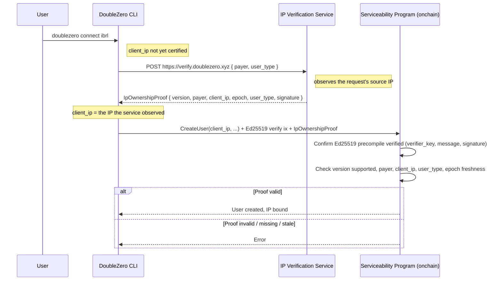

# RFC 27: IP Ownership Verification Service for user connection

## Summary

**Status: Draft**

This RFC introduces an **IP Ownership Verification** step for DoubleZero user creation. When a user
binds a public `client_ip` to a connection, an external **IP Verification Service** issues a
cryptographically signed `IpOwnershipProof` attesting that the request originated from that IP. The
serviceability program validates the proof **onchain** before accepting the `client_ip`.

The motivation is a concrete gap: for **wildcard access passes** — passes stored at the unspecified
IP (`0.0.0.0`) or flagged `allow_multiple_ip`, including the `EdgeSeat` passes issued by the
shred-oracle — the program intentionally accepts *any* globally‑routable `client_ip` without
verifying that the connecting party controls it. The proof re‑introduces the missing per‑IP control
for exactly those flows, without removing the flexibility of connecting from a changing IP.

## Motivation

Today the serviceability program gates user creation with an **AccessPass** keyed by
`(client_ip, user_payer)`. For a pass bound to a specific IP, the program enforces that the user's
`client_ip` matches the pass, so the issuing authority effectively chose the IP. But for **wildcard
passes** the program skips that check entirely
(`smartcontract/programs/doublezero-serviceability/src/processors/user/create_core.rs:215-228`):

```rust
// A pass stored at the UNSPECIFIED PDA (0.0.0.0) is valid for any client IP by construction
if accesspass.client_ip != Ipv4Addr::UNSPECIFIED
    && accesspass.client_ip != client_ip
    && !accesspass.allow_multiple_ip()
{ /* reject */ }
```

The only validation applied to the supplied IP is `is_global(client_ip)`
(`.../state/user.rs:381`), which checks that the address is publicly routable — **not** that the
caller owns it.

This is a real risk for wildcard passes:

- **IP squatting → denial of service.** The `User` PDA is derived from `(client_ip, user_type)`
  (`create_core.rs:153`). Registering an IP occupies that slot and can prevent the legitimate
  operator of that IP from creating their own user.
- **Traffic misdirection.** The controller provisions the GRE tunnel and routes toward the declared
  `client_ip`; an IP the registrant does not control points device traffic at an unrelated third
  party.

The `EdgeSeat` flow in `doublezero-shreds` (`shred-oracle`) issues exactly such wildcard passes
(`client_ip = 0.0.0.0`, `allow_multiple_ip = true`), so this gap is on the path the project is
actively building toward.

### Goal

Guarantee that the `client_ip` a user binds is one the connecting party can demonstrably originate
traffic from, enforced where it cannot be bypassed (onchain), while preserving the ability to
connect from a non‑preregistered or changing IP.

## New Terminology

- **IP Verification Service** — A DoubleZero‑operated HTTP service that observes the source IP of an
  inbound request and returns a signed `IpOwnershipProof`.
- **`IpOwnershipProof`** — A signed attestation
  `{ version, payer, client_ip, epoch, user_type, signature }` produced by the verifier keypair. Its
  layout is defined once, normatively, in `crates/doublezero-ip-proof`.
- **Verifier keypair** — The Ed25519 keypair owned by DoubleZero whose public key is the trust root
  for proof validation; its pubkey is stored in onchain global state.
- **Wildcard access pass** — An AccessPass stored at the unspecified IP (`0.0.0.0`, `IS_DYNAMIC`)
  and/or flagged `ALLOW_MULTIPLE_IP`, which the program accepts for any `client_ip`. Includes the
  `EdgeSeat` passes issued by the shred-oracle.
- **Proof of control** — Evidence that the holder of `payer` can originate traffic from `client_ip`,
  established by issuing the verification request *from* that IP.

## Alternatives Considered

- **Do nothing.** Wildcard passes continue to accept any routable IP. Leaves the squatting and
  traffic‑misdirection risks open for those flows.
- **Verify at access‑pass issuance.** The authority/service that issues the pass verifies IP control
  and issues a **specific‑IP** pass (which the program already binds). This works and adds no onchain
  crypto, but it does not cover the wildcard/`EdgeSeat` model whose whole purpose is to let a client
  connect from any IP without preregistration. Good complement, not a full substitute.
- **Client‑side certification only (CLI checks the IP).** Rejected: the CLI is not a trust boundary.
  An attacker calling the program/SDK directly bypasses any check that lives only in `connect`.
- **Signed proof validated onchain (this RFC).** The only option that is both non‑bypassable and
  applicable to wildcard passes: the program rejects a user creation that lacks a valid proof for the
  declared IP, regardless of how the instruction is submitted.

## Detailed Design

### Protocol Flow



### Steps

1. The CLI sends a request to the verification service. The service uses the **source IP of the
   request** as `client_ip`, the `payer` and `user_type` from the body, and the current DoubleZero
   epoch:

   ```
   POST https://verify.doublezero.xyz
   { "payer": "<Pubkey>", "user_type": <u8> }
   ```

   The client does **not** send `client_ip`: the observed source IP is the whole point of the
   exchange, and a client-supplied IP would defeat it. `user_type` is client-supplied, which is safe
   — it is not a trust boundary, and the program checks it against the user it is creating.

2. The service returns a signed proof:

   ```json
   {
     "version": <u8>,
     "payer": "<payer_pubkey>",
     "client_ip": "<a.b.c.d>",
     "epoch": <u64>,
     "user_type": <u8>,
     "signature": "<ed25519_signature>"
   }
   ```

   The signed message is a fixed 57-byte layout — a domain-separation prefix and version byte
   followed by `payer || client_ip || epoch || user_type` — signed by the verifier keypair. See
   below.

3. The CLI submits the user‑creation transaction carrying both:
   - the `IpOwnershipProof`, and
   - an **Ed25519 program instruction** (the native precompile) over `(verifier_pubkey, message,
     signature)`, placed in the same transaction.

4. The serviceability program validates and, only if valid, binds `client_ip`.

### Proof Specification

`crates/doublezero-ip-proof` is the **normative** definition of both the struct and the signed
bytes; `signed_message_for()` there is the single source of truth that the program, the CLI, and the
service all reconstruct from. This section describes it — where the two disagree, the crate wins.

```rust
pub struct IpOwnershipProof {
    pub version: u8,          // 1  layout version, written by the issuer
    pub payer: Pubkey,        // 32
    pub client_ip: Ipv4Addr,  // 4 (IPv4)
    pub epoch: u64,           // 8
    pub user_type: u8,        // 1  serviceability UserType discriminant
    pub signature: [u8; 64],  // Ed25519
}
```

The signed message is 57 bytes, with no length prefixes and no Borsh, so the program can build it on
the stack and compare it against what the Ed25519 precompile instruction covers:

```text
offset  len  field
     0   11  b"DZ_IP_PROOF"       domain separation
    11    1  version
    12   32  payer
    44    4  client_ip, network order
    48    8  epoch, little-endian
    56    1  user_type
```

`Ipv4Addr` is used to match the type used throughout the program; it is serialized as its 4
network‑order octets.

**Domain separation.** The `DZ_IP_PROOF` prefix keeps these bytes from colliding with any other
DoubleZero message the verifier key might ever be asked to sign.

**Versioning.** `version` travels *in* the proof rather than being a compile-time constant, so
verifiers can reconstruct the bytes for any version they accept. A new layout rolls out by teaching
the program and the service to accept both versions, then switching issuers over, then dropping the
old version once no outstanding proof can still be inside its freshness window — no atomic cutover
across program, service, and every deployed CLI.

**`user_type`, and why not the User pubkey.** The User account is a PDA over
`(client_ip, user_type)`, so `client_ip` alone does not pin the account being created: a proof for an
IP would otherwise be reusable for a different connection type on that IP. Binding `user_type`
closes that. Binding the derived User pubkey instead would *not* work: the service is the party that
discovers `client_ip`, so the client would have to send a pubkey derived from its own autodetected
IP, and on any NATed or multi-homed host that pubkey disagrees with the IP the service observed —
producing a validly signed proof that can never verify.

### Onchain Validation

Solana programs cannot verify an Ed25519 signature directly inside BPF cheaply. Verification uses
the **native Ed25519 precompile**: the CLI includes an `Ed25519SigVerify` instruction in the same
transaction, and the serviceability program **introspects the Instructions sysvar** to confirm that
instruction is present and that its public key, message, and signature match the expected verifier
key and the message the program reconstructs from this creation's own arguments.

Required checks:

1. Read `IpOwnershipProof` from instruction data; confirm `proof.version` is supported
   (`doublezero_ip_proof::is_supported_version`) and reconstruct the message with
   `signed_message_for(proof.version, ...)`.
2. `globalstate.ip_verifier_authority_pk` is not `Pubkey::default()`. An unconfigured verifier is a
   hard reject, never "any signature passes".
3. Load the Ed25519 instruction from the Instructions sysvar and confirm it verifies `signature`
   over `message` with the **verifier public key from global state**.
4. `proof.payer == user_payer` — the account that *owns* the user, which the program computes as
   `effective_owner`, not the transaction payer. On the ordinary path they are the same account. On
   the owner-override path (the sentinel or a USER_ADMIN holder creating a user owned by someone
   else) they differ, and it is the owner who operates `client_ip` and whom the AccessPass is keyed
   on; a proof naming the payer could never be obtained for an address the payer does not operate.
5. `proof.client_ip == client_ip` being bound to the user.
6. `proof.user_type == user_type` being created.
7. `proof.epoch` is within the freshness window: `clock.epoch` or `clock.epoch - 1`. A proof fetched
   moments before an epoch rollover must still work, so the window carries one epoch of slack;
   anything older, or claiming an epoch that has not happened, is rejected. Fixed constant, not
   configurable.

The program scans the Instructions sysvar for the Ed25519 instruction rather than reading a fixed
index, so a client may place it anywhere and interleave compute-budget instructions freely.

The precompile's own offsets need checking, not just its payload. Each of the three
`*_instruction_index` fields may name a *different* instruction to read the key, signature, or
message from; if one does, the precompile verified bytes the program never inspects, and comparing
against the Ed25519 instruction's own data would accept a signature over something else entirely.
The program therefore rejects any instruction whose offsets name another instruction, whose offsets
run past the end of its data, or that carries other than exactly one signature.

#### Rejection conditions

The program MUST reject when any of the following holds:

- the Ed25519 verify instruction is absent or does not match (`verifier_key`, `message`, `signature`);
- the Ed25519 instruction's offsets name another instruction, run past the end of its data, or it
  carries other than exactly one signature;
- the Instructions sysvar account is not supplied;
- `payer` mismatch;
- `client_ip` mismatch with the value being bound;
- `user_type` mismatch with the user being created;
- `proof.version` is not in the supported set;
- the proof is stale (epoch outside the freshness window) or dated to a future epoch;
- no verifier public key is configured in global state;
- the proof is malformed.

A proof that is *absent* is rejected only when the flag is set and the payer is not the sentinel
authority; see Backward Compatibility.

Each class has its own `DoubleZeroError` variant, so an operator can tell a stale proof from a
rotated verifier key from a client that never attached the Ed25519 instruction.

### Trust Root and Key Management

The verifier public key is stored in onchain global state (alongside the other DoubleZero
authorities) so it can be rotated by the existing authority‑management instruction without a program
upgrade. Rotating the key invalidates outstanding proofs; clients re‑verify on next connect.

### Relationship to AccessPass

This proof does **not** replace AccessPass. AccessPass continues to gate *who* may connect and *what*
they may do (epoch validity, multicast allowlists, seat caps). The proof governs *which IP* a user
may bind:

- **Specific‑IP passes** already bind the IP onchain; the proof is redundant there (it MAY still be
  required uniformly for simplicity).
- **Wildcard / `EdgeSeat` passes** accept any IP today; the proof is the per‑IP control that closes
  the squatting/misdirection gap for them.

## Impact

- **Onchain (serviceability):** new proof validation in the user‑creation path (Instructions‑sysvar
  introspection), a verifier public key in global state, and new instruction arguments/accounts
  (the proof and the Instructions sysvar). This is the first onchain Ed25519 verification in the
  program.
- **CLI (`doublezero`):** `connect` calls the verification service and attaches the proof plus the
  Ed25519 instruction to the transaction. This extends the existing public‑IP autodetection
  (`look_for_ip` via ifconfig.me), which becomes a UX convenience rather than the source of truth.
  Separately, `check_accesspass` should also probe the dynamic (`0.0.0.0`) AccessPass PDA, which it
  does not today (`smartcontract/cli/src/requirements.rs`).
- **New off‑chain component:** the IP Verification Service (stateless signer that echoes the observed
  source IP).
- **Operational:** the service must observe the real client source IP. Behind a proxy/CDN it must use
  a trusted forwarded‑for header; otherwise it would sign the proxy's IP.
- **Shared format crate:** `crates/doublezero-ip-proof` holds the layout all three consumers build
  against, so none of them reimplements the signed bytes from prose.

## Security Considerations

- **Non‑bypassable.** The control lives onchain. An attacker submitting the instruction directly
  still needs a valid proof; the service only signs the IP it actually observed, and a TCP/TLS
  handshake source cannot be spoofed off‑path, so a proof for an IP the attacker cannot originate
  from is unobtainable.
- **Origin, not exclusive ownership.** A proof attests that the holder of `payer` originated a
  request from `client_ip` around `epoch`. Behind NAT/CGNAT or a shared egress IP, multiple
  co‑located parties could each obtain a proof for the same IP. This bounds remote squatting but does
  not arbitrate between parties sharing one egress IP. DoubleZero validators with dedicated public
  IPs are unaffected.
- **Source‑IP consistency.** The IP the CLI uses to reach the verification service must be the same
  IP it binds as the tunnel `client_ip`. On multi‑homed hosts the client must ensure the verification
  request egresses from the intended IP (e.g., source binding).
- **Centralized trust root.** The verifier keypair is a DoubleZero‑operated authority. The benefit
  delivered is automated, non‑bypassable per‑IP verification — not decentralization. Key rotation is
  supported via global state.
- **Replay.** The epoch window bounds proof reuse; because the proof binds `payer`, `client_ip`, and
  `user_type`, reuse only re‑asserts the same binding — and since the User PDA is
  `f(client_ip, user_type)`, that is the same User account. A nonce would further constrain reuse
  within an epoch, at the cost of the service holding state; it is not needed for the operations in
  scope here.

## Backward Compatibility

Rollout is gated on `FeatureFlag::RequireIpOwnershipProof` (bit 2, `require-ip-ownership-proof`),
set per environment through the existing `SetFeatureFlags` instruction.

- **Flag clear.** A creation that supplies no proof is accepted, so clients built before RFC-27 keep
  working. A creation that *does* supply one is still validated in full: a client attaching a broken
  proof is broken now, not at rollout, and letting it through would hide that until the flag flips.
- **Flag set.** Every user creation requires a valid proof — wildcard and specific-IP passes alike,
  and on the idempotent rerun path as well as on first creation. One exception: a creation paid for
  by `globalstate.sentinel_authority_pk` may omit the proof.

**The sentinel exemption.** The shred-oracle provisions multicast publishers owned by validators, so
the proof would have to name the validator for an address the verification service never sees a
request from — there is no proof the oracle could obtain, and without the exemption setting the flag
would break that path outright. Unlike the wildcard-pass gap this RFC closes, the exemption is not
reachable by a registrant: it requires a DoubleZero-operated key. It waives the *requirement* only;
a proof the sentinel does attach is still validated in full, so the oracle can start carrying real
proofs without a program change. The residual risk is that a compromised sentinel key can bind any
IP, and that `InitGlobalState` seeds `sentinel_authority_pk` to whoever initialized global state, so
in a fresh environment the exemption belongs to the deployer until the key is rotated. Replacing it
is tracked in issue #4215.

The proof is optional on the wire rather than on the instruction: `BorshDeserializeIncremental`
decodes an older client's shorter payload as `None`, and whether `None` is acceptable is the flag's
decision, not the decoder's.

This replaces the version-window approach an earlier draft proposed. A blanket window in which the
legacy no-proof flow stays available reopens exactly the gap this RFC exists to close: a squatter
simply uses the legacy path. A flag makes the transition an operator decision with a known,
per-environment moment of enforcement, rather than a property of whatever client version happens to
be in the field.

Uniform enforcement is otherwise deliberate. The proof is redundant for a specific-IP pass, whose
address the issuing authority already chose, but "required except when redundant" is a second code
path through the most security-sensitive check in user creation, and the redundant check costs
roughly 650 CU against a 1,400,000 budget.

## Non-Goals

- **Releasing a User account whose IP has since changed hands.** The proof is issued once, at
  creation, and never rechecked, so it says nothing after the fact. The common production case is
  not a malicious registrant but an honest one whose control of the address lapses later; a new
  operator can hold a perfect proof for that address and still be locked out, because
  `create_user_core` rejects on the occupied PDA before a proof is relevant. Reclaiming such an
  account is tracked separately (issues #4193 and #4190).
- **Periodic re-verification.** Re-proving on a schedule is out of scope here, and depends on the
  reclaim design above.
- **IPv6.** The program's `client_ip` surface is `Ipv4Addr` and the User PDA derives from it. The
  version byte in the signed message leaves room for a v2 layout.

## Open Questions

Resolved:

- **Should the proof bind to the specific user account (or a nonce) to further constrain replay
  within an epoch?** Yes, by way of `user_type`: the User PDA is `f(client_ip, user_type)`, so
  binding both pins the account a proof authorizes. Binding the derived pubkey itself would not
  work — see the proof specification above.
- **What is the freshness window?** `clock.epoch` and `clock.epoch - 1`.
- **Should proofs be persisted onchain for auditing, or is the bound `client_ip` sufficient?** Not
  persisted. The bound `client_ip` plus transaction history is the audit record.
- **Should IP re-verification be periodic?** Out of scope — see Non-Goals.
- **Should IPv6 be supported?** Not in v1 — see Non-Goals.

Open:

- On what cadence should the verifier key rotate?
