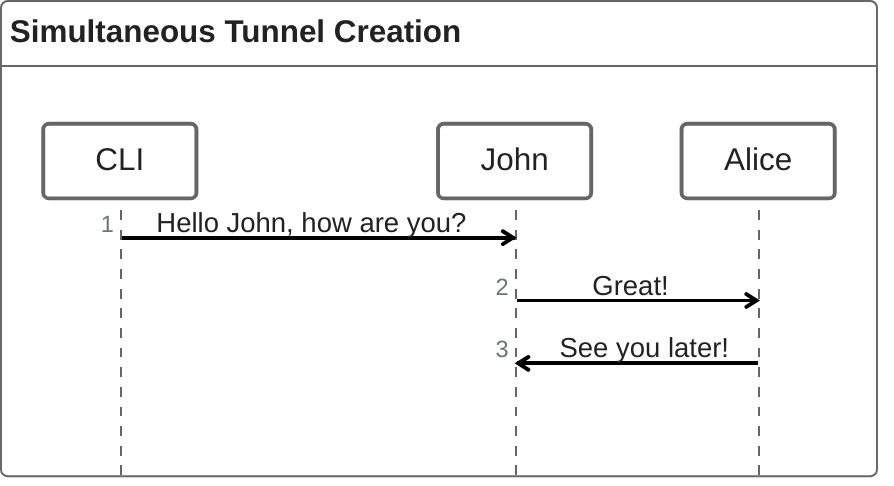

# Supporting Multiple Tunnels

## Summary

DoubleZero needs to support multiple tunnels of the same or different types. Currently, only a single tunnel can go over an interface which is no longer sufficient for the needs of the product. 

## Motivation

Multiple tunnel support is required now that DoubleZero supports IBRL and multicast. In fact, multicast can not be publicly released wthout multiple tunnel support.  
## New Terminology

*

## Alternatives Considered


## Detailed Design




### Data Structure Changes

A new data structure, `Interface`, will be defined that is attached to a `device`. A `device` can have many `interfaces`.  

```mermaid
classDiagram
    class Interface {
      AccountType account_type
      Pubkey owner
      Pubkey device_pk
      string name
      IpV4Inet[] ip4_addresses
      bool tunnel_termination
      
    }
    class Device {
        AccountType account_type
        Pubkey owner
        u128 index
        u8 bump_seed
        Pubkey location_pk
        Pubkey exchange_pk
        DeviceType device_type
        IpV4 public_ip
        DeviceStatus status
        String code
        NetworkV4List dz_prefixes
    }

    Interface --> Device : device_pk
````

### Network Changes
IPs will be assigned from a general pool of IP addresses. These IP addresses will be originally sourced from the IPs that the contributors provide through their minimum /29. These IPs are already used to assign src IPs for multicast tunnels. There is a limited supply of IPs that will be exhausted somewhat quickly. To mitigate the IP resource problem, DoubleZero can either request more IPs from network contributors or if necessary, IPs can be pulled from the /21 that DoubleZero owns. These are being set aside for edge filtration so they should only be used if absolutely necessary. 


 ### Service Changes


Supporting multiple tunnels

#### CLI
The CLI currently selects the tunnel termination endpoint for a user connection based on min(latency) across all DZDs. In the event there is an existing tunnel terminated on the DZD, we need to select the next best endpoint on the same DZD. 

#### Daemon
Latency probing changes are needed for this as the current implementation looks at the public_ip field of device record to probe each DZD:
  1. Look at device table and then the interface table based on the device pubkey
  2. Filter on tunnel termination interfaces per device
  3. Initiate latency probes per tunnel termination
  4. Store results as <Device: Interface: LatencyResult> and serve via /latency endpoint for CLI

#### Activator
* check to see logic around which dz prefixes are chosen
* logic that change; currently first ip now we need >1 and changes reflected on the table
* initial device bootstrapping needs to be considered
    * where/how do you allocate
    * can a user set their own termination "points" etc

#### Controller
* *optional*: configuration for tunnel termination loopbacks generated in 
The smart contract will need to own the issuing of IPs. The IP's usage is agnostic from the smart contract's perspective. All it needs to do is assign the IP that is associated with a particular interface. 
o etc
* registct
The immediate impact will be the rollout of multicast support, the v0.2.0 release for DoubleZeroC. Non-*

* Functional simultaneous tunnels of
* 

Discuss effects on:

* Existing codebase (modules touched, refactors required)
* Operational complexity (deployment, monitoring, costs)
* Performance (throughput, latency, resource usage)
* User experience or documentation
  Quantify impacts where possible; note any Supporting multip e tunnels shouldn't change the security posxure as the same security practices are inherited. pected ROI.

## Security Considerations


*Threat analysis and mitigations.*
Identify new attack surfaces, trust boundaries, or privacy issues introduced by the change. Describe how each risk is prevented, detected, or accepted and reference relevant best practices.

## Backwards Compatibility

New logic will introduce a breaking change as this RFC covers the initial rollout of multicast. This release will be tagged with a minor version of 0.2.0 to signif* y the breaking change.

## Open Questions


