# DoubleZero Telemetry Design for Contributor Rewards

# Summary

**Status: Active**

This document defines a decentralized process for collecting, storing, and evaluating network telemetry data on the DZ Serviceability sidechain. Telemetry is accumulated on-chain via a dedicated smart contract, with requirements defined in this document. Telemetry enables transparent and tamper-resistant tracking of network performance and resource utilization. This data is then used to assess each contributor's participation in the network and to verify that they have met their agreed-upon commitments. The approach ensures accountability, incentivizes high-quality service, and provides a foundation for automated rewards or penalties based on objective, on-chain evidence.

# Motivation

Current network monitoring solutions are centralized, opaque, and susceptible to manipulation. There is a need for a trust-minimized, verifiable telemetry system that enables:

- Transparent measurement of network health and contributor performance
- On-chain, auditable records of service delivery
- Automated enforcement of service-level agreements (SLAs) and contributor incentives

The primary purpose of collecting this telemetry information is to objectively measure the performance of the network. This data will, in turn, enable DZF to reward contributors for the links they provide to the network. By storing telemetry information on-chain, the protocol ensures that all data is tamper-resistant and publicly auditable.

Additionally, these metrics are used to execute Shapley value calculations, allowing the protocol to fairly determine the rewards each contributor receives based on their marginal contribution to the overall network service. This approach incentivizes high-quality participation, aligns contributor rewards with actual impact, and supports decentralized governance and reliability across the DoubleZero ecosystem.

# Scope

This design document focuses on data collection and onchain storage. Summarization and reward calculation are outside the scope of this design. The process of funding payer accounts is also out of scope and is owned by DZF. See the [Visibility](https://www.notion.so/Visibility-18ffef22bebe80d09af9f0832696ee0f?pvs=21) document for other telemetry metrics that are outside the scope of this design.

# New Terminology

- **Telemetry Record:** A PDA (Program Derived Address) account in the smart contract that accumulates latency samples for a specific circuit from a source DoubleZero Device (DZD) to a destination DZD. This account collects all latency measurements for a given epoch, with each periodic submission appending new samples to the end of the account data. A new PDA account is created for each unique combination of epoch, `device_pk`, and `link_pk`.
- **Telemetry Oracle:** A set of off-chain agents responsible for submitting signed telemetry records to the DoubleZero ledger. There is one agent installed on each DZD that collects data from the DoubleZero network and writes in, and another agent that collects data from 3rd party providers and writes it to the DZ Serviceability.

# Detailed Design

## Architecture Overview

The following diagram represents the information flow used to provide the data required for the Shapley value calculation. It requires both standard internet latency information and the actual latency values measured within the DoubleZero network.

1. **Inventory Registration:** The Serviceability Program maintains an on-chain registry of Devices and Links, representing the network inventory.
2. **DZ Latency Measurement:** An agent running on each switch (DZD) uses the on-chain inventory to identify peer devices and links. For each link, the agent periodically measures round-trip time (RTT) to other DZDs), collecting latency samples for every active link.
3. **Internet Latency Measurement:** Combine data from an agent run on each DZD with data from 3rd party providers to create an approximate view of global internet performance between cities where DZ operates.
4. **Data Accumulation:** The agent accumulates RTT measurements for each (device_pk, link_pk) pair.
5. **Periodic Submission:** At defined intervals (every 60 seconds), the agent submits a batch instruction to the Telemetry Program smart contract, reporting the accumulated RTT samples for each (device_pk, link_pk, epoch) tuple.
6. **On-Chain Storage:** The smart contract creates or updates a telemetry account for each (device_pk, link_pk, epoch), appending the new samples to the account's data.
7. **Percentile Calculation:** At the end of each epoch, the Telemetry Program reads the accumulated samples and computes the 95th percentile latency for each link, using this value to evaluate SLA compliance and contributor performance.
8. **Latency Accumulator Account Creation:** At the end of each epoch, the Telemetry Program will create an account to store the latency accumulator calculation for each metric, as measured by each DZD for every Link. This account will record the statistical values (min, max, 95th percentile, 99th percentile) for each metric. The account will contain all aggregated values for each epoch and will be used as input for the Shapley value calculation.

Note: Timestamps have at least microsecond resolution (the standard in the high-frequency trading world). We store in nanosecond resolution for future compatibility.

## Data Structures (on-chain)

- `DZLatencySamples`:
    - epoch: u64
    - device_a_pk: Pubkey
    - device_z_pk: Pubkey
    - location_a_pk: Pubkey
    - location_z_ok: Pubkey
    - link_pk: Pubkey
        - Default (all 1s) value indicates samples are DZ internet data, otherwise samples are DZ link data
    - agent_pk: Pubkey
        - Not the device pubkey, which does not have a private key
        - Used to validate authority to write to this account
    - sampling_interval_microseconds: u64

        Note: Time measurements are all in stored microseconds for consistency, but due to the Solana account size limit of 10 MB, the sampling interval can never be lower than about 67ms.

        - 10,280,000 / (4 * 60 * 60 * 24 * 2) =14.873 max samples per second… lowest sampling interval = 1000ms / 14.873 = roughly 67ms
    - start_timestamp_microseconds: u64
    - next_sample_index: u32
    - samples: [u32] (RTT values in microseconds) *The rest of the buffer contains latency samples as u32 values for each period. Blanks are filled with 0.*
- `ThirdPartyLatencySamples`
    - data_provider_name: String[32]
        - For example “WonderPing”, “RIPE Atlas”, “GlobalPing”, …, limited to 32 bytes
    - epoch: u64
    - location_a_pk: Pubkey
    - location_z_pk: Pubkey
    - sampling_interval_microseconds: u64
    - start_timestamp_microseconds: u64
    - next_sample_index: u32
    - samples: [u32] (RTT values in microseconds) *The rest of the buffer contains latency samples as u32 values for each period. Blanks are filled with 0.*

## Instructions

Instructions initialize the PDA account for the metric by creating its header and setting the epoch, frequency, and starting timestamp. Gaps are indicated by 0 value and there is nothing that prevents an agent from submitting a value of 0 for a measurement (indicating a gap, since 0 is not a valid measure of network latency). New samples are appended to the existing account.

- `initialize-dz-latency-samples`
    - device_a_pk: Pubkey (32 bytes) // fetched from serviceability account
    - device_z_pk: Pubkey (32 bytes) // fetched from serviceability account
    - link_pk: Pubkey (32 bytes) // fetched from serviceability account, or all 1s for internet data
    - epoch: u64 (8 Bytes)
    - sampling_interval_microseconds: u64, (8 Bytes) // taken from latency config
- `initialize-thirdparty-latency-samples`
    - data_provider_name: String[32]
    - location_a_pk
    - location_z_ok
    - epoch: u64 (8 Bytes)
- `write-dz-latency-samples`
    - start_timestamp_microseconds: u64  (8 Bytes)
    - samples: Vec<u32> (RTT values in microseconds) (4 Bytes + n * 4 Bytes)
- `write-thirdparty-latency-samples`
    - start_timestamp_microseconds: u64  (8 Bytes)
    - samples: Vec<u32> (RTT values in microseconds) (4 Bytes + n * 4 Bytes)

## Algorithms & Control Flow

- **Measurement:**
    - DZ: For each link, the agent measures RTT to the remote DZD and records the value in memory and on disk (in case of agent restart)
    - 3rd party internet: For each pair of cities, the internet latency collector fetches latency information from 3rd party servicxes, maps the A and Z locations to DZ locations, discards data that does not map to any DZ location
- **Batch Submission:**
    - DZ: Every 1 minutes, the agent sends an instruction to the smart contract with all accumulated samples for the current period.
        - The contract appends these samples to the corresponding (device_pk, link_pk, epoch) account.
    - 3rd party internet: TODO: Do we write raw data? Summary data for epoch? Or resample to match DZ data sampling interval?

## Data collection

We want to calculate contributor rewards based on the benefits that DZ links provide in comparison to the public internet in a transparent and objective way. Our primary metric is latency between the locations served by DoubleZero. To avoid the cost of an external probe connected to each DZD, we use software on the DZD itself to collect latency for each DZD pair and each DZ link.

Data collected from DZDs includes latency between each DZD pair over the public internet. However, this is not sufficient for modeling internet performance, because DoubleZero's internet connectivity is not representative of the public internet. For example, in testnet our largest contributor uses a single internet provider that optimizes for low latency. This does not represent situations in the public internet like sub-optimal routing between providers. In order to use data that's closer to what users experience in the real world, we need to gather more data from elsewhere.

### Requirements - DZD-to-DZD latency
1. Collect data frequently (every 1s or 10s) and with low bandwidth utilization using a simplerequest/response
1. Capture per packet Round Trip Time (RTT)
1. Set packet size to 2048 bytes (2000 data bytes) to match contributors’ link requirement
    - Note: Some 3rd party data providers don’t allow us to set packet sizes. We assume that the difference in serialization delay between a 64 byte and a 2048 byte is small enough on 10+Gbps links that it won’t materially impact reward calculations.
1. Accumulate data in memory (and on disk in case of agent restart)
1. Probes should NOT use ping since results would depend on how EOS prioritizes processing of icmp echo requests/replies

### Design - DZD-to-DZD latency (controlplane/telemetry)

| Method | Pros | Cons |
| --- | --- | --- |
| **Use Arista’s [TWAMP Light](https://datatracker.ietf.org/doc/html/rfc5357#page-23) implementation** | - Built in to EOS - Hardware timestamps | - Closed source - No guarantee that the implementation will be the same across vendors |
| ✅ **Roll our own [TWAMP Light](https://datatracker.ietf.org/doc/html/rfc5357#page-23)** | - Complete control - Open source, auditable | - More effort than using Arista’s TWAMP Light - May be susceptible to userspace contention influencing the accuracy of latency and jitter measurements |
| **DZ agent UDP** | - Complete control - Open source, auditable - Potentially less effort than rolling our own TWAMP Light | - May be susceptible to userspace contention influencing the accuracy of latency and jitter measurements |
| **Telegraf agent** (Use EOS Telegraf agent to collect data using iperf) |  | - Can’t fully configure from EOS API - Need custom plugin to write onchain |

Selected approach: roll our own TWAMP Light. A new Arista telemtery collector, to be distributed in the same RPM as the existing doublezero agent, runs on each DZD. It collects a list of devices from on-chain and probes each of them with TWAMP, storing results back on-chain.

### Requirements - internet latency
1. Data must be timestamped so we can determine approximately which Solana epoch it corresponds to
1. Data must be tagged with an A and Z geographic location that can be used to determine proximity toDZ locations
1. Providers must have probes in all the cities where we plan to operate
1. Providers must allow us to measure latency between pairs of their probes. We will disqualifyproviders that require the user to provide the test target, because we don't want to get into thebusiness of managing a fleet of probes.
1. Providers must provide the geographic location of each probe. Latitude and longitude are ideal,but city name may work.
1. Providers must have an API that supports all needed functionality
### Design - Location-to-location internet latency (controlplane/internet-latency-collector)
This component collects internet latencdy data from 3rd party providers and publishes it to the `ThirdPartyLatencySamples` data structure described above. This component performs two primary tasks.

**1. Configuration.** (Frequency: daily) First, it collects a list of DZ locations with active DZDs from the Serviceability program. Using that list, it configures each 3rd party provider to collect measurements between each pair of locations.

**2. Collection.** (Frequency: hourly) Second, it extracts recent data recorded by each 3rd party provider and writes it to `ThirdPartyLatencySamples`.

In order to select the probes to use, the collector uses the location's latitude and longitude to find the nearest probes. We support multiple probes per location to avoid data loss when a probe fails, and we require probes to be within 15km of a DZ location to be considered usable for that location.

We considered the following 3rd party providers (sorted alphabetically by name).
| **Source** | **Pros** | **Cons** | **Status** |
| --- | --- | --- | --- |
| GlobalPing | - Free | - No probe-to-probe measurements (3rd party requirement #4) | ❌ Disqualified
| Catchpoint | | - No probe-to-probe measurements (3rd party requirement #4)  | Pending disqualification
| RIPE Atlas | | - Users must operate probes to earn credits to use Atlas | ✅ Qualified |
| ThousandEyes | | - Costs $20K+ per year | Pending
| Wheresitup | | | ✅ Qualified |
| WonderNetwork Ping | | - No API (3rd party requirement #6) | ❌ Disqualified

#### Sequence diagram - 3rd party provider configuration

```mermaid
sequenceDiagram
	autonumber
	loop Update configuration (daily)
	    Collector->>🔗Serviceability🔗: Get locations with active DZDs
	    🔗Serviceability🔗->>Collector: DZ locations
	    loop For each 3rd party data provider
		    Collector->>3rdparty: Get current configuration
			3rdparty->>Collector: current config
			Collector->>Collector: Generate diff of current vs desired config
			Collector->>3rdparty: CRUD operations based on diff
	    end
	end
```

#### Sequence diagram - 3rd party provider collection

```mermaid
sequenceDiagram
	autonumber
	loop Collect data (hourly)
	    Collector->>🔗Serviceability🔗: Get locations with active DZDs
	    🔗Serviceability🔗->>Collector: DZ locations
	    loop For each 3rd party data provider
		    Collector->>3rdparty: Get current configuration
			3rdparty->>Collector: current config
			Collector->>3rdparty: Read new data
			3rdparty->>Collector: new data
			Collector->>🔗Telemetry🔗: write new data
	    end
	end
```

# Initial Work Plan

1. **Design spec RFC for telemetry program:** https://github.com/malbeclabs/doublezero/issues/531
2. **Agent Latency Calculation:** https://github.com/malbeclabs/doublezero/issues/510
    - Implement latency measurement in the DZD agent. Initially, the agent will record RTT samples to a local file for each link.
3. **Telemetry Smart Contract:** https://github.com/malbeclabs/doublezero/issues/511
    - Develop the Telemetry Program smart contract to receive and accumulate RTT samples submitted by agents.
4. **Agent-Smart Contract Integration:** https://github.com/malbeclabs/doublezero/issues/519
    - Update the agent to send RTT samples directly to the Telemetry Program smart contract. Also record data in a local file in case of agent restart.
5. **Agent signing key:**
    - Update serviceability program to add a signing key that the agent will use to sign telemetry data. (Generate a private key for each device, or potentially allow the contributor to provide a key.)
6. **3rd Party Collector:**
    - Collect latency data from 3rd party providers and write it to `ThirdPartyLatencySamples`
7. **Agent funding:**
    - Create a tool that periodically distributes SOL to agent accounts so they always have enough lamports to write new data

# Configuration

- Measurement interval (e.g., every 1 seconds)
- Submission interval (e.g., every 1 minutes)

# Impact

- **Codebase:** New smart contract (Telemetry Program), updates to Serviceability Program, CLI/SDK extensions for telemetry submission and queries.
- **Operational Complexity:** Requires deployment and operation of telemetry oracles; increases on-chain storage and transaction volume.
- **Performance:** Slight increase in on-chain resource usage; enables automated, scalable SLA enforcement.
- **User Experience:** Improves transparency and trust; enables contributors to verify their own performance and compliance.

# Security Considerations

- **Data Integrity:** All telemetry records must be signed by trusted oracles; contract verifies signatures.
- **Sybil Resistance:** Only authorized oracles can submit telemetry; access controlled via on-chain allowlist.
- **Privacy:** Telemetry data is public, so metrics that require read access control may not be stored.
- **Data tampering by contributors:** The first mainnet-beta release will NOT be permissionless, and only trusted partners will be admitted to the network, therefore we do not have a significant risk of data tampering.
- **Malicious data submission by bad actors:** We register the agent with the telemetry program, where the telemetry program account specifying the agent as the proper authority. In order to write data to a specific latency account, the agent must be passed in as a signer and match the authority on the SLA account. This requires a private key on the agent.

# Backward Compatibility

- No known backward compatibility issues

# Open Questions

- Do we measure link reliability (and use it to discount the contributor-reported bandwidth)? It’s not critical but we’d like to if it’s not too difficult.
    - In the first release, gaps in the data provide a proxy for link reliability. Since rewards are calculated based on p95, if a link is missing 5% of data for the epoch, the link’s owner will not be rewarded for that epoch.
- One account every two days per link doesn’t seem like much, but how many accounts is too many for the DZ Serviceability? How is ledger performance impacted over time?
    - Ask Triton One for guidance?
        - Chris at Anza should help us here since he’s responsible for the params of our fork
- We need a safeguard to prevent an agent from submitting too much data (higher frequency than specified in the header). Not a question, but just pointing this out in case the agent has a bug and tries to submit duplicate data (or in a malicious case, an agent tries to fill an epoch’s account with low measurements).
    - Out of scope for first release
- What exactly do we store for 3rd party data providers?
    - Need to research exactly what data each provider providers. We should store min and average.
- Arista does not support TWAMP on GRE interfaces, so we may not be able to use it on testnet until we have migrated off of GRE. Should we wait for the migration, or pursue a different option (UDP ping in DZD agent) in the interim?

# FAQ

- What is the optimal telemetry submission interval?
    - We don’t have an answer but the team has selected a 60 second submission interval as a starting point
- How does the protocol handle missing or delayed telemetry submissions? What strategy will we use to handle and complete missing data (Filling in the blanks) in the series?
    - Short delays are not a problem since we will aggregate at the epoch
    - The on-chain program will fill missing data with zeros.
- Who should generate the metrics to avoid a conflict of interest with the reward recipient?
    - The contributor (owner of the DZD) will self-attest to the performance for the first version of this implementation
- Should telemetry data be pruned or archived off-chain after a certain period?
    - No, all data will be retained on the DZ Serviceability indefinitely. Based on the current design, the scale of the DZ telemetry data is not large enough to require an off-chain archival solution. (A 30-node network, at 10KB per node pair per epoch, with measurements in both directions, will need roughly 18MB in storage per epoch. 10KB * 30^2 * 2 = 18MB.)
- For mainnet-beta, do we need a way to prevent contributors from tampering with the metrics produced by their DZDs?
    - No, for mainnet-beta we will not be permissionless, we will be working with trusted contributor partners.
