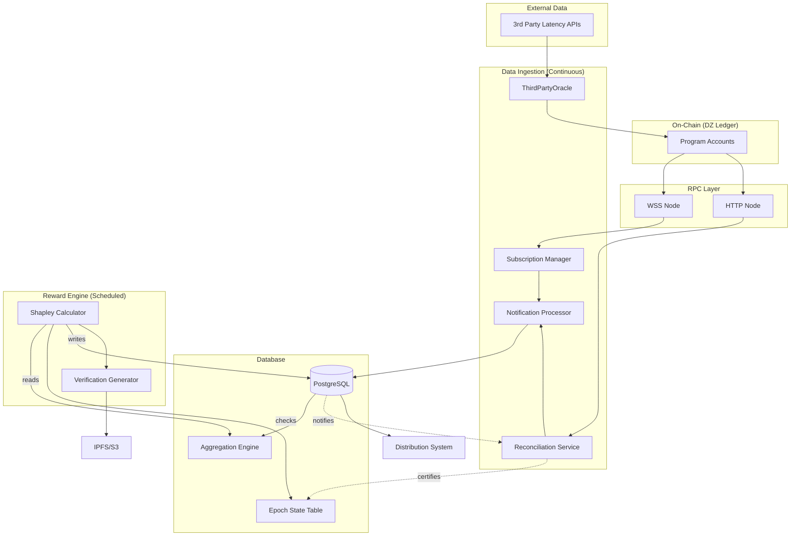

### **Summary**

This document specifies the design and architecture for the DoubleZero
Off-Chain Rewards Division. This system is a critical component of the
network's incentive mechanism, responsible for processing on-chain performance
telemetry and calculating rewards for network contributors in a fair,
transparent, and _ideally_ verifiable manner.

The architecture is designed for scalability, security, and auditability. It
leverages Solana's WebSocket (WSS) RPC interface for real-time data ingestion,
supplemented by a periodic reconciliation process to ensure data completeness.

A PostgreSQL database serves as the system's persistent store and aggregation
engine, while Shapley value calculations are used for equitable reward
distribution. A core feature of this design is the creation of a **Verification
Packet** and a corresponding **Verification Fingerprint** for each reward
epoch, allowing any contributor to independently audit their reward calculation
and fostering trust in the system.

### **Motivation**

The DoubleZero network's success depends on incentivizing high-quality
contributions. While the on-chain telemetry system **[TODO: link to
telemetry-rfc.md]** provides the source of raw performance data, the
computational complexity of reward calculations (specifically Shapley values)
makes on-chain execution impractical and cost-prohibitive.

This off-chain system is required to:

- **Process Large Datasets:** Efficiently handle high-volume telemetry data
  from a growing number of network links.
- **Enable Complex Calculations:** Perform computationally expensive Shapley
  value calculations that are currently infeasible to do on chain.
- **Ensure Verifiability:** Provide a transparent and auditable process that
  allows contributors to verify the fairness of their rewards, bridging the trust
  gap inherent in off-chain systems.
- **Maintain Flexibility:** Allow for the evolution of reward logic and
  parameters without requiring costly and complex smart contract upgrades.
- **Guarantee Data Completeness:** Implement a robust data ingestion pipeline
  that combines real-time subscriptions with periodic reconciliation to prevent
  missed on-chain events during potential outages.

### **Architecture & Data Flow**

The system is designed as a set of smaller services that feed a central data
processing pipeline. This design ensures separation of concerns and high
availability.



**Data Flow:**

1.  **Bootstrap:** On startup, the **Subscription Manager** queries all
    existing accounts via RPC and establishes a WebSocket subscription for each
    one.
2.  **Real-time Stream:** The **Subscription Manager** receives real-time
    account updates from the WSS RPC node and passes them to the **Notification
    Processor**.
3.  **Third-Party Data:** The **ThirdPartyOracle** service periodically fetches
    data from external APIs and submits it to the on-chain Telemetry program.
    These on-chain updates are then ingested by the `Subscription Manager`.
4.  **Reconciliation:** On a configurable interval, the **Reconciliation
    Service** performs a full `getProgramAccounts` scan to find and process any
    updates missed by the WSS stream. **[TODO: rethink, should be slot based? perf
    bottleneck?]**
5.  **Process & Store:** The **Notification Processor** decodes account data,
    discards duplicates using the `telemetry_account_progress` table, and
    writes the raw data to the database.
6.  **Aggregate in DB:** After storing raw data, a SQL function
    (`update_telemetry_aggregates`) is triggered. This function calculates
    statistical metrics (p95, uptime). **[TODO: ensure this is not flaky]**
7.  **Epoch Finalization:** After an epoch ends and a grace period passes, a
    final reconciliation run certifies the data is complete up to a cutoff
    slot. This updates the epoch's status to `data_complete`.
8.  **Calculate Rewards:** The **Shapley Calculator** service is triggered for
    completed epochs. It reads the finalized metrics, loads the demand matrix,
    and computes rewards. **[TODO: Does this happen at reward epoch boundary?]**
9.  **Publish Proof:** The **Verification Generator** creates the Verification
    Packet, generates its fingerprint (hash), and publishes the packet to
    IPFS/S3. The fingerprint and storage URL are saved with the reward data.
    **[TODO: Formalize separately? Needed for launch?]**
10. **Distribute:** A separate **Rewards Distribution System** reads the
    finalized rewards to send payments.

### **Atomicity & Data Completeness**

To guarantee that rewards for an epoch are calculated on a complete and final
dataset, we can try an "all-or-nothing" approach via an "Epoch Finalization
Process". Ideally this ensures that the system is reliable.

1.  **Data Grace Period:** A configurable delay (e.g., 6 hours) after an epoch's
    end, allowing potentially late-arriving data to be ingested.
2.  **Final Reconciliation & Certification:** After the grace period, a
    mandatory reconciliation run is performed for the ended epoch. Upon
    successful completion, this service updates an `epoch_state` table, marking the
    epoch as `data_complete` and recording a final `cutoff_slot`.
3.  **Decoupled Calculation:** The `Shapley Calculator` is a scheduled job that
    will only operate on epochs marked as `data_complete`. This decouples
    ingestion from calculation, ensuring that if the calculator fails and restarts,
    it will operate on the exact same, certified dataset, making the process
    idempotent and deterministic.

### **Components**

#### **Subscription Manager**

- **Role:** Manages the WSS connection and all account subscriptions.
- **Logic:** Maintains a list of subscribed accounts, handles
  connection/reconnection, and forwards WSS messages to the `Notification
Processor`.

#### **Reconciliation Service**

- **Role:** Acts as a periodic safety net and the finalizer of epoch data.
- **Logic:** Runs on a configurable interval _and_ is triggered as part of the
  Epoch Finalization Process. It fetches all program accounts, compares against
  the DB, sends missed updates to the `Notification Processor`, and marks
  entities no longer on-chain as inactive.

#### **ThirdPartyOracle** [TODO: This is needed for shapley calculations]

- **Role:** Ingests internet performance data to be used as a baseline.
- **Logic:** Periodically queries external latency APIs (or whatever we come up
  with), processes the data, and submits it to the on-chain
  `ThirdPartyLatencySamples` accounts. [TODO: If this data will not live on
  chain, we need to incorporate this into this system itself]

#### **Notification Processor**

- **Role:** Consumes updates from both the `Subscription Manager` and
  `Reconciliation Service`, decodes them, and persists them.
- **Logic:** Receives an `(AccountUpdate, slot)` tuple, uses the
  `telemetry_account_progress` table to discard stale or duplicate updates, and
  writes new data to the database.

#### **Database (PostgreSQL)** [TODO: subject to change]

- **Role:** Source of truth for all data.
- **Key Tables:**
  - `telemetry_samples`: Stores raw, unprocessed telemetry data.
  - `link_metrics`: Stores aggregated, per-epoch metrics.
  - `telemetry_account_progress`: Tracks the last processed state for each
    account.
  - `epoch_state`: Tracks the lifecycle of a reward epoch (`collecting`,
    `data_complete`, `calculating`, `completed`).

### **Data Structures**

- **`Verification Packet`**: The full JSON dataset published to IPFS/S3 containing all inputs for an epoch's reward calculation.

- **`Verification Fingerprint`**: The **SHA-256 hash** of the canonicalized `Verification Packet` (deterministic).

- **`ContributorReward` (Model):**

  ```rust
  pub struct ContributorReward {
      pub epoch: u64,
      pub contributor_pk: String,
      pub reward_amount: Decimal,
      pub shapley_value: Decimal,
      pub verification_fingerprint: String, // SHA-256 hash of the packet
      pub verification_packet_url: String, // IPFS CID or S3 URL
  }
  ```

- **`VerificationPacket` (Sample JSON for example):**
  ```json
  {
    "calculationTimestamp": "<ts>"
    "demandMatrix": [],
    "epoch": 123,
    "processedMetrics": [],
    "rewardPool": "1 bajillion",
    "shapleyLibraryVersion": "v0.1.0"
  }
  ```

### **Verifiability & Audit Trail** [TODO: can be punted for launch?]

The publication of the `Verification Packet` and `Fingerprint` is a core,
non-negotiable feature for building contributor trust.

- **Process:** The calculator service will serialize all inputs into the
  canonical `Verification Packet` JSON, hash it to get the `Fingerprint`, and
  upload the packet to IPFS/S3.
- **Storage:** The `Fingerprint` and the storage URL (e.g., `ipfs://<CID>`) are
  stored in the `contributor_rewards` table.
- **Public Audit:** A tool can be provided for contributors to fetch the
  packet, verify its integrity by re-calculating the hash, and then re-run the
  open-source calculation to validate their reward.

### **Scalability, Performance, & Future Enhancements**

- **Ingestion:** The WSS + Reconciliation model is a practical starting point.
  It is more resilient than WSS alone. The primary bottleneck will be the
  periodic `getProgramAccounts` call in the Reconciliation Service, which will
  become slower as the network grows.
- **Processing:** The architecture is scalable, the `NotificationProcessor`
  should be a lightweight buffer, and the heavy lifting of aggregation is
  offloaded to the database. The `Shapley Calculator` is CPU-bound and
  Contributor-Count-bound and can be scaled vertically (when its time, which I
  don't expect would be until late next year).

### **Open Questions & Discussion Points**

- **Third-Party Metrics Integration:** This RFC proposes a dedicated
  `ThirdPartyOracle` service that writes data on-chain. [TODO: Discuss how we do
  this]
- **Epoch Finalization:** Is the proposed "Data Grace Period" followed by a
  final reconciliation run an acceptable mechanism for ensuring data completeness
  before reward calculation?
- **Verification Packet Storage:** Is IPFS the preferred storage target, or is
  an S3-compatible object store sufficient for launch? S3 is simpler to
  implement, while IPFS offers better decentralization.
- **Reward Calculation Timing:** The proposed design calculates rewards for
  `Epoch N` after it has been finalized. This creates a delay. Is this
  acceptable, or is a more real-time (and more complex) calculation model
  required? Arguably the delay is acceptable as long as the rewards are paid out
  reliably and fairly.
