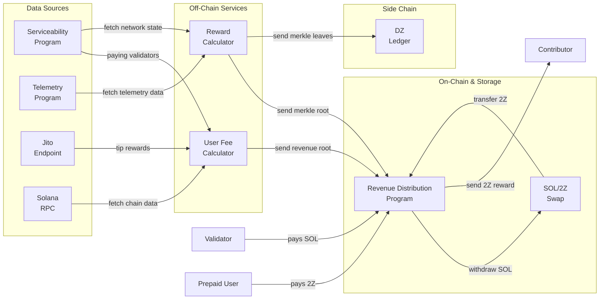
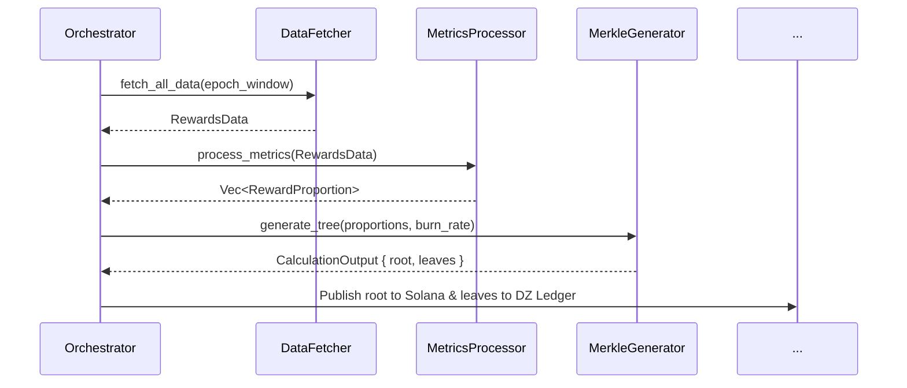

# **Summary**

This document specifies the architecture for the `rewards-calculator`, a stateless off-chain service responsible for calculating contributor reward proportions and the epoch-specific burn rate for the DoubleZero network. The design prioritizes correctness, verifiability, and a clean separation of concerns between off-chain computation and on-chain settlement.

The system is a single, scheduled batch service. After each reward epoch, the service fetches all required on-chain data, calculates each contributor's fair _proportion_ of the total rewards (via Shapley values), and determines a `burn_rate`. The final outputs are a **Merkle root** derived from these values and the corresponding **Merkle leaves**. The Merkle root is published to the on-chain Revenue Distribution Program on Solana, while the full set of leaves is published to the DZ Ledger.

# **Motivation**

The DoubleZero network's success depends on fairly incentivizing its contributors. The computational complexity of fair reward calculations (specifically Shapley values) makes on-chain execution impractical. This off-chain system is required to:

- **Decouple Calculation from Payout:** The complex calculation of reward _proportions_ is computationally intensive. By calculating only proportions off-chain, we decouple this process from the variable and potentially delayed finalization of the total on-chain revenue pool for that epoch.
- **Ensure Verifiability:** Provide a transparent, auditable process where the on-chain commitment (the Merkle root) is small and cheap to store, while the underlying data (the leaves on the DZ Ledger) is fully available for any participant to verify.
- **Maintain Flexibility:** Allow the core reward logic and parameters (e.g., the burn rate formula) to evolve off-chain without requiring frequent and costly smart contract upgrades.
- **Process Large Datasets:** Efficiently handle the full data load of a completed epoch to determine fair reward proportions.

# **New Terminology**

- **Reward Proportion:** A fractional value representing a contributor's percentage share of the total rewards for an epoch, as determined by the Shapley value calculation.
- **Merkle Leaf:** An individual data entry in the reward distribution, such as a single contributor's reward proportion or the epoch burn rate. Each leaf is hashed to form the base of the Merkle tree.
- **Merkle Root:** A single 32-byte hash that acts as a cryptographic commitment to the entire set of Merkle leaves. It is the only piece of reward data that needs to be stored on the Solana blockchain.
- **Revenue Distribution Program:** The on-chain Solana program that stores the Merkle root for each epoch and processes payout transactions from contributors who provide a valid Merkle proof.

# **Alternatives Considered**

The primary alternative considered was a system where the off-chain service calculates absolute reward amounts (in 2Z tokens) and publishes the full list of payees and amounts on-chain. This was rejected because:

1.  **Tight Coupling:** It would require the off-chain service to know the total reward pool in advance, coupling it to the on-chain revenue collection and swap processes, which may not have completed in a timely manner.
2.  **High On-Chain Cost:** Storing a potentially large list of rewards directly on-chain for every epoch would be prohibitively expensive.
3.  **Inflexibility:** Changes to the reward distribution would require more complex on-chain logic.

The Merkle tree approach was chosen because it provides the best balance of on-chain security, verifiability, and off-chain flexibility at a minimal on-chain cost.

# **Detailed Design**

## **Full Rewarding Architecture**

Below is the full architecture of the rewarding system. This RFC focuses solely on the **Rewards Calculator** off-chain service.



## **Internal Component Architecture**

The `rewards-calculator` binary is a single executable with a clear, linear data flow.



## **Proposed Data Structures**

```rust
use rust_decimal::Decimal;
use serde::{Deserialize, Serialize};
use solana_sdk::pubkey::Pubkey;

/// Represents a single contributor's calculated reward proportion.
/// The `proportion` is stored as a fixed-point integer after scaling.
#[derive(Debug, Clone, Serialize, Deserialize, PartialEq, Eq, PartialOrd, Ord)]
pub struct ContributorReward {
    pub payee: Pubkey,
    pub proportion: u64, // e.g., scaled by 1e12 for precision
}

/// Represents the burn information for the epoch.
/// The `rate` is stored as a fixed-point integer after scaling.
#[derive(Debug, Clone, Serialize, Deserialize, PartialEq, Eq, PartialOrd, Ord)]
pub struct BurnInfo {
    pub rate: u64, // e.g., scaled by 1e12 for precision
}

/// Defines the types of data that can be included as a leaf in the Merkle tree.
/// This enum allows for type-safe handling of different leaf data and ensures
/// that different leaf types produce different hashes. The enum is sorted by
/// variant to ensure canonical ordering.
#[derive(Debug, Clone, Serialize, Deserialize, PartialEq, Eq, PartialOrd, Ord)]
#[serde(rename_all = "camelCase")]
pub enum MerkleLeafData {
    Burn(BurnInfo),
    ContributorReward(ContributorReward),
}

/// The final, canonical output of a successful calculation run.
#[derive(Debug, Clone)]
pub struct CalculationOutput {
    /// The 32-byte Merkle root hash to be published on-chain.
    pub merkle_root: [u8; 32],
    /// The full list of leaves, to be published to the DZ Ledger.
    pub merkle_leaves: Vec<MerkleLeafData>,
}
```

## **Merkle Tree Construction Algorithm**

The generation of the Merkle root must be perfectly deterministic, leveraging the `svm-hash` library. The `rewards-calculator` service is responsible for preparing the data correctly before passing it to the hashing library.

1.  **Leaf Creation:** For each `(payee, proportion)` tuple, create a `MerkleLeafData::ContributorReward`. Create a single `MerkleLeafData::Burn` with the epoch's burn rate. All `Decimal` values must first be converted to `u64` using a standardized scaling factor.
2.  **Canonical Ordering:** Collect all `MerkleLeafData` objects into a `Vec<MerkleLeafData>`. **Crucially, sort this `Vec`**. The derived `Ord` trait on `MerkleLeafData` will ensure a canonical ordering, first by enum variant (`Burn` before `ContributorReward`), and then by the struct's fields.
3.  **Serialization:** Iterate through the _sorted_ `Vec` and serialize each `MerkleLeafData` enum into its canonical JSON byte representation (e.g., `{"burn":{"rate":500...}}`, `{"contributorReward":{"payee":"...","proportion":...}}`). This results in a `Vec<Vec<u8>>`.
4.  **Hashing and Tree Building:**
    - Pass the `Vec` of serialized byte slices to the `svm_hash::merkle::merkle_root_from_leaves` function.
    - This function hashes each serialized leaf using a domain-separated double-SHA256 hash:
      `H(L) = double_hash(L, LEAF_PREFIX, LEAF_PREFIX)`.
    - It then combines pairs of hashes using a domain-separated single-SHA256 hash to form their parent:
      `H(A, B) = hashv(&[NODE_PREFIX, A.as_ref(), B.as_ref()])`.
    - The process repeats until a single root hash remains.

# **Impact**

- **Codebase:** This RFC guides the initial implementation of the `rewards-calculator` project and its workspace crates. It defines the core data flow and the primary interfaces between components.
- **Operational Impact:** The resulting system is a single, stateless binary. Its operational footprint is minimal, requiring only a scheduler (e.g., cron) for execution. Monitoring will focus on the successful completion of the batch job and the publication of artifacts to the on-chain program and the DZ Ledger.
- **Ecosystem:** This service is a critical component for enabling DoubleZero tokenomics. It provides the mechanism for fairly distributing rewards to network contributors in a decentralized and verifiable manner.

# **Security Considerations**

- **Service Integrity:** The `rewards-calculator` is a trusted off-chain component. A compromise of the execution environment could lead to the publication of an incorrect Merkle root. Immediate mitigation is to just run the service in a secure, minimal, and access-controlled environment. The public verifiability of the calculation provides a crucial check; any incorrect root can be challenged and identified by the community.
- **Availability:** The availability of the Merkle leaf data on the DZ Ledger is critical for payouts. If the DZ Ledger is unavailable, contributors cannot generate proofs to claim their rewards. The DZ Ledger must be treated as a high-availability system.

# **Backward Compatibility**

This RFC describes the initial design and implementation of a new system. As such, there are no backwards compatibility concerns. Future changes to the Merkle leaf structure or hashing algorithm will require a new version of the on-chain `Revenue Distribution Program` capable of handling the new format.

# **Open Questions**

- The precise mechanism for synchronizing off-chain calculations with on-chain epochs needs to be finalized.
- The exact formula for calculating the `burn_rate` is to be determined.
- The exact scaling factors for converting decimal proportions and rates to `u64` need to be defined and standardized across all components.
