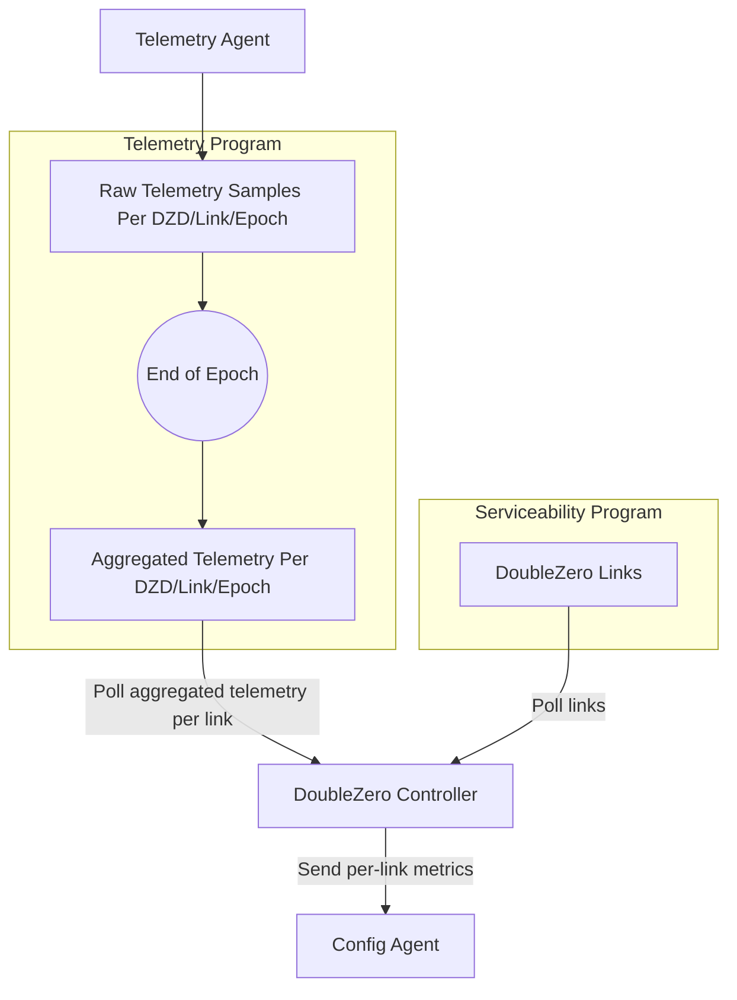
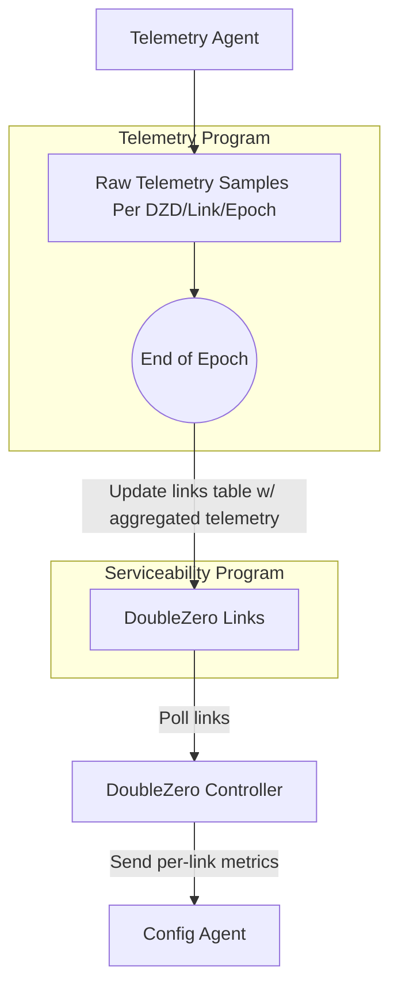

# Methodology For Setting Per-link Metrics

## Summary

In order to optimize packet forwarding across DoubleZero, we need a methology for setting per-link metrics in order for an ingress DoubleZero device to derive the shortest path to an egress DoubleZero device, with min(latency) being the key optimization function. This document proposes using a metric value directly derived from per-link telemetry measurements written on-chain by each device's telemetry agent over the previous epoch. If a link has latency data populated for the previous epoch, the DoubleZero controller will generate per-link configuration to apply the generated metric value, which can then impact the shortest path decision making of an ingress DoubleZero device.

## Motivation

While per-link metric derivation currently happens on DoubleZero testnet today, the process is manually completed by a human pinging across a link at a single point in time and manually applying a metric on a DoubleZero device. While this functionally works, there are several pitfalls to this process:
- Human error is a thing, and given hundreds of links, an incorrect metric value (100 instead of 1000) can transform what should be a high latency link to a low latency link and suboptimally impact packet forwarding across DoubleZero
- Latency values can change change over time on a link, which isn't reflected during a single point in time measurement. For example, a bandwidth contributor may be using a protected circuit, and during a fiber cut, the underlying provider may reroute the physical link onto a longer fiber path to restore service. While this link may have been the most performant prior to the fiber cut, the additional latency post fiber cut on the protected path may make this a less than optimal link from DoubleZero's perspective.
- Utilizing measured latency values written on-chain by DoubleZero device agents provide transparency into how each per-link metric is being calculated

## New Terminology

N/A

## Alternatives Considered

### Use Static Metric Values Set By The Bandwidth Contributor and/or Foundation

This by far the simplest approach. In the link data structure on-chain, there are already fields for both delay (`delay_ms`) and jitter (`jitter_ms`), which can be used to form a composite latency-based metric and consumed by the DoubleZero controller for rendering per-link configuration. These can be set by either the bandwidth contributor or foundation at turnup time.

The downside to this approach is all the issues mentioned in the motivation section of this document.

### Use Real Time Metric Values Set By The Telemetry Agent

The DoubleZero controller could consume the most recent telemetry samples written on-chain within an epoch and immediately apply updated per-link metrics. While this is fairly straightforward to implement, without a smoothing function applied, sample to sample outliers would directly impact packet forwarding within DoubleZero as jitter would potentially cause shortest path recalculations on devices.

The controller could use a windowing function internally to smooth latency outliers but unless the window was done on a strict boundary, it may be difficult to understand which samples contributed to a particular metric value. Additionally, the smoothed latency value and metric would need to be written back on-chain both for transparency and to provide durability to controller restarts, as the architecture is currently stateless and solely based on on-chain data.

## Detailed Design

The goal of this design is to leverage the existing telemetry pipeline and latency samples written on-chain to derive and configure per-link metrics. In order to optimize for stability, metric values will be derived based on aggregated telemetry data over the previous epoch. The side effect of this is a link cannot be brought into service until there is a previous epoch's worth of telemetry data.

Since the DoubleZero devices currently leverage IS-IS as an underlay routing protocol, link metrics are restricted to a minimum metric value of 1 and a maximum metric value of 16,777,215 (2^24), which is the maximum value allowed in an IS extended neighbor TLV used for wide metrics.

The per-link metric calculation can be kept simple to start. We can directly use the p99 latency in microseconds over the previous epoch as the metric value. For example, a p99 latency value of 400us would equate to a metric value of 400 on a link where a p99 latency of 220ms would equate to a metric of 220,000 on a link. One could argue to use a composite metric such as p99 latency (us) + p99 jitter (us) which would select for circuits with min(latency + jitter) and they would not be wrong but we should bias towards a walk/crawl/run approach, especially until we have more confidence on telemetry sampling.

In the event a link has no telemetry data from the previous epoch, the link could either be assigned a maximum metric of 16,777,215 or not placed into protocols altogether.

One of the major decision points is how/where will we store aggregated telemetry data. Below are two options for this.

### Option #1: Store Aggregated Telemetry In Telemetry Program

1. Telemetry samples are written on-chain by the telemetry agent running on each DZD.
2. At the end of each epoch, an aggregation function runs to calculate p99 latency and jitter values. Since this is required for rewards calculation, it seems this could be reused here. In order to make these queryable, the output can be written to an on-chain record as part of the telemetry program.
3. The controller can fetch the aggregated telemetry for all links from the telemetry program as well as all link metadata from the serviceability program. Given the serviceability program provides metadata such as interface names, desired operational state, etc, and the telemetry program contains latency values, enough inforamtion is available to render templated configuration for each DoubleZero device.
4. Each DoubleZero device config agent will receive updated metrics as part of their configuration they fetch during their normal polling clock tick to the controller.

### Option #2: Store Aggregated Telemetry In Serviceability Program

This option is similar to #1 but instead of storing aggregated telemetry data in a seperate table within the telemetry program, the aggregation function could store them within the links table of the serviceability program itself. There is already a delay field (`delay_ms`) and jitter (`jitter_ms`) available in each row and could be reused or new fields created. This allows the controller to poll a single table for both link and aggregated telemetry information.

One downside of this is ownership of these records as contributors have access to edit their links and are currently able to populate delay/jitter values. These could be removed from the doublezero CLI but more nefarious users could bypass this.

## Impact

### Serviceability Program
- Update link data structure to include:
   - Include drained flag boolean which would either set affinity on link or max metrc (2^24)
   - last epoch latency + jitter (if option #2 selected)

### Telemetry Program
- Build or reuse rewards aggregate telemetry function and adapt to writing results on-chain either to new table in telemetry program (option #1) or the links table (option #2)

### Controller
- Update controller to fetch link table, aggregate telemetry and transform p99 latency into metric value; render appropriate interface template.

## Security Considerations

It is mentioned in the open questions but it seems useful to have a mechanism to override a metric value for the purposes of traffic engineering in the short term. This can belong in the links table but if it can be modified by a bandwidth contributor, packet forwarding can be impacted across DoubleZero.

## Backwards Compatibility

N/A

## Open Questions

*Items that still need resolution.*
List outstanding issues, research tasks, or decisions deferred to later milestones. This section helps reviewers focus feedback and signals areas where contributions are welcomed.

- Should we include an override field in the link record? We're solely depependent on telemetry behaving correctly and even if it is, there are times where manual traffic engineering will be necessary. This is however dangerous if this can be set by the bandwidth contributor so it may belong somewhere else.

- I don't love the circular dependencies we're building with the network decoupled from on-chain data. If a device loses management connectivity, we're at risk of not being able to update metric values in the event of an operational issue. We specifically didn't want to run validators directly on the DZDs since a network issue could also cause us to never reach consensus.
