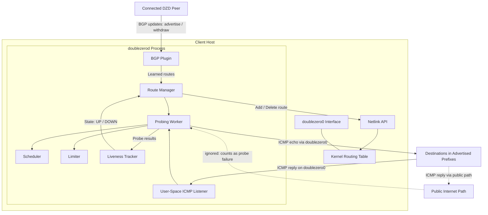
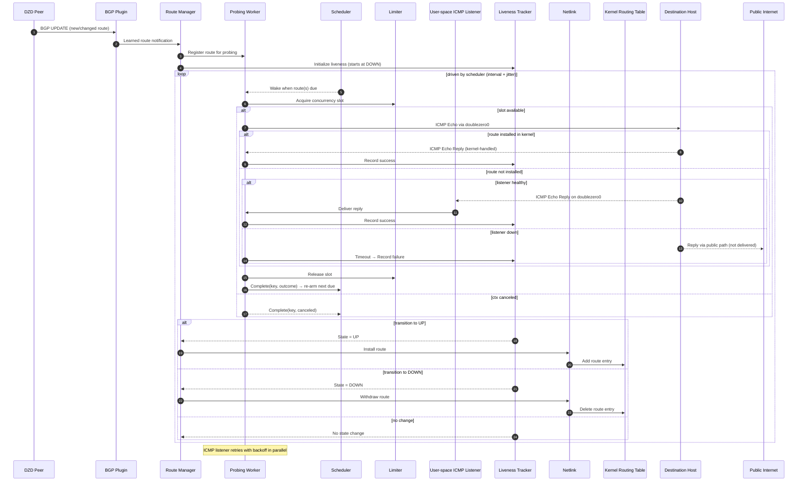

# DoubleZero Client Route Liveness Probing

## Summary

This proposal introduces **Route Liveness Probing** to the `doublezerod` client daemon.

The goal is to enable active data-plane validation of BGP-learned routes from DoubleZero Devices (DZDs), ensuring that only reachable routes are installed in the local kernel routing table.

Each route is periodically probed via ICMP echo requests, transitioning between `UP` and `DOWN` states according to a hysteresis-based policy. Routes marked `UP` are installed; routes marked `DOWN` are removed until reachability recovers.

The feature will initially apply only to the IBRL service type (unicast without allocated IP), where fallback connectivity over the public internet path exists.

## Motivation

Currently, BGP-learned routes from DZDs are installed unconditionally. If a DZD or its tunnel fails while the BGP session remains established, these routes can remain installed even when the underlying data path is unreachable — leading to silent blackholing until the control plane detects the failure or manual configuration changes are made.

Route liveness probing introduces a data-plane-derived reachability signal, enabling `doublezerod` to locally remove failed routes from the kernel routing table without disturbing BGP control-plane stability.

This enhances operational reliability, accelerates convergence after partial or asymmetric failures, and aligns with the goal of making the DoubleZero client resilient to silent path degradation.

## New Terminology

- **Route Liveness Probe** — A periodic ICMP echo request used to verify reachability of a BGP-learned destination.
- **Liveness State** — The local classification of a route as `UP` or `DOWN`, derived from recent probe results.
- **Liveness Policy** — The decision logic (currently hysteresis-based) that governs transitions between states, using configurable thresholds for consecutive successes or failures.
- **Probing Scheduler** — Determines per-route probe timing, re-arms routes after completion, and signals the worker when the earliest due time changes.
- **Probing Limiter** — A concurrency guard that caps the number of in-flight probes globally.
- **Probing Worker** — Executes probes as directed by the Scheduler, subject to the Limiter, and reports outcomes to the liveness tracker.
- **User-Space ICMP Listener** — A lightweight listener bound to `doublezero0` that receives echo replies over the overlay interface, ensuring responses don’t traverse the public internet when routes are not installed.
- **Probing Subsystem** — The module within `doublezerod` responsible for coordinating probe execution, state evaluation, and route installation or withdrawal.

## Alternatives Considered

### Passive Monitoring (existing `doublezero-monitor-tool`)

A passive approach could infer route health from forwarding statistics such as `nftables` or kernel FIB counters. However, it cannot distinguish between an idle route and an unreachable one and provides no proactive assurance of data-plane reachability. Detection is reactive and only occurs once user traffic has already been impacted.

### BGP-Only (current in-client behavior)

Relying solely on BGP session state and withdrawals, as done today, limits detection to control-plane failures. It cannot detect partial or asymmetric data-plane failures where the session remains established but forwarding has stopped, leading to silent blackholing until standard hold timers expire.

### Active Liveness Probing via TWAMP

TWAMP would provide a standards-based active probing mechanism but requires reflector support on the remote side and coordinated upgrades across all participating devices. Because existing clients already support kernel-space ICMP responders, ICMP-based probing can be deployed incrementally without disrupting reachability between mixed-version peers.

### Active Liveness Probing via ICMP (selected)

ICMP echo probing was selected for its simplicity, universality, and backward-compatible deployment. It leverages existing ICMP handling paths, requires no additional coordination between clients, and provides a reliable binary reachability signal suitable for gating route installation.

## Detailed Design

### Integration Context

The probing subsystem integrates with the existing BGP plugin in `doublezerod`. Each service type (IBRL, IBRL with allocated IP, multicast) can declare whether route probing is active. In this proposal, probing is enabled only for IBRL (without allocated IP) mode.

<details>

<summary>System context diagram</summary>



</details>

<details>

<summary>Workflow sequence diagram</summary>



</details>

### Workflow

- **Route Announcement**

    When a new route is learned via BGP, the route manager registers it for probing and initializes its liveness state to `DOWN`.

- **Probing**

    The probing worker periodically sends ICMP echo requests toward each destination.

    - Echo replies are received either by the user-space ICMP listener or directly by the kernel’s ICMP stack when the route is already installed.
    - The Scheduler determines when each route is probed, introducing jitter to avoid synchronized bursts.
    - The Limiter bounds the number of concurrent probes to control resource usage.
    - Each probe runs with a per-probe timeout, and the listener automatically restarts with exponential backoff if it fails.
- **Liveness Evaluation**

    Probe outcomes are aggregated by the liveness tracker according to the active policy:

    - Consecutive successes above a threshold transition the route to `UP`.
    - Consecutive failures above a threshold transition it to `DOWN`.
    - Intermediate results cause no state change.
- **Routing Synchronization**

    The route manager reflects liveness transitions into the kernel routing table:

    - Routes marked `UP` are installed.
    - Routes marked `DOWN` are withdrawn.
    - BGP session state remains unaffected.

### Configuration Parameters

| Parameter | Description | Default |
| --- | --- | --- |
| `--route-probing-enable` | Enables the probing subsystem | disabled |
| `--route-probing-probe-timeout` | Timeout per probe | 1s |
| `--route-probing-liveness-up-threshold` | Consecutive successes to mark route `Up` | 3 |
| `--route-probing-liveness-down-threshold` | Consecutive failures to mark route `Down` | 3 |
| `--route-probing-max-concurrency` | Maximum number of concurrent probes | 64 |
| `--route-probing-schedule-interval` | Base probe scheduling interval | 1s |
| `--route-probing-schedule-jitter` | Random jitter applied to probe scheduling | 100ms |

### Liveness Policy

The initial liveness policy is hysteresis-based, prioritizing stability over short-term responsiveness. This layer is intentionally pluggable, allowing future replacement with alternative evaluation strategies such as EWMA-based smoothing, weighted failure scoring, or adaptive thresholds that respond to observed probe variance.

### **Concurrency and Rate Limiting**

Probe execution is governed by a simple semaphore-based limiter that caps the number of concurrent probes.

- A global limiter enforces a fixed ceiling on concurrent probes.
- Each worker acquires the next available slot before launching a probe and releases it upon completion.
- The scheduler re-arms each route after completion based on its next due time.
- Fairness arises naturally from due-time ordering and jitter rather than strict queueing.
- Blocked acquires respect cancellation to prevent leaks or deadlocks.

This policy provides predictable resource usage and stable operation, while leaving room for more advanced rate-limiting and convergence-optimized mechanisms in future iterations.

### Scheduling and Timing

Probe scheduling operates on fixed intervals with random jitter to avoid synchronization across routes. This reduces burstiness, improves fairness across routes, and complements the global concurrency limiter by ensuring probes are launched in a staggered pattern rather than synchronized waves.

### Observability

The probing subsystem exposes a minimal set of Prometheus metrics to report probe outcomes, liveness transitions, concurrency usage, and listener health.

Labels provide per-tunnel and per-device visibility while keeping cardinality low.

| Name | Type | Labels | Meaning |
| --- | --- | --- | --- |
| `doublezero_probing_probes_total` | counter | `service_type`, `tunnel_src`, `device_code`, `result` | Total number of probe attempts, labeled by outcome (`ok`, `timeout`, `error`). |
| `doublezero_probing_probe_rtt_seconds` | histogram | `service_type`, `tunnel_src`, `device_code` | Round-trip time distribution for successful probes. |
| `doublezero_probing_liveness_transitions_total` | counter | `service_type`, `tunnel_src`, `device_code`, `to` | Count of route state transitions (`up`, `down`) driven by the liveness policy. |
| `doublezero_probing_convergence_to_up_seconds` | histogram | `service_type`, `tunnel_src`, `device_code` | Time from the first successful probe while `DOWN` until transition to `UP` (includes thresholds, scheduling, limiter, kernel add). |
| `doublezero_probing_convergence_to_down_seconds` | histogram | `service_type`, `tunnel_src`, `device_code` | Time from the first failed probe while `UP` until transition to `DOWN` (includes thresholds, scheduling, limiter, kernel delete). |
| `doublezero_probing_routes_state` | gauge | `service_type`, `tunnel_src`, `device_code`, `state` | Current number of routes in each liveness state (`up`, `down`). |
| `doublezero_probing_kernel_route_ops_total` | counter | `service_type`, `tunnel_src`, `device_code`, `op` | Number of route add/delete operations performed in the kernel. |
| `doublezero_probing_limiter_in_flight` | gauge | `service_type`, `tunnel_src` | Current number of active probes. |
| `doublezero_probing_limiter_capacity` | gauge | `service_type`, `tunnel_src` | Configured maximum number of concurrent probes. |
| `doublezero_probing_limiter_acquire_total` | counter | `service_type`, `tunnel_src`, `result` | Attempts to acquire a concurrency slot (`acquired`, `canceled`, `timeout`). |
| `doublezero_probing_listener_restarts_total` | counter | `service_type`, `tunnel_src` | Total restarts of the user-space ICMP listener. |

The `doublezerod` client daemon also exposes an API endpoint `/status/routes`, used by the `doublezero` CLI to show per-route liveness status and recent RTTs:

```
$ doublezero status --routes

SERVICE TYPE   TUNNEL SRC     DESTINATION        STATUS   RTT     NETWORK
-------------- -------------- -----------------  -------  ------  --------
IBRL           10.0.0.1       203.0.113.42/32    DOWN     timeout devnet
IBRL           10.0.0.1       198.51.100.14/32   DOWN     timeout devnet
IBRL           10.0.0.1       192.0.2.18/32      UP       238ms   devnet
IBRL           10.0.0.1       198.51.100.8/32    UP       175ms   devnet
IBRL           10.0.0.1       203.0.113.7/32     UP       92ms    devnet
IBRL           10.0.0.1       198.51.100.2/32    UP       44ms    devnet
IBRL           10.0.0.1       192.0.2.5/32       UP       21ms    devnet
```

## Failure Scenarios

### Probing Subsystem Failure

If the probing subsystem crashes, deadlocks, or encounters runtime errors (e.g., socket exhaustion), route liveness state stops updating. Routes remain in their last known state (`UP` or `DOWN`) until recovery, which may temporarily leave stale routes installed or withdrawn. Forwarding continuity is preserved during this period.

The user-space ICMP listener runs in a persistent retry loop with exponential backoff. If it fails, probes targeting destinations still present in the kernel routing table continue to succeed via kernel-handled ICMP replies, while probes that rely on user-space handling fail until the listener recovers.

### ICMP Unavailability on Destination Clients

If a destination DoubleZero client disables ICMP handling or filters echo replies, peers mark the associated routes as `DOWN` and withdraw them from local routing tables. Traffic to that destination then flows via the public internet path rather than the `doublezero0` interface. Reachability is preserved, but the DoubleZero overlay is bypassed until ICMP responsiveness resumes.

### Transient Misclassification

ICMP rate limiting, temporary congestion, or asymmetric return paths can cause sporadic probe failures and transient route-state misclassifications. The hysteresis policy mitigates short-lived noise by requiring consecutive failures or recoveries before transition, though overly aggressive thresholds can still cause unnecessary route churn.

### Resource Exhaustion

In large deployments, excessive concurrency or overly aggressive probe intervals can exhaust file descriptors or CPU resources. The Limiter caps in-flight probes, and the Scheduler staggers timings (interval + jitter) to avoid bursts. Severe misconfiguration can still degrade performance or delay probe processing.

## Impact

### Operational Reliability

Ensures that only verifiably reachable routes remain active, preventing blackholes caused by stale or inconsistent BGP state.

### Convergence

Enables faster local convergence after data-plane failures without altering BGP session timers or advertisements.

Randomized jitter in the Scheduler prevents synchronized probe bursts and improves stability during large-scale route changes.

### Resource Usage

Introduces lightweight background ICMP traffic and minimal CPU overhead.

A fixed concurrency ceiling enforced by the Limiter, combined with evenly distributed scheduling, ensures predictable scaling across large route tables.

### Observability

Adds a small number of metrics exposing probe and scheduler activity (e.g., limiter utilization, queue depth, per-route state transitions). Operational complexity remains low; the metrics are primarily for troubleshooting and resource analysis rather than continuous monitoring.

## Security Considerations

The route liveness probing subsystem does not materially alter DoubleZero’s trust or threat model. It operates entirely within the client’s existing control and data plane, using ICMP echo requests to destinations learned through the trusted DZD control plane.

Probes are sent only toward prefixes advertised by connected DZDs, so there is no risk of arbitrary or unscoped network scanning. Probe frequency and concurrency are bounded to prevent overload or amplification. Responses are handled either by the `doublezerod` process (when the user-space ICMP listener is running) or by the kernel’s ICMP stack on remote peers running earlier versions.

The feature introduces no new externally reachable services or credentials, and ICMP payloads contain no sensitive information. The primary operational consideration is that ICMP must be permitted between peers for liveness detection to function accurately.

## Backward Compatibility

Route liveness probing is designed to be interoperable across mixed client versions, ensuring that enabling it does not break communication between upgraded and non-upgraded peers.

### Compatibility Matrix

- **Probing enabled on source only:**

    If the destination’s route is installed in its kernel table, ICMP replies return over `doublezero0` and the probe can succeed. If the destination’s route is not installed (e.g., tunnel down), its kernel will return the reply via the public internet path; the source treats that as a probe failure.

- **Probing enabled on both source and destination:**

    Both clients use the DoubleZero user-space ICMP listener to exchange echo replies over the `doublezero0` interface, even when the route is not installed in the kernel table. This ensures accurate overlay-level reachability and preserves end-to-end validation within the DoubleZero fabric.

- **Probing disabled on both sides:**

    Behavior remains unchanged from current deployments—routes are installed and withdrawn solely based on BGP control-plane updates.


### Deployment Considerations

Route probing will ship as a disabled feature flag in initial releases. Operators can opt in for testing, but it will remain off by default until the subsystem has proven stable and client ICMP responsiveness is broadly consistent.

Early testing shows that about 7% of existing clients do not currently respond to ICMP probes. These nodes will appear unreachable to peers performing liveness probing, even though control-plane routes and forwarding may continue to function normally.

The first rollout phase should focus on ensuring ICMP reachability across all clients. During this period, probing should be enabled only in controlled or opt-in deployments, where its behavior can be observed without affecting reachability. Once ICMP handling is consistent and the subsystem demonstrates stable performance, the feature can be gradually enabled for broader use and eventually made default-on in later releases.

During the transition:

- Mixed environments remain compatible, as unupgraded peers still respond via their kernel-space ICMP stack when their routes are installed.
- When overlay ICMP is unavailable on the destination, replies will traverse the public internet instead of `doublezero0` and be treated as probe failures.
- Full overlay-level reachability validation via `doublezero0` becomes authoritative once all clients handle ICMP properly.

## Open Questions

- **Liveness Policy** — Should we keep the current hysteresis model, or adopt a smoother approach (e.g., EWMA or loss-weighted) to better handle intermittent loss and jitter?
- **Adaptive Scheduling** — Should the Scheduler or Limiter adjust dynamically based on route count, observed loss, or system load, or offer a mode optimized for convergence speed?
- **Route Weighting** — Should all routes contribute equally to state evaluation, or should liveness results be weighted by stake or reputation (as in `doublezero-monitor-tool`)?
- **Convergence Tuning** — What probe intervals and success/failure thresholds yield the best balance between responsiveness and stability across diverse network conditions?
- **Visibility and Monitoring** — How can we detect and debug flapping or systemic probe loss across clients? Should aggregate telemetry on probe health be collected globally?
- **ICMP Reachability Rollout** — Roughly 7% of clients do not currently respond to ICMP. What coverage level is acceptable before making probing the default behavior?
- **Reachability Detection and Notification** — How will users discover when their client is not reachable via ICMP once probing becomes default-on? Should the CLI proactively test ICMP reachability during `connect` or `status` commands and surface an error or warning? Should the daemon detect and exit if not?
