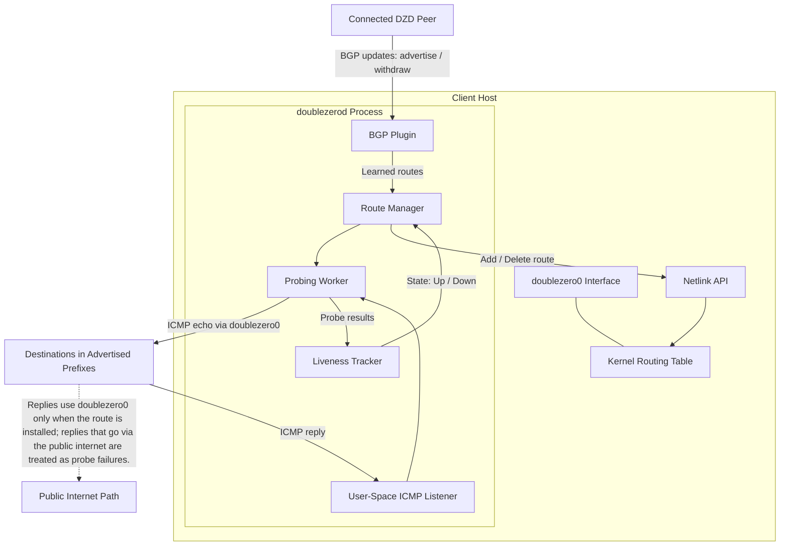
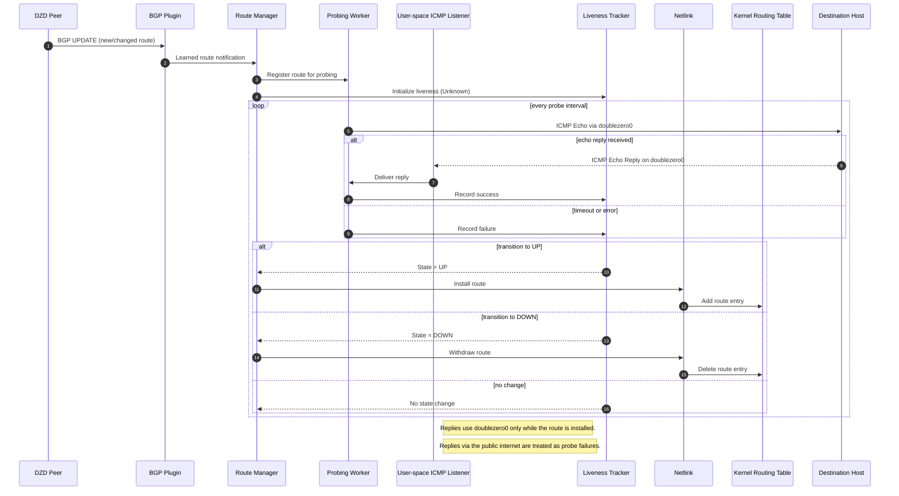

# DoubleZero Client Route Liveness Probing

## Summary

This proposal introduces **Route Liveness Probing** to the `doublezerod` client daemon.

The goal is to enable active data-plane validation of BGP-learned routes from DoubleZero Devices (DZDs), ensuring that only reachable routes are installed in the local kernel routing table.

Each route is periodically probed via ICMP echo requests, and transitions between `UP` and `DOWN` states according to a hysteresis-based policy. Routes marked `UP` are installed in the kernel routing table; routes marked `DOWN` are removed from the kernel routing table until they recover.

The feature will initially be available only for the IBRL service type (unicast without allocated IP), where fallback reachability over the public internet path is available.

## Motivation

Currently, routes learned from DZDs over BGP are installed unconditionally. If a DZD or its tunnel fails while the BGP session remains established, these routes can remain in the kernel routing table even when traffic is no longer deliverable — leading to silent blackholing until standard BGP timers expire or manual intervention occurs.

Introducing route liveness probing provides an independent, data-plane-based signal of reachability. This allows `doublezerod` to locally suppress failed routes without disturbing control-plane stability.

It improves operational reliability, reduces convergence time after partial failures, and aligns with the goal of making the DoubleZero client resilient to asymmetric or silent path failures.

## New Terminology

- **Route Liveness Probe** — A periodic ICMP echo request sent by the client to verify that traffic can reach a given BGP-learned destination.
- **Liveness State** — The local classification of a route as `Unknown`, `Up`, or `Down`, based on recent probe outcomes.
- **Liveness Policy** — The decision logic (hysteresis-based) that determines when to transition between states, using configurable thresholds for consecutive successes or failures.
- **Probing Worker** — The component that executes probes on a fixed interval and reports results to the policy tracker.
- **User-Space ICMP Listener** — A lightweight responder on `doublezero0` that sends echo replies via `doublezero0` even when the route isn’t in the kernel table (where the kernel ICMP stack would otherwise return the reply over the public internet).
- **Probing Subsystem** — The overall module within `doublezerod` that coordinates probing, evaluation, and route installation/withdrawal.

## Alternatives Considered

### Passive Monitoring (existing `doublezero-monitor-tool`)

A passive approach could infer route health from forwarding statistics such as `nftables` or kernel FIB counters. However, it cannot distinguish between an idle route and an unreachable one and provides no proactive assurance of data-plane reachability. Detection is reactive and only occurs once user traffic has already been impacted.

### BGP-Only (current in-client behavior)

Relying solely on BGP session state and withdrawals, as done today, limits detection to control-plane failures. It cannot detect partial or asymmetric data-plane failures where the session remains established but forwarding has stopped, leading to silent blackholing until standard hold timers expire.

### Active Liveness Probing via TWAMP

TWAMP would provide a standards-based active probing mechanism but requires reflector support on the remote side and coordinated upgrades across all participating devices. Because existing clients already support kernel-space ICMP responders, ICMP-based probing can be deployed incrementally without disrupting reachability between mixed-version peers.

### Active Liveness Probing via ICMP (selected)

ICMP echo probing was selected for its simplicity, universality, and backward-compatible deployment. It leverages existing ICMP handling paths, requires no additional coordination between clients, and provides a reliable binary reachability signal suitable for gating route installation.

## Detailed Design

### Integration Context

The probing subsystem integrates with the existing **BGP plugin** in `doublezerod`. Each service type (IBRL, IBRL with allocated IP, multicast) can declare whether route probing is active. In this proposal, probing is **enabled only for IBRL (without allocated IP)** mode.

System context diagram

```mermaid
graph TB
  DZD[Connected DZD Peer]
  DESTS[Destinations in Advertised Prefixes]
  INTERNET[Public Internet Path]

  subgraph CLIENT[Client Host]
    DZIF[doublezero0 Interface]

    subgraph DZD_PROC[doublezerod Process]
      BGP[BGP Plugin]
      RM[Route Manager]
      PW[Probing Worker]
      LT[Liveness Tracker]
      UL[User-Space ICMP Listener]
    end

    NL[Netlink API]
    KRT[Kernel Routing Table]
  end

  %% Control Plane
  DZD -->|BGP updates: advertise / withdraw| BGP
  BGP -->|Learned routes| RM

  %% Probing Workflow
  RM --> PW
  PW -->|ICMP echo via doublezero0| DESTS
  DESTS -->|ICMP reply| UL
  UL --> PW
  PW -->|Probe results| LT
  LT -->|State: Up / Down| RM

  %% Routing Integration
  RM -->|Add / Delete route| NL
  NL --> KRT
  DZIF --- KRT

  %% Reply Path Note
  DESTS -. "Replies use doublezero0 only when the route is installed; replies that go via the public internet are treated as probe failures." .-> INTERNET
```

Workflow sequence diagram

```mermaid
sequenceDiagram
  autonumber
  participant DZD as DZD Peer
  participant BGP as BGP Plugin
  participant RM as Route Manager
  participant PW as Probing Worker
  participant UL as User-space ICMP Listener
  participant LT as Liveness Tracker
  participant NL as Netlink
  participant KRT as Kernel Routing Table
  participant DST as Destination Host

  DZD->>BGP: BGP UPDATE (new/changed route)
  BGP->>RM: Learned route notification
  RM->>PW: Register route for probing
  RM->>LT: Initialize liveness (Unknown)

  loop every probe interval
    PW->>DST: ICMP Echo via doublezero0
    alt echo reply received
      DST-->>UL: ICMP Echo Reply on doublezero0
      UL->>PW: Deliver reply
      PW->>LT: Record success
    else timeout or error
      PW->>LT: Record failure
    end

    alt transition to UP
      LT-->>RM: State = UP
      RM->>NL: Install route
      NL->>KRT: Add route entry
    else transition to DOWN
      LT-->>RM: State = DOWN
      RM->>NL: Withdraw route
      NL->>KRT: Delete route entry
    else no change
      LT-->>RM: No state change
    end
  end

  Note right of UL: Replies use doublezero0 only while the route is installed.
  Note right of UL: Replies via the public internet are treated as probe failures.
```

### Workflow

1. **Route Announcement**

    When a new route is learned via BGP, it is registered with the route manager, which initializes its liveness state to `Unknown`.

2. **Probing**

    The probing worker periodically sends ICMP echo requests toward each destination.

    - Echo replies are handled by the **user-space ICMP listener** bound to `doublezero0`.
    - This listener ensures replies return over the overlay interface, since the kernel’s ICMP stack would otherwise send them over the public internet when the route isn’t installed.

3. **Liveness Evaluation**

    Results are fed into the liveness policy tracker:

    - Consecutive successes above a threshold transition the route to `Up`.
    - Consecutive failures above a threshold transition it to `Down`.
    - Intermediate results cause no state change.

4. **Routing Synchronization**

    The route manager reflects state changes into the kernel routing table:

    - Routes marked `Up` are installed.
    - Routes marked `Down` are withdrawn.
    - BGP session state is unaffected.

### Configuration Parameters

| Parameter | Description | Default |
| --- | --- | --- |
| `--route-probing-enable` | Enables the probing subsystem | disabled |
| `--route-probing-interval` | Probe interval per route | 1s |
| `--route-probing-timeout` | Timeout per probe | 1s |
| `--route-probing-up-threshold` | Consecutive successes to mark route `Up` | 3 |
| `--route-probing-down-threshold` | Consecutive failures to mark route `Down` | 3 |

### Policy Design

The initial liveness policy is **hysteresis-based**, trading responsiveness for stability.

The policy layer is designed to be pluggable, enabling future replacement with alternative evaluation strategies such as EWMA-based smoothing, weighted failure scoring, or adaptive thresholds that respond to observed probe variance.

## Failure Scenarios

### Probing Subsystem Failure

If the probing subsystem crashes, deadlocks, or encounters runtime errors (e.g., socket exhaustion), route liveness state stops updating. Routes remain in their last known state — either `UP` or `DOWN` — until the subsystem recovers. This may temporarily cause stale routes to remain installed or withdrawn, but forwarding continuity is preserved.

### ICMP Unavailability on Destination Clients

If a destination DoubleZero client disables ICMP handling or filters echo replies, its peers will mark the associated routes as `DOWN` and withdraw them from their local routing tables. Traffic to that destination will then be sent via the public internet path instead of the `doublezero0` interface. This behavior preserves reachability but bypasses the DoubleZero overlay until the client resumes responding to ICMP.

### Transient Misclassification

ICMP rate limiting, temporary congestion, or asymmetric paths can cause sporadic probe failures and transient misclassification of route state. The hysteresis policy mitigates short-lived noise by requiring consecutive failures or recoveries before transition, but overly aggressive thresholds could still cause unnecessary route churn.

### Resource Exhaustion

In deployments with many routes, the probing loop may open a large number of concurrent ICMP sessions or consume excessive file descriptors. Concurrency limits and probe scheduling mitigate this risk, but misconfiguration or extreme churn could still degrade performance.

## Impact

### Operational Reliability

Ensures that only verifiably reachable routes remain active, preventing blackholes caused by stale BGP state.

### Convergence

Enables faster local convergence following data-plane failures, without affecting BGP session timers or advertisements.

### Resource Usage

Adds lightweight background ICMP traffic and minimal CPU overhead; concurrency and rate limits ensure scalability with large route tables.

### Observability

Exposes route state transitions via logs and metrics, providing operators with visibility into data-plane reachability.

## Security Considerations

The route liveness probing subsystem does not materially alter DoubleZero’s trust or threat model. It operates entirely within the client’s existing control and data plane, using ICMP echo requests to destinations learned through the trusted DZD control plane.

Probes are sent only toward prefixes advertised by connected DZDs, so there is no risk of arbitrary or unscoped network scanning. Probe frequency and concurrency are bounded to prevent overload or amplification. Responses are handled either by the `doublezerod` process (when the user-space ICMP listener is running) or by the kernel’s ICMP stack on remote peers running earlier versions.

The feature introduces no new externally reachable services or credentials, and ICMP payloads contain no sensitive information. The primary operational consideration is that ICMP must be permitted between peers for liveness detection to function accurately.

## Backward Compatibility

Route liveness probing is designed to be **interoperable across mixed client versions**, ensuring that enabling it does not break communication between upgraded and non-upgraded peers.

### Compatibility Matrix

- **Probing enabled on source only:**

    If the destination’s route is installed in its kernel table, ICMP replies return over `doublezero0` and the probe can succeed. If the destination’s route is not installed (e.g., tunnel down), its kernel will return the reply via the public internet path; the source treats that as a probe failure.

- **Probing enabled on both source and destination:**

    Both clients use the DoubleZero user-space ICMP listener to exchange echo replies over the `doublezero0` interface, even when the route is not installed in the kernel table. This ensures accurate overlay-level reachability and preserves end-to-end validation within the DoubleZero fabric.

- **Probing disabled on both sides:**

    Behavior remains unchanged from current deployments—routes are installed and withdrawn solely based on BGP control-plane updates.

### Deployment Considerations

Initial testing indicates that **approximately 7% of existing clients do not currently respond to ICMP probes**.

These clients will appear unreachable to peers performing liveness probing, even though routing and forwarding may still function correctly over the control plane.

To ensure consistent behavior, the **first phase of rollout** should focus on enabling ICMP responsiveness across all clients, regardless of whether route probing itself is enabled.

Once universal ICMP handling is confirmed, **subsequent upgrades** can enable route probing selectively or by default.

During this transition:

- **Mixed environments remain compatible**, as unupgraded peers still respond via their kernel-space ICMP stack when their routes are installed.
- **When overlay ICMP is unavailable on the destination**, replies will return over the public internet rather than `doublezero0`, and are treated as probe failures.
- **Full overlay-level reachability validation over `doublezero0`** becomes reliable once all clients are ICMP-responsive.

## Open Questions

- **Liveness Policy** — Is the current hysteresis approach good enough, or do we need something smoother like an EWMA or loss-weighted model to better handle intermittent loss and jitter?
- **Thresholds & Convergence** — What probe interval and success/failure counts give us fast enough convergence without spamming probes or creating churn?
- **Route Weighting** — Should all routes count the same, or should liveness results be weighted by stake or reputation (like `doublezero-monitor-tool`)?
- **Probe Concurrency** — With lots of routes, how many probes can safely run at once, and do we need a global rate cap?
- **Visibility & Monitoring** — How do we detect and debug flapping or systemic probe loss across clients? Should we collect telemetry or metrics from all clients to build an aggregate view of reachability and probe health?
- **ICMP Reachability Rollout** — About 7% of clients don’t currently answer ICMP. What’s “good enough” coverage before we can safely make probing default?
