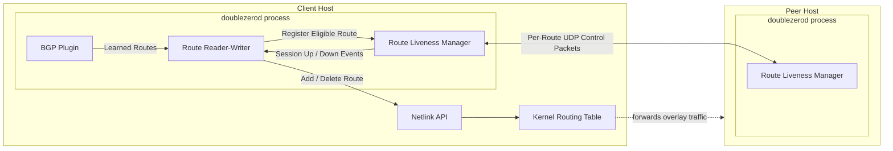
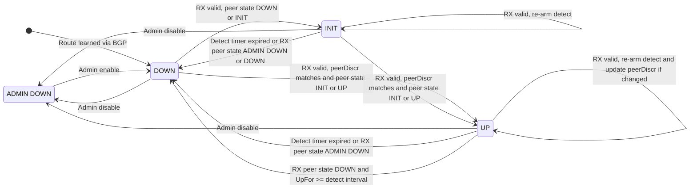
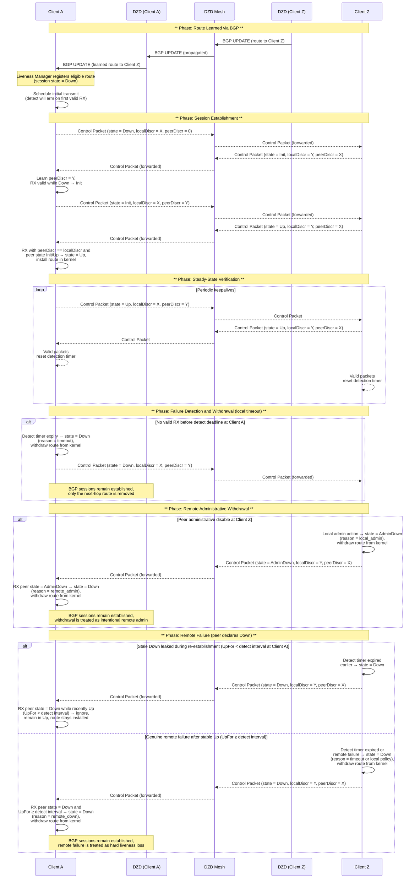

# DoubleZero Client Route Liveness

**Status: Approved**

## Summary

This document proposes a per-route liveness protocol for DoubleZero clients that verifies data-plane reachability rather than relying solely on BGP session state. Each client maintains a lightweight, bidirectional UDP exchange with its peer for every eligible route, using fixed-size control packets to confirm packet flow in both directions.

When a session confirms bidirectional reachability, its route transitions to `Up` and is installed in the kernel routing table. If no valid control packets are received before the detection timer expires, the session transitions to `Down`, and the route is withdrawn locally while the BGP session remains established.

The protocol draws inspiration from Bidirectional Forwarding Detection (BFD, [RFC 5880](https://datatracker.ietf.org/doc/html/rfc5880)) but is adapted for DoubleZero’s overlay model. It enables rapid fault detection through symmetric, lightweight exchanges and operates out-of-band from BGP while integrating with BGP-learned routes, requiring no changes to BGP timers or control-plane signaling.

The initial deployment targets IBRL mode (unicast without allocated IP addresses), where the client’s DoubleZero IP is the same as its public IP, and so, in this mode, traffic automatically uses the public Internet when the overlay route is absent from the kernel routing table.

## Motivation

Currently, BGP-learned routes from DoubleZero clients are installed unconditionally. If a client or its tunnel fails while the BGP session remains established, the kernel can continue forwarding traffic into an unreachable path, causing silent blackholing until control-plane timers or manual intervention remove the routes.

BGP routes derived from onchain state are propagated to clients by DoubleZero Devices (DZDs). While this confirms control-plane reachability, it does not ensure that packets actually flow between peers through the data path. As a result, data-plane faults such as unidirectional or asymmetric link failures, incorrect routing, or transient congestion can leave routes installed even when traffic is undeliverable.

Per-route Liveness Sessions close this gap by continuously validating bidirectional reachability at the data-plane level. Routes remain installed only while their sessions confirm two-way packet flow and are withdrawn immediately when detection fails. This enables rapid convergence, prevents prolonged forwarding to unreachable peers, and improves the reliability of the DoubleZero network.

## New Terminology

- **Control Packet** — Fixed-length UDP datagram containing the sender’s session state, discriminators, and timing parameters.
- **Liveness Session** — Per-route, bidirectional relationship that validates reachability between two peers using control packets.
- **Session State** — Lifecycle of a Liveness Session: `Down`, `Init`, `Up`, or `AdminDown`.
- **Discriminators** — Random 32-bit identifiers that uniquely identify a session instance and allow peers to detect restarts.
- **Transmit Interval** — Minimum spacing between consecutive outbound control packets.
- **Detect Multiplier** — Number of missed receive intervals tolerated before declaring failure.
- **Detection Time** — Maximum time without receiving a valid packet before declaring the session `Down`; calculated as `DetectMult × max(peer_desired_tx, local_required_rx)`.
- **Session Binding** — Requirement that packets for a session arrive on the expected `(interface, local address, peer address)` path.
- **Liveness Manager** — Component that owns the UDP socket, session registry, and protocol coordination.
- **Liveness Scheduler** — Timer subsystem that drives transmit and detection events across all sessions.
- **Liveness Receiver** — Handler that processes inbound control packets and updates the corresponding session state.

## Alternatives Considered

- Rely solely on BGP session state
- Sidecar monitor tool (e.g. `doublezero_monitor` from Anza)
- Passive forwarding statistics (kernel or nftables counters)
- ICMP echo-based probing
- UDP-based bidirectional protocol (selected)

## Detailed Design

### Architecture

Each DoubleZero client maintains one UDP socket on 44880, multiplexing all per-route Liveness Sessions.

When an eligible route is learned, the Liveness Manager (LM) creates a session in `Down`, assigns a random local discriminator, and arms transmit/detect timers. Sessions are symmetric—both peers send fixed-size control packets over the bound path `(interface, local address, peer address)`.

A route is installed when its session enters `Up`, and withdrawn locally on `Down`. BGP remains established. State changes flow LM → Route Reader-Writer (RRW) → Netlink.



### State Machine

States: `AdminDown`, `Down`, `Init`, `Up`.

- **AdminDown**

    Operator-disabled; advertise unavailable.

    - `AdminDown → Down`: session re-enabled.
- **Down**

    Initial or failed state; remain here when first enabled, on detection timeout, or when peer is `AdminDown`.

    - `Down → Init`: valid packet with peer `Down` or `Init`.
    - `Down → Up`: valid packet, matching `peerDiscr`, peer `Init` or `Up`.
    - `Down → AdminDown`: local disable.
- **Init**

    Peer reachable; handshake in progress.

    - `Init → Up`: peer `Init` or `Up`.
    - `Init → Down`: detection timeout or peer `Down`/`AdminDown`.
    - `Init → AdminDown`: local disable.
- **Up**

    Session established; timers enforce fast liveness.

    - `Up → Down`: detection timeout; or peer `AdminDown`; or peer `Down` after ≥1 detect interval in Up (earlier `Down` is ignored as stale during re-establishment).
    - `Up → AdminDown`: local disable.
    - No `Up → Init`: peer `Init` is treated as failure (→ `Down`).



### Session Lifecycle

- Learn route → create session in `Down`, schedule TX.
- First valid RX → `Init` (learn `peerDisc`).
- RX with `peerDisc` matching ours and peer state `Init`/`Up` → `Up`, install route.
- Valid RX in `Init`/`Up` → refresh detect timer.
- Detect timeout → `Down`, withdraw route, send one `Down`, enter TX backoff.
- RX peer `Down` only after being `Up` ≥ one detect interval → treat as valid failure → `Down` + withdraw route.

    (Earlier peer-Down during re-establishment is ignored as stale.)

- Local admin disable → `AdminDown` (suppress detect, advertise AdminDown).
- RX peer `AdminDown` → `Down`, withdraw route (intentional remote disable).

<details open>

<summary>Sequence diagram</summary>



</details>

### Message Format

Control packets are fixed-length 40-byte UDP datagrams (network byte order):

```
 0                   1                   2                   3
 0 1 2 3 4 5 6 7 8 9 0 1 2 3 4 5 6 7 8 9 0 1 2 3 4 5 6 7 8 9 0 1
+-+-+-+-+-+-+-+-+-+-+-+-+-+-+-+-+-+-+-+-+-+-+-+-+-+-+-+-+-+-+-+-+
| Ver(3)|0|State(2)|0|       DetectMult       |     Length      |
+-+-+-+-+-+-+-+-+-+-+-+-+-+-+-+-+-+-+-+-+-+-+-+-+-+-+-+-+-+-+-+-+
|                       Local Discriminator                     |
+-+-+-+-+-+-+-+-+-+-+-+-+-+-+-+-+-+-+-+-+-+-+-+-+-+-+-+-+-+-+-+-+
|                       Peer  Discriminator                     |
+-+-+-+-+-+-+-+-+-+-+-+-+-+-+-+-+-+-+-+-+-+-+-+-+-+-+-+-+-+-+-+-+
|              Desired Minimum TX Interval (µs)                 |
+-+-+-+-+-+-+-+-+-+-+-+-+-+-+-+-+-+-+-+-+-+-+-+-+-+-+-+-+-+-+-+-+
|              Required Minimum RX Interval (µs)                |
+-+-+-+-+-+-+-+-+-+-+-+-+-+-+-+-+-+-+-+-+-+-+-+-+-+-+-+-+-+-+-+-+
|                        Reserved (zero)                        |
|                           20 bytes                            |
+-+-+-+-+-+-+-+-+-+-+-+-+-+-+-+-+-+-+-+-+-+-+-+-+-+-+-+-+-+-+-+-+
```

| Field | Size | Description |
| --- | --- | --- |
| Version | 3 bits | Protocol version; current `1`. |
| State | 2 bits | `AdminDown`/`Down`/`Init`/`Up`. |
| Detect Mult | 8 bits | Missed-RX intervals tolerated. |
| Length | 8 bits | Fixed `40`. |
| Local Discriminator | 32 bits | Sender-chosen, non-zero. |
| Peer Discriminator | 32 bits | Last learned peer disc or `0`. |
| Desired Min TX Interval | 32 bits | Sender’s min TX cadence (µs). |
| Required Min RX Interval | 32 bits | Sender’s min RX capability (µs). |
| Reserved | 160 bits | Zero; ignored on RX. |

**Receive processing (normative):**

1. Drop if `len≠40`, `ver≠1`, `DetectMult==0`, or reserved bits non-zero.
2. Enforce session binding: packet must arrive on expected `(iface, localIP, peerIP)` and port 44880; otherwise drop.
3. Clamp timing values to local bounds.
4. Update peer parameters; if `peerDisc == myLocalDisc`, session is eligible for `Up`.

**Version handling:** unsupported versions are treated as invalid and dropped.

### Timer Semantics

Two monotonic timers per session.

| Timer | Definition | On Expiry |
| --- | --- | --- |
| **Transmit** | `max(local_desired_tx, peer_required_rx)` | Send control packet |
| **Detect** | `DetectMult × max(peer_desired_tx, local_required_rx)` | Transition `Down`, withdraw route |

Each side advertises its own Desired Minimum TX Interval and Required Minimum RX Interval to inform peer pacing and detection timing. These values are advisory, not negotiated, and are clamped within locally configured bounds.

After `Down`, TX uses exponential backoff with randomized jitter to avoid synchronization. Implementations SHOULD cap backoff and resume normal cadence on first valid RX.

### Routing Integration

| State | Kernel Action |
| --- | --- |
| `Up` | Install route |
| `Init`, `Down` | Withdraw route |
| `AdminDown` | Suppress route regardless of peer |

Sessions are created/removed by dynamic route events; restoration is immediate on `Up`, bounded by detection timing—not BGP hold timers.

## Observability

### Metrics

The client daemon MUST expose metrics at the endpoint `/metrics` in Prometheus text format.

The following metrics MUST be present:

| Name | Type | Labels | Meaning |
| --- | --- | --- | --- |
| `doublezero_liveness_sessions` | gauge | `iface`, `local_ip`, `state` | Current number of sessions by FSM state (`admin_down`, `down`, `init`, `up`). |
| `doublezero_liveness_session_transitions_total` | counter | `iface`, `local_ip`, `from`, `to`, `reason` | Count of session state transitions by from (state), to (state), and reason (`detect_timeout`, `rx_down`, `admin_down`). |
| `doublezero_liveness_routes_installed` | gauge | `iface`, `local_ip` | Number of routes currently installed by the liveness process. |
| `doublezero_liveness_route_installs_total` | counter | `iface`, `local_ip` | Total route add operations performed in the kernel. |
| `doublezero_liveness_route_withdraws_total` | counter | `iface`, `local_ip` | Total route delete operations performed in the kernel. |
| `doublezero_liveness_convergence_to_up_seconds` | histogram | `iface`, `local_ip` | Time from the first successful control message while `down` until transition to `up` (includes detect threshold, scheduler delay, and kernel install). |
| `doublezero_liveness_convergence_to_down_seconds` | histogram | `iface`, `local_ip` | Time from the first failed or missing control message while `up` until transition to `down` (includes detect expiry, scheduler delay, and kernel delete). |

The following metrics SHOULD be exposed, but as opt-in due to high cardinality:

| Name | Type | Labels | Meaning |
| --- | --- | --- | --- |
| `doublezero_liveness_peer_sessions` | gauge | `iface`, `local_ip`, `peer_ip`, `state` | Current number of sessions by peer and FSM state (`admin_down`, `down`, `init`, `up`). |
| `doublezero_liveness_peer_session_detect_time_seconds` | gauge | `iface`, `local_ip`, `peer_ip` | Current detect time by session (after clamping with peer value). |

The following metrics SHOULD be exposed:

| Name | Type | Labels | Meaning |
| --- | --- | --- | --- |
| `doublezero_liveness_scheduler_queue_len` | gauge | `iface`, `local_ip` | Current number of pending events in the scheduler queue. |
| `doublezero_liveness_handle_rx_duration_seconds` | histogram | `iface`, `local_ip` | Distribution of time to handle a valid received packet. |
| `doublezero_liveness_control_packets_tx_total` | counter | `iface`, `local_ip` | Total control packets sent. |
| `doublezero_liveness_control_packets_rx_total` | counter | `iface`, `local_ip` | Total control packets received. |
| `doublezero_liveness_control_packets_rx_invalid_total` | counter | `iface`, `local_ip`, `reason` | Invalid control packets received (e.g. `short`, `bad_version`, `bad_len`, `parse_error`, `not_ipv4`, `reserved_nonzero`). |
| `doublezero_liveness_unknown_peer_packets_total` | counter | `iface`, `local_ip` | Packets received that didn’t match any known session. |
| `doublezero_liveness_io_errors_total` | counter | `iface`, `local_ip`, `op` | Count of non-timeout I/O errors (`read`, `write`, `set_deadline`). |

### API

The client daemon MUST expose an API endpoint `/routes` as follows:

```
$ curl --unix-socket /var/run/doublezerod/doublezerod.sock http://localhost/routes

[
  {
    "user_type": "IBRL",
    "network": "devnet",
    "local_ip": "9.169.90.110",
    "peer_ip": "203.0.113.42",
    "rt_status": "present",
    "liveness_status": "down",
    "liveness_last_updated": "2025-11-08T12:34:56Z"
  },
  {
    "user_type": "IBRL",
    "network": "devnet",
    "local_ip": "9.169.90.110",
    "peer_ip": "192.0.2.5",
    "rt_status": "absent",
    "liveness_status": "up",
    "liveness_last_updated": "2025-11-08T12:34:56Z"
  }
]
```

### CLI

The client CLI MUST expose per-route liveness status using the daemon API:

```
$ doublezero status --routes

User Type Local IP       Peer IP        RT Status Liveness Status Network Liveness Last Updated
--------- -------------- -------------- --------- --------------- ------- ---------------------
IBRL      9.169.90.110   203.0.113.42   absent    down            devnet  2025-11-08T12:00:00Z
IBRL      9.169.90.110   198.51.100.14  absent    down            devnet  2025-11-08T12:00:00Z
IBRL      9.169.90.110   192.0.2.18     present   up              devnet  2025-11-08T12:00:00Z
IBRL      9.169.90.110   198.51.100.8   present   up              devnet  2025-11-08T12:00:00Z
IBRL      9.169.90.110   203.0.113.7    present   up              devnet  2025-11-08T12:00:00Z
IBRL      9.169.90.110   198.51.100.2   present   up              devnet  2025-11-08T12:00:00Z
IBRL      9.169.90.110   192.0.2.5      present   up              devnet  2025-11-08T12:00:00Z
```

## Impact

- **Control-plane load**

    Each active session transmits a fixed 40-byte control packet per *Transmit Interval* (typically 100 ms – 1 s).

    Aggregate rate: `Rate_tx = N / TxInterval`.

    Example: 1 000 sessions × 200 ms ≈ 5 000 pps (~120 kbit/s including UDP + IP headers).

    Even 10 000 sessions × 1 s stay under 400 kB/s per direction.

    Receive processing cost scales linearly with session count and mirrors transmit rate.

- **Timer scheduling**

    All sessions share a single priority queue; no per-session threads.

    Wakeups are coalesced into batches to reduce jitter and system-call load.

    Typical timer density (1–10 k timers/s) easily fits within event-loop granularity.

    Detection timers use monotonic clocks and remain unaffected by NTP or wall-clock adjustments.

- **Memory and CPU footprint**

    Each session maintains ≈ 64 B of state (discriminators, timers, peer parameters).

    At 10 000 sessions, memory use is < 1 MB.

    All sessions share a single UDP socket; no per-session sockets.

    Packet handling has constant computational cost due to fixed-length parsing.

- **Failure detection parameters**

    Operators tune *Transmit Interval* and *Detect Multiplier* to trade off detection speed versus false positives.

    Conservative values handle transient congestion; aggressive values shorten fault detection.

    Overall resource footprint remains small, linear, and predictable at scale.


## Failure Scenarios

- **Peer restart**

    A peer restart resets its discriminator. The local side MUST detect this change within one transmit interval plus one round-trip time, transition to `Init`, and reconverge to `Up`. No manual intervention is required.

- **Local process restart**

    On restart, sessions MUST be reinitialized as BGP routes are re-learned. Each re-learned route MUST trigger a new discriminator assignment and session establishment. Recovery SHOULD complete within one transmit interval plus one RTT under normal network conditions.

- **Data-plane loss or congestion**

    If no valid control packet is received before the detection deadline (`DetectMult × RX interval`), the session MUST transition to `Down` and withdraw the corresponding route. When valid control packets resume, the session SHOULD automatically transition back to `Up` once bidirectional reachability is confirmed.

- **Unidirectional or asymmetric failure**

    Bidirectional reachability is required; one-way loss MUST cause a transition to `Down` to prevent blackholing during asymmetric faults.

- **Burst loss tolerance**

    Implementations SHOULD tolerate short loss bursts using the detection multiplier (typically ≥ 3, as in BFD) to avoid unnecessary transitions under transient loss.

- **Network partition or prolonged unreachability**

    When no control packets are received for the full detection window, the session MUST remain `Down` until valid traffic resumes. Recovery SHOULD occur automatically once connectivity is restored.

- **Large-scale or synchronized outages**

    After transitioning to `Down`, transmit scheduling SHOULD apply exponential backoff (bounded by configuration) and randomized jitter. Implementations MUST ensure that control-plane load remains bounded under widespread failures and SHOULD minimize synchronized recovery during convergence.


## Security Considerations

- **Attack surface and trust model**

    The protocol exposes a single UDP listener on port 44880 shared by all sessions. Each client transmits and receives fixed-size control packets at a fixed cadence; there is no request–response amplification vector.

    Peer authenticity depends on pre-provisioned BGP or controller configuration. No in-band authentication or encryption is performed. A malicious or misconfigured peer can only affect its own session state; it cannot influence other routes or global behavior.

- **Source validation and binding**

    Incoming packets MUST be accepted only if their `(local IP, peer IP, interface)` triple matches a known route bound to an active session.

    Packets received on unexpected interfaces, addresses, or ports **MUST** be silently discarded. This prevents off-path spoofing and enforces strict data-plane symmetry between transmit and receive paths.

- **Input validation and robustness**

    All packet fields MUST be validated before use:

    - `Version == 1`, `Length == 40`
    - `DetectMult > 0` and within local limits
    - Transmit and receive intervals within configured bounds
    - Reserved bits = 0 (non-zero → drop)

    Invalid or malformed packets MUST be discarded without any state change.

    Implementations SHOULD suppress excessive logging of repeated invalid inputs to avoid log flooding.

- **Traffic and amplification control**

    The protocol is symmetric: each host transmits at its own configured rate regardless of inbound traffic volume.

    Message size is constant, and no replies are generated for unrecognized sources, eliminating reflection and amplification risks.

- **Rate limiting and fairness**

    Implementations SHOULD apply lightweight per-source and aggregate rate limiting (e.g., token buckets) to bound inbound processing load.

    Aggregate receive caps SHOULD protect event-loop latency. Dropped packets MAY be counted for diagnostics but SHOULD NOT be logged individually.

- **Resource bounding and DoS containment**

    Sessions MUST be created only through explicit local registration; inbound traffic MUST NOT instantiate new state.

    All memory, file descriptors, and timers MUST be bounded by configuration.

    Packet parsing MUST use fixed-size structures and constant-time operations with no dynamic allocation. Even under flood conditions, CPU and memory consumption MUST scale linearly with configured session count.


## Backward Compatibility

Deployment occurs in two phases so users can upgrade clients independently while maintaining stable interoperability.

### Phase 1 — Passive Liveness

- Clients fully run the protocol—sending and receiving control packets and maintaining session state—but do not let the protocol itself control route installation or withdrawal.
- Users are expected to open the UDP port used by the liveness protocol so upgraded peers can exchange control traffic, verify session establishment, and be ready to participate once route management is activated in Phase 2.
- The liveness subsystem is expected to be feature-complete in this phase, including the specified observability mechanisms (`doublezero status --routes`).
- This phase validates protocol behavior and network reachability under real conditions.
- All clients should reach this phase before any enable active mode, unless they accept that routes toward legacy clients will be withdrawn.

### Phase 2 — Active Liveness

- Clients now actively manage routes in the kernel routing table as part of the liveness protocol lifecycle.
- Participation begins as opt-in, allowing developers and early adopters to validate route management under real network conditions while others remain in passive mode.
- Clients that have not opened the liveness protocol UDP port by this stage will be treated as unreachable by peers in active mode, which will withdraw routes toward them based on liveness state.
- The long-term objective is full adoption of *Active Liveness* once stability and convergence are demonstrated in production.

### Compatibility

Clients operating in different modes interact as follows:

- **Active ↔ Active:** Normal bidirectional operation; both peers manage routes through the liveness protocol.
- **Active ↔ Passive:** Control packets are exchanged; only the active peer modifies routes based on session state. The passive peer continues to update its routing table through existing mechanisms (e.g., BGP), independent of the liveness protocol.
- **Active ↔ Legacy:** Legacy peers ignore the protocol; active peers mark sessions `Down` and withdraw the associated routes.
- **Passive ↔ Passive / Passive ↔ Legacy:** Routing proceeds through normal mechanisms, unaffected by the liveness protocol. The routing table continues to change as usual, but never in response to liveness-derived state.

Once all clients support *Passive Liveness* and have opened the liveness UDP port, users can safely enable *Active Liveness* without causing unreachable paths or asymmetric routing toward legacy peers.

## Open Questions

- **Per-route configuration**
    - Should users be able to override liveness settings (e.g., transmit interval, detection multiplier) for specific routes or disable liveness on specific routes?
- **Scalability and rate limiting**
    - How should global transmit-rate limits (e.g., packets per second or bits per second) be applied to bound network load at scale?
    - How should per-peer or global pacing interact with existing jitter and backoff to smooth bursts without unnecessarily delaying fault detection?
    - How should the system balance stability and bounded overhead against faster fault detection and route convergence under constrained rate budgets?
