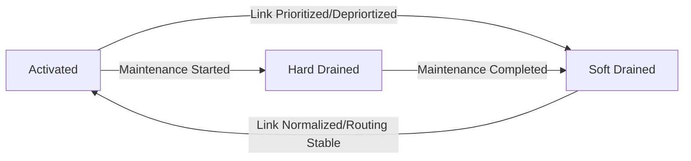
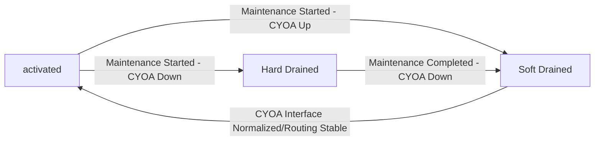
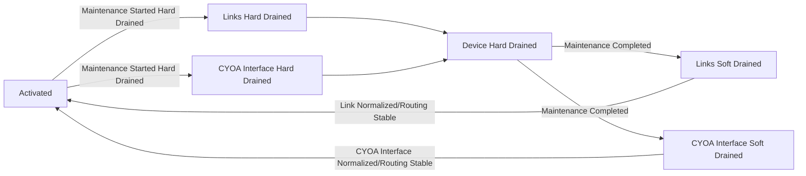
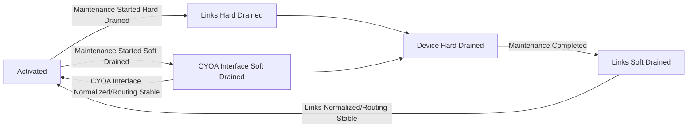

# Network Draining

## Summary

A frequent requirement of operating a physical network is the ability to remove a device (DZD) or link from being an active part of the network topology.  This is often referred to a draining, where traffic is rerouted to alternative options or, in the case of provisioning, prevented from being actively used until formally declared Ready for Service (RFS).
 
The goal of this RFC is to define the use-cases and mechanisms for draining one or more links on a DZD, including all links which would render the DZD fully drained.

Scenarios (workflows) where draining is used include:

* Provisioning a new DZD
* Provisioning a new link
* Scheduling maintenance activities
* Managing operational outages

## Motivation

It is critical that contributors have operational levers to manage the health of the network, particularly in relation to the scenarios outlined in the Summary section. For a blockchain project such as DZ, the goal must be to express this on a smart-contract, with automation to realize the desired intent. 

The existing tools that are available to achieve the equivalent of a draining status are described in table 1 below.

| Area                  | Options              | Owner                       | Description |
|------------------------|----------------------------|------------------------------|------------------------------|
| WAN Link |  1. Set delay on smart-contract to a high value i.e. 1000ms   2. Shutdown WAN interface(s)  | 1. Contributor or DZF   2. Contributor     | 1: Will migrate traffic to an alternative link only if available (soft draining).  Will not migrate traffic if link is only path on the network.   2: Will force link offline  (hard draining).  Will reroute traffic to alternative if available.  Users will fall back to Internet if no alternatives are available.
| DZX Link | 1. Set delay on smart-contract to a high value i.e. 1000ms   2. Shutdown WAN interface(s)      | 1. A-side contributor or DZF   2. A-side or Z-side contributor    | 1: Will migrate traffic to an alternative link only if available (soft draining). Will not migrate traffic if link is only path on the network   2: Will force link offline (hard draining).  Will reroute traffic to alternative if available.  Users will fall back to Internet if no alternatives are available.
| CYOA Link (if one) | 1.1 Set `max-users = 0` on smart-contract for the DZD   1.2 User delete   2. Shutdown CYOA interface  | 1.1 Contributor or DZF   1.2 DZF only.   2. Contributor     | 1: No new users can connect.  Existing users are forced off of DZ.
| CYOA Link (more than one) | 1.1 Set `max-users = 0` on smart-contract for the DZD   1.2 User delete   2. Shutdown one or more CYOA interfaces    | 1.1 Contributor or DZF   1.2 DZF only   2. Contributor    | 1: No new users can connect. Existing users are forced off of DZ. All CYOA links affected (may not be intent).   2. Contributor can shutdown targeted selection of CYOA interfaces.  Users may still be able to connect if DZD `public_ip` is not bound to interface that is shutdown.
| DZD | 1.1 Set delay for all WAN and DZX links on smart-contract to a high value i.e. 1000ms   1.2 Set `max-users = 0` on smart-contract for the DZD   1.3 User delete   2. Shutdown all WAN, DZX and CYOA interfaces     | 1.1 Contributor or DZF   1.2 Contributor or DZF   1.3 DZF only   2. Contributor   | 1: No new users can connect. Existing users are forced off of DZ. All CYOA links affected (may not be intent).   2. Contributor can override smart-contract and shutdown all user facing ports. 

Table 1: Existing Draining Options

The processes described in table 1 are fragile for a number of reasons.  Having different owners of different parts of the same workflow requires coordination between a contributor and the DZF, or, in the case of DZX links, between contributors themselves.  It is also not explicit the intent about setting increased link delay values, or setting max-users to 0.  Ultimately, a simple CLI option in the smart-contract that automates the multiple existing steps required with a new drained status helps operationally with ease of execution and the desired state of the network.  Additionally, a drained status can be used to support initial DZD provisioning and protecting the network during maintenance windows and outages.

## New Terminology

* Drained: the state where a DZD or link is removed from the active network topology.  A drained state could be applied to a single link (WAN or DZX), one or more CYOA interfaces, or to a DZD in its entirety
* Draining: the process of moving a link, interface or DZD from activated to drained states
* `edge.status`: field applied to CYOA interface to represent: active/hard_drained/soft_drained
* Hard-drained: a link is removed from routing or a DZD is fully drained of traffic
* Soft-drained: a link IS-IS metric is set to 1,000,000, forcing traffic to use alternative paths only if available.  A soft-drained link will still be used by DZ users if it is the only path between two users
* Undraining: the process that reverses the draining process

## Alternatives Considered

* IS-IS overload bit: 
  * Risk of blackholing traffic 
  * Interaction with Segment Routing currently unknown

## Detailed Design

### WAN Link

* Update `link.status` field to include the following states: 
  * activated (existing):
    * Steady state
    * Available to forward traffic
    * IS-IS metric based on delay
  * hard_drained (new):
    * A link is removed from routing 
    * IS-IS disabled by removing `isis enable 1` on interfaces
    * Use-case: link maintenance or outage without alternatives available
  * soft_drained (new):
    * A link is deprioritized 
    * IS-IS metric is increased to 1,000,000: `isis metric 1000000`
    * Use-case: link maintenance or outage with alternatives (primary and secondary links) available

* Define a new delay_override field as part of the smart-contract definition of a link.
  * Supports an operator-defined mechanism to affect the use of a link
  * More granular control than soft_drained or hard_drained states
  * Is set to 0 by default
  * Is set to 1000 when link in soft_drained state
  * Use-cases: 
    * sets metric for soft_drained state
    * link demoted from primary to secondary link, but is still preferred over tertiary link
* CLI Commands:
  * `doublezero link --pubkey PUBKEY --status [hard_drained|soft_drained|activated]`
  * `doublezero link --pubkey PUBKEY --delay-override-ms [0.01 <= X <= 1000]`

### DZX Link

* Leverage same `link.status`and delay_override fields described in WAN Link section
* Update smart-contract to allow either A-Side or Z-Side contributors to trigger `link.status` transitions

### CYOA Interface

* Define a new `edge.status` field as part of the smart-contract definition of a CYOA interface (CYOA interface concept to be defined).
  * `edge.status` can take on 3 states:
    * active - steady state, available for users to connect via
    * hard_drained:
      * `max-users = 0`
      * a CYOA interface is `shutdown`
      * Use-case: when it is preferred to disable connectivity to ISP e.g. if under a DoS attack
    * soft_drained:
      * `max-users = 0`
      * Existing users are forced to use Internet by filtering all prefixes on eBGP sessions to users at the DZD
      * Use-case: when CYOA has an outage or is unstable
* CLI Commands:
  * `doublezero device interface drain PUBKEY [hard|soft|undrain]`

📝 **Note**  
Draining a CYOA interface temporarily disconnects users, they will reconnect to the same DZD on undraining unless they choose to reconnect to a different DZD during the period when the CYOA interface is drained.

### DZD

* A DZD is drained if all WAN and DZX links, and CYOA interfaces, are drained
  * `link.status`:
    * Each link is set to `hard_drained`
  * `edge.status`: `soft_drained` or `hard_drained`
  * Use-case: when performing configuration changes outside of DZ protocol

## Impact

This RFC should improve the operational controls to manage DZDs and links in the network.  It introduces an intent based methodology that uses explict fields to achieve the desired state.

The primary codebases that require updates include:
* seviceability
* controller

## Security Considerations

* The goal of this RFC is to automate existing workflows.  No new attack vectors should be introduced.

## Backward Compatibility

* Default values for all new smart-contract fields should be defined during the initial software release.
* Consideration should be given to links that have an outage and/or are currently overloading `delay-ms`

## Open Questions

* How do we determine it is safe to drain a DZD?
    * Capacity
    * Alternative routes
* What verification can be implemented to prove that a DZD, link or CYOA interface has been successfully drained and undrained?
* Can we ensure that the agent can always talk to the controller if the CYOA is in a hard state?
* How do we want to manage monitoring when a DZD is set to drained?
