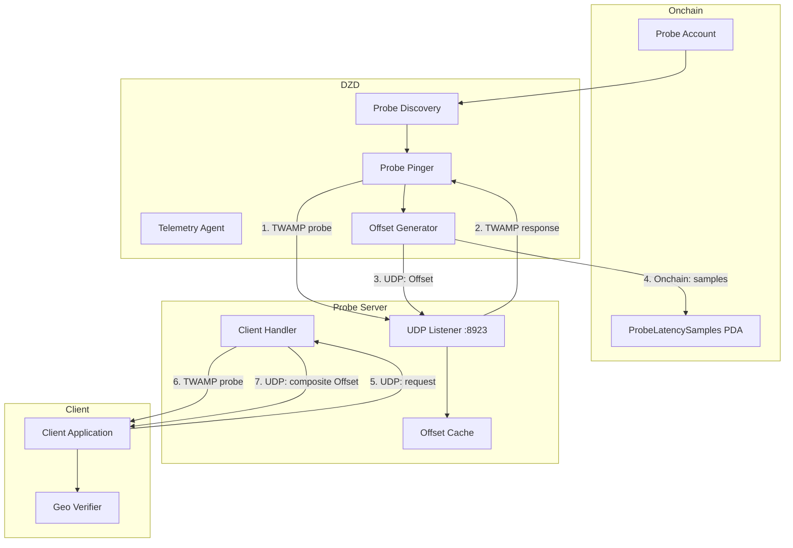

# Geo-Location Verification via Latency-Based Triangulation

## Summary

**Status: `Draft`**

This RFC introduces a geo-location verification system that validates the physical location of client devices using latency-based measurements through intermediate Probe servers. The system builds on DoubleZero's existing TWAMP telemetry infrastructure (RFC4) to provide cryptographically signed, onchain proof of approximate device location.

The system uses a three-tier measurement chain: DoubleZero Devices (DZDs) with precisely known locations measure latency to Probe servers, which measure latency to client devices. Each measurement is cryptographically signed and includes references to previous measurements, creating an auditable trail. Location is expressed as "z milliseconds away from latitude x, longitude y," enabling verification that devices are within specified geographic boundaries.

## Motivation

Users are intereted using DZDs as reference points to determine approximate location for clients for things such as ensuring GDPR compliance. This leverages the verifiable network of DZDs and contributors and is a reasonable way to monetize the network.

Problems with current IP location services:
- IP geolocation databases are unreliable (30-50% accuracy for city-level)
- No audit trail exists 
- Data and methodology is controlled by centralized organizations without transparency
- A GPS based system requires servers to have access to datacenter roofs

Customers need a trustless, verifiable system that:
- Provides cryptographic proof stored onchain
- Leverages existing infrastructure (DZDs with known locations)
- Scales to large numbers of clients

### Solution Approach

This RFC leverages DoubleZero's existing TWAMP telemetry infrastructure to create a latency-based triangulation system. The speed of light through fiber (approximately 124 miles/millisecond) provides a physical upper bound on distance based on round-trip latency. While actual network paths include switching delays, latency measurements provide reliable approximations suitable for uses such as regulatory geo-fencing (e.g., "plausibly within EU" = <24ms RTT (1,500 miles max) from reference points).

## New Terminology

### dzProbe
A server that acts as an intermediary for latency measurements. dzProbes:
- Are bare metal servers. Ideally located within 1ms of a DZD
- Run a UDP listener (default port 8923) accepting signed Offset messages from DZDs
- Pull configuration from the DZ Ledger and measure latency to client devices specified there
- Generate composite Offset messages including references to DZD measurements attesting to the probe's location
- Are registered onchain in the Telemetry Program

### Offset
A signed data structure representing the latency relationship between two entities (DZD↔Probe or Probe↔Client):

```rust
struct LocationOffset {
    signature: [u8; 64],          // Ed25519 signature
    pubkey: [u8; 32],             // Signer's public key (DZD or Probe)
    lat: f64,                     // Reference point latitude (WGS84)
    lon: f64,                     // Reference point longitude (WGS84)
    rtt_ns: u64,                  // Measured RTT in nanoseconds
    num_references: u8,           // Number of previous offsets in chain
    references: Vec<Offset>,      // Previous offsets (empty for DZD→Probe)
}
```

**DZD-generated Offsets** contain no references (DZDs are roots of trust). <br> 
**Probe-generated Offsets** include references to DZD Offsets, enabling clients to verify the entire measurement chain.

> 💡 An enterprising user could use the existing link telemetry to confirm locations of DZDs relative to other DZDs. This is not covered by this RFC.

### Location Offset
The RTT to a client from the lat/lon in the Offset struct.

### Child Probe
A Probe assigned to a specific DZD for periodic latency measurement, defined onchain. DZDs only measure and send Offsets to their mated Probes.

**Child Criteria:**
- Probe must be within latency threshold of DZD (e.g., <1ms RTT, 62 miles)
- Each doublezero Exchange will have at least 1 Probe. For the POC we only need a single Probe in testnet.
- Foundation authority controls children assignments

### Latency Budget
Maximum acceptable RTT between client and reference point for geo-verification. Determines geographic radius. Examples:
- **50ms:** ~3,000km radius ("within EU")
- **100ms:** ~6,000km radius ("within North America")
- **10ms:** ~600km radius (city/metro area)

## Alternatives Considered

### Satus Quo: Centralized Location Service (Rejected)
**Pros:** Simple implementation, flexible, Already exists
**Cons:** Single point of failure, requires trust, no cryptographic proof
**Decision:** Rejected by potential clients

### Direct DZD↔Client Measurement (Rejected)
**Pros:** Simpler, lower latency, lower cost
**Cons:** Control plane traffic in DZDs would not scale to moderate numbers of clients.
**Decision:** Rejected. Avoided to prevent resource consumption on the resource-constrained DZD.

### GPS-Based Verification (Rejected)
**Pros:** More precise, well-established
**Cons:** Not available in typical data centers.
**Decision:** Rejected.

### Probe-Based Triangulation (SELECTED)
**Pros:** Leverages existing infrastructure, no client modifications, cryptographic proof, onchain auditability, scalable, privacy-preserving
**Cons:** Infrastructure cost (~$50/month per probe), less precise than GPS, additional latency
**Decision:** Selected. Best balance of security, verifiability, and operational simplicity.

## Detailed Design

### Architecture Overview



**Data Flow:**

1. **Probe Discovery (10s interval):** DZD queries onchain Probe accounts to discover mated probes
2. **DZD→Probe Measurement (5s interval):** DZD sends TWAMP probe, measures RTT
3. **Offset Generation:** DZD creates Offset with lat/lon, latency, timestamp, signs with Ed25519
4. **Dual Posting:** DZD submits samples to `ProbeLatencySamples` PDA onchain AND sends Offset to Probe via UDP
5. **Probe Caching:** Probe verifies DZD signature, caches Offset in memory
6. **Client Request:** Client sends UDP packet to Probe requesting verification
7. **Probe→Client Measurement:** Probe measures RTT to client using TWAMP
8. **Composite Offset:** Probe creates new Offset with DZD Offset as reference, signs it
9. **Client Verification:** Client verifies signature chain, validates latency within threshold

### Data Structures

#### Probe Account (Onchain)

```rust
pub struct Probe {
    pub account_type: AccountType,           // AccountType::Probe
    pub owner: Pubkey,                       // DZ Foundation
    pub index: u128,                         // Unique index for PDA
    pub bump_seed: u8,
    pub location_pk: Pubkey,                 // Reference to Location account
    pub lat: f64,                            // Cached from Location
    pub lon: f64,                            // Cached from Location
    pub public_ip: Ipv4Addr,                 // Where probe listens
    pub port: u16,                           // Default: 8923
    pub status: ProbeStatus,                 // Pending/Activated/Suspended/Deleting
    pub code: String,                        // e.g., "ams-probe-01"
    pub mated_devices: Vec<Pubkey>,          // DZDs to measure
    pub latency_threshold_ns: u64,           // Max RTT for mating
    pub metrics_publisher_pk: Pubkey,        // For telemetry submissions
    pub reference_count: u32,
    pub _unused: [u8; 64],
}
```

**PDA Seeds:** `["doublezero", "probe", index.to_le_bytes()]`

#### ProbeLatencySamples Account (Onchain)

Mirrors `DeviceLatencySamples` structure from RFC4:

```rust
pub struct ProbeLatencySamplesHeader {
    pub account_type: AccountType,
    pub epoch: u64,
    pub origin_device_agent_pk: Pubkey,      // DZD agent
    pub origin_device_pk: Pubkey,            // DZD
    pub target_probe_pk: Pubkey,             // Probe
    pub origin_device_location_pk: Pubkey,
    pub target_probe_location_pk: Pubkey,
    pub sampling_interval_microseconds: u64, // e.g., 5_000_000 = 5s
    pub start_timestamp_microseconds: u64,
    pub next_sample_index: u32,
    pub _unused: [u8; 128],
}

pub struct ProbeLatencySamples {
    pub header: ProbeLatencySamplesHeader,
    pub samples: Vec<u32>,                   // RTT in microseconds, max 35k samples
}
```

**PDA Seeds:** `["doublezero", "probe_latency_samples", origin_device_pk, target_probe_pk, epoch]`

### Smart Contract Changes

#### New Instructions (Telemetry Program)

```rust
pub enum TelemetryInstruction {
    // Existing instructions...

    InitializeProbe {
        index: u128,
        public_ip: Ipv4Addr,
        port: u16,
        code: String,
        latency_threshold_ns: u64,
        metrics_publisher_pk: Pubkey,
    },

    UpdateProbe {
        public_ip: Option<Ipv4Addr>,
        port: Option<u16>,
        status: Option<ProbeStatus>,
        latency_threshold_ns: Option<u64>,
    },

    AddMatedDevice { device_pk: Pubkey },
    RemoveMatedDevice { device_pk: Pubkey },

    InitializeProbeLatencySamples {
        epoch: u64,
        sampling_interval_microseconds: u64,
    },

    WriteProbeLatencySamples {
        start_timestamp_microseconds: u64,
        samples: Vec<u32>,
    },
}
```

### Component Implementation

#### Telemetry Agent Extensions

**Configuration (`controlplane/telemetry/internal/telemetry/config.go`):**

```go
type Config struct {
    // Existing fields...
    ProbeEnabled           bool          // Default: false
    ProbeInterval          time.Duration // Default: 5s
    ProbeTimeout           time.Duration // Default: 2s
    ProbePacketSize        int           // Default: 2048 bytes
    ProbeUDPPort           uint16        // Default: 8923
    ProbesRefreshInterval  time.Duration // Default: 10s
}
```

**Modules:**
- `probe_discovery.go`: Discovers mated probes from onchain (~200 lines)
- `probe_pinger.go`: TWAMP measurements to probes (~300 lines)
- `offset_generator.go`: Creates signed Offsets (~150 lines)
- `probe_publisher.go`: Submits samples onchain and UDP (~200 lines)

#### Probe Server

New service deployed alongside DZDs in exchanges.

**File:** `probe-server/` (new directory)

**Components:**
- **UDP Listener:** Accepts DZD Offsets and client requests
- **Offset Cache:** Stores recent DZD Offsets (keyed by DZD pubkey)
- **Client Handler:** Measures RTT to clients, generates composite Offsets
- **Signature Verifier:** Validates Ed25519 signatures

**Language:** Rust (for performance and consistency with other infrastructure)

**Configuration:**
```yaml
listen_addr: "0.0.0.0:8923"
probe_pubkey_file: "/etc/probe/keypair.json"
max_offset_age_seconds: 60
cache_size: 10000
```

#### Client SDK

**File:** `sdk/rs/src/geolocation/` (new module)

**Components:**
- `offset.rs`: Offset struct with signature verification
- `client.rs`: UDP client for requesting Offsets
- `verifier.rs`: Chain verification and latency validation

**Example Usage:**

```rust
use doublezero_sdk::geolocation::{GeoVerifier, LatencyBudget};

let verifier = GeoVerifier::new();
let probe_addr = "probe.ams.doublezero.network:8923";

// Request location proof
let offset = verifier.request_offset(probe_addr)?;

// Verify signature chain
offset.verify_chain()?;

// Check latency budget
let budget = LatencyBudget::eu_compliance(); // 50ms
if offset.total_latency_ns() <= budget.max_ns {
    println!("Client is within EU");
}
```

## Security Considerations

### Threat Model

| Threat | Mitigation |
|--------|-----------|
| **IP Spoofing** | Not addressed in POC/MVP; discussed in future work |
| **Replay Attacks** | Timestamps; receivers reject offsets >60s old |
| **Signature Forgery** | Ed25519 signatures; DZD keys secured in telemetry agent |
| **Man-in-the-Middle** | UDP is connectionless; future: DTLS for encryption |
| **Probe Compromise** | Multiple probe verification in MVP; onchain audit trail |
| **DDoS on Probes** | Rate limiting, firewall rules, cloudflare proxying |
| **Client False Claims** | Clients cannot forge Offsets; signature verification required |

### Privacy Considerations

- **Location Precision:** Offsets reveal approximate distance only (kilometers), not exact coordinates
- **No IP Logging:** Probes don't persist client IPs
- **Optional Verification:** Clients control when to request location proofs
- **Onchain Privacy:** ProbeLatencySamples don't include client data

## POC Requirements

**Goal:** Single probe deployment for testing

1. Telemetry program changes:
   - Probe and ProbeLatencySamples accounts
   - 6 new instructions (Initialize/Update/AddMated/RemoveMated/InitSamples/WriteSamples)
2. Telemetry agent extensions:
   - Probe discovery from onchain
   - TWAMP measurement to probes
   - Offset generation and signing
   - Dual posting (onchain + UDP)
3. Probe server:
   - UDP listener for DZD Offsets and client requests
   - Offset caching and verification
   - Client RTT measurement
   - Composite Offset generation
4. Client SDK:
   - Offset struct with signature verification
   - Simple UDP client
5. Deployment:
   - 1 probe in Amsterdam (colocated with DZD)
   - Mated to 1-2 DZDs for testing

## MVP Requirements

**Goal:** Production-ready system with multi-probe verification

1. All POC components (above)
2. Multi-probe verification:
   - Clients query 2-3 probes
   - Verification requires consensus (e.g., 2 of 3 agree)
3. Probe infrastructure:
   - Deploy 1 probe per DoubleZero exchange
   - Automated probe provisioning via Terraform
4. Monitoring:
   - Grafana dashboards for probe health
   - Alerting for offline probes, signature failures
5. Documentation:
   - Client integration guide
   - Probe operator handbook
6. Foundation operations:
   - Probe management CLI (`doublezero probe list/create/update`)
   - Automated key rotation

## Implementation Phases

### Phase 1: POC (4 weeks)

**Week 1-2: Onchain & Telemetry Agent**
- Smart contract: Probe account, instructions (~1,000 lines)
- Telemetry agent: probe discovery, pinger, offset generator (~800 lines)
- Testing: devnet deployment, unit tests

**Week 3: Probe Server**
- UDP listener, offset cache, client handler (~1,200 lines)
- Docker image, deployment scripts
- Testing: integration tests with telemetry agent

**Week 4: Client SDK & Integration**
- Client SDK: offset verification, UDP client (~500 lines)
- Example application demonstrating verification
- Testing: end-to-end POC validation

### Phase 2: MVP (6 weeks)

**Week 5-6: Multi-Probe & Infrastructure**
- Multi-probe verification logic
- Terraform for probe deployment
- Deploy probes to 5-10 exchanges

**Week 7-8: Monitoring & Operations**
- Grafana dashboards
- Probe management CLI
- Automated provisioning

**Week 9-10: Documentation & Launch**
- Integration guides
- Security audit
- Testnet rollout, mainnet-beta deployment

## Testing Strategy

### Unit Tests
- Offset signature generation/verification
- ProbeDiscovery onchain parsing
- TWAMP measurement accuracy
- PDA derivation correctness

### Integration Tests
- Telemetry agent → Probe UDP communication
- Onchain sample submission and retrieval
- Client SDK → Probe verification flow
- Multi-probe consensus logic

### E2E Tests (devnet/testnet)
- Full DZD → Probe → Client chain
- Signature verification across components
- Latency budget enforcement
- Probe child/un-child operations

### Performance Tests
- Probe server throughput (clients/second)
- Offset cache performance (10k+ entries)
- Telemetry agent overhead (<1% CPU)

## Operational Considerations

### Probe Deployment

**Requirements:**
- Bare metal or VPS in DoubleZero exchange datacenter
- 2 CPU cores, 4GB RAM, 50GB disk
- Public IPv4 address
- Port 8923 UDP open
- <20ms RTT to mated DZDs

**Cost:** ~$50/month per probe (bare metal hosting in exchange)

### Monitoring

**Metrics:**
- Probe availability (uptime %)
- DZD→Probe latency (p50, p95, p99)
- Client request rate
- Signature verification failures
- Offset cache hit rate

**Alerts:**
- Probe offline >5 minutes
- Signature verification failure rate >1%
- RTT to mated DZD exceeds threshold

### Key Management

**DZD Keys:** Existing `metrics_publisher_pk` used for Offset signing (no new key infrastructure)
**Probe Keys:** Generated during provisioning, stored in `/etc/probe/keypair.json`, backed up to Foundation secure storage

## Future Work

### IP Spoofing Mitigation

**Problem:** Malicious probe could be close to DZD but forward requests to distant actual probe

**Approach (Phase 3):**
- Require probes to have onchain Device account (same as DZDs)
- DZDs ping probe's public IP and verify it responds
- Add "reachability verification" to childing process

### Geographic Multi-Probe Triangulation

**Problem:** Single probe gives distance, not precise location

**Approach (Phase 4):**
- Client queries 3+ geographically dispersed probes
- SDK performs trilateration from multiple distance measurements
- Narrows location to intersection of circles

### DTLS Encryption

**Problem:** UDP communication is plaintext

**Approach (Phase 5):**
- Add DTLS wrapper for Probe↔Client communication
- Protects against eavesdropping (though Offsets are public onchain)

## Backward Compatibility

- No breaking changes to existing telemetry infrastructure
- Telemetry agent remains functional with `probe_enabled: false`
- New Probe accounts coexist with existing Device accounts

## Open Questions

1. Should probes support IPv6? (Initially IPv4 only for simplicity)
2. What's the optimal cache size for Offset storage? (Testing will determine, starting with 10k entries)
3. Should probe metrics be posted onchain? (Yes for auditability; separate from client verification path)
4. How to handle probe key rotation? (Manual for POC, automated in MVP)

## References

- RFC4: Telemetry for Contributor Rewards
- TWAMP Light: RFC 5357
- Ed25519: RFC 8032
- Speed of light in fiber: ~124,000 miles/second (124 miles/ms)
