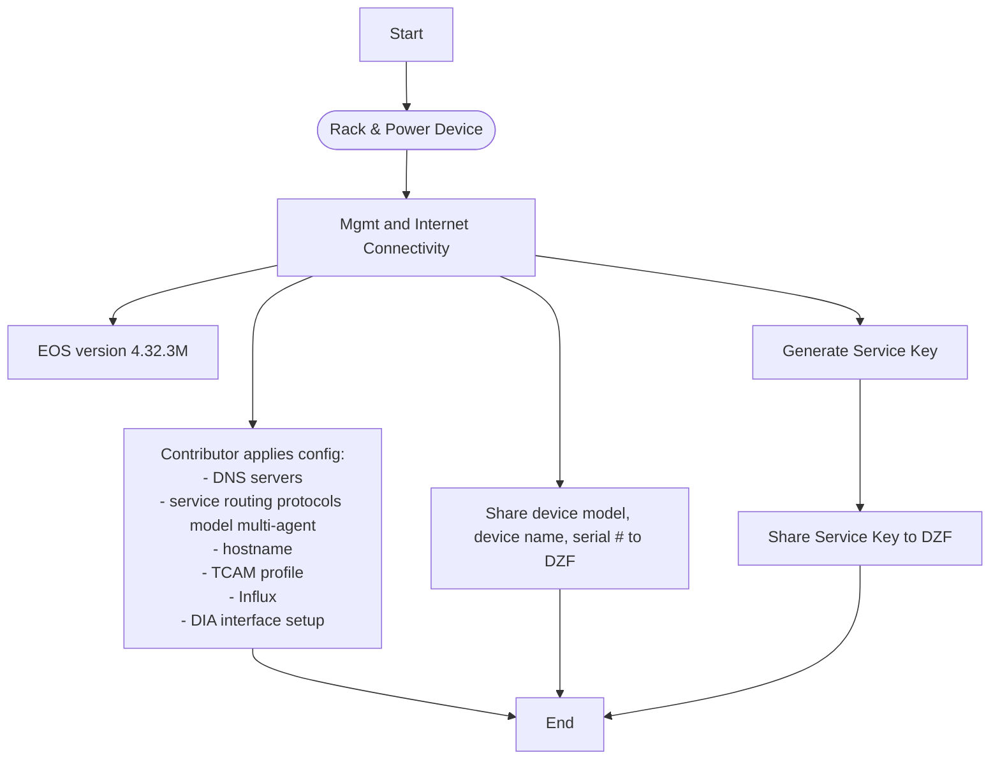
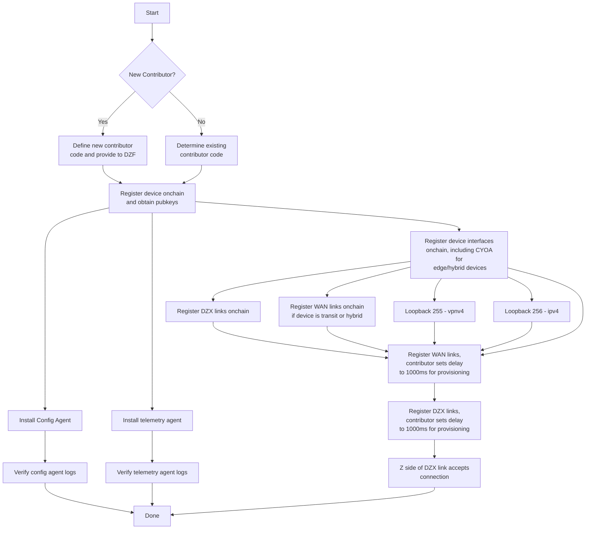
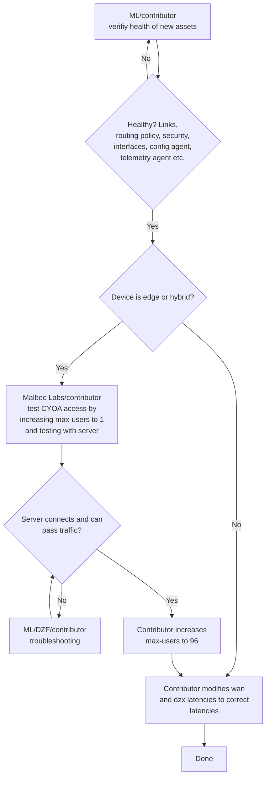

# Network Provisioning Framework

## Summary

**Status: Draft**

This RFC defines the network provisioning process used by DoubleZero contributors when onboarding (and offboarding) new devices, links, and CYOA interfaces, with a focus on automating the process. Also see rfc9-link-draining.md.

## Motivation

The provisioning process for DoubleZero Devices (DZDs) and links currently requires manual effort, is prone to human error, and includes overhead and delays from coordination between contributors and the DoubleZero Foundation (DZF). Therefore we propose to define the process, identify which parts of the process to prioritize for automation, and take initial implementation steps. 

## New Terminology

- **Onboarding** - The process of adding a new device or link to the network, starting with contributor's decision to add a device or link
- **Offboarding** - The process of removing an existing device or link from the network, starting with the contributor's decision to remove the link or device
- **Edge device** - A DoubleZero Device (DZD) that terminates user tunnels (max-users > 0). It has at least 1 CYOA interface with DIA. It has at least 1 WAN or DZX link. 
- **Transit device** - A DZD that routes traffic between other DZDs but does not terminate user tunnels. It has at least 1 non-CYOA DIA interface. It has at least 2 WAN and/or DZX links.
- **Hybrid device** - A DZD that terminates user tunnels and also routes traffic between other DZDs. Has at least 1 CYOA interface with DIA. Has at least 2 WAN or DZX links.
- **RFS** - Ready For Service criteria are a set of conditions that must be met for a device or link to be considered healthy and therefore ready for service.
- **Burn-in period** - The amount of time a link or device must pass all its health checks before it can be activated. For links and devices activated for the first time this is 200,000 slots on the [DoubleZero ledger](https://explorer.solana.com/?cluster=custom&customUrl=https%3A%2F%2Fdoublezero-mainnet-beta-local.rpcpool.com%2Fdb336024-e7a8-46b1-80e5-352dd77060ab), which at 370ms per slot is about 20 hours. For links and devices being re-activated after maintenance this is 50,000 slots, about 5 hours.

## Alternatives Considered

* We can keep the current loosely defined manual process in place. This will allow us to prioritize other development work, but it will keep operational overhead high for contributors, and make the DoubleZero mainnet-beta network more difficult to scale.
* We can look at procuring a commercial network provisioning system such as Cisco Network Services Orchestrator, Juniper Apstra, SolarWinds Network Configuration Manager, or others. However, based on team members' experience with these systems, in the best case they systems tend to be expensive and require extensive investment in customization. They also use traditional database backends, and would require additional customization to integrate with the DZ ledger (if doing so is even feasible). We prefer a minimal, purpose-built system that deeply integrates with the rest of the DoubleZero stack.

## Scope
This rfc covers device and link onboarding, and device draining for maintenance purposes like firmware upgrades and parts replacement. 

The following are out of scope:
- Offboarding of devices is out of scope because we don't currently have demand for removing devices from the network. 
- Automatically moving devices or links to a drained status, for example due to failing health checks, is out of scope due to the operational risk it would introduce. For now, this will still require action by the contributor owning the device or link.
- Link draining is already covered by rfcs/rfc9-link-draining.md.
- Automatic re-connection of users to nearby devices is out of scope. During device draining, users will remain connected to their current device, and will need to take action if they want to re-connect to another nearby device
- Providing visibility into the history of the network topology is out of scope.
- Providing users with visibility into a schedule of planned maintenance is out of scope.
- Automatically determining whether the network has enough capacity to safely drain a given DZD is out of scope.
- Draining of CYOA interfaces is out of scope, although draining a device will shut down all user BGP sessions, and so it will have the effect of removing all user traffic from all CYOA interfaces.
- We would like to publish detailed health info to contributors onchain, but to keep the scope tight, we will start by using Grafana to publish health info to contributors.
- We would like to add a health check that performs a port scan on devices, but that is currently out of scope.
- Some device/link RFS criteria are out of scope because we don't currently have a way to retrieve relevant data from devices, and we don't want to delay the first version of this framework in order to incorporate them. For example we currently have no way to verify that NTP is configured correctly.
- Providing a means for DZDs to talk to the controller when internet access is down is out of scope.


## Detailed Design

### Device onboarding - current process
This section describes the existing manual onboarding process for new devices. The workflow is divided into phases to make them easier to view. This framework focuses on Phase 3 of the device onboarding process. 

Phase 1 - Initial device setup


Phase 2 - Model device onchain


Phase 3 - Health check and enable user connections


Here are the same phases as lists:

#### Phase 1
1. Rack & power device
1. Mgmt and Internet connectivity
1. Upgrade EOS to version 4.32.3M
1. Contributor applied configuration
    1. DNS servers
    1. `service routing protocols model multi-agent`
    1. hostname
    1. DZ-provided TCAM profile
    1. Influx
    1. DIA interface setup
1. Generate service key
    1. Share service key to DZF

#### Phase 2
1. Share device model, name, and serial number to DZF
1. If this is a new contributor, define new contributor code and provide to DZF
1. Register device onchain with max-users=0 (to prevent users from connecting)
    1. Provide pubkey to DZF
1. Install config agent
    1. Verify config agent logs
1. Install telemetry agent
    1. Verify telemetry agent logs
1. Register device interfaces onchain
    1. Loopback256 - ipv4
    1. Loopback255 - vpnv4
    1. Interfaces to be used for wan/dzx links
    1. Interfaces to be used for CYOA
1. Register wan/dzx links onchain with link.status set to `soft-drained`
1. Z side contributor accepts any pending links

#### Phase 3
1. Contributor verifies health of new assets
    1. Are interfaces links, routing protocols, routing policy, security, etc, configured correctly?
    1. Are the device's config and telemetry configured and operating correctly?
1. For edge/hybrid devices
    1. Run QA test via device's CYOA interface(s)
    1. On failure, troubleshoot errors and repeat QA test
    1. On success, set device.max-users to 96
1. For each link connected to the device:
    1. Contributor un-drains the link by setting link.status to `activated`

### Architecture
We propose to create a new `monitor-oracle` component tha periodically monitors the health of links and devices and updates new `health` fields in the serviceability `link` and `device` to `Healthy` if all ready-for-service criteria are met, or `Impaired` if any criteria are not met. The controller, in turn, supplies the fleet of DZDs with configuration statements that implement the desired network configuration for each status. The diagram shows the case where a link or device is in a drained status, has passed all health checks, and has a desired_status of activated. 

```
                 ┌────────────────┐
                 │ monitor-oracle │
                 └───────┬────────┘
                         │
            ┌────────────┴─────────────┐───────────────────────────────────────────────┐                             
            │                          │                                               │                             
        poll│                          │ When all health criteria are met,             │ When all health criteria are
            ▼                          │ update link.health to Healthy                 │ update device.health to Healthy
┌───────────────────────-┐   ┌─────────│──────────────────────────┐          ┌─────────│──────────────────────────┐
│ Device health info from│   │         │                          │          │         │                          │
│ (DZ_Ledger / Influx /  │   │         ▼                          │          │         ▼                          │
│ Prometheus)            │   │  ┌──────────────┐                  │          │  ┌──────────────┐                  │
└──────────────────────-─┘   │  │ link.health  │                  │          │  │ device.health│                  │
                             │  └──────┬───────┘                  │          │  └──────┬───────┘                  │
                             │         │                          │          │         │                          │
                             │         │ if link is Healthy and   │          │         │ if device is Healthy and │
                             │         │ link.desired_status is   │          │         │ device.desired_status is │
                             │         │ activated, set           │          │         │ activated, set           │
                             │         │ link.status to activated.│          │         │ device.status to         │
                             │         ▼                          │          │         ▼ activated.               │
                             │  ┌──────────────────────┐          │          │  ┌──────────────────────┐          │
                             │  │ link.status          │◄────────────┐   ┌─────►│ device.status        │          │
                             │  └──────────────────────┘          │  │   │   │  └──────────────────────┘          │
                             │                                    │  │   │   │                                    │
                             │   serviceability "link" program    │  │   │   │  serviceability "device" program   │
                             └────────────────────────────────────┘  │   │   └────────────────────────────────────┘  
						   	                                         │   │
						   	                                  poll   │   │   poll
					                                                 │   │
						   	                                   ┌─────┴───┴──┐
							                                   │ controller │
						 	                                   └────────────┘
						 	                                        ▲
                                                                    │
						                                            │ poll
						                                      ┌─────┴──────┐
                                                              │  device    │┐
                                                              │   fleet    ││┐
                                                              └────────────┘││
													           └────────────┘│
													            └────────────┘
```

### Link (WAN or DZX) onboarding/maintenance/offboarding

#### Link onboarding - RFS criteria
1. Link record created on DZ ledger with link.status = `pending` and link.desired_status = `activated`
1. The link's A and Z interfaces have <burn-in slots> worth of data in InfluxDB with zero errors and non-zero utilization
1. The link has <burn-in slots> of data in the DoubleZero ledger telemetry program with zero loss

#### Link onboarding - steps
0. Determine the burn-in period to use:
    1. If link.health is `pending` (new link), use a burn-in period of 200K DZ Ledger slots (about 20 hours)
    1. If link.health is `drained` (link is in maintenance), use a monitoring-oracle of 50K DZ Ledger slots (about 5 hours)
1. The `monitor-oracle` component, when all ready-for-service criteria have been met for the burn-in period, sets link.health to `healthy`
1. On link.health update, the serviceability link program sets link.status to `activated` when:
        1. link.desired_status = activated
        1. and link.health = healthy 
        1. and link.status = `soft-drained`|`hard-drained`
1. When link.status is `activated`, controller configures link's device interfaces

##### Link maintenance - steps
1. Contributor sets link.desired_status to `hard-drained`
1. When the contributor sets link.desired_status to `hard-drained`, the serviceability device program sets link.status to `drained`
1. Controller sets `isis passive` on link interfaces
1. When maintenance is complete, contributor sets link.desired_status to `activated`
1. Follow [the link onboarding steps](#link-onboarding---steps) above to bring the link back into service

#### Link offboarding - steps
1. Contributor sets link.status to `hard-drained`
1. Controller sets `isis passive` on link interfaces
1. Contributor runs `doublezero link delete --pubkey <pubkey>`
1. Contributor optionally runs `doublezero device interface delete <device-code> <interface-name>` for all interfaces
1. Contributor manually removes the interface configuration with `default interface <interface-name>`

### Device onboarding
As of December 2025, 72 device have been onboarded to DoubleZero mainnet-beta using the manual health check process described in [phase 3](#phase-3) above. The automated process outlined here replaces the manual process.

The high level steps for device onboarding are as follows:
1. Set the device's desired_status to activated status
1. Set the device's connected links's desired_status to activated
1. Once the links pass all prerequisites for the burn-in period, set their status to activated
1. Once the device passes all prerequisites for the burn-in period, set its status to activated
1. For edge/hybrid devices, set max-users to the network-wide max (currently 96)

#### Device onboarding - RFS criteria
1. Device record created with
    1. public_ip - set
    1. dz_prefixes - at least one /29
    1. max_users - set to 0
    1. status = `pending`
    1. Loopback255 exists with loopback_type = vpnv4
    1. Loopback256 exists with loopback_type = ipv4
1. DIA
    1. At least 1 DIA interface defined on chain with status = activated
    1. At least 1 DIA interface up for 24 hours with zero errors and non-zero utilization
1. At least 1 DZX/WAN link interface defined on chain with status = activated
1. At least 1 DZX or WAN link up for 24 hours with zero errors and non-zero utilization (already established by link RFS criteria)
1. Device meets the criteria for its device.type (edge, hybrid, transit)
1. Device is reporting to InfluxDB for 24 hours (already established by link RFS criteria)
1. Config agent installed and running for 24 hours
1. Telemetry agent installed and running for 24 hours (already established by link RFS criteria)
1. QA tests have emitted 4 "qa test success" prometheus metrics for the device in the past 24 hours

#### Device onboarding - out of scope RFS criteria
The following criteria are out of scope because they depend on data that we currently don't have access to.
1. DIA
    1. BGP routes received from DIA are marked with `no-advertise`
    1. An ACL is applied to inbound DIA traffic
    1. The 0th IP in the device's first dz_prefix is configured on loopback100 and reachable via DIA
1. NTP is configured and synced
1. DNS is configured and working
1. TCAM profile is set
1. `service routing protocols model multi-agent` has been set

#### Device onboarding - steps
0. Determine the burn-in period to use:
    1. If device.health is `pending` (new device), use a burn-in period of 200K DZ Ledger slots (about 20 hours)
    1. If device.health is `drained` (device is in maintenance), use a monitoring-oracle of 50K DZ Ledger slots (about 5 hours)
1. The `monitor-oracle` component, when all ready-for-service criteria have been met for the burn-in period, sets device.health to `healthy`
1. On device.health update, the serviceability link program sets device.status to `activated` and device.max-users to 96 (for edge/hybrid devices only) when the following are all true:
    1. device.desired_status = activated
    1. and device.health = healthy 
    1. and device.status = `drained`

### Device maintenance
When a device needs maintenance that will interrupt user traffic, such as a firmware upgrade or hardware part replacement, we first soft-drain the device's links to re-route transit traffic around the device. Next, we drain user traffic from the device itself by having the controller add `neighbor <w.x.y.z> shutdown` to every user BGP session. At this point, from the user's perspective, `doublezero status` will show a tunnel status of `pending`, and the user will not be able to route any traffic over DoubleZero unless they take action by disconnecting a connecting to a different device.

For IBRL users, traffic will re-route via the internet. For multicast users, traffic will be interrupted for the duration of the maintenance, so users will need to fall back on other means to receive the same data over the internet. If users want to remain connected to DoubleZero during the maintenance, they will need to take action to disconnect and reconnect to a different device. 

##### Device maintenance - steps
1. Contributor runs `doublezero link update --pubkey PUBKEY --desired-status drained` for each link connected to the device
1. Contributor runs `doublezero device update --pubkey PUBKEY --desired-status drained`
1. When the contributor sets device.desired_status to `drained`, the serviceability device program sets device.status to `drained`

1. On link.desired_status update, the serviceability link program sets link.status to `hard-drained` and sets link.health to `drained`.
1. Controller sets `isis passive` on link interfaces
1. When maintenance is complete, contributor sets link.desired_status to `activated`
1. Follow [the link onboarding steps](#link-onboarding---steps) above to bring the link back into service

#### Device offboarding
Out of scope

### Tasks

#### - serviceability: add link.health 
```
pub enum LinkHealth {
    Unknown = 0,
    Pending = 1,
    Healthy = 2,
    Drained = 3    
    Impaired = 4,
}
```

#### - serviceability: add link.desired_status
```
pub enum LinkDesiredStatus {
    Activated = 0,
    SoftDrained = 1,
    HardDrained = 2,
    Deleted = 3,
}
```

#### - serviceability: add device.health 
```
pub enum DeviceHealth {
    Unknown = 0,
    Pending = 1,
    Healthy = 2,
    Drained = 3,
    Impaired = 4,
}
```

#### - serviceability: add device.desired_status
```
pub enum DeviceDesiredStatus {
    Unknown = 0,
    Activated = 1,
    Drained = 2,
    Deleted = 3,
}
```

#### - monitor-oracle: add logic to update link.health and device.health
#### - serviceability link program
- add LinkHealth
- add LinkDesiredStatus
- add `Drained` to LinkStatus
- add logic to update link.status
- allow foundation to override device.status
#### - serviceability device program
- add DeviceHealth
- add DeviceDesiredStatus
- add `Drained` to DeviceStatus
- add logic to update device.status
- allow foundation to override device.status
#### - activator/serviceability: when devices and links are created, don't change their status to activated
#### - activator/serviceability: don't allow users to connect when device.status is drained
#### - controller: add logic that shuts down user BGP sessions when device.status is drained
#### - qa: update alldevices test to emit prometheus metrics
#### - client: don't attempt to connect to a device whose status is not activated
#### - Grafana: don't alert on links and devices that are not in activated status

## Impact

Changes are needed to the following components:
* serviceability link and device
* controller
* QA alldevices test

This RFC should improve the operational controls to manage DZDs and links in the network.  It introduces an intent based methodology that uses explict fields to achieve the desired state.

This RFC adds a new monitor-oracle component that collects data from Solana and the DZ ledger (serviceability and telemetry), reads data from Grafana and InfluxDB, and writes data to serviceability.

Contributors should not be rewarded for devices and links that are not in activated status. This check is already present in contributor-rewards (doublezero-offchain/crates/contributor-rewards/src/calculator/shapley_handler.rs).

## Security Considerations

- The monitor-oracle component will API keys for reading from Grafana and InfluxDB, as well as a key with write access to link.health and device.health. If this key is leaked, an attacker could move a device into activated status even though it's not healthy.
- An attacker could shut down user BGP sessions on DZDs if they gains the ability to update device.status or device.desired_status to `drained`.

## Backward Compatibility

*Interaction with existing deployments.*
Explain whether current nodes, data, or integrations continue to work unchanged. If not, spell out migration paths, feature gates, version negotiation, or deprecation timelines.
- The changes can be deployed in a backward-compatible manner, starting with the program updates, followed by the qa and monitor-oracle updates, followed by the controller updates.

## Open Questions
* What verification can be implemented to prove that a DZD, link or CYOA interface has been successfully drained and undrained?
