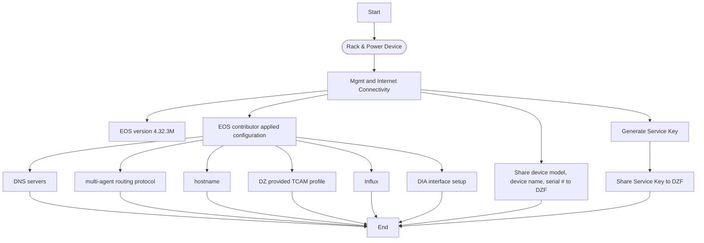
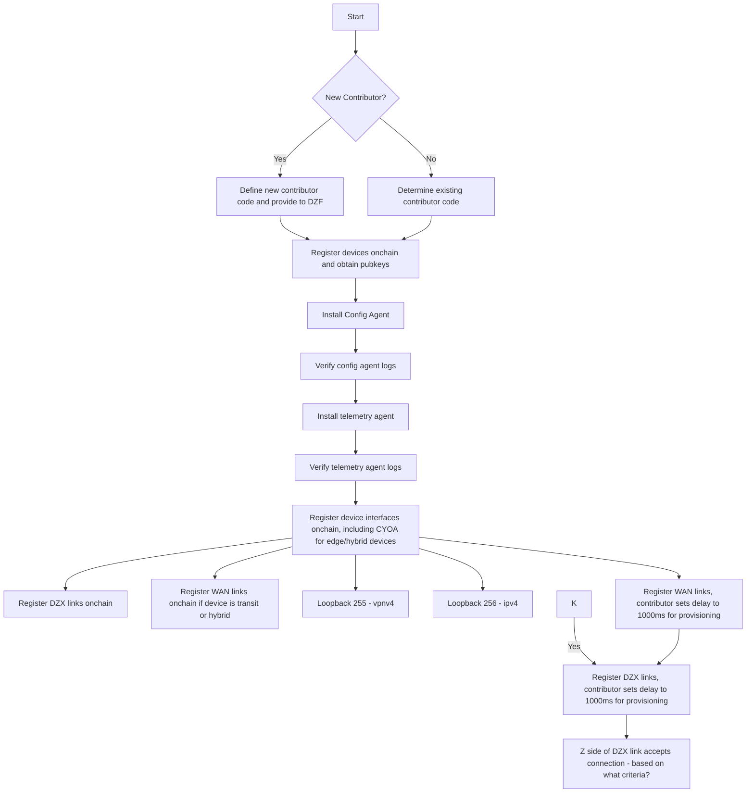
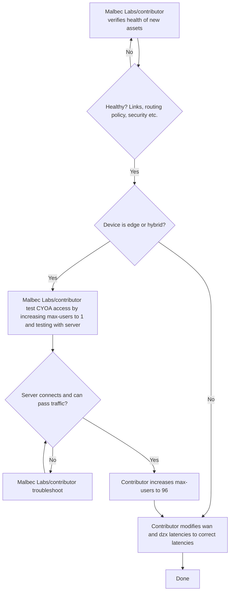
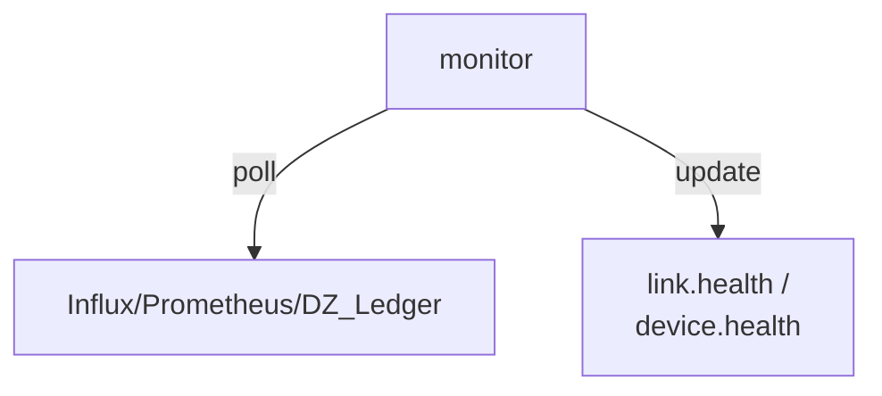
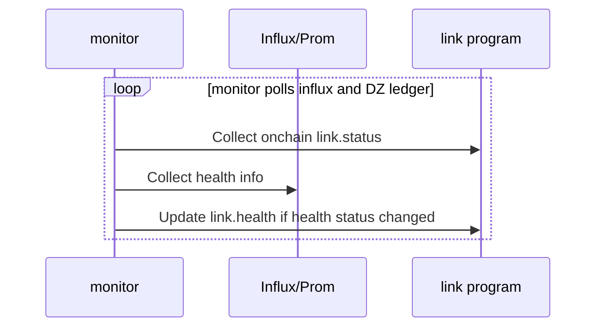

# TODO
- Incorporate https://github.com/malbeclabs/doublezero/issues/2032

# Network Provisioning Framework

## Summary

**Status: Draft**

This RFC defines the network provisioning process used by DoubleZero contributors when onboarding (and offboarding) new devices, links, and CYOA interfaces, with a focus on automating the process. Also see rfc9-link-draining.md.

## Motivation

The provisioning process for DoubleZero devices and links currently involves a lot of manual effort, is prone to human error, and includes overhead and delays from coordination between contributors and the DoubleZero Foundation. We want to define the process, and identify which parts of the process to prioritize for automation.

## New Terminology

- **Onboarding** - The process of adding a new device or link to the network, starting with the point at which the contributor and DZF have decided to add the device or link
- **Offboarding** - The process of removing an existing device or link from the network, starting with the point at which the contributor has decided to remove the link or device
- **Edge device** - A DoubleZero Device (DZD) that terminates user tunnels (max-users > 0). It has at least 1 CYOA interface with DIA. It has at least 1 WAN or DZX link. 
- **Transit device** - A DZD that routes traffic between other DZDs but does not terminate user tunnels. It has at least 1 non-CYOA DIA interface. It has at least 2 WAN and/or DZX links.
- **Hybrid device** - A DZD that terminates user tunnels and also routes traffic between other DZDs. Has at least 1 CYOA interface with DIA. Has at least 2 WAN or DZX links.

## Alternatives Considered

* We can keep the current loosely defined manual process in place. This will allow us to prioritize other development work, but it will keep operational overhead high for contributors, and make the DoubleZero mainnet-beta network more difficult to scale.
* We can look at procuring a commercial network provisioning system such as Cisco Network Services Orchestrator, Juniper Apstra, SolarWinds Network Configuration Manager, or others. However, Malbec Labs has experience with using these systems. In the best case these systems tend to be expensive and they do not solve anything out of the box - they require customization. They also use traditional database backends, and would require customization to integrate with the DZ ledger (if doing so is even feasible). We prefer the approach of building a minimal, purpose-built system that deeply integrates with the rest of the DoubleZero stack.

## Detailed Design

* Architecture overview (diagrams encouraged but optional)
* Data structures, schemas, or message formats
* Algorithms, control flow, or state machines
* API or CLI changes (with example calls)
* Configuration options, defaults, and migration steps
  Use subsections as needed; aim for clarity over brevity.

### Scope
This rfc covers device and link onboarding, and device draining for maintenance purposes like firmware upgrades and parts replacement. Offboarding of devices is out scope because we don't currently have demand for removing devices from the network.

Link draining is already covered by rfcs/rfc9-link-draining.md.

Also out of scope:
- Automatic re-connection of users to nearby devices is out of scope. Users will remain connected to their current device, and will need to take action if they want to re-connect to another nearby device
- Visibility into the history of the network topology is out of scope

### Device onboarding - current process
This section describes the existing manual onboarding process for new devices. The workflow is divided into phases to make them easier to view.

Phase 1



Phase 2


Phase 3 (Verification and Activation):


Here are the same phases as a list:

Phase 1
1. Rack & power device
1. Mgmt and Internet connectivity
1. Upgrade EOS to version 4.32.3M
1. Contributor applied configuration
    1. DNS servers
    1. Multi-agent routing protocol
    1. hostname
    1. DZ-provided TCAM profile
    1. Influx
    1. DIA interface setup
1. Generate service key
    1. Share service key to DZF

Phase 2
1. Share device model, name, and serial number to DZF
1. If this is a new contributor, define new contributor code and provide to DZF
1. Register device onchain with max-users=0 (to prevent users from connecting)
    1. Provide pubkey to DZF
1. Install config agent
    1. Verify config agent logs
1. Install telemetry agent
    1. Verify telemetry agent logs
1. Register device interfaces onchain
    1. Loopback256 - ipv4
    1. Loopback2556 - vpnv4
    1. Interfaces to be used for wan/dzx links
    1. Interfaces to be used for CYOA
1. Register wan/dzx links onchain with link.status set to `soft-drained`
1. Z side contributor accepts any pending links

Phase 3
1. Contributor verifies health of new assets
    1. Are links, routing protocols, routing policy, security, etc, configured correctly?
1. For edge/hybrid devices
    1. Run QA test via device's CYOA interface(s)
    1. On failure, troubleshoot errors and repeat QA test
    1. On success, set device.max-users to 96
1. For each link connected to the device:
    1. Contributor un-drains the link by setting link.status to `activated`


### Link (WAN or DZX) onboarding

#### Link onboarding - prerequisites
1. Link record exists on DZ ledger with link.status = `soft-drained` or `hard-drained`
1. The link's A and Z interfaces have 24 hours of data in InfluxDB with zero errors and non-zero utilization
1. link.desired_status = activated

#### Link onboarding - activation
1. The `monitor` component, when all prerequisites are met, sets link.health to `healthy`
1. The `activator` component listens to link events (and periodically polls for them)
	1. Set link.status to `activated` when:
        1. link.desired_status = activated
        1. and link.health = healthy 
        1. and link.status = `soft-drained`|`hard-drained`

### Link (WAN or DZX) offboarding

#### Link offboarding - prerequisites
1. link.status = `hard-drained`

#### Link offboarding - deletion
1. Contributor or DZF runs `doublezero link delete --pubkey <pubkey>`

### Device onboarding
As of December 2025, 72 device have been onboarded to DoubleZero mainnet-beta using the manual process described above. The automated process outlined here replaces the manual process.

Move device to activated status first, then move links to activated status, then (for edge/hybrid) set max-users > 0.

#### Device activation - prerequisites
1. Device record created with
    1. public_ip - set
    1. dz_prefixes - at least one /29
    1. max_users - set to 0
    1. status = `hard-drained`
1. DIA
    1. At least 1 DIA interface defined on chain with status = activated
    1. At least 1 DIA interface up for 24 hours with zero errors and non-zero utilization
1. At least 1 DZX/WAN link interface defined on chain with status = activated
1. At least 1 DZX or WAN link up for 24 hours with zero errors and non-zero utilization
1. Device is reporting to InfluxDB for 24 hours
1. Config agent installed and running for 24 hours
1. Telemetry agent installed and running for 24 hours
1. QA test passing for 24 hours

#### Device activation - prerequisites - out of scope
The following items depend on data that we currently don't have access to.
1. DIA
    1. BGP routes received from DIA are marked with `no-advertise`
    1. An ACL is applied to inbound DIA traffic
    1. The 0th IP in the device's first dz_prefix is configured on loopback100 and reachable via DIA
    1. NTP is configured and synced


#### Link onboarding - activation
1. The `monitor` component, when all prerequisites are met, sets device.health to `healthy`
1. The `activator` component listens to device events (and periodically polls for them)
	1. Set device.status to `activated` when:
        1. device.desired_status = activated
        1. and device.health = healthy 
        1. and device.status = `soft-drained`|`hard-drained`

#### Device maintenance
When a device needs maintenance that will interrupt user traffic, such as a firmware upgrade or hardware part replacement, we first soft-drain the devices links to re-route transit traffic around the device. Next, we drain the device itself by having the controller add , which shuts down all user BGP sessions. At this point, from the user's perspective, `doublezero status` will show a tunnel status of `pending`, and the user will be able to route any traffic over DoubleZero. 

For IBRL users, traffic will re-route via the internet. For multicast users, traffic will be interrupted for the duration of the maintenance, so users will need to fall back on other means to receive the same data over the internet. If users want to remain connected to DoubleZero during the maintenance, they will need to take action to disconnect and reconnect to a different device. 

#### Device offboarding
Out of scope

#### Architecture - components



#### Sequence diagrams

Link onboarding - Sequence diagram:



### Tasks

- serviceability: add link.health 
```
pub enum LinkHealth {
    Unknown = 0,
    Pending = 1,
    Healthy = 2,
    Impaired = 3,
}
```
- serviceability: add device.health_last_updated_timestamp_seconds
```
    pub health_last_updated_timestamp_seconds: u64, // 8
```
- serviceability: add link.desired_status
```
pub enum LinkDesiredStatus {
    Activated = 0,
    SoftDrained = 1,
    HardDrained = 2,
    Deleted = 3,
}
```
- serviceability: add device.health 
```
pub enum DeviceHealth {
    Unknown = 0,
    Pending = 1,
    Healthy = 2,
    Impaired = 3,
}
```
- serviceability: add device.health_last_updated_timestamp_seconds
```
    pub health_last_updated_timestamp_seconds: u64, // 8
```
- serviceability: add device.desired_status
```
pub enum DeviceDesiredStatus {
    Activated = 0,
    SoftDrained = 1,
    HardDrained = 2,
    Deleted = 3,
}
```
- monitor: add logic to update link.health and device.health
- activator: add logic to update link.status and device.status

-----
WORK IN PROGRESS - DO NOT READ PAST THIS POINT

## Impact

*Consequences of adopting this RFC.*
Discuss effects on:

* Existing codebase (modules touched, refactors required)
* Operational complexity (deployment, monitoring, costs)
* Performance (throughput, latency, resource usage)
* User experience or documentation
  Quantify impacts where possible; note any expected ROI.

## Security Considerations

*Threat analysis and mitigations.*
Identify new attack surfaces, trust boundaries, or privacy issues introduced by the change. Describe how each risk is prevented, detected, or accepted and reference relevant best practices.

## Backward Compatibility

*Interaction with existing deployments.*
Explain whether current nodes, data, or integrations continue to work unchanged. If not, spell out migration paths, feature gates, version negotiation, or deprecation timelines.

## Open Questions

*Items that still need resolution.*
List outstanding issues, research tasks, or decisions deferred to later milestones. This section helps reviewers focus feedback and signals areas where contributions are welcomed.

---

*End of template. Delete all instructional text (italicized sentences and bullet guidance) when submitting your RFC.*
