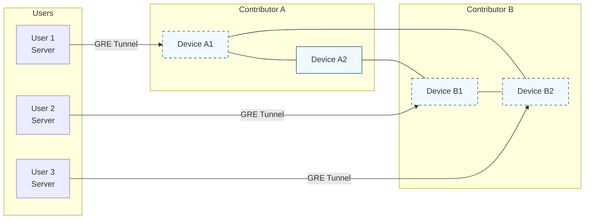
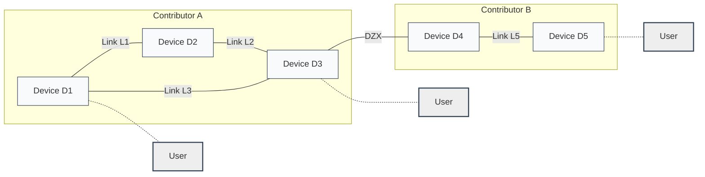
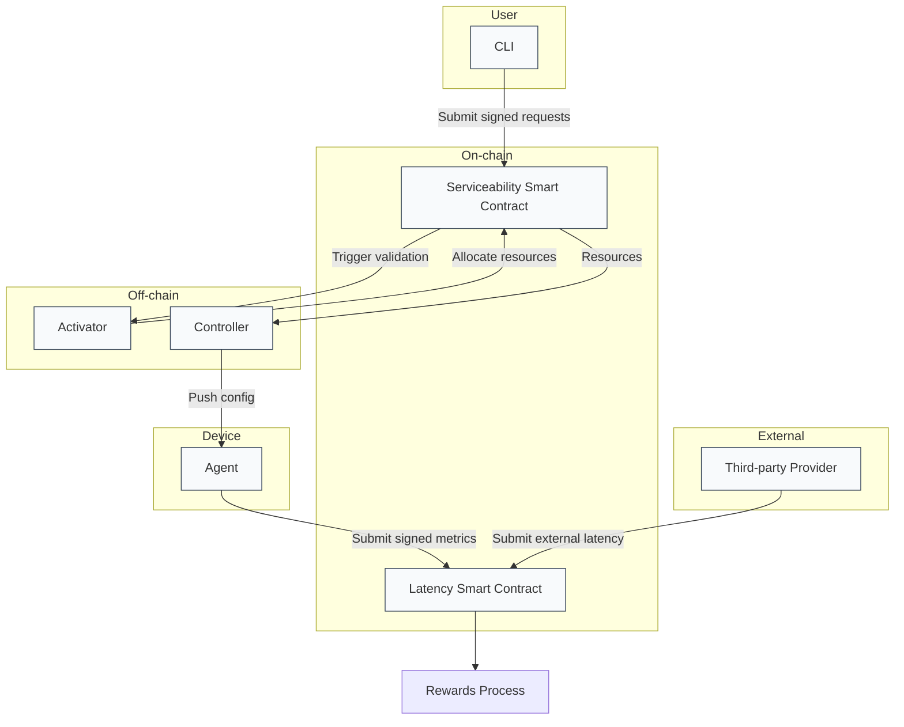
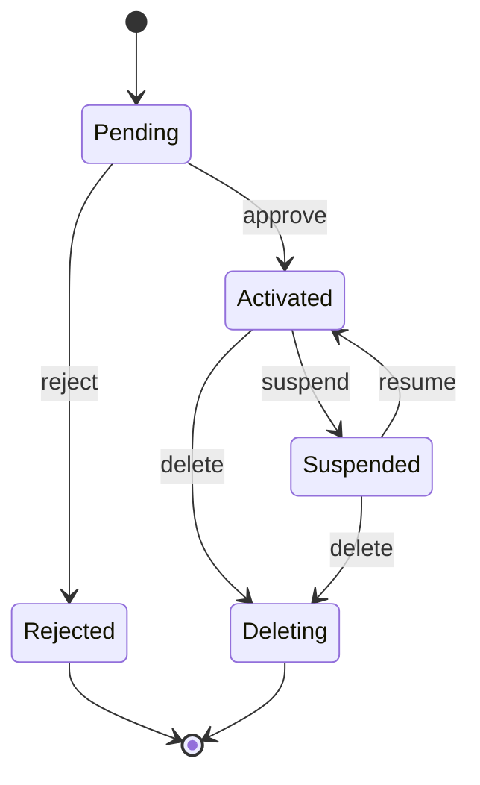
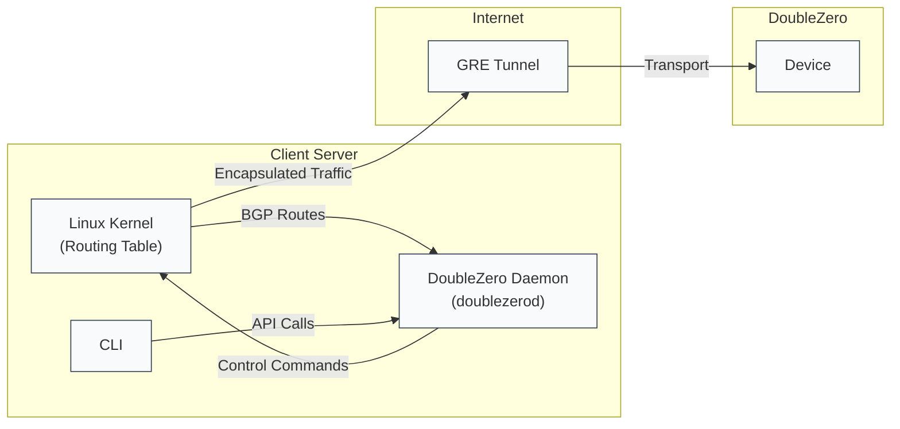
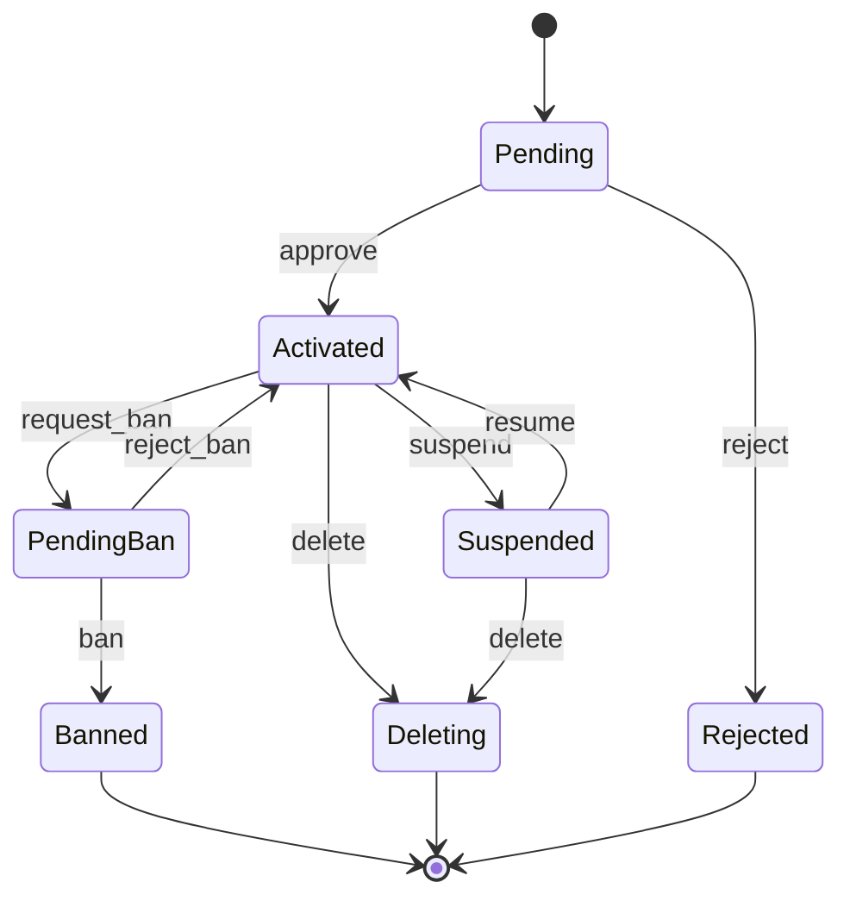

# **DoubleZero System Overview**

DoubleZero is a permissionless, multi-contributor network designed to facilitate the decentralized interconnection of devices, links, and users on the Solana blockchain. Its primary purpose is to enable multiple organizations or individuals to contribute, manage, and configure network resources—such as devices and tunnels—without relying on a central authority. This approach fosters openness, interoperability, and resilience within the network infrastructure.



## Contributor Process

The Serviceability smart contract establishes an abstraction layer where core network elements—locations, exchanges, devices, links, and users—are represented as on-chain structures. Each entity can be created, modified, or managed by different contributors, enabling a truly multi-contributor model. This architecture allows the network to evolve and expand collaboratively, adapting to diverse scenarios and requirements.

All information stored in the smart contract acts as the source of truth for other components in the DoubleZero ecosystem, supporting the automatic generation of configurations in multi-vendor environments. This ensures the network operates as a unified system, supporting unicast and multicast protocols, and offering flexibility in IP address assignment (either reusing the client’s address or assigning a public DoubleZero address).



This diagram represents two contributors within the DoubleZero network. Each contributor has a set of registered Devices and on-chain Links that define the connections between them. These Links enable the measurement of network performance and the calculation of rewards. In addition to internal links, the contributors are also interconnected through a special external device known as a **DZX**, which acts as a shared point of interconnection between contributors. This setup illustrates how different participants in the network can collaborate while maintaining ownership boundaries.

Users access the DoubleZero network by establishing a GRE (Generic Routing Encapsulation) tunnel to one of the Devices. Each Device is deployed in a specific city and is connected to the public internet through a local interconnection. This setup allows users to securely route their traffic into the DoubleZero mesh network, leveraging the closest Device as an entry point. The GRE tunnel provides a lightweight and flexible mechanism for encapsulating network packets, enabling seamless integration between the user's network and the DoubleZero infrastructure.

## Contributor Automation Process

DoubleZero is composed of six main components, each playing a specific role in enabling the operation of a decentralized, performance-aware network. Together, they provide the interface, control logic, automation, and monitoring required for contributors and users to participate in the system.



### 1. **CLI (Command Line Interface)**

The CLI is the main user-facing tool for interacting with the DoubleZero network. It allows contributors to register their contributor account, create and manage Devices and Links, query system status, and interact directly with the on-chain programs. All operations initiated through the CLI are cryptographically signed and submitted to the smart contract, ensuring secure, authenticated interactions and persistent on-chain state changes.

### 2. **Serviceability Smart Contract**

The Serviceability smart contract acts as the on-chain source of truth for the DoubleZero network. It securely stores all relevant metadata, including contributors, devices, and links, as well as state transitions such as pending, activated, or suspended. It also holds governance-related configurations. This contract enforces protocol-level rules, validates signatures from network participants, and ensures that all changes are transparent and auditable.

### 3. **Activator**

The Activator is an off-chain guardian process responsible for validating and activating the various entities submitted by contributors. It plays a central role in approving Devices, Links, and Users after performing validation checks, and in allocating critical resources such as IP blocks, tunnel indices, and GRE segments. By bridging operational requirements with on-chain governance, the Activator ensures that only properly configured and compliant participants are allowed to operate within the network.

### 4. **Controller**

The Controller is responsible for generating and applying network configuration to the physical or devices registered in the DoubleZero system. It uses the declarations stored on-chain to push routing rules, GRE tunnel definitions, and peering configurations to the appropriate devices. Its role is to ensure that all devices are provisioned correctly and are ready to forward traffic securely and efficiently. The Controller relies on the Agent to execute these actions on the hardware itself.

### 5. **Agent**

The Agent runs on or near each physical device and serves as the telemetry and operations interface at the edge of the network. It is responsible for collecting performance metrics such as latency, availability, and throughput, and for signing and submitting this telemetry data back to the network. By providing accurate, real-time measurements, the Agent plays a critical role in supporting DoubleZero’s performance-based reward model and in maintaining the health and accountability of the infrastructure.

### 6. Telemetry **Smart Contract**

The Latency Smart Contract functions as the on-chain registry for all network latency and performance metrics. It accepts signed reports from both internal agents and authorized third-party measurement providers, and supports measurements between DoubleZero devices as well as from external observation points. By storing this data immutably and transparently, the contract enables precise performance auditing and ensures that contributors are rewarded based on the actual quality of service they provide.

## Process Flows

### As a new contributor, I want to complete the registration process in DoubleZero so that I can participate in the network, contribute resources, and start earning rewards

To start contributing to DoubleZero, a contributor account must be registered. This is done using the DoubleZero CLI, where a code and the pubkey of the identity that will receive the rewards (ATA account) must be provided. The code is a short, space-free name used to identify the contributor. It doesn't need to reference the actual company—it can be something like a color or a flower name, for example. The ATA Owner is the pubkey that will be used to transfer the tokens generated from rewards.

```bash
$ doublezero contributor create --code flower_power
Signature: 2gpYMUZ5U8r8SxfRNvBN6i4LAawG3yHg5dQ3jDdUZriPv2rqDEJTe6EqTxt8SKurkeKdrHfTLdXdyaEdYg1SGWbU
```

After creating a contributor account on the DoubleZero network, it is possible to retrieve and inspect its current state. This includes querying on-chain data to verify that the contributor has been properly registered. As part of the creation process, the contributor must have an existing ATA on Solana that will be associated with the contributor’s identity. This identity Pubkey serves as the on-chain reference for all future interactions, such as device registration, reward distribution, and telemetry reporting. Confirming the contributor’s status and Pubkey ensures that the registration was successful and that the contributor is ready to participate in the network.

```bash
$ doublezero contributor list
 account                                      | code         | ata_owner                                    | status    | owner
 2CSc5wWzWmUoNeru81jyaQcJZQpVchVq6pe9nF3rQA2D | flower_power | 7CTniUa88iJKUHTrCkB4TjAoG6TD7AMivhQeuqN2LPtX | activated | DZKy4E6QNZSGowGoek4VX352QpHnRAWvqrd76vjbB3jo
```

### As a contributor, I want to create a Device that will be associated with my physical equipment, so that it can participate in the network and be eligible for rewards

To create Devices in the DoubleZero network, contributors must use the `create device` command provided by the CLI. This command requires several parameters that define key characteristics of the device, such as its name, geographic location, device type, and interface configuration. These parameters are essential not only for uniquely identifying the device within the network, but also for enabling the controller to provision and configure services correctly on the underlying physical hardware.

Once the device is registered on-chain, the controller uses the provided information to generate and deploy the appropriate configuration for that device. This includes setting up network interfaces, routing behavior, monitoring agents, and any additional logic required for the device to participate in the DoubleZero mesh. Proper device creation ensures that the node is fully integrated into the network and capable of handling telemetry, routing, and user traffic as intended.

```bash
$ doublezero device create --code la2-dz01 --contributor flower_power --location lax --exchange xlax --public-ip "207.45.216.134" --dz-prefixes "100.0.0.0/16" --metrics-publisher 1111111FVAiSujNZVgYSc27t6zUTWoKfAGxbRzzPB
Signature: 374zrVMZcA1bL1aMtUrRB2U5JW2ibZrXgXrQMkgTXD5RiSCQmo7gmd3dq4PdBw2RmhWer4J6LbcB4cfvcLmU1xNY
```

In this example, we are creating a device with the code `la2-dz01` for the contributor `flower_power`, located in Los Angeles. Cities are typically represented using the three-letter codes of their major airports—here, “LAX” is used for Los Angeles. The device is connected to the local exchange point `xlax`, which defines its interconnection within the DoubleZero network.

A public IP address is assigned to the device; this will be the IP used by clients to connect via GRE tunnels. We also define the prefix of the DZ IP range that this device will advertise to connected users.

Additionally, the public key `metrics-publisher` is authorized to sign and submit metrics for this device. This allows an external, trusted agent to report telemetry data such as latency and availability, contributing to the on-chain evaluation of the device’s performance and reward eligibility.



In the DoubleZero system, each Device follows a defined lifecycle that ensures it is properly validated and provisioned before it becomes active in the network. The diagram above illustrates the possible states a Device can transition through:

- **Pending**: This is the initial state when a contributor creates a device. At this stage, the device's information is registered on-chain but it is not yet active or usable. It is awaiting review and approval by the activator process to change it to Activated. But if it fails the approval process, the Activator can change the state to Rejected.
- **Activated**: Once a Device is approved—by an off-chain oracle process known as the *Activator*—it transitions to the `Activated` state. During this step, the Activator allocates the necessary resources (such as GRE configurations, IP allocations, and controller settings) and registers the device so it can begin serving users. While in this state, an actor can change the device's state to Suspended or Deleting.
- **Rejected**: If the device fails validation or is not approved, the Activator transitions the device to the `Rejected` state. This state indicates that the device will not be used in the network and will not proceed further. The device can only be deleted once in this state.
- **Suspended**: A contributor can suspend an activated device temporarily due to performance issues. In this state, the device is effectively paused and does not participate in routing. The contributor can then call the resume instruction to change the device state back to Activated.
- **Deleting**: A network contributor can delete his own device. Devices that are no longer needed or have been decommissioned enter the `Deleting` state. This is a terminal phase that leads to complete removal from the network. The Activator will close the device account and lamports will be sent back to the contributor.

We can retrieve a list of all devices that have been created and inspect the details of each, including the unique public key (Pubkey) that was generated during their registration. This Pubkey serves as the definitive on-chain identifier for the device and is used internally by the network to validate actions and ownership.

```bash
$ doublezero device list
 account                                      | code      | location | exchange | device_type | public_ip      | dz_prefixes                | status    | owner                             
 8scDVeZ8aB1TRTkBqaZgzxuk7WwpARdF1a39wYA7nR3W | la2-dz01  | lax      | xlax     | switch      | 207.45.216.134 | 100.0.0.0/16               | activated | DZKy4E6QNZSGowGoek4VX352QpHnRAWvqrd76vjbB3jo
```

In most CLI commands and workflows, devices are commonly referenced using their short code—an easily recognizable label assigned by the contributor at creation (e.g., `la2-dz01`). This approach simplifies interaction and improves human readability, especially when managing multiple devices.

However, in scenarios where absolute precision is required—such as scripting, automation, or when dealing with similarly named devices—it is recommended to use the device’s Pubkey instead. The Pubkey eliminates any ambiguity and ensures that the operation targets the exact intended device, regardless of naming conventions or human error.

```bash
$ doublezero device create --code ny5-dz01 --contributor flower_power --location ewr --exchange xewr --public-ip "64.86.249.80" --dz-prefixes "101.0.0.0/16" --metrics-publisher 1111111FVAiSujNZVgYSc27t6zUTWoKfAGxbRzzPB
Signature: 2BYKzcGt63t5t1eyC5gt9peKQa4VShjNHmoUJnZxZUwGMKd3DF3kt7mZirPu2iVkuUyLwyi4Vid2hyAZp59dK5q2

$ doublezero device list
 account                                      | code      | location | exchange | device_type | public_ip      | dz_prefixes                | status    | owner                             
 8scDVeZ8aB1TRTkBqaZgzxuk7WwpARdF1a39wYA7nR3W | la2-dz01  | lax      | xlax     | switch      | 207.45.216.134 | 100.0.0.0/16               | activated | DZKy4E6QNZSGowGoek4VX352QpHnRAWvqrd76vjbB3jo
 FBUy8tzFWa8LhQmCfXbnWZMg1XUDQfudanoVK5NP4KGP | ny5-dz01  | ewr      | xewr     | switch      | 64.86.249.80   | 101.0.0.0/16               | activated | DZKy4E6QNZSGowGoek4VX352QpHnRAWvqrd76vjbB3jo
```

### As a contributor, I want to define a link between two of my configured devices in DoubleZero, so that they can exchange data and be recognized as part of the same network topology

The following CLI command demonstrates how a contributor can establish a **Link** between two previously configured Devices. The link parameters ensure that traffic engineering, telemetry, and reward calculations reflect the intended characteristics of the physical connection.

```bash
$ doublezero link create wan --code "la2-dz01:ny5-dz01" --side-a la2-dz01 --side-z ny5-dz01 --bandwidth "10 Gbps" --mtu 9000 --delay-ms 40 --jitter-ms 3
Signature: 3gkYnutkpiZBkYqdPbDgm1Fc9diNSt2G5sUtKANUrKH2TmhVzkBBUL9Ao1KTwKEjxvAgD9ZKwiXnjMeyaNCqAYGz
```

| Argument | Description |
| --- | --- |
| `--code` | A unique human‑readable identifier for the link. (`la2-dz01:ny5-dz01`). |
| `--side-a` / `--side-z` | The short codes (or Pubkeys) of the Devices at each end of the link. |
| `--link-type` | The operational layer of the connection; `L3` indicates an IP (Layer‑3) link. |
| `--bandwidth` | Committed information rate for the link (here, **10 Gbps**). |
| `--mtu` | Maximum Transmission Unit size; a larger MTU (9000) supports jumbo frames and reduces overhead. |
| `--delay-ms` | Expected one‑way latency in milliseconds (40 ms) used for performance scoring. |
| `--jitter-ms` | Acceptable variation in latency (3 ms). |

When the command is executed, DoubleZero records the link on‑chain, validates that both Devices belong to the same contributor, and updates the network topology graph. Telemetry agents start monitoring the link to verify latency, and jitter targets. If the link meets the declared performance, the contributor receives higher rewards; otherwise, penalties may apply.


In the DoubleZero system, each Link follows a defined lifecycle that ensures it is properly validated and provisioned before it becomes active in the network. The diagram above illustrates the possible states a Link can transition through:

- **Pending**: This is the initial state when a contributor creates a link. At this stage, the link information is registered on-chain but it is not yet active or usable. It is awaiting review and approval by the activator process to change it to Activated. But if it fails the approval process, the Activator can change the state to Rejected.
- **Activated**: Once a Link is approved—by an off-chain oracle process known as the *Activator*—it transitions to the `Activated` state. During this step, the Activator allocates the necessary resources (such as GRE configurations, IP allocations, and controller settings) and registers the device so it can begin serving users. While in this state, an actor can change the link’s state to Suspended or Deleting.
- **Rejected**: If the link fails validation or is not approved, the Activator transitions the device to the `Rejected` state. This state indicates that the link will not be used in the network and will not proceed further. The link can only be deleted once in this state.
- **Suspended**: **This link state is not used for anything currently.** A contributor can suspend an activated link temporarily due to performance issues. In this state, the device is effectively paused and does not participate in routing. The contributor can then call the resume instruction to change the device state back to Activated.
- **Deleting**: A network contributor can delete his own link. Links that are no longer needed or have been decommissioned enter the `Deleting` state. This is a terminal phase that leads to complete removal from the network. The Activator will close the device account and lamports will be sent back to the contributor.

### As a contributor, I want to suspend a Device so that I can perform maintenance without allowing users to connect to it.

The suspension process in DoubleZero allows contributors to temporarily take a Device out of service without fully deleting or deregistering it. This is particularly useful when maintenance or reconfiguration is required.

When a contributor runs the command:

```bash
$ doublezero device suspend --pubkey EhAqBmYSg2aT2dYwv5zz81mTJGgNe9zGZvLFup1D55bU
Signature: 4TNjcojz3835pdowMjfTgBEoLtAPZVLHKW6C6HYT51V6ZiEsK9Tkms3PQmy4GYcasLyxMUbpEYq2sJPG8GSpYhWs
```

The system initiates a state transition for the specified Device, moving it from the **Activated** state to the **Suspended** state, as defined in the state diagram.

In the **Suspended** state:

- The Device is no longer eligible to receive user traffic.
- It is excluded from reward calculations.
- The Agent may continue collecting telemetry, but the data is not used for active performance evaluation.
- Links associated with the Device may also be disabled or marked as inactive depending on network policy.

The suspension is processed as an on-chain transaction, ensuring transparency and accountability. Once the maintenance is completed, the contributor or the Activator can resume the Device using a similar command, triggering a transition back to the **Activated** state. This allows the Device to safely rejoin the network without requiring a full reinitialization.

To bring a previously suspended device back into service, the contributor can use the `doublezero device resume` command. This operation signals to the network that the device is once again ready to operate, and should be returned to the **Activated** state.

For example:

```bash
$ doublezero device resume --pubkey EhAqBmYSg2aT2dYwv5zz81mTJGgNe9zGZvLFup1D55bU
Signature: 3wyZrqbZXUJRVcmphrdHvvpCiiGKJaMBZzobKTFZG94ok8C35vGRBvf5vS3uAWBA6cS5GhJAZ667EhtHN3ATgqga
```

Upon submission, the smart contract verifies the signature, confirms the device is currently in the **Suspended** state, and then processes the transition to **Activated**. Once resumed, the device regains its ability to receive new users.

This process allows contributors to maintain operational flexibility, ensuring that devices can be temporarily paused without being fully removed, and then restored to service in a seamless and secure way.

## User Process

To connect to the DoubleZero network, the user installs the DoubleZero client software on their server. This includes two components: the **CLI**, used to interact with the DoubleZero service (e.g., to register the user, view connection status, or retrieve assigned Devices), and the **daemon process**, called `doublezerod`, which handles the actual network integration.

The `doublezerod` process is responsible for establishing a **GRE tunnel** between the user's server and the assigned DoubleZero **Device**, using the public internet as the underlying transport layer. This tunnel provides a secure and direct path for encapsulated traffic to enter the DoubleZero mesh.

In addition to setting up the tunnel, `doublezerod` establishes a **BGP session** with the DoubleZero Device's switch. Through this session, the server receives a list of IP prefixes corresponding to known Solana validators participating in the DoubleZero network. For each received route, `doublezerod` injects a **static route** into the Linux kernel’s main routing table, effectively overriding the default path to those validators.

By routing traffic through the GRE tunnel and across the DoubleZero backbone, the server benefits from improved connectivity to all other participating validators. This setup reduces latency, avoids network congestion, and enhances the quality of inter-validator communication—critical for maintaining fast block propagation and effective participation in the Solana consensus process.

The integration is seamless from the user’s perspective, with the CLI and daemon abstracting the complexities of tunnel management and dynamic route handling.

## Testing

Program integration tests suppress Solana program logs by default to keep output readable. To enable program logs (useful for debugging test failures), set the `PROGRAM_LOG` environment variable:

```bash
PROGRAM_LOG=1 cargo test-sbf -p doublezero-serviceability
```



This process ensures that once DoubleZero is connected, traffic to validators that are part of the DoubleZero network will begin to flow through the optimized DoubleZero backbone, while traffic to validators that are still operating over the public internet will continue to use the default internet route. This guarantees that no service restart is required and that traffic will transparently follow the improved path.

Additionally, this setup provides an automatic fallback mechanism: if the BGP session is disconnected, the daemon removes the static routes from the kernel’s routing table, allowing traffic to seamlessly continue flowing over the internet without interruption.

To orchestrate this entire flow, the CLI is responsible for creating the user account on the smart contract, waiting for the Activator to validate and assign the necessary resources, and then initiating the connection process through the DoubleZero Daemon, which handles the tunnel setup and route provisioning.

## User account lifecycle



The user account lifecycle in DoubleZero follows a stateful process that ensures all user registrations and terminations are validated, controlled, and auditable. The transitions between states are governed by a combination of user actions and decisions made by the network's Activator or governance entities.

### **User Account Flow Description**

1. **Pending**
    
    When a user runs the `doublezero connect` command, a new user account is created on the smart contract in the **Pending** state. At this stage, the user is not yet active in the network. The request awaits validation and approval by the **Activator**, which checks the configuration and assigns necessary network resources (like IP addresses).
    
2. **Activated**
    
    If the Activator approves the user, the account transitions to the **Activated** state. The user is now officially part of the DoubleZero network, and GRE tunneling and BGP sessions. The user’s validator benefits from improved network connectivity at this point.
    
3. **Rejected**
    
    If the Activator finds the request invalid or non-compliant, the user is moved to the **Rejected** state. The account is discarded and cannot be used unless re-created.
    
4. **Suspended**
    
    A user in the Activated state can temporarily **suspend** their connection, for instance, to perform maintenance or stop routing traffic through DoubleZero. This can be initiated by the user themselves. Suspended users are not eligible for routing or performance rewards until they resume.
    
5. **Resume**
    
    A previously suspended user can transition back to the Activated state by using the `doublezero resume` command, which restores routing and re-establishes connectivity.
    
6. **Deleting**
    
    When a user decides to permanently leave the network, they can initiate a **delete** operation. This sets the account to the **Deleting** state. The **Activator** then performs the cleanup (revoking resources, tearing down tunnels) and finalizes the deletion by removing the user account from the smart contract.
    
7. **Banning**
    
    In certain cases, such as policy violations or abuse, someone from the **DoubleZero Foundation** can initiate a **ban request**. This moves the user to the **PendingBan** state. After review, if the ban is confirmed, the account transitions to **Banned**, and the user is forcibly disconnected from the network. Banned users are considered permanently disallowed from rejoining.
    

## As a user, I want to be able to connect to the DoubleZero network from my server so that I can improve the connectivity of my Solana validator.

To fulfill this objective, the user runs the command:

```bash
$ doublezero connect
```

This command initiates a full connection workflow managed by the CLI and the DoubleZero Daemon. In the background, the **daemon (`doublezerod`)** has already been actively measuring **latency** from the user’s server to all available Devices in the network. These latency measurements are continuously updated to reflect real network conditions.

When the `connect` command is executed, the CLI queries the list of Devices along with the latest latency results. It then **automatically selects the optimal Device** based on the lowest measured latency, ensuring that the user is connected through the most performant entry point in the network.

Once the best Device is selected, the CLI proceeds to **create a new User account** on the **Serviceability smart contract**, which includes the identity of the server and its selected Device. This request is signed and submitted on-chain.

The **Activator** then picks up this pending User, validates the request, and—if all conditions are met—**approves the user and assigns a network resource**, such as a dedicated IP address from the contributor’s IP block, if required.

Once the account is approved and provisioned, the **daemon finalizes the connection**, establishing a GRE tunnel to the selected Device and exchanging BGP routes. From this point forward, the user’s server routes traffic to known Solana validators through the optimized DoubleZero mesh, significantly improving latency, packet delivery, and overall validator performance—without requiring manual network reconfiguration or restarts.

### **Usage**

```bash
doublezero connect [OPTIONS] <COMMAND>
```

### **Commands (Connection Modes)**

- **`ibrl`**
    
    Provisions the user in **IBRL mode** (Increase bandwidth and reduce latency).
    
    In this mode, the user's server establishes a BGP session with the Device, receives validator route announcements, and dynamically configures static routes to redirect Solana-related traffic through the DoubleZero tunnel. This is the most common and performance-optimized setup for Solana validators.
    
- **`multicast`**
    
    Provisions the user in **Multicast mode**.
    
    This mode is intended for advanced scenarios where the user requires multicast routing support, often used in testing, monitoring, or special-purpose traffic distribution. It’s less common for validator use cases.
    

---

### **Options**

- `--client-ip <CLIENT_IP>`
    
    (Optional) Specifies the **IPv4 address** of the user's server.
    
    If not provided, the client attempts to detect the IP automatically. This IP is used for tunnel source validation and helps the Activator assign the appropriate GRE configuration.
    
- `--device <DEVICE>`
    
    (Optional) Defines the **Device** to which the user should connect. This can be a **Device code** (e.g., `la2-dz01`) or its **Pubkey**.
    
    If not specified, the CLI will select the best available Device based on latency measurements gathered by the daemon.
    
- `--verbose`
    
    Enables **verbose output**, which provides more detailed logs about the steps being performed during provisioning and connection. Useful for debugging or audit purposes.
    

## As a user, I want to disconnect my server from the DoubleZero network so that I can perform maintenance, reconfigure my network, or temporarily stop participating without affecting my local services.

To disconnect a server from the DoubleZero network, users can use the `doublezero disconnect` command. This command cleanly removes the server’s connection to the selected DoubleZero Device, deactivates routing rules, and tears down the associated GRE tunnel. It is typically used when a user needs to perform server maintenance, reconfigure local network settings, or simply stop routing traffic through DoubleZero temporarily.

### Example Usage

```bash
doublezero disconnect ibrl --device la2-dz01
```

### Parameters

- **`[DZ_MODE]`**
    
    Specifies the disconnection mode. Possible values:
    
    - `ibrl`: Disconnects the server from DoubleZero in Intelligent BGP Route Learning mode.
    - `multicast`: Used for disconnecting from a multicast-enabled setup.
- **`-device <DEVICE>`**
    
    (Optional) Specifies the Device to disconnect from, using either the short code (e.g., `la2-dz01`) or the Device’s public key. If omitted, the daemon will determine the active Device based on session state.
    
- **`--client-ip <CLIENT_IP>`**

    (Deprecated) Previously used to specify the client IP for disconnect. The daemon (doublezerod) now manages the client IP — set `--client-ip` on the daemon instead.


---

When executed, this command instructs the DoubleZero Daemon to:

1. Tear down the GRE tunnel between the server and the specified Device.
2. Withdraw BGP sessions.
3. Remove static routes injected into the kernel’s routing table.
4. Delete the user account on smart contract.

This operation is safe and does not disrupt any unrelated services running on the server. Once disconnected, the server resumes using its default internet routes, allowing traffic to continue flowing normally outside of DoubleZero.
