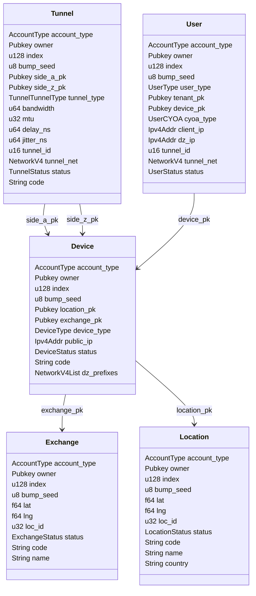

# DoubleZero CLI Command Library

This project centralizes all CLI commands used by the various DoubleZero command-line interfaces (CLIs) in a single, reusable library. By consolidating command logic here, we ensure consistency, maintainability, and ease of extension across all DoubleZero CLI tools.

## Purpose

- **Centralization:** All CLI commands are implemented in one place, avoiding code duplication and simplifying updates.
- **SDK Integration:** Each command uses the DoubleZero Rust SDK to interact with the Solana smart contract, enabling on-chain queries and state modifications.
- **Extensibility:** New commands or changes to existing ones can be made in this library and immediately benefit all CLIs that depend on it.

## How It Works

- CLI tools import this library to access a unified set of commands.
- Commands use the SDK to build and send transactions, query on-chain data, and process results.
- The command library abstracts away low-level details, providing a high-level interface for CLI development.

## Main On-Chain Structures

Below are the main on-chain structures managed by the CLI commands. Each structure is represented as a Rust struct and mapped to a Solana account. The following Mermaid diagram shows their relationships:



A CLI tool can use this library as follows:

```rust
use doublezero_cli_commands::device::CreateDeviceCommand;

let cmd = CreateDeviceCommand {

}.execute(&client)?;
```

## Entities and Commands Covered

- **Device:** Create, update, list, and manage devices.
- **Tunnel:** Create, update, list, and manage tunnels.
- **Location:** Create, update, list, and manage locations.
- **Exchange:** Create, update, list, and manage exchanges.
- **User:** Register, update, list, and manage users.

Each command is documented in the SDK and follows a consistent interface for ease of use.

## CLI Commands by Structure

Below is a list of available CLI commands for each main on-chain structure:

### Location
- `location create` — Create a new location
    | Argument     | Type     | Description                |
    |--------------|----------|----------------------------|
    | --code       | String   | Location code/identifier   |
    | --name       | String   | Location name              |
    | --country    | String   | Country                    |
    | --lat        | f64      | Latitude                   |
    | --lng        | f64      | Longitude                  |
    | --loc-id     | f64      | Location id                |
- `location delete` — Delete a location
    | Argument   | Type   | Description           |
    |------------|--------|-----------------------|
    | --pubkey   | Pubkey | Location public key   |
- `location get` — Get location details
    | Argument   | Type   | Description           |
    |------------|--------|-----------------------|
    | --pubkey   | Pubkey | Location public key   |
- `location list` — List all locations
        
    | Field           | Type     | Description                       |
    |-----------------|----------|-----------------------------------|
    | account         | Pubkey   | Location public key               |
    | code            | String   | Location code/identifier          |
    | name            | String   | Location name                     |
    | country         | String   | Country                           |
    | lat             | f64      | Latitude                          |
    | lng             | f64      | Longitude                         |
    | status          | Enum     | Location status                   |
    | owner           | Pubkey   | Owner's public key                |
- `location update` — Update location information
    | Argument     | Type     | Description                |
    |--------------|----------|----------------------------|
    | --pubkey     | Pubkey   | Location public key        |
    | --code       | String   | Location code/identifier   |
    | --name       | String   | Location name              |
    | --country    | String   | Country                    |
    | --lat        | f64      | Latitude                   |
    | --lng        | f64      | Longitude                  |
    | --loc-id     | f64      | Location id                |

### Exchange
- `exchange create` — Create a new exchange
    | Argument     | Type     | Description                |
    |--------------|----------|----------------------------|
    | --code       | String   | Exchange code/identifier   |
    | --name       | String   | Exchange name              |
    | --lat        | f64      | Latitude                   |
    | --lng        | f64      | Longitude                  |
    | --loc-id     | f64      | Location id                |
- `exchange delete` — Delete an exchange
    | Argument   | Type   | Description           |
    |------------|--------|-----------------------|
    | --pubkey   | Pubkey | Exchange public key   |
- `exchange get` — Get exchange details
    | Argument   | Type   | Description           |
    |------------|--------|-----------------------|
    | --pubkey   | Pubkey | Exchange public key   |
- `exchange list` — List all exchanges
    *(none)*
    
    | Field           | Type     | Description                       |
    |-----------------|----------|-----------------------------------|
    | account         | Pubkey   | Exchange public key               |
    | code            | String   | Exchange code/identifier          |
    | name            | String   | Exchange name                     |
    | country         | String   | Country                           |
    | lat             | f64      | Latitude                          |
    | lng             | f64      | Longitude                         |
    | status          | Enum     | Exchange status                   |
    | owner           | Pubkey   | Owner's public key                |
- `exchange update` — Update exchange information
    | Argument     | Type     | Description                |
    |--------------|----------|----------------------------|
    | --pubkey     | Pubkey   | Exchange public key        |
    | --code       | String   | Exchange code/identifier   |
    | --name       | String   | Exchange name              |
    | --country    | String   | Country                    |
    | --lat        | f64      | Latitude                   |
    | --lng        | f64      | Longitude                  |

### Device
- `device create` — Create a new device
    | Argument         | Type     | Description                       |
    |------------------|----------|-----------------------------------|
    | --code           | String   | Device code/identifier            |
    | --location       | Pubkey   | Location public key               |
    | --exchange       | Pubkey   | Exchange public key               |
    | --public-ip      | Ipv4Addr | Device public IPv4 address        |
    | --device-type    | Enum     | Device type                       |
- `device delete` — Delete a device
    | Argument   | Type   | Description         |
    |------------|--------|---------------------|
    | --pubkey   | Pubkey | Device public key   |
- `device get` — Get device details
    | Argument   | Type   | Description         |
    |------------|--------|---------------------|
    | --pubkey   | Pubkey | Device public key   |
- `device list` — List all devices
    
    | Field           | Type     | Description                       |
    |-----------------|----------|-----------------------------------|
    | account         | Pubkey   | Device public key                 |
    | code            | String   | Device code/identifier            |
    | location        | Pubkey   | Location public key               |
    | exchange        | Pubkey   | Exchange public key               |
    | device_type     | Enum     | Device type                       |
    | public_ip       | Ipv4Addr | Device public IPv4 address        |
    | dz_prefixes     | List     | List of network prefixes          |
    | status          | Enum     | Device status                     |
    | owner           | Pubkey   | Owner's public key                |
- `device resume` — Resume a suspended device
    | Argument   | Type   | Description         |
    |------------|--------|---------------------|
    | --pubkey   | Pubkey | Device public key   |
- `device suspend` — Suspend a device
    | Argument   | Type   | Description         |
    |------------|--------|---------------------|
    | --pubkey   | Pubkey | Device public key   |
- `device update` — Update device information
    | Argument         | Type     | Description                       |
    |------------------|----------|-----------------------------------|
    | --pubkey         | Pubkey   | Device public key                 |
    | --code           | String   | Device code/identifier            |
    | --public-ip      | Ipv4Addr | Device public IPv4 address        |
    | --dz-prefixes    | List     | List of network prefixes          |

### Tunnel
- `tunnel create` — Create a new tunnel
    | Argument        | Type     | Description                        |
    |-----------------|----------|------------------------------------|
    | --code          | String   | Tunnel code/identifier             |
    | --owner         | Pubkey   | Owner's public key                 |
    | --side-a        | Pubkey   | Side A device public key           |
    | --side-z        | Pubkey   | Side Z device public key           |
    | --tunnel-type   | Enum     | Tunnel type                        |
    | --bandwidth     | u64      | Bandwidth (bps)                    |
    | --mtu           | u32      | MTU (bytes)                        |
    | --delay-ns      | u64      | Delay (milliseconds)               |
    | --jitter-ns     | u64      | Jitter (milliseconds)              |
- `tunnel delete` — Delete a tunnel
    | Argument   | Type   | Description         |
    |------------|--------|---------------------|
    | --pubkey   | Pubkey | Tunnel public key   |
- `tunnel get` — Get tunnel details
    | Argument   | Type   | Description         |
    |------------|--------|---------------------|
    | --pubkey   | Pubkey | Tunnel public key   |
- `tunnel list` — List all tunnels
    
    | Field           | Type     | Description                       |
    |-----------------|----------|-----------------------------------|
    | account         | Pubkey   | Tunnel public key                 |
    | code            | String   | Tunnel code/identifier            |
    | side_a_pk       | Pubkey   | Side A device public key          |
    | side_z_pk       | Pubkey   | Side Z device public key          |
    | tunnel_type     | Enum     | Tunnel type                       |
    | bandwidth       | u64      | Bandwidth (bps)                   |
    | mtu             | u32      | MTU (bytes)                       |
    | delay_ns        | u64      | Delay (milliseconds)              |
    | jitter_ns       | u64      | Jitter (milliseconds)             |
    | tunnel_net      | NetworkV4| Tunnel network prefix             |
    | status          | Enum     | Tunnel status                     |
    | owner           | Pubkey   | Owner's public key                |
- `tunnel update` — Update tunnel information
    | Argument        | Type     | Description                        |
    |-----------------|----------|------------------------------------|
    | --pubkey        | Pubkey   | Tunnel public key                  |
    | --code          | String   | Tunnel code/identifier             |
    | --bandwidth     | u64      | Bandwidth (bps)                    |
    | --mtu           | u32      | MTU (bytes)                        |
    | --delay-ns      | u64      | Delay (milliseconds)               |
    | --jitter-ns     | u64      | Jitter (milliseconds)              |

### User
- `user create` — Register a new user
    | Argument      | Type     | Description                |
    |---------------|----------|----------------------------|
    | --device      | Pubkey   | Device public key          |
    | --cyoa-type   | Enum     | CYOA type                  |
    | --client-ip   | Ipv4Addr | Client IPv4 address        |
    | --dz-ip       | Ipv4Addr | DoubleZero IPv4 address    |
    | -a            | Option   | Allocate DZ IP             |
- `user delete` — Delete a user
    | Argument   | Type   | Description         |
    |------------|--------|---------------------|
    | --pubkey   | Pubkey | User public key     |
- `user get` — Get user details
    | Argument   | Type   | Description         |
    |------------|--------|---------------------|
    | --pubkey   | Pubkey | User public key     |
- `user list` — List all users
    
    | Field           | Type     | Description                       |
    |-----------------|----------|-----------------------------------|
    | account         | Pubkey   | User public key                   |
    | user_type       | Enum     | User type                         |
    | tenant_pk       | Pubkey   | Tenant public key                 |
    | device_pk       | Pubkey   | Device public key                 |
    | cyoa_type       | Enum     | CYOA type                         |
    | client_ip       | Ipv4Addr | Client IPv4 address               |
    | dz_ip           | Ipv4Addr | DoubleZero IPv4 address           |
    | tunnel_id       | u16      | Tunnel ID                         |
    | tunnel_net      | NetworkV4| Tunnel network prefix             |
    | status          | Enum     | User status                       |
    | owner           | Pubkey   | Owner's public key                |
- `user request_ban` — Request a user ban
    | Argument   | Type   | Description         |
    |------------|--------|---------------------|
    | --pubkey   | Pubkey | User public key     |
- `user update` — Update user information
    | Argument      | Type     | Description                |
    |---------------|----------|----------------------------|
    | --pubkey      | Pubkey   | User public key            |
    | --client-ip   | Ipv4Addr | Client IPv4 address        |
    | --dz-ip       | Ipv4Addr | DoubleZero IPv4 address    |
    | --tunnel-id   | u16      | Tunnel ID                  |
    | --tunnel-net  | NetworkV4| Tunnel network prefix      |

---

For more details on each command and structure, see the SDK documentation and the main smart contract README.
