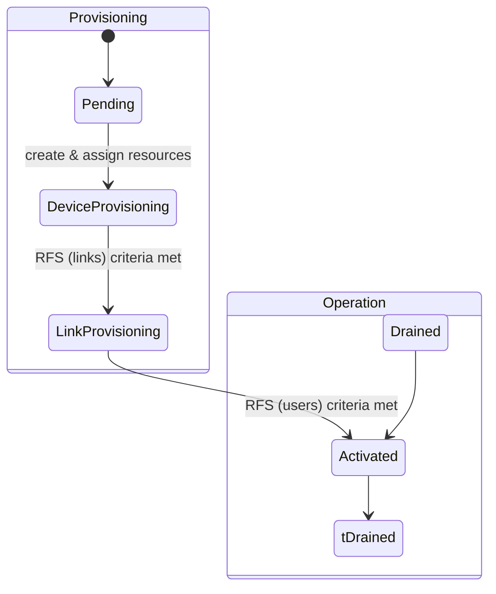
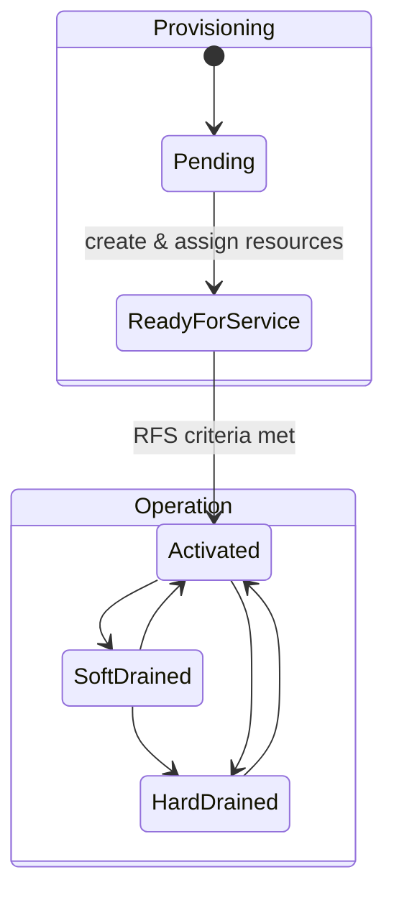

# Provisioning in DoubleZero Smart Contract

This document describes the provisioning process for Devices and Links in the DoubleZero smart contract, including their states and transitions. The design is based on [RFC 12: Network Provisioning Framework](https://github.com/malbeclabs/doublezero/blob/main/rfcs/rfc12-network-provisioning.md).

## Device States and Transitions

Device provisioning is a multi-stage process, with explicit states to represent the lifecycle of a device:

### DeviceStatus Enum
```
pub enum DeviceStatus {
	Pending = 0,                // 1. assign resources and change to DeviceProvisioning
	Activated = 1,              // 4. device and link health checks have passed and device is ready to connect users
	Deleting = 3,
	Rejected = 4,
	Drained = 5,
	DeviceProvisioning = 6,     // 2. controller provides configuration.
	LinkProvisioning = 7,       // 3. device health checks have passed and device is ready to connect links
}
```


### Device State Transitions
1. **Pending → DeviceProvisioning**: Device is created and resources are assigned.
2. **DeviceProvisioning → LinkProvisioning**: All device RFS (Ready For Service) criteria for links are met (e.g., interfaces, agents, reporting).
3. **LinkProvisioning → Activated**: All device RFS criteria for users are met (e.g., links up, QA tests passed).
4. **Activated → Drained**: Device is being prepared for maintenance; user traffic is drained.
5. **Drained → Activated**: Maintenance is complete and device is ready for users again.
6. **Any → Suspended/Deleting/Rejected**: Administrative or error conditions.




Device transitions are managed by the serviceability program and the device-health-oracle, which monitors health and readiness.

## Link States and Transitions

Links (WAN or DZX) also have a well-defined lifecycle:

### LinkStatus Enum
```
pub enum LinkStatus {
	Pending = 0,
	Activated = 1,
	Suspended = 2,
	Deleting = 3,
	Rejected = 4,
	Requested = 5,
	HardDrained = 6,
	SoftDrained = 7,
	Provisioning = 8,
}
```

### Link State Transitions
1. **Pending → Provisioning**: Link is created and initial resources are assigned.
2. **Provisioning → Activated**: All link RFS criteria are met (burn-in period, health checks, telemetry).
3. **Activated → SoftDrained/HardDrained**: Link is being prepared for maintenance (SoftDrained for metric increase, HardDrained for full removal from routing).
4. **Drained → Activated**: Maintenance is complete and link is ready for service again.
5. **Any → Suspended/Deleting/Rejected**: Administrative or error conditions.



Link transitions are managed by the serviceability program and device-health-oracle, with controller support for configuration changes.

## Health and Desired Status

Both Devices and Links have `health` and `desired_status` fields to support intent-based operations:

### DeviceHealth
```
pub enum DeviceHealth {
	Unknown = 0,
	Pending = 1,
	ReadyForLinks = 2,        // ready to connect links
	ReadyForUsers = 3,        // ready to connect users
	Impaired = 4,
}
```

### LinkHealth
```
pub enum LinkHealth {
	Unknown = 0,
	Pending = 1,
	ReadyForService = 2,
	Impaired = 3,
}
```

### DeviceDesiredStatus / LinkDesiredStatus
```
pub enum DeviceDesiredStatus {
    Pending = 0,
    Activated = 1,
    HardDrained = 6,
    SoftDrained = 7,
}

pub enum LinkDesiredStatus {
    Pending = 0,
    Activated = 1,
    HardDrained = 6,
    SoftDrained = 7,
}
```

## Provisioning Workflow Summary

1. **Onboarding**: Devices and links are created in Pending/Provisioning state. Health checks and burn-in periods are enforced.
2. **Activation**: When all RFS criteria are met, health is updated and status transitions to Activated.
3. **Maintenance**: Draining (Soft/Hard) is used to safely remove user or transit traffic for maintenance. After maintenance, status can return to Activated.
4. **Offboarding**: (Out of scope) Devices/links can be deleted or rejected administratively.

## References
- [RFC 12: Network Provisioning Framework](https://github.com/malbeclabs/doublezero/blob/main/rfcs/rfc12-network-provisioning.md)
- [RFC 9: Link Draining](https://github.com/malbeclabs/doublezero/blob/main/rfcs/rfc9-link-draining.md)
