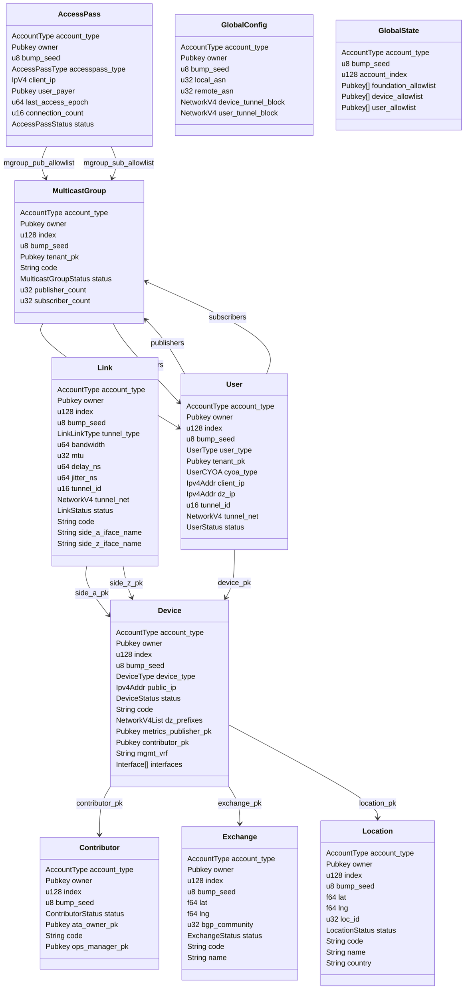
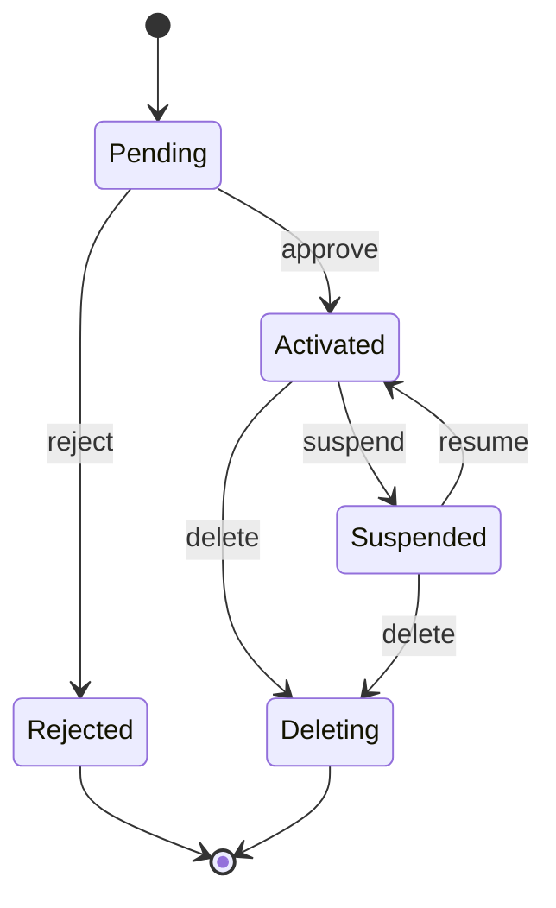
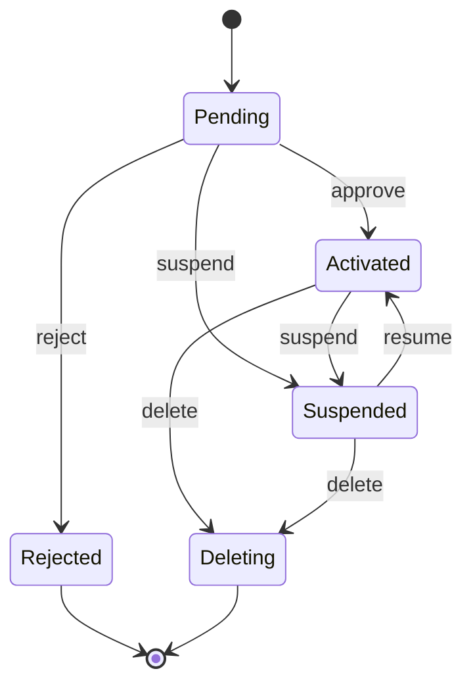
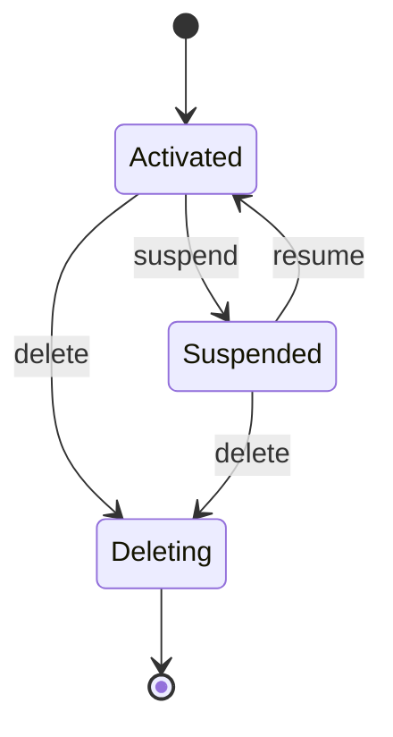
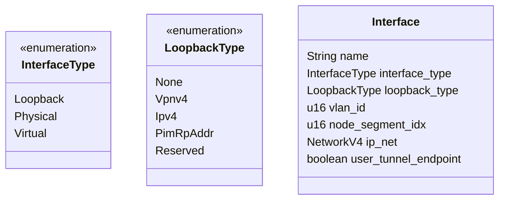
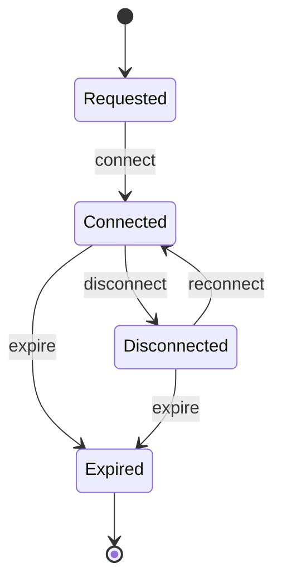
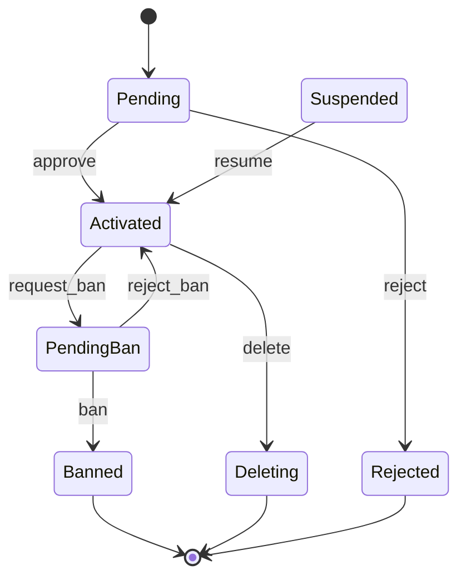
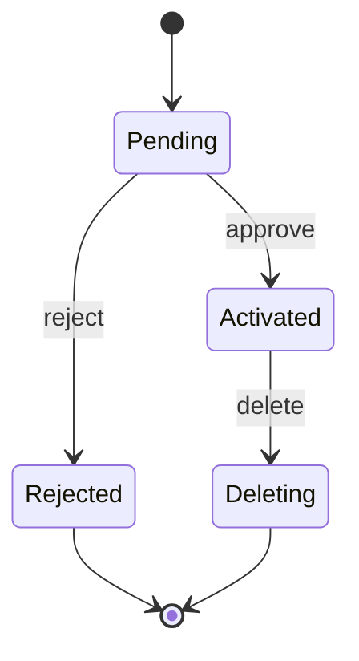

# DoubleZero Solana Smart Contract

DoubleZero is a permissionless, multi-contributor network designed to facilitate the decentralized interconnection of devices, tunnels, and users on the Solana blockchain. Its primary purpose is to enable multiple organizations or individuals to contribute, manage, and configure network resources—such as devices and tunnels—without relying on a central authority. This approach fosters openness, interoperability, and resilience within the network infrastructure.

The DoubleZero smart contract establishes an abstraction layer where core network elements—locations, exchanges, devices, tunnels, and users—are represented as on-chain structures. Each entity can be created, modified, or managed by different contributors, enabling a truly multi-contributor model. This architecture allows the network to evolve and expand collaboratively, adapting to diverse scenarios and requirements.

The permissionless characteristic means that any authorized user can interact with the network to create or modify resources without needing centralized approvals. Users can connect to the nearest DoubleZero device and access network services transparently, while contributors can autonomously deploy and manage network infrastructure.

All information stored in the smart contract acts as the source of truth for other components in the DoubleZero ecosystem, supporting the automatic generation of configurations in multi-vendor environments. This ensures the network operates as a unified system, supporting both unicast and multicast protocols, and offering flexibility in IP address assignment (either reusing the client’s address or assigning a public DoubleZero address).

## Accounts (`state/`)

The following Rust structures define the on-chain account types that the smart contract will manage to store all information related to the DoubleZero network definition. Each contributor can define their own objects, and all participants will be able to read the network as a single, unified entity operating collaboratively.

- **Location**: Structure and enums for locations, including status.
- **Exchange**: Structure and enums for exchanges, including status.
- **Contributor**: Structure and enums for contributors, including status.
- **Device**: Structure and enums for devices, including device type and status.
- **Link**: Structure and enums for links, including tunnel type and status.
- **User**: Structure and enums for users, including user type.
- **MulticastGroup**: Structure and enums for multicast groups, including status.
- **GlobalConfig**: Structure for global configuration parameters, such as ASNs and network blocks.
- **GlobalState**: Structure for the global state, including allowlists and global indices.

---

## State Structure Diagram

---

## Location

Represents a physical or logical location in the DoubleZero network. Locations are used to group devices and exchanges geographically or logically, and store metadata such as coordinates and country.

| Field        | Type           | Description     |
| ------------ | -------------- | --------------- |
| account_type | AccountType    | Type of account |
| owner        | Pubkey         | Location owner  |
| index        | u128           | Location index  |
| bump_seed    | u8             | PDA bump seed   |
| lat          | f64            | Latitude        |
| lng          | f64            | Longitude       |
| loc_id       | u32            | Location ID     |
| status       | LocationStatus | Location status |
| code         | String         | Location code   |
| name         | String         | Location name   |
| country      | String         | Country         |

## Exchange

Represents an exchange point in the network, typically associated with a location. Exchanges facilitate interconnection between devices and users, and store metadata such as coordinates and status.

| Field               | Type           | Description     |
| ------------------- | -------------- | --------------- |
| account_type        | AccountType    | Type of account |
| owner               | Pubkey         | Exchange owner  |
| index               | u128           | Exchange index  |
| bump_seed           | u8             | PDA bump seed   |
| lat                 | f64            | Latitude        |
| lng                 | f64            | Longitude       |
| bgp_community       | u32            | BGP community   |
| status              | ExchangeStatus | Exchange status |
| code                | String         | Exchange code   |
| name                | String         | Exchange name   |

## Contributor

Network Contributors are responsible for administering devices and tunnels in the DoubleZero network. These users expand and maintain the network by adding and managing hardware and connectivity.

| Field        | Type              | Description        |
| ------------ | ----------------- | ------------------ |
| account_type | AccountType       | Type of account    |
| owner        | Pubkey            | Contributor owner  |
| index        | u128              | Contributor index  |
| bump_seed    | u8                | PDA bump seed      |
| status       | ContributorStatus | Contributor status |
| code         | String            | Contributor code   |
| ata_owner    | Pubkey            | ATA identity       |

## Device

Represents a network device (such as a switch) that participates in the DoubleZero network. Devices are linked to locations and exchanges, and store information such as public IP, type, and status.

| Field                  | Type             | Description                                 |
|------------------------|------------------|---------------------------------------------|
| account_type           | AccountType      | Type of account                             |
| owner                  | Pubkey           | Device owner                                |
| index                  | u128             | Device index                                |
| bump_seed              | u8               | PDA bump seed                               |
| location_pk            | Pubkey           | Location public key                         |
| exchange_pk            | Pubkey           | Exchange public key                         |
| device_type            | DeviceType       | Device type (e.g. Switch)                   |
| public_ip              | Ipv4Addr         | Public IP address                           |
| status                 | DeviceStatus     | Device status                               |
| code                   | String           | Device code                                 |
| dz_prefixes            | NetworkV4List    | List of network prefixes                    |
| metrics_publisher_pk   | Pubkey           | Metrics publisher public key                |
| contributor_pk         | Pubkey           | Contributor public key                      |
| mgmt_vrf               | String           | Management VRF name or "" for not set       |
| interfaces             | Vec of Interface | List of device interfaces                   |

## Link

Represents a network tunnel between two endpoints (devices or users) in the DoubleZero network. Links define connectivity, bandwidth, and other transport parameters.

| Field             | Type         | Description             |
|-------------------|--------------|-------------------------|
| account_type      | AccountType  | Type of account         |
| owner             | Pubkey       | Link owner              |
| index             | u128         | Link index              |
| bump_seed         | u8           | PDA bump seed           |
| side_a_pk         | Pubkey       | Side A public key       |
| side_z_pk         | Pubkey       | Side Z public key       |
| tunnel_type       | LinkLinkType | Tunnel type             |
| bandwidth         | u64          | Bandwidth               |
| mtu               | u32          | MTU                     |
| delay_ns          | u64          | Delay in nanoseconds    |
| jitter_ns         | u64          | Jitter in nanoseconds   |
| tunnel_id         | u16          | Tunnel ID               |
| tunnel_net        | NetworkV4    | Tunnel network          |
| status            | LinkStatus   | Link status             |
| code              | String       | Link code               |
| side_a_iface_name | String       | Side A interface name   |
| side_z_iface_name | String       | Side Z interface name   |

## AccessPass

Represents an access pass in the DoubleZero network. AccessPasses are used to control and track access to network resources, including multicast group permissions and connection status.

| Field                  | Type                | Description                                                        |
|------------------------|---------------------|--------------------------------------------------------------------|
| account_type           | AccountType         | Type of account (must be AccessPass)                               |
| owner                  | Pubkey              | Pass owner                                                         |
| bump_seed              | u8                  | Bump seed for PDA                                                  |
| accesspass_type        | AccessPassType      | Pass type (`Prepaid` or `SolanaValidator(Pubkey)`)                 |
| client_ip              | Ipv4Addr            | Associated client IP                                               |
| user_payer             | Pubkey              | User who pays for the access                                       |
| last_access_epoch      | u64                 | Last access epoch (`u64::MAX` = unlimited)                         |
| connection_count       | u16                 | Number of performed connections                                    |
| status                 | AccessPassStatus    | Pass status (`Requested`, `Connected`, `Disconnected`, `Expired`)  |
| mgroup_pub_allowlist   | Vec<Pubkey>         | Multicast groups this pass can publish to                          |
| mgroup_sub_allowlist   | Vec<Pubkey>         | Multicast groups this pass can subscribe to                        |

## User

Represents a user account in the DoubleZero network. Users are associated with devices and tunnels, and store information such as user type, IP addresses, and status.

| Field        | Type        | Description       |
| ------------ | ----------- | ----------------- |
| account_type | AccountType | Type of account   |
| owner        | Pubkey      | User owner        |
| index        | u128        | User index        |
| bump_seed    | u8          | PDA bump seed     |
| user_type    | UserType    | User type         |
| tenant_pk    | Pubkey      | Tenant public key |
| device_pk    | Pubkey      | Device public key |
| cyoa_type    | UserCYOA    | CYOA type         |
| client_ip    | IpV4Addr    | Client IP         |
| dz_ip        | IpV4Addr    | DoubleZero IP     |
| tunnel_id    | u16         | Tunnel ID         |
| tunnel_net   | NetworkV4   | Tunnel network    |
| status       | UserStatus  | User status       |

## MulticastGroup

Represents a multicast group in the DoubleZero network. Multicast groups aggregate users for group-based communication and maintain group membership and network information.

| Field         | Type                 | Description                            |
| ------------- | -------------------- | -------------------------------------- |
| account_type  | AccountType          | Type of account                        |
| owner         | Pubkey               | Multicast group owner                  |
| index         | u128                 | Multicast group index                  |
| bump_seed     | u8                   | PDA bump seed                          |
| tenant_pk     | Pubkey               | Tenant public key                      |
| code          | String               | Multicast group code                   |
| status        | MulticastGroupStatus | Multicast group status                 |
| pub_allowlist | Vec<Pubkey>          | List of allowed publisher public keys  |
| sub_allowlist | Vec<Pubkey>          | List of allowed subscriber public keys |
| publishers    | Vec<Pubkey>          | List of publisher user public keys     |
| subscribers   | Vec<Pubkey>          | List of subscriber user public keys    |

## GlobalConfig

Stores global configuration parameters for the DoubleZero network, such as ASNs and network blocks for tunnels and users.

| Field               | Type        | Description         |
| ------------------- | ----------- | ------------------- |
| account_type        | AccountType | Type of account     |
| owner               | Pubkey      | Config owner        |
| bump_seed           | u8          | PDA bump seed       |
| local_asn           | u32         | Local ASN           |
| remote_asn          | u32         | Remote ASN          |
| device_tunnel_block | NetworkV4   | Device Tunnel block |
| user_tunnel_block   | NetworkV4   | User tunnel block   |

## GlobalState

Represents the global state of the DoubleZero network, including allowlists for foundations, devices, and users, as well as a global index.

| Field                | Type        | Description          |
| -------------------- | ----------- | -------------------- |
| account_type         | AccountType | Type of account      |
| bump_seed            | u8          | PDA bump seed        |
| account_index        | u128        | Global state index   |
| foundation_allowlist | Vec<Pubkey> | Foundation allowlist |
| device_allowlist     | Vec<Pubkey> | Device allowlist     |
| user_allowlist       | Vec<Pubkey> | User allowlist       |

---

## Instructions (`processors/`)

Each module in `processors/` implements instructions for operating on the smart contract entities. The main instructions per entity are:

- **globalconfig/**: `set`
- **globalstate/**: `initialize`, `close`
- **allowlist/**: `add` and `remove` operations for foundation, device, and user allowlists
- **location/**: `create`, `delete`, `reactivate`, `suspend`, `update`, `resume`
- **exchange/**: `create`, `delete`, `reactivate`, `suspend`, `update`, `resume`
- **device/**: `create`, `activate`, `deactivate`, `delete`, `reactivate`, `reject`, `suspend`, `update`, `resume`, `closeaccount`
- **tunnel/**: `create`, `activate`, `deactivate`, `delete`, `reactivate`, `reject`, `suspend`, `update`, `resume`, `closeaccount`
- **user/**: `create`, `activate`, `deactivate`, `delete`, `reactivate`, `reject`, `requestban`, `suspend`, `update`, `ban`, `resume`, `closeaccount`
- **multicastgroup/**: `create`, `delete`, `reactivate`, `suspend`, `update`, `resume`

Each instruction is implemented as a Rust file in the corresponding folder, following the convention `name.rs`.

---

## Instruction Details

### globalconfig

#### set

Sets or updates the global configuration parameters for the DoubleZero network, such as ASNs and network blocks.
| Parameter | Type | Description |
|----------------------|-----------|---------------------------------------------|
| local_asn | u32 | Local ASN for the network |
| remote_asn | u32 | Remote ASN for the network |
| device_tunnel_block | NetworkV4 | Network block for tunnels |
| user_tunnel_block | NetworkV4 | Network block for user tunnels |

**Accounts:**

- `[signer]` Authority
- `[writable]` GlobalConfig account (PDA)
- `[writable]` GlobalState account

### globalstate

#### initialize

Initializes the global state for the DoubleZero network, including allowlists and global indices. **This instruction is executed only once to initialize the smart contract after deployment on the blockchain. Subsequent executions will have no effect.**
| Parameter | Type | Description |
|------------------------|----------------|---------------------------------------------|
| foundation_allowlist | Vec<Pubkey> | List of foundation public keys |
| device_allowlist | Vec<Pubkey> | List of device public keys |
| user_allowlist | Vec<Pubkey> | List of user public keys |

**Accounts:**

- `[signer]` Payer
- `[writable]` GlobalState account (PDA)
- `system_program`

### allowlist

#### add / remove

Adds or removes a public key from the foundation, device, or user allowlists in the global state.
| Parameter | Type | Description |
|-----------|--------|----------------------------|
| pubkey | Pubkey | Public key to add/remove |

**Accounts:**

- `[signer]` Authority
- `[writable]` GlobalState account

### location

#### create

Creates a new location in the DoubleZero network, storing its coordinates, code, name, and country.
| Parameter | Type | Description |
|-----------|--------|---------------------------------------------|
| lat | f64 | Latitude of the location |
| lng | f64 | Longitude of the location |
| code | String | Location code identifier |
| name | String | Location name |
| country | String | Country of the location |

**Accounts:**

- `[signer]` Payer
- `[writable]` Location account (PDA)
- `[writable]` GlobalState account
- `system_program`

#### delete / reactivate / suspend

Changes the status of an existing location. Used to delete, reactivate, or suspend a location.
| Parameter | Type | Description |
|-----------|--------|----------------------------|
| index | u128 | Location index (unique ID) |

**Accounts:**

- `[signer]` Authority
- `[writable]` Location account (PDA)
- `[writable]` GlobalState account

#### update

Updates the fields of an existing location. Allows modification of location configuration and metadata.
| Parameter | Type | Description |
|---------------|----------------|---------------------------------------------|
| index | u128 | Location index (unique ID) |
| ...fields | varies | Fields to update (same as in create) |

**Accounts:**

- `[signer]` Authority
- `[writable]` Location account (PDA)
- `[writable]` GlobalState account

#### resume

Reactivates a suspended location, setting its status back to Activated.
| Parameter | Type | Description |
|-----------|--------|----------------------------|
| index | u128 | Location index (unique ID) |
| bump_seed | u8 | PDA bump seed |

**Accounts:**

- `[writable]` Location account (PDA)
- `[writable]` GlobalState account
- `[signer]` Payer
- `system_program`

### exchange

#### create

Creates a new exchange point in the network, typically linked to a location, and sets its metadata and coordinates.
| Parameter | Type | Description |
|-------------|----------|---------------------------------------------|
| location_pk | Pubkey | Public key of the associated location |
| lat | f64 | Latitude of the exchange |
| lng | f64 | Longitude of the exchange |
| code | String | Exchange code identifier |
| name | String | Exchange name |

**Accounts:**

- `[signer]` Payer
- `[writable]` Exchange account (PDA)
- `[writable]` GlobalState account
- `[writable]` Location account
- `system_program`

#### delete / reactivate / suspend

Changes the status of an existing exchange. Used to delete, reactivate, or suspend an exchange point.
| Parameter | Type | Description |
|-----------|--------|----------------------------|
| index | u128 | Exchange index (unique ID) |

**Accounts:**

- `[signer]` Authority
- `[writable]` Exchange account (PDA)
- `[writable]` GlobalState account

#### update

Updates the fields of an existing exchange. Allows modification of exchange configuration and metadata.
| Parameter | Type | Description |
|---------------|----------------|---------------------------------------------|
| index | u128 | Exchange index (unique ID) |
| ...fields | varies | Fields to update (same as in create) |

**Accounts:**

- `[signer]` Authority
- `[writable]` Exchange account (PDA)
- `[writable]` GlobalState account

#### resume

Reactivates a suspended exchange, setting its status back to Activated.
| Parameter | Type | Description |
|-----------|--------|----------------------------|
| index | u128 | Exchange index (unique ID) |
| bump_seed | u8 | PDA bump seed |

**Accounts:**

- `[writable]` Exchange account (PDA)
- `[writable]` GlobalState account
- `[signer]` Payer
- `system_program`

### device

#### create

Creates a new device in the DoubleZero network, associating it with a location and exchange, and initializing its configuration.
| Parameter | Type | Description |
|---------------|----------------|---------------------------------------------|
| location_pk | Pubkey | Public key of the associated location |
| exchange_pk | Pubkey | Public key of the associated exchange |
| device_type | DeviceType | Type of device (e.g., Switch) |
| public_ip | IpV4Addr | Public IP address of the device |
| code | String | Device code identifier |
| dz_prefixes | NetworkV4List | List of network prefixes for the device |

**Accounts:**

- `[signer]` Payer
- `[writable]` Device account (PDA)
- `[writable]` GlobalState account
- `[writable]` Location account
- `[writable]` Exchange account
- `system_program`

#### activate / deactivate / delete / reactivate / reject / suspend

Changes the status of an existing device. Used to activate, deactivate, delete, reactivate, reject, or suspend a device in the network.
| Parameter | Type | Description |
|-----------|--------|----------------------------|
| index | u128 | Device index (unique ID) |

**Accounts:**

- `[signer]` Authority
- `[writable]` Device account (PDA)
- `[writable]` GlobalState account

#### update

Updates the fields of an existing device. Allows modification of device configuration and metadata.
| Parameter | Type | Description |
|---------------|----------------|---------------------------------------------|
| index | u128 | Device index (unique ID) |
| ...fields | varies | Fields to update (same as in create) |

**Accounts:**

- `[signer]` Authority
- `[writable]` Device account (PDA)
- `[writable]` GlobalState account

#### resume

Reactivates a suspended device, setting its status back to Activated.
| Parameter | Type | Description |
|-----------|--------|----------------------------|
| index | u128 | Device index (unique ID) |
| bump_seed | u8 | PDA bump seed |

**Accounts:**

- `[writable]` Device account (PDA)
- `[writable]` GlobalState account
- `[signer]` Payer
- `system_program`

#### closeaccount

Closes and cleans up a device account that is in Deleting status.
| Parameter | Type | Description |
|-----------|--------|----------------------------|
| index | u128 | Device index (unique ID) |
| bump_seed | u8 | PDA bump seed |

**Accounts:**

- `[writable]` Device account (PDA)
- `[writable]` Owner account
- `[writable]` GlobalState account
- `[signer]` Payer
- `system_program`

### link

#### create

Creates a new tunnel between two endpoints (devices or users), defining connectivity, bandwidth, and transport parameters.
| Parameter | Type | Description |
|---------------|--------------------|---------------------------------------------|
| side_a_pk | Pubkey | Public key of side A endpoint |
| side_z_pk | Pubkey | Public key of side Z endpoint |
| link_type | LinkLinkType | Type of tunnel (e.g., MPLSoGRE) |
| bandwidth | u64 | Bandwidth for the tunnel |
| mtu | u32 | MTU for the tunnel |
| delay_ns | u64 | Delay in nanoseconds |
| jitter_ns | u64 | Jitter in nanoseconds |
| tunnel_id | u16 | Tunnel identifier |
| tunnel_net | NetworkV4 | Network block for the tunnel |
| code | String | Link code identifier |

**Accounts:**

- `[signer]` Payer
- `[writable]` Link account (PDA)
- `[writable]` GlobalState account
- `[writable]` Device account (side A)
- `[writable]` Device account (side Z)
- `system_program`

#### activate / deactivate / delete / reactivate / reject / suspend

Changes the status of an existing tunnel. Used to activate, deactivate, delete, reactivate, reject, or suspend a tunnel.
| Parameter | Type | Description |
|-----------|--------|----------------------------|
| index | u128 | Link index (unique ID) |

**Accounts:**

- `[signer]` Authority
- `[writable]` Link account (PDA)
- `[writable]` GlobalState account

#### update

Updates the fields of an existing tunnel. Allows modification of tunnel configuration and metadata.
| Parameter | Type | Description |
|---------------|----------------|---------------------------------------------|
| index | u128 | Link index (unique ID) |
| ...fields | varies | Fields to update (same as in create) |

**Accounts:**

- `[signer]` Authority
- `[writable]` Link account (PDA)
- `[writable]` GlobalState account

#### resume

Reactivates a suspended tunnel, setting its status back to Activated.
| Parameter | Type | Description |
|-----------|--------|----------------------------|
| index | u128 | Link index (unique ID) |
| bump_seed | u8 | PDA bump seed |

**Accounts:**

- `[writable]` Link account (PDA)
- `[signer]` Payer
- `system_program`

#### closeaccount

Closes and cleans up a tunnel account that is in Deleting status.
| Parameter | Type | Description |
|-----------|--------|----------------------------|
| index | u128 | Link index (unique ID) |
| bump_seed | u8 | PDA bump seed |

**Accounts:**

- `[writable]` Link account (PDA)
- `[writable]` Owner account
- `[writable]` GlobalState account
- `[signer]` Payer
- `system_program`

### user

#### create

Creates a new user in the DoubleZero network, associating it with a device and tunnel, and initializing its configuration.
| Parameter | Type | Description |
|-------------|--------------|---------------------------------------------|
| user_type | UserType | Type of user (e.g., IBRL, Multicast) |
| tenant_pk | Pubkey | Tenant public key |
| device_pk | Pubkey | Device public key |
| cyoa_type | UserCYOA | CYOA type (connectivity option) |
| client_ip | IpV4Addr | Client IP address |
| dz_ip | IpV4Addr | DoubleZero-assigned IP address |
| tunnel_id | u16 | Tunnel identifier |
| tunnel_net | NetworkV4 | Network block for the tunnel |

**Accounts:**

- `[signer]` Payer
- `[writable]` User account (PDA)
- `[writable]` GlobalState account
- `[writable]` Device account
- `[writable]` Link account
- `system_program`

#### activate / deactivate / delete / reactivate / reject / requestban / ban

Changes the status of an existing user. Used to activate, deactivate, delete, reactivate, reject, request a ban, or ban a user.
| Parameter | Type | Description |
|-----------|--------|----------------------------|
| index | u128 | User index (unique ID) |

**Accounts:**

- `[signer]` Authority
- `[writable]` User account (PDA)
- `[writable]` GlobalState account

#### update

Updates the fields of an existing user. Allows modification of user configuration and metadata.
| Parameter | Type | Description |
|---------------|----------------|---------------------------------------------|
| index | u128 | User index (unique ID) |
| ...fields | varies | Fields to update (same as in create) |

**Accounts:**

- `[signer]` Authority
- `[writable]` User account (PDA)
- `[writable]` GlobalState account

#### closeaccount

Closes and cleans up a user account that is in Deleting status.
| Parameter | Type | Description |
|-----------|--------|----------------------------|
| index | u128 | User index (unique ID) |
| bump_seed | u8 | PDA bump seed |

**Accounts:**

- `[writable]` User account (PDA)
- `[writable]` Owner account
- `[writable]` GlobalState account
- `[signer]` Payer
- `system_program`

### multicastgroup

#### create

Creates a new multicast group in the DoubleZero network, defining its code, tenant, publisher/subscriber allowlists, and membership.
| Parameter | Type | Description |
|---------------|--------------|---------------------------------------------|
| code | String | Multicast group code identifier |
| max_bandwidth | u64 | Max bandwidth |
| owner | Pubkey | The multicast group owner |

**Accounts:**

- `[signer]` Payer
- `[writable]` MulticastGroup account (PDA)
- `[writable]` GlobalState account
- `system_program`

#### delete / reactivate / suspend

Changes the status of an existing multicast group. Used to delete, reactivate, or suspend a multicast group.
| Parameter | Type | Description |
|-----------|--------|----------------------------|
| index | u128 | Multicast group index |
| bump_seed | u8 | PDA bump seed |

**Accounts:**

- `[signer]` Authority
- `[writable]` MulticastGroup account (PDA)
- `[writable]` GlobalState account

#### update

Updates the fields of an existing multicast group. Allows modification of group configuration and membership.
| Parameter | Type | Description |
|---------------|----------------|---------------------------------------------|
| index | u128 | Multicast group index |
| bump_seed | u8 | PDA bump seed |
| code | String | Multicast group code identifier |
| multicast_ip | IP | The multicast group IP address |
| max_bandwidth | u64 | Max bandwidth |

**Accounts:**

- `[signer]` Authority
- `[writable]` MulticastGroup account (PDA)
- `[writable]` GlobalState account

#### resume

Reactivates a suspended multicast group, setting its status back to Activated.
| Parameter | Type | Description |
|-----------|--------|----------------------------|
| index | u128 | Multicast group index |
| bump_seed | u8 | PDA bump seed |

**Accounts:**

- `[writable]` MulticastGroup account (PDA)
- `[writable]` GlobalState account
- `[signer]` Payer
- `system_program`

#### closeaccount

Closes and cleans up a multicast group account that is in Deleting status.
| Parameter | Type | Description |
|-----------|--------|----------------------------|
| index | u128 | Multicast group index |
| bump_seed | u8 | PDA bump seed |

**Accounts:**

- `[writable]` MulticastGroup account (PDA)
- `[writable]` Owner account
- `[writable]` GlobalState account
- `[signer]` Payer
- `system_program`
