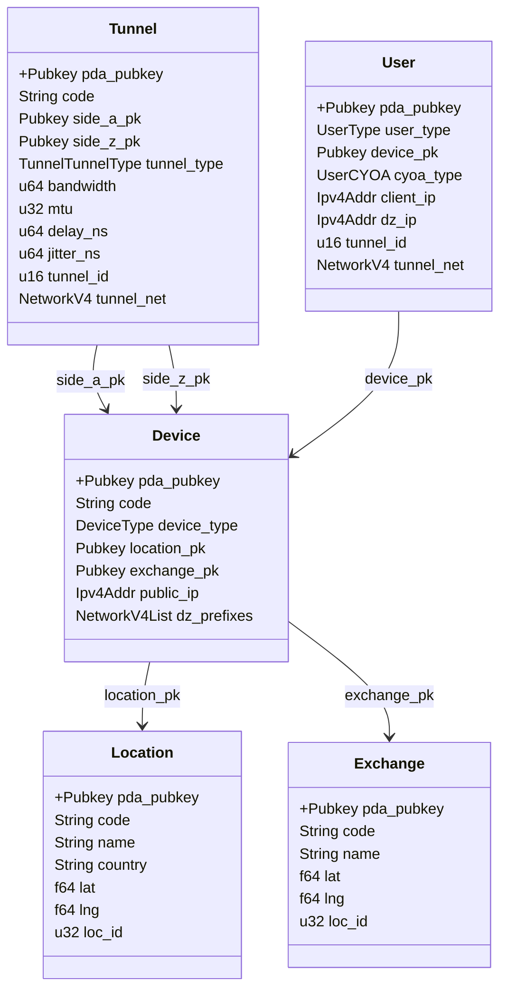

# DoubleZero Rust SDK

This SDK provides a Rust interface for interacting with the DoubleZero Solana smart contract. It enables developers to programmatically create, update, and manage all core DoubleZero entities (Locations, Exchanges, Devices, Tunnels, Users) and to invoke all supported instructions in a type-safe and ergonomic way.

## Features
- Type-safe Rust bindings for all DoubleZero smart contract instructions
- Account structure definitions matching on-chain state
- Helper functions for building and sending Solana transactions
- Support for permissionless, multi-contributor workflows

## Installation
Add the SDK to your Rust project by including it in your `Cargo.toml`:

```toml
[dependencies]
doublezero-sdk = { path = "../../sdk/rs" }
```

> Adjust the path as needed for your project structure.

## Usage

### 1. Import the SDK
```rust
use doublezero_sdk::*;
```

## Example: Using a Command

To use a command, create the corresponding struct, set its arguments, and call `execute(client)` with your DoubleZero client instance. For example, to create a tunnel:

```rust
use doublezero_sdk::commands::tunnel::CreateTunnelCommand;
use doublezero_sdk::DoubleZeroClient;
use solana_sdk::pubkey::Pubkey;
use doublezero_serviceability::state::tunnel::TunnelTunnelType;

// Prepare your arguments
let result = CreateTunnelCommand {
    code: "TUNNEL-001".to_string(),
    side_a_pk: [...],
    side_z_pk: [...],
    bandwidth: 1_000_000,
    mtu: 1500,
    delay_ns: 0,
    jitter_ns: 0,
}.execute(&client);

match result {
    Ok((signature, tunnel_pubkey)) => println!("Tunnel created: {} {}", signature, tunnel_pubkey),
    Err(e) => eprintln!("Error: {e}"),
}
```

Replace the arguments and client as needed for your use case. This pattern applies to all commands in the SDK.


## Main Structures Diagram

Below is a class diagram representing the main on-chain state structures managed by the DoubleZero protocol. Each structure's primary fields and relationships are shown, with PDA (Program Derived Address) public keys marked as primary keys.



## User Types in DoubleZero

The DoubleZero protocol defines three distinct types of users:

- **Foundation:** Responsible for administering locations and exchanges. The foundation manages the core infrastructure and governance of the network.
- **Network Contributors:** Responsible for administering devices and tunnels. Contributors expand and maintain the network by adding and managing hardware and connectivity.
- **Users:** End users who connect to the DoubleZero network with a User account. These users consume network services and resources provided by the contributors and foundation.

These roles are enforced at the protocol level and reflected in the permissions and operations available to each user type.

## Location Commands

The following commands allow you to manage Location entities on the DoubleZero protocol. Each command is represented by a struct with the listed arguments.

### CreateLocationCommand
Creates a new location with the specified parameters. Returns the transaction signature and the location's public key on success.
- `code: String` — Unique location code
- `name: String` — Location name
- `country: String` — Country code
- `lat: f64` — Latitude
- `lng: f64` — Longitude
- `loc_id: Option<u32>` — Optional location ID

### UpdateLocationCommand
Updates the parameters of an existing location. Returns the transaction signature.
- `code: Option<String>` — Optional new code
- `name: Option<String>` — Optional new name
- `country: Option<String>` — Optional new country
- `lat: Option<f64>` — Optional new latitude
- `lng: Option<f64>` — Optional new longitude
- `loc_id: Option<u32>` — Optional new location ID

### GetLocationCommand
Fetches a location by its public key or code. Returns the location's public key and its on-chain data if found.
- `pubkey_or_code: String` — Location public key or code

### DeleteLocationCommand
Deletes a location. Returns the transaction signature.
- `pubkey: Pubkey` — Pubkey

### ListLocationCommand
Lists all locations in the program. Returns a map of location public keys to their on-chain data.
- *(no arguments)*

| Field         | Type    | Description                |
|-------------- |---------|----------------------------|
| pda_pubkey    | Pubkey  | PDA public key (primary key) |
| code          | String  | Unique location code       |
| name          | String  | Location name              |
| country       | String  | Country code               |
| lat           | f64     | Latitude                   |
| lng           | f64     | Longitude                  |
| loc_id        | u32     | Location ID                |

### ResumeLocationCommand
Resumes a previously suspended location. Returns the transaction signature.
- `pubkey: Pubkey` — Pubkey

## Exchange Commands

The following commands allow you to manage Exchange entities on the DoubleZero protocol. Each command is represented by a struct with the listed arguments.

### CreateExchangeCommand
Creates a new exchange with the specified parameters. Returns the transaction signature and the exchange's public key on success.
- `code: String` — Unique exchange code
- `name: String` — Exchange name
- `lat: f64` — Latitude
- `lng: f64` — Longitude
- `loc_id: Option<u32>` — Optional location ID

### UpdateExchangeCommand
Updates the parameters of an existing exchange. Returns the transaction signature.
- `pubkey: Pubkey` — Pubkey
- `code: Option<String>` — Optional new code
- `name: Option<String>` — Optional new name
- `lat: Option<f64>` — Optional new latitude
- `lng: Option<f64>` — Optional new longitude
- `loc_id: Option<u32>` — Optional new location ID

### GetExchangeCommand
Fetches an exchange by its public key or code. Returns the exchange's public key and its on-chain data if found.
- `pubkey_or_code: String` — Exchange public key or code

### DeleteExchangeCommand
Deletes an exchange. Returns the transaction signature.
- `pubkey: Pubkey` — Pubkey

### ListExchangeCommand
Lists all exchanges in the program. Returns a map of exchange public keys to their on-chain data.
- *(no arguments)*

| Field         | Type    | Description                |
|-------------- |---------|----------------------------|
| pda_pubkey    | Pubkey  | PDA public key (primary key) |
| code          | String  | Unique exchange code       |
| name          | String  | Exchange name              |
| lat           | f64     | Latitude                   |
| lng           | f64     | Longitude                  |
| loc_id        | u32     | Location ID                |

### CreateExchangeCommand
Creates a new location with the specified parameters. Returns the transaction signature and the location's public key on success.
- `code: String` — Unique exchange code
- `name: String` — Exchange name
- `lat: f64` — Latitude
- `lng: f64` — Longitude
- `loc_id: Option<u32>` — Optional location ID

## Contributor Commands

Network Contributors are responsible for administering devices and tunnels in the DoubleZero network. These users expand and maintain the network by adding and managing hardware and connectivity. The following commands allow you to manage contributor-related entities on the protocol. Each command is represented by a struct with the listed arguments.

### CreateContributorCommand
Creates a new network contributor with the specified parameters. Returns the transaction signature and the contributor's public key on success.
- `code: String` — Unique contributor code
- `ata_owner: Pubkey` — ATA Identity

### UpdateContributorCommand
Updates the parameters of an existing contributor. Returns the transaction signature.
- `pubkey: Pubkey` — Pubkey
- `code: Option<String>` — Optional new code
- `ata_owner: Option<Pubkey>` — Optional new ATA identity

### GetContributorCommand
Fetches a contributor by its public key or code. Returns the contributor's public key and on-chain data if found.
- `pubkey_or_code: String` — Contributor public key or code

### DeleteContributorCommand
Deletes a contributor. Returns the transaction signature.

### ListContributorCommand
Lists all contributors in the program. Returns a map of contributor public keys to their on-chain data.
- *(no arguments)*

| Field        | Type    | Description                  |
|--------------|---------|------------------------------|
| pda_pubkey   | Pubkey  | PDA public key (primary key) |
| code         | String  | Unique contributor code      |
| ata_owner    | Pubkey  | ATA Identity                 |

## Device Commands

The following commands allow you to manage Device entities on the DoubleZero protocol. Each command is represented by a struct with the listed arguments.

### CreateDeviceCommand
Creates a new device with the specified parameters. Returns the transaction signature and the device's public key on success.
- `code: String` — Unique device code
- `location_pk: Pubkey` — Location public key
- `exchange_pk: Pubkey` — Exchange public key
- `device_type: DeviceType` — Device type enum
- `public_ip: Ipv4Addr` — Public IPv4 address
- `dz_prefixes: NetworkV4List` — List of DoubleZero prefixes

### UpdateDeviceCommand
Updates the parameters of an existing device. Returns the transaction signature.
- `pubkey: Pubkey` — Pubkey
- `code: Option<String>` — Optional new code
- `device_type: Option<DeviceType>` — Optional new type
- `public_ip: Option<Ipv4Addr>` — Optional new public IP
- `dz_prefixes: Option<NetworkV4List>` — Optional new prefixes

### GetDeviceCommand
Fetches a device by its public key or code. Returns the device's public key and its on-chain data if found.
- `pubkey_or_code: String` — Device public key or code

### DeleteDeviceCommand
Deletes a device. Returns the transaction signature.
- `pubkey: Pubkey` — Pubkey

### ListDeviceCommand
Lists all devices in the program. Returns a map of device public keys to their on-chain data.
- *(no arguments)*

| Field         | Type           | Description                |
|-------------- |---------------|----------------------------|
| pda_pubkey    | Pubkey         | PDA public key (primary key) |
| code          | String         | Unique device code         |
| device_type   | DeviceType     | Device type enum           |
| location_pk   | Pubkey         | Location public key        |
| exchange_pk   | Pubkey         | Exchange public key        |
| public_ip     | Ipv4Addr       | Public IPv4 address        |
| dz_prefixes   | NetworkV4List  | List of DoubleZero prefixes|

### CloseAccountDeviceCommand
Closes the device account, releasing its resources. Returns the transaction signature.
- `pubkey: Pubkey` — Pubkey
- `owner: Pubkey` — Owner public key

### RejectDeviceCommand
Rejects a device, providing a reason. Returns the transaction signature.
- `pubkey: Pubkey` — Pubkey
- `reason: String` — Rejection reason

### ResumeDeviceCommand
Resumes a previously suspended device. Returns the transaction signature.
- `pubkey: Pubkey` — Pubkey

## Link Commands

The following commands allow you to manage Link entities on the DoubleZero protocol. Each command is represented by a struct with the listed arguments.

### CreateLinkCommand
Creates a new link between two endpoints with the specified parameters. Returns the transaction signature and the link's public key on success.
- `code: String` — Unique link code
- `side_a_pk: Pubkey` — Public key for side A
- `side_z_pk: Pubkey` — Public key for side Z
- `link_type: LinkLinkType` — Link type enum
- `bandwidth: u64` — Bandwidth in bps
- `mtu: u32` — MTU size
- `delay_ns: u64` — Delay in nanoseconds
- `jitter_ns: u64` — Jitter in nanoseconds

### GetLinkCommand
Fetches a link by its public key or code. Returns the link's public key and its on-chain data if found.
- `pubkey_or_code: String` — Link public key or code

### RejectLinkCommand
Rejects a link, providing a reason. Returns the transaction signature.
- `pubkey: Pubkey` — Pubkey
- `reason: String` — Rejection reason

### ResumeLinkCommand
Resumes a previously suspended link. Returns the transaction signature.
- `pubkey: Pubkey` — Pubkey

### DeleteLinkCommand
Deletes a link. Returns the transaction signature.
- `pubkey: Pubkey` — Pubkey

### ActivateLinkCommand
Activates a link, assigning it a link ID and network. Returns the transaction signature.
- `pubkey: Pubkey` — Pubkey
- `tunnel_id: u16` — Link ID
- `tunnel_net: NetworkV4` — Link network (IPv4)

### CloseAccountLinkCommand
Closes the link account, releasing its resources. Returns the transaction signature.
- `pubkey: Pubkey` — Pubkey
- `owner: Pubkey` — Owner public key

### ListLinkCommand
Lists all links in the program. Returns a map of link public keys to their on-chain data.
- *(no arguments)*

| Field         | Type              | Description                |
|-------------- |------------------|----------------------------|
| pda_pubkey    | Pubkey            | PDA public key (primary key) |
| code          | String            | Unique tunnel code         |
| side_a_pk     | Pubkey            | Public key for side A      |
| side_z_pk     | Pubkey            | Public key for side Z      |
| tunnel_type   | TunnelTunnelType  | Tunnel type enum           |
| bandwidth     | u64               | Bandwidth in bps           |
| mtu           | u32               | MTU size                   |
| delay_ns      | u64               | Delay in nanoseconds       |
| jitter_ns     | u64               | Jitter in nanoseconds      |
| tunnel_id     | u16               | Tunnel ID                  |
| tunnel_net    | NetworkV4         | Tunnel network (IPv4)      |

### UpdateTunnelCommand
Updates the parameters of an existing tunnel. Returns the transaction signature.
- `pubkey: Pubkey` — Pubkey
- `code: Option<String>` — Optional new code
- `tunnel_type: Option<TunnelTunnelType>` — Optional new type
- `bandwidth: Option<u64>` — Optional new bandwidth
- `mtu: Option<u32>` — Optional new MTU
- `delay_ns: Option<u64>` — Optional new delay
- `jitter_ns: Option<u64>` — Optional new jitter

### SuspendTunnelCommand
Suspends a tunnel, disabling its operation without deleting it. Returns the transaction signature.
- `pubkey: Pubkey` — Pubkey

## User Commands

The following commands allow you to manage User entities on the DoubleZero protocol. Each command is represented by a struct with the listed arguments.

### CreateUserCommand
Creates a new user with the specified parameters. Returns the transaction signature and the user's public key on success.
- `user_type: UserType` — User type enum
- `device_pk: Pubkey` — Device public key
- `cyoa_type: UserCYOA` — CYOA type enum
- `client_ip: Ipv4Addr` — User client IPv4 address

### UpdateUserCommand
Updates the parameters of an existing user. Returns the transaction signature.
- `pubkey: Pubkey` — Pubkey
- `user_type: Option<UserType>` — Optional new user type
- `cyoa_type: Option<UserCYOA>` — Optional new CYOA type
- `client_ip: Option<Ipv4Addr>` — Optional new client IP
- `dz_ip: Option<Ipv4Addr>` — Optional new DoubleZero IP
- `tunnel_id: Option<u16>` — Optional new tunnel ID
- `tunnel_net: Option<NetworkV4>` — Optional new tunnel network

### GetUserCommand
Fetches a user by its public key or code. Returns the user's public key and its on-chain data if found.
- `pubkey_or_code: String` — User public key or code

### DeleteUserCommand
Deletes a user. Returns the transaction signature.
- `pubkey: Pubkey` — Pubkey

### ListUserCommand
Lists all users in the program. Returns a map of user public keys to their on-chain data.
- *(no arguments)*

| Field         | Type         | Description                |
|-------------- |-------------|----------------------------|
| pda_pubkey    | Pubkey      | PDA public key (primary key) |
| user_type     | UserType    | User type enum             |
| device_pk     | Pubkey      | Device public key          |
| cyoa_type     | UserCYOA    | CYOA type enum             |
| client_ip     | Ipv4Addr    | User client IPv4 address   |
| dz_ip         | Ipv4Addr    | DoubleZero IP              |
| tunnel_id     | u16         | Tunnel ID                  |
| tunnel_net    | NetworkV4   | Tunnel network (IPv4)      |

### SuspendUserCommand
Suspends a user, disabling their access without deleting the account. Returns the transaction signature.
- `pubkey: Pubkey` — Pubkey

### ResumeUserCommand
Resumes a previously suspended user. Returns the transaction signature.
- `pubkey: Pubkey` — Pubkey

### CloseAccountUserCommand
Closes the user account, releasing its resources. Returns the transaction signature.
- `pubkey: Pubkey` — Pubkey
- `owner: Pubkey` — Owner public key

### RejectUserCommand
Rejects a user, providing a reason. Returns the transaction signature.
- `pubkey: Pubkey` — Pubkey
- `reason: String` — Rejection reason

